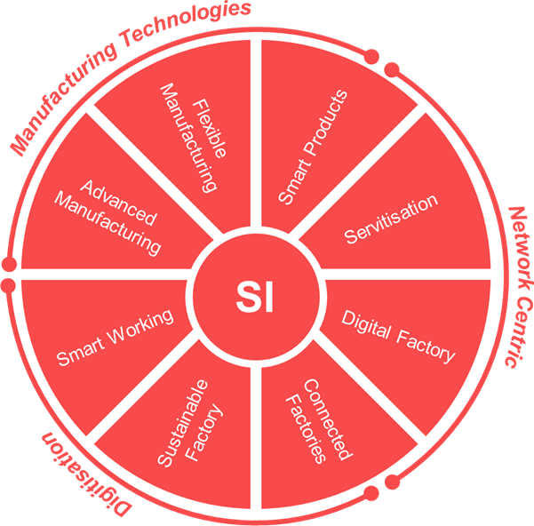
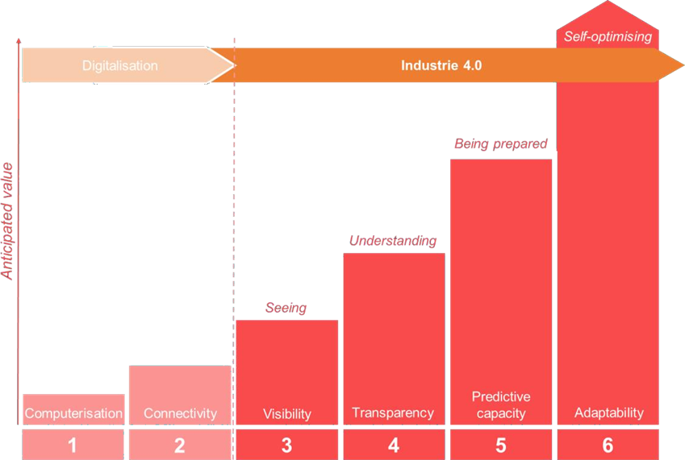

# ЦИФРОВИЙ ДВІЙНИК В РОЗУМНІЙ ПРОМИСЛОВОСТІ

 Smart Industry (SI) stands for three main transitions:

1) Radical digitisation

2) Connecting products, machines, and people

3) Use of new production technology

The Dutch SI program, for example, has eight focus areas surrounding these transitions, namely Smart Products, Servitisation, Digital Factory, Connected Factories, Sustainable Factory, Smart Working, Advanced Manufacturing, and Flexible Manufacturing.

 

 

This SI initiative involves a major transition in a very diverse landscape. Most companies are still in the process of addressing the challenges relating to connectivity, while the end-goal is to engineer, operate and maintain an adaptive autonomous, and in some cases, a self-aware solution. These qualities are represented by Stages 2 through 6 of the stages in the *Industry4.0* development path. Digitisation happens across all 6 stages, while the Digital Twin, an advanced form of Digitisation, happens when we start to address the challenges in Stages 4 through 6.

Ця ініціатива SI передбачає значний перехід у дуже різноманітний ландшафт. Більшість компаній все ще перебувають у процесі вирішення проблем, пов’язаних із підключенням, тоді як кінцева мета полягає в розробці, експлуатації та підтримці адаптивного автономного, а в деяких випадках самосвідомого рішення. Ці якості представлені етапами від 2 до 6 етапів шляху розвитку *Industry4.0*. Оцифровування відбувається на всіх 6 етапах, тоді як Digital Twin, вдосконалена форма оцифровки, відбувається, коли ми починаємо вирішувати завдання на етапах 4–6.

 

## A COMMON UNDERSTANDING

 A Digital Twin is a digital replica of an artefact, process, or service sufficient to be the basis for making decisions. The digital replica and physical world are often connected by streams of data. Change2Twin will address Digital Twins of artefacts, processes and services associated with manufacturing, with a goal being to promote of active use of a suitable ecosystem and marketplace that will accelerate affordable availability and give clarity to the market.

Цифровий двійник — це цифрова копія артефакту, процесу чи послуги, яка є достатньою для прийняття рішень. Цифрова копія та фізичний світ часто пов’язані потоками даних. Change2Twin розглядатиме цифрові двійники артефактів, процесів і послуг, пов’язаних із виробництвом, з метою сприяння активному використанню відповідної екосистеми та ринку, що прискорить доступність за доступною ціною та надасть ринку прозорості.

Grieves is recognised as coining the term Digital Twin, first using it to describe digital Product Lifecycle Management “information as a *twin* of information embedded” in “the physical system throughout its lifecycle” (Grieves & Vickers, Digital Twin: Mitigating Unpredictable, Undesirable Emergent Behavior in Complex Systems., 2017). Increased popularity of the term and availability of modern computing, engineering and management paradigms and practices, have promoted the Digital Twin as a key enabler of advanced digitisation.      

Вважається, що Ґрівс створив термін Digital Twin, вперше використавши його для опису управління життєвим циклом цифрового продукту «інформація як *двійник* інформації, вбудованої» у «фізичну систему протягом її життєвого циклу» (Grieves & Vickers, Digital Twin: Mitigating Unpredictable, Небажана аварійна поведінка в складних системах., 2017). Збільшення популярності терміну та доступність сучасних обчислювальних, інженерних та управлінських парадигм і практик сприяли цифровому близнюку як ключовому механізму прогресивної цифровізації.   

The concept of the Digital Twin is by no means new. Cutting-edge and emerging technologies have made it possible to realise a Digital Twin solution capable of much more than previously possible. However, before the term was coined, the concept might have been referred to as an advanced version of a computational mega-model, a synchronised virtual prototype (A virtual prototype typically misses key aspects of a Digital Twin that mirrors an existing physical system with a data link. Synchronising the virtual prototype is an earlier form of what we could consider a Digital Twin.), or a device shadow. More generally, it may have been defined as an adaptive model used in an operating stage of a physical system for some specific purpose (Rasheed, San, & Kvamsdal, 2019).

Концепція Digital Twin аж ніяк не нова. Передові та новітні технології дозволили реалізувати рішення Digital Twin, здатне набагато більше, ніж це було можливо раніше. Однак до того, як цей термін було введено, цю концепцію могли називати вдосконаленою версією обчислювальної мегамоделі, синхронізованого віртуального прототипу (Віртуальний прототип зазвичай пропускає ключові аспекти Digital Twin, який відображає існуючу фізичну систему з Синхронізація віртуального прототипу є більш ранньою формою того, що ми могли б вважати Digital Twin.), або тінню пристрою. У більш загальному плані її можна було визначити як адаптивну модель, яка використовується на робочому етапі фізичної системи для певної мети (Rasheed, San, & Kvamsdal, 2019).

In general, a key challenge hindering the widespread adoption of the Digital Twin is having an accepted shared definition and common language amongst experts and users. This is echoed by the current industry-led initiative, like the Digital Twin Consortium (Object Management Group, 2020), whose aim it is to have consistent vocabulary, architecture, security, and interoperability of Digital Twin technologies.

Загалом, ключовою проблемою, яка перешкоджає широкому впровадженню Digital Twin, є наявність прийнятого спільного визначення та спільної мови серед експертів і користувачів. Це підтверджується нинішньою галузевою ініціативою, як-от Digital Twin Consortium (Object Management Group, 2020), метою якої є мати узгоджений словниковий запас, архітектуру, безпеку та взаємодію технологій Digital Twin.

A survey of different solutions shows that different complexities and solutions make it possible to define the Digital Twin differently (Kritzinger, et al., 2018). However, in its simplest form and at its core, the definition provided herein underpins the more domain-specific and elaborate definitions.

Огляд різних рішень показує, що різні складності та рішення дозволяють по-різному визначати Digital Twin (Kritzinger, et al., 2018). Проте, у своїй найпростішій формі та за своєю суттю, надане тут визначення лежить в основі більш специфічних для домену та детальних визначень.

A simulation makes it possible to combine physics-based and data-driven modelling to mirror the fusion of the real and virtual worlds (Rosen, Boschert, & Sohr, 2018). Simulation is considered essential and intrinsic to advanced digitisation. Digital Twin as an enabler of advanced digitisation is expected to harness the synergy between modern technologies of computing and engineering paradigms like High Performance Computing, Internet of Things (IoT), 5G technology, and Virtual Reality (Gunal, 2019). Current trends of artificial intelligence (AI) and Machine Learning (ML), and in particular Federated Learning, introduced the concept of online twinning, i.e., where the model improves itself (Bellavista & Mora, 2019).

Симуляція дає змогу поєднати моделювання на основі фізики та даних, щоб відобразити злиття реального та віртуального світів (Rosen, Boschert, & Sohr, 2018). Симуляція вважається важливою та невід’ємною частиною розширеної оцифровки. Очікується, що Digital Twin як інструмент передової цифровізації використовуватиме синергію між сучасними технологіями обчислення та інженерними парадигмами, такими як високопродуктивні обчислення, Інтернет речей (IoT), технологія 5G та віртуальна реальність (Gunal, 2019). Сучасні тенденції штучного інтелекту (AI) і машинного навчання (ML), і зокрема федеративного навчання, запровадили концепцію онлайн-двійнингу, тобто коли модель самовдосконалюється (Bellavista & Mora, 2019).

Moreover, the Digital Twin is considered revolutionary because it reaches across different Industry domains. The underlying simulation models are becoming increasingly complex with time, mirroring the complexity of the physical processes they represent (Boschert & Rosen, 2016). This generates the need for new techniques in managing model complexities to operationalise the solution for the business process – a further complication to delivering an efficient and effective solution.

Крім того, Digital Twin вважається революційним, оскільки він охоплює різні галузі промисловості. Імітаційні моделі, що лежать в основі, з часом стають дедалі складнішими, відображаючи складність фізичних процесів, які вони представляють (Boschert & Rosen, 2016). Це породжує потребу в нових техніках управління складністю моделі для введення в дію рішення для бізнес-процесу, що є ще одним ускладненням для надання ефективного та ефективного рішення.

The complexity of Digital Twinning increases in line with the nature of the physical system, the purpose for which the twin is used, and the number and kinds of participants involved in developing, using and maintaining the solution. Dealing with the complex dynamics of the system requires an adaptive, autonomous, and evolutionary solution. Recognising the concurrency of having a continuously fit-for-purpose Digital Twin is essential to having an affordable, accessible, and appropriate solution. Maintaining unbroken cradle-to-grave digitisation is an advanced challenge (Pileggi, Lazovik, Broekhuijsen, Borth, & Verriet, 2020) but is essential to avoid having to redesign and redevelop an expensive custom Digital Twin solution.

Складність Digital Twinning зростає відповідно до природи фізичної системи, мети, для якої використовується двійник, а також кількості та видів учасників, залучених до розробки, використання та підтримки рішення. Робота зі складною динамікою системи вимагає адаптивного, автономного та еволюційного рішення. Визнання одночасності наявності цифрового близнюка, який постійно відповідає меті, є важливим для отримання доступного, доступного та відповідного рішення. Підтримка безперервної оцифровки від колиски до могили є складним завданням (Pileggi, Lazovik, Broekhuijsen, Borth, & Verriet, 2020), але це важливо, щоб уникнути необхідності перепроектувати та переробляти дороге індивідуальне рішення Digital Twin. 

## DIGITISATION CHALLENGES AND OPPORTUNITIES

A key objective of the Industrial IoT (IIoT) is to embody IoT technology in the industrial decision- making process. IIoT, as an enabler of the Industry4.0 vision, is able to generate a plethora of data, compounded by usually aggregated networking effects, and stored on edge or cloud platforms (Xu, He, & Li, 2014).

Ключовою метою промислового Інтернету речей (IIoT) є втілення технології Інтернету речей у процесі прийняття промислових рішень. IIoT, як інструмент бачення Industry4.0, здатний генерувати безліч даних, доповнених зазвичай агрегованими мережевими ефектами, які зберігаються на межових або хмарних платформах (Xu, He, & Li, 2014).

In particular in manufacturing, the efficient integration and management of IIoT devices can bring new services and opportunities including predictive maintenance, continuous monitoring, scheduling and remote running of maintenance interventions, process reconfiguration, etc., all the while achieving desired KPIs – process– and product-wise. All these capabilities could be evaluated and made possible by a Digital Twin implementation.

Зокрема, у виробництві ефективна інтеграція та управління пристроями IIoT може надати нові послуги та можливості, включаючи прогнозне технічне обслуговування, безперервний моніторинг, планування та дистанційне виконання втручань з технічного обслуговування, реконфігурацію процесів тощо, при цьому досягаючи бажаних KPI – процесів – і щодо продукту. Усі ці можливості можна оцінити та зробити можливими завдяки реалізації Digital Twin.

The overall goal of IIoT technology and platforms is to enable and facilitate decision-making under the quality constraints imposed by the application domain and deployment environment, bringing gains in efficiency, safety, and stability of the IIoT system. To implement and deploy a Digital Twin, some key technological aspects need to be considered that are crucial to its success:

Загальна мета технології та платформ IIoT полягає в тому, щоб уможливити та полегшити прийняття рішень в умовах обмежень якості, що накладаються областю застосування та середовищем розгортання, забезпечуючи підвищення ефективності, безпеки та стабільності системи IIoT. Щоб запровадити та розгорнути Digital Twin, необхідно врахувати деякі ключові технологічні аспекти, які мають вирішальне значення для його успіху:

**Connectivity**: This is the basic building block enabling the interactions with and between connected things, receiving data from and transporting them to the Digital Twin and the physical process(es). This spans their full lifecycle. In this context, options are available, differentiated on the basis of cost and flexibility.

**Підключення**: це базовий будівельний блок, який забезпечує взаємодію з підключеними об’єктами та між ними, отримання даних від цифрового близнюка та фізичних процесів і їх транспортування до них. Це охоплює їх повний життєвий цикл. У цьому контексті доступні варіанти, диференційовані на основі вартості та гнучкості.

Industrial wired data acquisition and control networks, like Fieldbus profiles or the more recent Time Sensitive Networking for Industrial Automation standards, have been foundational to industrial automation. They guarantee high reliability and real-time communication between things. While capable of fulfilling strict reliability and latency constraints, wired networks are expensive to deploy and maintain, making them unfeasible for many potential adopters. Fortunately, recent advances in wireless technologies, like *6TiSCH*, *Wireless HARD*, *Private 5G* and the upcoming industrial *WiFi7*, will help IIoT technology realise the Industry4.0 vision. Currently, more wireless networks are being deployed (Emerson, 2020).

Промислові дротові мережі збору даних і керування, такі як профілі Fieldbus або новіші стандарти чутливої до часу мережі для промислової автоматизації, були основою для промислової автоматизації. Вони гарантують високу надійність і зв'язок між речами в реальному часі. Незважаючи на те, що дротові мережі здатні відповідати суворим обмеженням щодо надійності та затримки, розгортання та обслуговування дротових мереж є дорогими, що робить їх неможливими для багатьох потенційних користувачів. На щастя, останні досягнення в бездротових технологіях, як-от *6TiSCH*, *Wireless HARD*, *Private 5G* і майбутній промисловий *WiFi7*, допоможуть технології IIoT реалізувати бачення Industry4.0. Зараз розгортається більше бездротових мереж (Emerson, 2020).

Moreover, industrial and low-power wireless communications are converging, boosting the capabilities of IIoT. First, low-power wireless technology has been shown to be capable of fulfilling reliability and power consumption requirements of industrial applications. Second, various standards enabling the convergence of low-power wireless and the Internet Protocol have emerged. These standards greatly simplify integration into existing networks, qualifying the technology as the true *eyes and ears* of the industrial Internet.

Крім того, промисловий і малопотужний бездротовий зв’язок зближуються, розширюючи можливості IIoT. По-перше, було показано, що малопотужна бездротова технологія здатна задовольнити вимоги до надійності та енергоспоживання промислових застосувань. По-друге, з'явилися різні стандарти, що забезпечують конвергенцію малопотужного бездротового зв'язку та Інтернет-протоколу. Ці стандарти значно спрощують інтеграцію в існуючі мережі, кваліфікуючи технологію як справжні *очі та вуха* промислового Інтернету.

**Data**: A Digital Twin needs data collected from its real-world asset over its full lifecycle. In a standalone Digital Twin solution these data include:

**Дані**: Digital Twin потребує даних, зібраних із його реальних активів протягом повного життєвого циклу. У автономному рішенні Digital Twin ці дані включають:

- *design data* pertaining to the real-world asset that include design specifications, process, engineering data;

- *manufacturing data* including production equipment, material, method, process, quality assurance and operators;

- *operational data* including configurations of both hardware and software, telemetry and real-time and historic usage data, and maintenance records of the real-world counterpart (Boss, et al., 2020).

- *проектні дані*, що стосуються реальних активів, які включають проектні специфікації, процес, інженерні дані;

- *дані про виробництво*, включаючи виробниче обладнання, матеріал, метод, процес, гарантію якості та операторів;

- *операційні дані*, включаючи конфігурації як апаратного, так і програмного забезпечення, телеметрію, дані про використання в режимі реального часу та історію використання, а також записи про технічне обслуговування реального аналога (Boss та ін., 2020).

Depending on the scale and scope of the manufacturing domain, potentially different and heterogeneous communication standards, protocols and technologies could be employed to save and transfer data.

Залежно від масштабу та обсягу виробничої сфери, для збереження та передачі даних можуть використовуватися потенційно різні та неоднорідні стандарти зв’язку, протоколи та технології.

These conditions further exacerbate the problem of understanding, finding, accessing and extracting relevant data needed for use case-dependent applications. In this context, the use of semantic frameworks and modeling approaches, such as the one proposed by *RAMI 4.0*, coupled with data pipelining approaches, helps alleviate the data chaos. This constitutes the basis for a structured data extraction and filtering, synchronising the twin.

Ці умови ще більше загострюють проблему розуміння, пошуку, доступу та вилучення відповідних даних, необхідних для програм, що залежать від варіанту використання. У цьому контексті використання семантичних структур і підходів до моделювання, таких як запропоновані *RAMI 4.0*, у поєднанні з підходами до конвеєрної обробки даних, допомагає зменшити хаос даних. Це є основою для структурованого вилучення та фільтрації даних, синхронізації близнюка. 

**Modelling**: The Digital Twin may contain different and heterogeneous computational and representational models pertaining to its real-world counterpart. This may range from first- principle models adhering to physical laws; data-driven, like statistical and ML models; geometrical and material, like CAx, Computer-Aided Design/Engineering (CAD, CAE); or visualisation-oriented ones, like mixed-reality.

**Моделювання**: Digital Twin може містити різні та неоднорідні обчислювальні та репрезентативні моделі, що стосуються його реального аналога. Це може варіюватися від моделей першого принципу, що дотримуються фізичних законів; керовані даними, такі як статистичні моделі та моделі ML; геометричні та матеріальні, як CAx, автоматизоване проектування/проектування (CAD, CAE); або орієнтовані на візуалізацію, як змішана реальність.

Hybrid approaches are also possible, e.g., the use of virtual-augmented reality complementing the physics/data-oriented models, or the use of physics simulation or modelling with AI-based approaches that alleviate problems like those related to training data scarcity.

Також можливі гібридні підходи, наприклад, використання віртуальної доповненої реальності, що доповнює фізичні/орієнтовані на дані моделі, або використання фізичного моделювання чи моделювання з підходами на основі штучного інтелекту, які полегшують такі проблеми, як проблеми, пов’язані з дефіцитом навчальних даних.

Considering the fast-paced adoption of AI-based techniques in the manufacturing domain, the following technical issues arise which pose a significant burden for SMEs:

Враховуючи швидке впровадження технологій на основі ШІ у сфері виробництва, виникають такі технічні проблеми, які становлять значний тягар для МСП:

- *Data Labeling Effort*: Data-driven approaches used for training the AI components usually require a large amount of cleaned and labelled data. The effort to create this trained data is considerable and should be optimised. The quality of data or labels is also of paramount importance.

- *Concept Drift*: Concept drift refers to the phenomena of deterioration in prediction accuracy, and usually occurs due to unforeseen changes on the learned statistical properties of the target variables being predicted.

- *Quality of Training data*: No model is better than the data upon which it is built. If the training data does not accurately represent the underlying task distribution, the model will be unable to learn the true phenomena. It is therefore important that industries have robust procedures for training data extraction and preparation.

- *Зусилля з маркування даних*: керовані даними підходи, які використовуються для навчання компонентів ШІ, зазвичай потребують великої кількості очищених і позначених даних. Зусилля для створення цих навчених даних є значними, і їх слід оптимізувати. Якість даних або міток також має першочергове значення.

- *Концептуальний дрейф*: концептуальний дрейф відноситься до явища погіршення точності передбачення та зазвичай виникає через непередбачені зміни вивчених статистичних властивостей цільових змінних, які прогнозуються.

- *Якість навчальних даних*: Жодна модель не краща за дані, на основі яких вона побудована. Якщо навчальні дані не точно відображають основний розподіл завдань, модель не зможе вивчити справжні явища. Тому важливо, щоб галузі мали надійні процедури для навчання витягу та підготовки даних.

**Deployment**: A Digital Twin can be deployed on the *cloud-to-thing* continuum, starting from the thing (also the lightweight Digital Twin), the *edge* or the *cloud*. The specific deployment criteria depend on the scenario requirements and are typically based on:

- latency requirements, e.g., measured in terms of response time;

- security or privacy considerations of information flows;

- scope of the Digital Twin, i.e., whether we are dealing with a standalone solution or parts of a bigger system.

**Розгортання**: Digital Twin можна розгорнути в континуумі *cloud-to-thing*, починаючи з речі (також полегшеного Digital Twin), *edge* або *cloud*. Конкретні критерії розгортання залежать від вимог сценарію та зазвичай базуються на:

- вимоги до затримки, наприклад, виміряні за часом відповіді;

- міркування безпеки або конфіденційності інформаційних потоків;

- сфера дії Digital Twin, тобто чи ми маємо справу з окремим рішенням чи частинами більшої системи.

In general, different deployment possibilities apply that depend on the device or IIoT capabilities, objective and scope of the Digital Twin:

- *IIoT Twin*: A lightweight Digital Twin deployed on premises or onboard the machine performing utility tasks for quality management operations; namely, low latency and high reliability. This twin gathers data from the physical twin, transmitting them to a higher control entity, like an Edge Twin. Considering the constrained nature of this device, no training occurs and this process is often delegated.

- *Edge Twin*: A higher order control entity, running on the premises of the production site (i.e., plant gateway) is tasked with the lifecycle management (i.e., the deployment, instantiation, control and disposal) of locally deployed IoT twins. The entity performs the more computationally expensive tasks, controlling the flow of, and collecting data from local IoT twins. This provides the control knobs that enable local optimisations and interoperability.

- *Cloud Twin*: If employed, this environment rich in resources has a global scope and acts as a logically centralised repository for data. It is tasked with performing time- consuming and typically off-line simulation and training of models. The models are then subsequently provided to the edge twin consisting of, e.g., predictive models elaborated in advance that are more efficiently executed on the plant premises.

Загалом застосовуються різні можливості розгортання, які залежать від можливостей пристрою чи Інтернету речей, мети та сфери застосування Digital Twin:

- *IIoT Twin*: легкий Digital Twin, розгорнутий у приміщенні або на борту машини, що виконує службові завдання для операцій з управління якістю; а саме низьку затримку та високу надійність. Цей близнюк збирає дані з фізичного близнюка, передаючи їх вищому керуючому об’єкту, наприклад Edge Twin. Враховуючи обмежений характер цього пристрою, навчання не відбувається, і цей процес часто делегується.

- *Edge Twin*: керуючий об’єкт вищого рівня, який працює на території виробничого майданчика (тобто заводський шлюз), відповідає за керування життєвим циклом (тобто розгортання, інстанціювання, контроль і утилізація) локально розгорнутих близнюків IoT. Суб’єкт виконує більш дорогі з обчислювальної точки зору завдання, контролюючи потік і збираючи дані з локальних близнюків IoT. Це забезпечує ручки керування, які забезпечують локальну оптимізацію та взаємодію.

- *Cloud Twin*: якщо використовується, це багате на ресурси середовище має глобальний масштаб і діє як логічно централізоване сховище даних. Його завданням є виконання тривалих і зазвичай офлайн моделювання та навчання моделей. Потім моделі згодом надаються до граничного близнюка, що складається, наприклад, з прогнозних моделей, розроблених заздалегідь, які більш ефективно виконуються на території підприємства.

**APIs**: Digital Twins need to interact with other components, e.g., Digital Twins in a composite system or an operator consulting the system. To facilitate these interactions, various APIs must be available to allow for information collection and control between the twin and its real-world counterpart. Depending on the use case, different mechanisms are available:

- *bulk* or *offline data access*, e.g., through databases or any other form of repository containing relevant data for the twin;

- *online data access*, e.g., through RESTful APIs or some streaming technology like Apache Kafka;

- *management* and *interaction APIs*, enabling information exchange among *cloud-to- thing* continuum twin components, like *cloud-to-x*, *device-to-x*;

- *interoperable APIs,* facilitating information exchange among twins from different vendors.

**API**: Digital Twins повинні взаємодіяти з іншими компонентами, наприклад, Digital Twins у складеній системі або оператор, який консультує систему. Щоб полегшити цю взаємодію, мають бути доступні різні API, які дозволяють збирати інформацію та контролювати її між близнюком і його аналогом у реальному світі. Залежно від варіанту використання доступні різні механізми:

- *масовий* або *офлайн-доступ до даних*, наприклад, через бази даних або будь-яку іншу форму сховища, що містить відповідні дані для близнюка;

- *онлайн-доступ до даних*, наприклад, через RESTful API або певну потокову технологію, як-от Apache Kafka;

- API *керування* та *взаємодії*, які забезпечують обмін інформацією між компонентами континууму *cloud-to-thing*, такими як *cloud-to-x*, *device-to-x*;

- *сумісні API,* полегшують обмін інформацією між близнюками від різних постачальників.

**Security**: Considering the role and scope of the Digital Twin, physical-to-digital (and *vice versa*) interactions require security mechanisms aimed at:

- providing secure access to the Digital Twin contents;

- securing and attesting the information flow between the twin, its real-world counterpart, and the other twins in a composable system;

- securing the *cloud-to-thing* continuum, hence deployment environment and software updates.

**Безпека**: враховуючи роль і масштаб Digital Twin, взаємодія фізично-цифрового (і *навпаки*) вимагає механізмів безпеки, спрямованих на:

- забезпечення безпечного доступу до вмісту Digital Twin;

- забезпечення безпеки та підтвердження потоку інформації між близнюком, його аналогом у реальному світі, та іншими близнюками в складовій системі;

- забезпечення континууму *від хмари до речі*, отже, середовища розгортання та оновлень програмного забезпечення.

**Regulation and the law**: Although one may think that the law changes relatively infrequently, changes typically have significant impact. Considering the effects digitisation has on society, there are important considerations to be made early on when devising or selecting new or advanced digitisation technologies, methodologies, and strategies.

**Нормативне регулювання та закон**: хоча можна подумати, що законодавство змінюється відносно рідко, зміни зазвичай мають значний вплив. Беручи до уваги вплив оцифрування на суспільство, є важливі міркування, які слід враховувати на ранній стадії розробки або вибору нових або просунутих технологій, методологій і стратегій оцифрування.

Knowledge of the legal status of production, use and sharing of data, ML models and other smart properties is essential to enable legal accountability and traceability throughout the supply chain. The certification approach for non-deterministic processes makes the legal evolution of the servitisation of manufacturing products a complicated and challenging task.

Знання правового статусу виробництва, використання та обміну даними, моделями ML та іншими інтелектуальними властивостями є важливими для забезпечення юридичної відповідальності та відстеження в усьому ланцюжку постачання. Підхід сертифікації для недетермінованих процесів робить юридичну еволюцію сервітизації виробничої продукції складним і складним завданням.

Ultimately, we should safeguard human self-determination and foster human empowerment. To achieve this, we need to be mindful of the various challenges related to law and regulation.

Зрештою, ми повинні захистити людське самовизначення та сприяти розширенню людських можливостей. Щоб досягти цього, нам потрібно пам’ятати про різноманітні проблеми, пов’язані із законодавством і регулюванням.

**Innovation and business models:** The lack of clear vision of a strategic holistic approach makes it hard to access the growth potential of Industry4.0. Understanding the possibilities and benefits that can be achieved will help with leadership. Even if manufacturing companies understand technological enablers of opportunity, like Digital Twin, robotics, and AI, they require diverse human talent in many areas, like data science and industrial IoT, and the profound roles required to support the vision.

**Інновації та бізнес-моделі:** Відсутність чіткого бачення стратегічного цілісного підходу ускладнює доступ до потенціалу зростання Industry 4.0. Розуміння можливостей і переваг, яких можна досягти, допоможе в лідерстві. Навіть якщо виробничі компанії розуміють технологічні чинники можливостей, такі як Digital Twin, робототехніка та штучний інтелект, їм потрібні різноманітні людські таланти в багатьох сферах, як-от наука про дані та промисловий Інтернет речей, а також глибокі ролі, необхідні для підтримки бачення.

Leveraging new ecosystems and data to survive or thrive, companies need to diversify and access new revenue sources. Strategic choices are determined by servitisation, but they are not always comprehensive. Uneven comprehension threatens the digitisation effort as it opposes progress, in some cases even cancelling it out.

Використовуючи нові екосистеми та дані, щоб вижити чи процвітати, компаніям потрібно диверсифікувати та отримати доступ до нових джерел доходу. Сервітизація визначає стратегічний вибір, але він не завжди є вичерпним. Нерівне розуміння загрожує зусиллям з оцифрування, оскільки воно перешкоджає прогресу, а в деяких випадках навіть скасовує його.

The lack of trust among parties, the concern of confidentiality and Intellectual Property (IP) protection, and the uncertainty about safety, security and liability conditions are some of the challenges to B2B data sharing. Analysis of enabling factors that promote the sustainability, replicability and scalability of data-driven Industry4.0 models proves to be particularly hard.

Відсутність довіри між сторонами, занепокоєння конфіденційністю та захистом інтелектуальної власності (IP), а також невизначеність щодо безпеки, безпеки та умов відповідальності є одними з проблем для обміну даними B2B. Аналіз сприятливих факторів, які сприяють стабільності, відтворюваності та масштабованості моделей Industry4.0, що керуються даними, виявляється особливо складним.

**Digital skills and competences**: In Data Science alone, job titles include the data engineer, scientist and architect. Combining the knowledge of these roles is essential to a holistic solution but the skills required to develop, deploy, operate, and maintain their solutions successfully are grossly underestimated.

**Цифрові навички та компетенції**: лише в Data Science назви посад включають інженера даних, вченого та архітектора. Поєднання знань про ці ролі має важливе значення для цілісного рішення, але навички, необхідні для успішної розробки, розгортання, експлуатації та підтримки їхніх рішень, сильно недооцінюються.

Development and recognition of digital competencies are essential to having skilled people who can have the ability to engineer a solution that brings the desired benefits. However, the systems we support are becoming more complex and harder for a single individual to handle. Separating concerns for those involved is becoming more important. While being a specialist in their own role, they need to be aware of the complementary roles to not complicate or hinder the system of experts working together to achieve the holistic solution.

Розвиток і визнання цифрових компетенцій є важливими для наявності кваліфікованих людей, здатних розробити рішення, яке принесе бажані переваги. Однак системи, які ми підтримуємо, стають складнішими, і з ними важче працювати одній людині. Відокремлення проблем для тих, хто залучений, стає більш важливим. Будучи спеціалістами у своїй ролі, вони повинні знати про взаємодоповнюючі ролі, щоб не ускладнювати та не перешкоджати системі експертів, які працюють разом для досягнення цілісного рішення.

Education and training of both IT and subject matter experts in the various sectors of the industry are essential to maintaining a manageable solution. An increase in the demand for highly skilled workers will result in more potential for job opportunities, like data scientists, in the next years.

Навчання та підготовка ІТ-спеціалістів і експертів із предметних питань у різних галузях промисловості мають важливе значення для підтримки керованого рішення. Збільшення попиту на висококваліфікованих працівників у наступні роки призведе до збільшення можливостей для працевлаштування, наприклад, науковців із обробки даних.

# DIGITAL TWIN BARRIERS

 The nine Digital Twin barriers can be classified as being either of organisational or technological nature. However, by no means are these exclusive designations. Classifying them under what we consider to be their *primary* designation, we elaborate them as follows.

Дев'ять цифрових подвійних бар'єрів можна класифікувати як організаційні або технологічні. Однак це аж ніяк не виняткові позначення. Класифікуючи їх за тим, що ми вважаємо їхнім *основним* призначенням, ми розробляємо їх наступним чином. 

| **Organisational**              | **Technological**                 |
| ------------------------------- | --------------------------------- |
| 1. Lack of visionary leadership | 5. Keeping it fit-for-purpose     |
| 2. Being unprepared for change  | 6. Maintaining reliable operation |
| 3. Many open questions          | 7. Ensuring effective execution   |
| 4. Unclear ecosystem support    | 8. Accounting for  uncertainty    |
|                                 | 9. Bringing it all together       |

 

## BARRIER 1: LACK OF VISIONARY LEADERSHIP

Having a clear vision of what the organisation’s leadership wants to achieve is crucial. Apart from knowing what the Digital Twin is, leadership should be clear on which business goals it should help to achieve.

Наявність чіткого бачення того, чого хоче досягти керівництво організації, має вирішальне значення. Окрім знання того, що таке Digital Twin, керівництво має чітко розуміти, яких бізнес-цілей воно має допомогти досягти.

Understanding the very diverse range of applications and knowing about which performance indices are typically affected helps align the future business ambition with the technical and operational aspects of what the company does.

Розуміння дуже різноманітного діапазону застосувань і знання про те, які індекси продуктивності зазвичай впливають, допомагає узгодити майбутні бізнес-амбіції з технічними та операційними аспектами діяльності компанії.

Forming an ecosystem, and knowing which partners need to be involved and how each contributes to a healthy competitive environment, with shared research and development costs, and affordable commercial offerings for large companies and SMEs alike, are beneficial in the long term.

Створення екосистеми та знання того, яких партнерів потрібно залучити та як кожен робить внесок у здорове конкурентне середовище, зі спільними витратами на дослідження та розробки та доступними комерційними пропозиціями як для великих компаній, так і для МСП, є корисними в довгостроковій перспективі.

## BARRIER 2: BEING UNPREPARED FOR CHANGE

Working practices are changing. Digital transformation of the SME and their partners leads to new ways of working and new business models. Being unprepared or resisting change can be detrimental to accessing the benefits that the Digital Twin brings or can, in the worst scenario, lead to issues with the business.

Практика роботи змінюється. Цифрова трансформація МСП та їхніх партнерів веде до нових способів роботи та нових бізнес-моделей. Непідготовленість або опір змінам може зашкодити доступу до переваг, які приносить Digital Twin, або, у гіршому випадку, призвести до проблем із бізнесом.

As an integrated solution, Digital Twin unites different departments and disciplines to achieve business goals more effectively and efficiently. Workplace silos may need to collapse to achieve this. This may lead to changing workplace practices if there are tangible and measurable benefits or should the solution scope cross current silo borders.

Як інтегроване рішення, Digital Twin об’єднує різні відділи та дисципліни для більш ефективного та ефективного досягнення бізнес-цілей. Для цього може знадобитися зруйнувати силоси на робочому місці. Це може призвести до зміни практик на робочому місці, якщо є відчутні та вимірні переваги, або якщо обсяг рішення виходить за межі існуючих силосів.

Different participants in the same or co-operating organisations may:

- use different tools of the same, overlapping or disjoint domains, all of which contribute to the same Digital Twin dataset;

- apply different data quality and release processes;

- have different measures of success.

The participants need to be convinced that the system gives benefits and is safe, useable, and reliable. This poses a significant challenge when different people have different ways of understanding the same process. This is exacerbated by the fact that their working habits and understanding of the business may be fundamentally different.

Різні учасники однієї або спільної організації можуть:

- використовувати різні інструменти однакових доменів, що перекриваються або не перетинаються, і всі вони вносять свій внесок у той самий набір даних Digital Twin;

- застосовувати різні процеси якості та випуску даних;

- мають різні показники успіху.

Учасники мають бути переконані, що система дає переваги та є безпечною, зручною та надійною. Це створює серйозну проблему, коли різні люди по-різному розуміють той самий процес. Це посилюється тим, що їх робочі звички і розуміння справи можуть кардинально відрізнятися.

## BARRIER 3: MANY OPEN QUESTIONS

 As an enabler of digitisation, Digital Twin enables new means and mechanisms that lead to innovation not only in technology, but also in new and alternative business models. This means that there is much more choice as to what to do and what to prioritise.

For example, an operator is incentivised to have a comprehensive monitoring and optimisation twin, while vendors can benefit from obtaining data during operation of the product twins. Sharing and collaboration for simulation and analytics can be favorable.

We need mechanisms that ensure fair rewards, pertaining to:

- *sharing responsibility*, where the creation and maintenance of a Digital Twin requires a dedicated organisational unit to manage the computational and network resources to operate the twin and the repository with its data connectors.

- *ensuring secure access*, where a Digital Twin is an extraordinarily valuable asset as the value of individual datasets from CAD & CAE, product lifecycle management, etc. is increased by combining them. The Digital Twin owner needs to have the capability to provide appropriately secure access methods.

- *protecting IPR*, where many organisational units contribute to a Digital Twin; not all of them will belong to the same organisation. Agreements and technical solutions need to be put in place to ensure clear data ownership.

Monetising through the use, re-use, repurposing, and servitisation of Digital Twins or parts thereof are often unconsidered additional benefits for the Digital Twin owner.

 

## BARRIER 4: UNCLEAR ECOSYSTEM SUPPORT 

There is still much market confusion. Digital Twin purposes are many and varied. Moreover, the technical solutions support different ways of achieving the business goal. This means that solutions can become costly and quickly complex.

The business landscape of the Digital Twin business is not entirely clear. Project-based consultancy firms are acquiring different solution provider companies, creating Digital Twin offerings that do not fit their current operating model well. Moreover, suppliers of models, data, and even Digital Twin integrators are neither clear nor well-established yet.

The generic IT technology currently constitutes a small fraction of the entire cost of the Digital Twin solution, mostly involving a custom siloed solution. This market confusion hampers the progress of making Digital Twins a viable option, especially for SMEs, not only regarding its development, but also its operation and maintenance.

Standards and best practices are necessary to foster the development and agreement of a common language that can relieve quite some uncertainty in the intra- and inter-organisational business relations. Although many standards and best practices exist for different technologies and methods used in digitisation, there is a lack thereof for integrated Digital Twin solutions.

A marketplace that supports a Digital Twin community for the models and reasoning tools would help companies monetise on Digital Twins. Their Digital Twin is an asset they can monetise too.

A lack of an accepted basic definition and common language, standards, and best practices in industry, also results in a technological challenge. Requirements are hard to identify and address while different terms and ambiguous solution definitions are plentiful. By addressing this organisational challenge, we enable more focussed technology.

 

## BARRIER 5: KEEPING IT FIT-FOR-PURPOSE 

The Digital Twin is a combination of:

- *data*, giving insight into past, present, and future status of the system,

- *system (model) knowledge*, giving a view of aspects of the system as best we know it to be, and

- *purpose-related models* or algorithms that use the data and system knowledge (model) to calculate some fact about the system.

These cater specifically to some technical purpose that forms a part of a business process and supports a business goal. Depending then on the purpose, all of the data, system model and purpose model, need to be such that the Digital Twin is fit-for-purpose. And more than merely being fit-for-purpose, we need to be able to evaluate the fitness of the Digital Twin to be sure it continues to work correctly, to be able to update it, and to know when the updates are correctly completed.

Complicating matters even further, system knowledge is often incomplete, inconsistent, or incorrect. ML and AI offer some support but introduce other challenges, having their own limitations and challenges like low interpretability and explainability, or requiring infeasibly long time to learn patterns. Still often valid they can either constitute a part of the system model, or the purpose-related model. The key challenge is making it operational, which requires expert skill.

**Access to quality data:** A sufficiently comprehensive Digital Twin has multiple concerns. It can produce substantial volumes of different data types, at a significantly high rate. A specialised user must be able to find the necessary useful information quickly, easily and without confusion.

Moreover, a Digital Twin can also benefit from the large data repositories and live streams from the environment in which the physical twin operates. Data federation involves combining different potentially enormous datasets with streams of potentially real-time information. The organisation of this infrastructure can assist in effectively identifying and accessing quality data.

A more challenging issue is the consideration of sensitive data. Certain data is protected by privacy laws, while others include business secrets. Not only is this a challenge of data locality, but it may also require controlled analysis. If the insights into the data can be discovered from the results of some analysis, the use of the solution will be limited.

Different stakeholders who would use certain information for different purposes, will consider the quality of said data differently. This may also bias the solution to provide better access to different data, depending on how requirements are identified and integrated into the system.

Even though there is often much data available, it is also often the case that there are too few events of significance to train data-driven models. This is because such models require a large number of relevant samples that can then be used to classify or predict future events. Specifically, in industry, relatively large safety margins are in place resulting low failures, especially given the zero-defect engineered systems already in place.

Quality data is then data that is suited to the purpose. Collecting and making data available in time is relatively easy. Federating and processing that data is a consideration requiring expert knowledge of the system and the models (especially ML models) used for a specific purpose.

**Having the right model fidelity:** The Digital Twin solution needs to be fit-for-purpose. For the modelling exercise, this means that the abstraction level of the models must be suitable to be able to capture the salient features of the system that contribute to system’s performance. The *principle of parsimony* helps avoid having an unnecessarily high level of fidelity (or Level of Detail, LoD), which in turn, could lead to a higher demand for computational resources and greater complexity, resulting in a challenge to understand and formally validate models for the sake of trusting them.

However, it is not always clear which features are salient. The same argument is made for the information available or unavailable. A strength of the Digital Twin is that the synchronisation with real, currently relevant data of the physical system, enables more appropriate evaluation and results. The challenge lies in understanding which are the information currently relevant, and how to make them Findable, Accessible, Interoperable, and Reusable (FAIR) (Wilkinson, Dumontier, Aalbersberg, & Appleton, 2016). These qualities are key to deriving most business value from the data.

The purpose also needs attention to be able to make sure the model and data infrastructure and applications can be evaluated as being fit-for purpose. Management criteria, like SMART (Doran, 1981), i.e., Specific, Measurable, Achievable, Realistic and Timely, can help focus efforts and increase the chances of achieving the goal and can be used to relate the fidelity of the purpose to that of the model and data qualities.

Finding the right fidelity, or granularity, of the Digital Twin solution is a crucial task for an effective and efficient solution. It requires realising the complicated juxtaposition of these considerations. Too much detail may become very expensive or infeasible, time-consuming to develop, implement, and maintain, and too complicated for individuals to understand, manage, and eventually trust with a necessary level of confidence.

The opposite also proves an obstacle; namely, having a solution that does not bring value, yet comes at a higher cost. Dealing with the unknown and uncertainty is yet an even further complication.

 

## BARRIER 6: MAINTAINING RELIABLE OPERATION

 

One of the benefits of the Digital Twin is that it can be used throughout the lifecycle of the real- world twin. It can either be used in the same or a different way in each stage of the system, depending on the purpose or the user.

Lifecycle management of a Digital Twin is an important challenge to address because it is a complicated software and hardware system to manage. It combines lifecycle information, measurements of the asset state and simulations. They must be maintained by lifecycle management technology to reflect the actual state of a system. This includes new processes, like cognition, which naturally leads to self-awareness to support efficiency and validity.

The Digital Twin must be designed, built, tested, deployed, operated, maintained, and disposed of. Exacerbating these tasks, as a complex Digital Twin involves different stakeholders from different organisations, concurrent development and operation quickly becomes tricky. IT systems are necessary to be able to debug and understand what happens to the Digital Twin to use and improve it effectively.

Maintenance includes both upgrading the software system, hardware components, and the digital replicas (models) in the system. When they change, managing the ownership and control, as well as the effects these changes may have, is crucial to a Digital Twin that continues to bring value effectively, efficiently, and especially in an affordable way.

In all, without lifecycle management technology for the Digital Twin to ensure reliable operation that brings continued value, the Digital Twin solution will only be relevant for a limited context and eventually become obsolete, requiring expensive and time-consuming reparation turning this activity into a nightmarish endeavor.

 

## BARRIER 7: ENSURING EFFECTIVE EXECUTION

 

A sufficiently comprehensive Digital Twin will require substantial computational resources likely to be distributed over a cloud that combines private and public clouds with vendor platforms and HPC resources. This design will need to carefully define what needs to be done on the edge of the system, and what is done in the cloud computing environment to deal with computational overload especially.

Distributed co-simulation of different kinds of models, synchronised with the actual system state, require design patterns to be effective. Current HPC and cloud native solutions are not generic enough. They require expert architecting of continuous development and deployment of the Digital Twin solution, pertaining to efficiency of shared computation, communication, and storage resources.

Scaling-up with a more powerful machine is not always the most effective way to ensure continued operation. Distributed architectures that ensure the growth and evolution of a system require careful consideration.

Beyond the issue of scale, security is not always consistent, which means a security-by-design solution is needed for a generic approach as IP and safety are typically critical for the SI application domain.

 

## BARRIER 8: ACCOUNTING FOR UNCERTAINTY

 

A Digital Twin is only as good as the data, and simulation and reasoning models used in the solution. Data must be cleaned, reconciled, and become understood by those who wish to inspect them to increase trustworthiness of the system. Models (even *first principles* ones) must be validated and tuned to ensure they follow the state of the facility.

System engineering and operating methodology, like that of Model-Based System Engineering, are to be adapted to be able to maintain continued confidence and trust that the Digital Twin is performing as expected and will continue to do so in the system context it finds itself operating.

Trusting the results of models and algorithms used, are not in place or operational, especially at scale. Moreover, the data used by models and algorithms need to be trusted. Trust is related

to the ownership of the data, models and system itself. Being able to identify who did what, when it was done, and why, gives the user of the results a means of accountability and allows potential level of confidence to be decided. Wrong decisions, or their repetition, can be avoided.

 

## BARRIER 9: BRINGING IT ALL TOGETHER

 

Development of a Digital Twin requires understanding the dynamics of the system. These are presented in the form of requirements that the Digital Twin software must support. Developing a Digital Twin is not only challenging because of the heterogenous and highly granular compositional nature of the distributed co-simulating model that must integrate efficiently with reasoning logic to address a specific purpose. It also requires careful design to allow for the integration of multiple stakeholders and probably different kinds of unexpected purposes.

Data from such heterogeneous sources need to be converted into the homogeneous data format of the comprehensive and consistent Digital Twin. Such data conversion may result in loss of information. A Digital Twin data model may, for example, support only explicit geometry, whereas the source application stores parametric geometry. Also, converters will usually be provided by the source application vendor. The correction of errors and delivery of converter scope extensions may take time.

To integrate data from different sources requires a good understanding of the Digital Twin data model; integration is usually not supported by source application vendors as it is outside of their data domain. It may happen on low levels of granularity when, for example, the nodes of an analysis mesh need to be linked to the underlying CAD-shape and to sensor locations on a test rig.

Versioning of input data or models, or human interaction, to the static parts of a Digital Twin, that is, to its configuration, requires special attention. An update of the CAD shape may make simulation and testing models invalid, as well as, input that is streamed from sensors. Change control and history tracking are challenging topics of a Digital Twin data integration.

Many companies already have some form of digitisation efforts underway; others have existing solutions that may require significant modification. Not all participants are technically able or can afford to redesign their entire plant. Therefore, the existing digitisation technologies and processes that are already in place need to be considered carefully as well. Existing processes and technologies need to be uninterrupted, otherwise Digital Twin success could come at the detriment of another part of the business.

Engineering a holistic Digital Twin requires a solution that is:

- *Low code*, since not every model developer or user is a programmer;

- *Highly (semi-)automated*, since your solution can be, or become, quite large and quickly unmanageable;

- *Interoperable*, since interdependencies and complexity are increasing, with a larger volume and variety of data, models and system components.