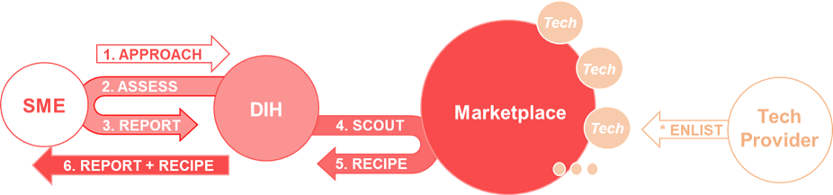
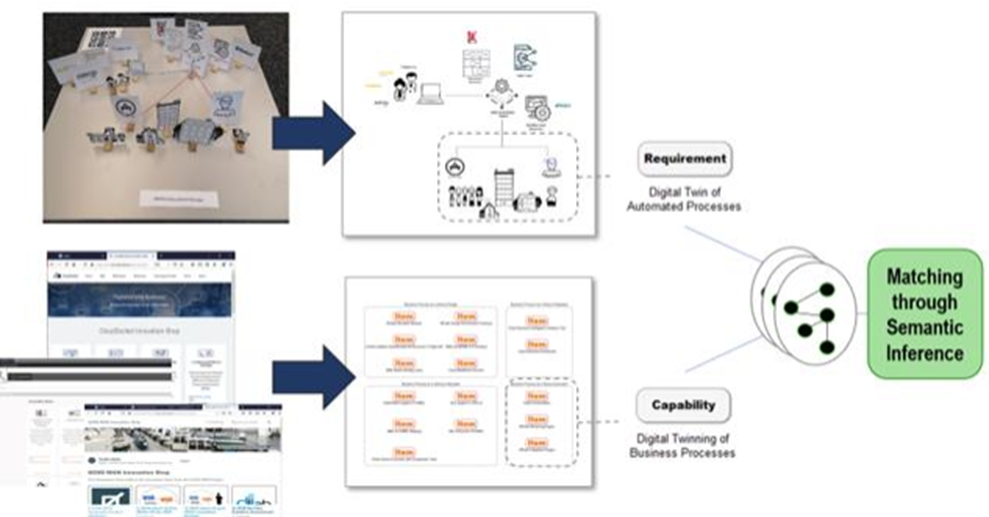

[До change2twin](README.md)

# Технології для забезпечення цифрових двійників на виробництві

Enabling technologies for digital twins in manufacturing, Oliver Barrowclough

Оригінал статті за [посиланням](https://www.change2twin.eu/wp-content/uploads/2022/09/DigitalTwinEnablingTechnology_position-paper_OliverBarrowclough-1.pdf)

[Enabling technology catalog](https://www.google.com/url?sa=t&rct=j&q=&esrc=s&source=web&cd=&cad=rja&uact=8&ved=2ahUKEwifxN3Gntv9AhURx4sKHdokDm8QFnoECBoQAQ&url=https%3A%2F%2Fec.europa.eu%2Fresearch%2Fparticipants%2Fdocuments%2FdownloadPublic%3FdocumentIds%3D080166e5ddabb8bf%26appId%3DPPGMS&usg=AOvVaw2m-hOyaG-XAKtIK5ZpR9jt)

## 1. Вступ

**Цифрові дійники** за своєю природою мають широкий спектр і, отже, охоплюють широкий діапазон технологій, від **традиційних комп’ютерних технологій (CAx)** до **передового обчислювального обладнання**, а також більше до **технологій що недавно зявилися** такі як (промисловий) Інтернет речей і глибоке навчання. Для того, щоб МСП могли отримати максимальну віддачу від впровадження своїх цифрових близнюків, важливо, щоб ці технології були доступні та представлені їм у зрозумілий і відповідний для їхнього бізнесу спосіб.

Однією з основних перешкод для впровадження цифрових двійників у промисловості є нерозуміння можливостей, які надають останні технологічні розробки. **Мета цього позиційного документа** полягає в тому, щоб надати простий і **лаконічний вступ** до широкого спектру **технологій, важливих для впровадження цифрових двійників**. Ми також обговорюємо, як таксономія технологій (організації даних у структурований та логічний спосіб) допоможе зробити технології доступними та знаходжувальними для Центрів цифрових інновацій (DIH) і МСП. Ми показуємо початкову версію торгового майданчика (маркетплейс marketplace ) Change2Twin у якості платформи для користувачів, що призначення для пошуку та відкривання технологій, а також на те, як ринок розвивається, щоб більш комплексно задовольняти нові потреби.

## 2 Загальне розуміння цифрового двійника

В Індустрії 4.0 термін «цифровий двійник» став загальноприйнятим, але його часто неправильно розуміють або неправильно представляють. Тому важливо подивитися на існуючі означення терміну для загального розуміння терміну. Хоча формальне означення змінюється залежно від контексту, наступні означення дають широке уявлення про те, що можна вважати цифровим двійником.

**Означення цифрового двійника, яке використовується в Change2Twin**, таке:

> Цифровий двійник — це цифрове представлення артефакту, процесу чи послуги (сервісу, service), яке є достатньо точним, щоб воно могло бути основою для прийняття рішень. Ця цифрова копія (replica) та реальний світ часто пов’язані потоками даних.

Після запуску проекту Change2Twin **було розроблено ще два означення**. Коротке означення, надане **Digital Twin Consortium**, частиною Object Management Group, таке ([джерело](https://www.digitaltwinconsortium.org/hot-topics/the-definition-of-a-digital-twin.htm)):

> Цифровий двійник — це віртуальне представлення об’єктів і процесів реального світу, синхронізованих із заданою частотою та точністю.

Ще одне більш детальне означення, надане **Американським інститутом аеронавтики та астронавтики**, таке (AIAA Digital Engineering Integration Committee, 2020):

> Цифровий двійник – це набір віртуальних інформаційних конструкцій, які імітують структуру, контекст і поведінку окремого/унікального фізичного активу або групи фізичних активів, що динамічно оновлюються даними зі свого фізичного двійника протягом життєвого циклу та інформують про рішення, які реалізують цінність.

Незважаючи на невеликі відмінності у фразеології, ці означення достатньо схожі, щоб дати послідовне уявлення про те, що ми маємо на увазі під цифровим двійником. **Фактичний прояв цифрового двійника звичайно** повністю **залежить від конкретного випадку використання**, тобто вони можуть бути дуже **різними на практиці, але всі поділяють властивості віртуального представлення фізичного активу, який синхронізується, коли відбуваються зміни у фізичному двійнику.** Саме рішення часто є динамічним і включає в себе поєднання різних моделей, джерел інформації, бізнес-процесів і цілей, що робить його кросдисциплінарним, але результат завжди спрямований на створення цінності для відповідних зацікавлених сторін. Change2Twin сфокусований на цифрових двійникх, що пов’язані із сектором виробництва.

## 3 Технології, які забезпечують можливість реалізації цифрових двійників

У цьому розділі ми розглядаємо поточну літературу з детальним описом деяких типів технологій, які зазвичай потрібні для реалізації цифрових двійників. Надалі для простоти в українському перекладі вони зватимуться **забезпечуючими технологіями** (enabling). Тут розглянута тільки **високорівнева категоризація технологій**, пізніше в документі буде представлено також більш повну таксономію, яка розбиває технології на їхні складові частини. Слід також зауважити, що технології, що розгялядаються, більше орієнтовані на **цифрових двійників у секторі виробництва**.

Існує кілька різних оглядових статей, у яких детально описуються типи забезпечуючих (enabling) технологій, які зустрічаються в реалізаціях цифрових двійників (Fuller, 2020), (Rasheed, San, & Kvamsdal, 2020), (Kritzinger та ін., 2018). У цьому розділі ми коротко згадаємо деякі з найбільш актуальних. Ця категорізація створена на основі (Rasheed, San, & Kvamsdal, 2020), однак у нашому списку ми також додали одну додаткову категорію "керування даними" та об’єднуємо категорії "моделювання на основі данних" (Data-driven modelling) з "кібернетикою великих даних" (big data cybernetics). Таким чином у наступних підрозділах **ми розглядаємо такі категорії**:

- **Геометричне моделювання та моделювання на основі фізичних принципів (Geometric and physics-based modelling)**
- **Моделювання на основі даних і кібернетика великих даних (Data-driven modelling & big data cybernetics)**
- **Інфраструктура та платформи (Infrastructure and platforms)**
- **Людино-машинний інтерфейс (Human-machine interface)**
- **Керування даними (Data management)**

Слід зазначити, що **впровадження цифрових двійників постійно розвиваються** і можуть у майбутньому включати інші технології, особливо коли вони стають зрілими і комерційно доступними. Таким чином, наступні підрозділи є неповним переліком технологій. Однак їх можна вважати **збіркою, яка охоплює деякі з найважливіших аспектів поточних реалізацій цифрових двійників**.

### 3.1 Геометричне моделювання та моделювання на основі фізичних принципів

#### 3.1.1 Автоматизоване проектування та обробка зображень 

Створення цифрового двійника (Digital twinning) часто починається з **геометричного моделювання**. В дійсності, багато малих і середніх підприємств уже мають доступні моделі своїх продуктів у тій чи іншій формі, що може стати ідеальною відправною точкою для їхніх цифрових двійників. **3D-моделі**, які використовуються в цифрових двійниках, часто створюються на етапі проектування в процесі розроблення продукту за допомогою **програмного забезпечення автоматизованого проектування (CAD, САПР )**. Залежно від конкретного випадку, використання такої моделі у якості основи для цифрового двійника **може бути недостатнім**. Наприклад, якщо цифровий двійник буде використовуватися як основа для рішень, які залежать від характеристик матеріалу фізичного активу, може знадобитися більш детальна модель.

У випадках, коли моделі проектування недоступні, може бути корисним інструментом **реверс інжиніринг (RE)**. RE передбачає перетворення сканів фізичного об’єкта (наприклад, лазерне сканування, фотограмметрія, КТ) назад у геометричну модель. Це може включати повну об’ємну інформацію про актив (наприклад, коли використовується комп’ютерна томографія) або просто відновлення зовнішніх поверхонь геометрії, як у випадку, коли доступні дані лазерного сканування або фотограмметричні дані. У багатьох випадках, для успішного реверс інжинірингу фізичного активу використовується програмне забезпечення в комбінації САПР та засобів обробки зображень.

#### 3.1.2 Комп'ютерне проектування

Часто аспекти цифрового двійника потребують моделювання **відношення об’єкта до навколишнього середовища**, наприклад, моделювання того, як температури або напруження змінюються в об’єкті за різних умов. Для цього потрібні методи **моделювання на основі фізичних принципів**, яке включає розв’язання відомих математичних рівнянь, пов’язаних із фізичними властивостями моделі. Стандартні моделі типу САПР у багатьох випадках не підходять для цього, оскільки зазвичай вони представляють лише межі об’єкта і не представляють явно його внутрішню частину. Найбільш поширеним підходом до створення моделі, придатної для фізичного моделювання, є дискретизація геометрії або обчислювальної області. Тип дискретизації дуже залежить від типу моделювання та методів, які вони використовують, будь то обчислення пружності, динаміка рідини чи теплопередача. Функціональні можливості для дискретизації моделей і розв’язування рівнянь доступні в стандартному програмному забезпеченні **автоматизованого проектування (CAE)**, однак це може бути трудомістким процесом. Новіший підхід, який випливає з наукової літератури, спрямований на зменшення кількості ручної праці, необхідної в робочих процесах моделювання дизайну продукту, відомий як **ізогеометричний аналіз (IGA, isogeometric analysis)** (Cottrell, 2009). IGA намагається уніфікувати проектні та інженерні представлення та може становити особливий інтерес у контексті цифрового двійника, оскільки одне представлення може використовуватися для багатьох цілей, включаючи проектування, моделювання та представлення властивостей матеріалу об’єкта.

#### 3.1.Комп'ютерно підтримане виробництво (Computer aided manufacturing)

У випадку створення цифрових двійників для виробничих процесів цікаві також інструменти **комп'ютерно підтриманого виробництва (CAM, Computer aided manufacturing)**. Програмне забезпечення CAM можна використовувати для означення та передачі такої інформації, як дані комп’ютерного числового керування (ЧПК, CNC) і параметри машини для субтрактивних виробничих процесів. У випадку адитивних процесів також може бути актуальною інформація про зрізи та вектори сканування . Незважаючи на те, що такі дані здебільшого цікаві під час **створення цифрових двійників виробничих процесів**, у деяких випадках може бути корисним зберегти цю інформацію в цифровому двійнику фактично виготовленого продукту. Наприклад, якщо частота відмов продукту залежить від використовуваного матеріалу та технології виготовлення, наявність цієї інформації в цифровому двійнику продукту є **критичною для таких застосувань, як прогнозне обслуговування**. Однак у деяких випадках така інформація може складатися з дуже великих обсягів даних, деякі з яких можуть бути обмежені правами інтелектуальної власності, тому міркування щодо того, яку виробничу інформацію слід зберігати в цифровому двійнику продукту, слід розглядати в кожному конкретному випадку.

### 3.2 Моделювання на основі даних і кібернетика великих даних

#### 3.2.1 Промисловий інтернет речей (IIoT)

Альтернативою підходу моделювання на основі фізичних процесів за допомогою відомих математичних моделей є проведення вимірювань фактичних умов на фізичному двійнику та застосування методів **моделювання на основі даних**. Однією з переваг моделювання на основі даних є те, що дані можуть охоплювати як відому, так і невідому фізику, таким чином забезпечуючи більш повний опис фізичних процесів. Однак для моделювання фізичних процесів таким чином **зазвичай потрібні великі обсяги даних**. Іншим обмеженням підходів, керованих даними, є можливість вимірювання певних умов за певних обставин (наприклад, вимірювання температури всередині об’єкта).

Щоб отримати дані, необхідні для моделювання на основі даних, існує **необхідність встановлення датчиків**, які можуть проводити вимірювання та передавати дані назад до комп’ютерних систем для подальшої обробки. Такі установки включають **Інтернет речей (IoT)**, який складається з мережі взаємопов’язаних датчиків, перетворювачів та інших пристроїв, які можуть збирати та постійно передавати великі обсяги даних. У виробничому контексті часто є більш доречним **промисловий Інтернет речей (IIoT)** , де вимоги щодо точності та якості показань датчиків, а також безпеки переданих даних зазвичай набагато суворіші, ніж на споживчому ринку.

Хоча показання датчиків пристроїв IIoT можуть бути цікавими і самі по собі, у контексті цифрового двійника вони зазвичай дають забагато даних, щоб аналізувати їх вручну. Нещодавні досягнення в **штучному інтелекті** відкрили нові можливості для глибшого розуміння великих обсягів даних. У той час, як штучний інтелект охоплює широкий спектр обчислювальних методів, більшість останніх досягнень стосуються машинного навчання, і особливо сфери глибокого навчання. Тепер за допомогою таких числових методів як **глибокі нейронні мережі (DNN, deep neural networks)** можливо моделювати багатовимірні та дуже нелінійні явища, як це часто вимагається в підходах, керованих даними.

#### 3.2.2 Штучний інтелект і машинне навчання

**Штучний інтелект (AI, ШІ)**  – це широкий термін, який охоплює сучасні підходи до **машинного навчання** на додаток до більш традиційних алгоритмів. На практиці багато застосувань штучного інтелекту містять програмні компоненти обох цих типів. У цифровому двійнику головними цілями штучного інтелекту є **вбудовування у цифровій двійник експертних знань та отримання знань із даних датчиків, зібраних з фізичного двійника**.

Багато з останніх досягнень в галузі ШІ стали можливими завдяки розвитку машинного навчання, зокрема глибокого навчання. Машинне навчання часто поділяють на три класи:

- **Навчання з учителем (Supervised learning)** особливо корисне, коли в цифрового двійника потрібно вбудувати наявні людські знання, оскільки воно базується на моделюванні пар вхідних даних і міток (labels). Позначення мітками (маркування) можна робити вручну, представляючи людські знання, або обчислювальним шляхом, як, наприклад, у випадку апроксимації результатів моделювання за допомогою DNN. Результатом тренування (training) моделі навчання з вчителем є її можливість повністю автоматично виводити мітки для нових вхідних даних. Навчаючи мережу на основі даних з мітками (маркованих даних), створеними декількома експертами, алгоритми навчання з вчителем можуть у деяких випадках працювати краще, ніж люди-оператори, з меншою кількістю неточностей. В інших випадках такі алгоритми можуть прискорювати важке ручне маркування, забезпечуючи початкове маркування, яку експерт може перевірити і, при необхідності, відредагувати, не беручи участі в усьому процесі маркування.

- **Навчання без учителя (Unsupervised learning)**, натомість, не потребує маркованих даних. Методи навчання без учителя, такі як кластеризація, можна використовувати для отримання нових уявлень про природу даних або для виявлення аномалій у великих масивах даних. Такі алгоритми часто використовуються в тандемі з людьми-експертами, які можуть використовувати результати для кращого інтерпретування даних.

- **Навчання з підкріпленням (RL, Reinforcement learning)** — при якому модель машинного навчання (яку ми називаємо агентом) навчається приймати  рішення на основі спостережень за навколишнім середовищем. Середовище може, наприклад, відповідати показанням з пристроїв IIoT, відповідних імітаційних моделей або комбінації обох. Потім агент отримує винагороду відповідно до певної бажаної поведінки та вчиться методом проб і помилок з часом максимізувати свою винагороду. RL особливо корисний у контексті планування та керування цифровими двійниками.

Технології штучного інтелекту, які ґрунтуються переважно на даних, часто викликають питання щодо **конфіденційності даних**. У деяких випадках це пов'язано з можливістю витягування з моделей ШІ необроблених даних  про людей. Останнім часом для вирішення цієї проблеми були розроблені такі техніки, такі як **диференційована приватність** (differential privacy, Abadi, et al.,  2016), які забезпечують обмеження впливу окремих вибірок на модель ШІ до певного рівня. В інших випадках питання більше пов’язане з тим, як отримати інформацію про набори даних, які є децентралізованими і не повинні надаватися спільно з центральним сервером.  **Федеративне навчання** є підходом до машинного навчання, при якому модель ШІ надсилається на  вузли мережі, де вона оновлюється, після чого надсилається назад на центральний сервер для об'єднання результатів з інших вузлів (Yang, et al., 2019).  Цей підхід відправлення алгоритму до даних, а не навпаки, гарантує, що кілька учасників можуть отримати загальну інформацію без обміну необробленими даними.

#### 3.2.3 Гібридна аналітика

Підходи до гібридного моделювання спрямовані на поєднання підходів до моделювання на основі фізичних законів та даних. Гібридна аналітика часто забезпечує більш гнучкий і надійний підхід і має перевагу в тому, що зберігає відому фізику моделі, водночас має справу з низькою якістю або кількістю даних, які заважають підходам, керованим даними. Тим не менш, поєднання часто є складнішим і вимагає більш спеціального підходу (Karniadakis, et al., 2021).

**Кібернетика великих даних** — це термін, який використовується для опису застосування вищезазначених підходів у контексті кібернетики (Rasheed, San, & Kvamsdal, 2020). Кібернетика — це міждисциплінарна галузь, метою якої є скерувати довільну систему до певної контрольної точки, використовуючи зворотний зв’язок від вибраних дій для визначення подальших дій. Деякі аспекти, які можна вважати **сприятливими для кібернетики великих даних**, включають:

- **Асиміляція даних**, де дані з різних джерел обробляються та фільтруються, 
- **Моделювання скороченого порядку (ROM, Reduced order modelling),** де складні задачі великої розмірності апроксимуються задачами меншої розмірності.

### 3.3 Інфраструктура та платформи

Існує кілька сервісів, які спрямовані на полегшення впровадження технологій (I)IoT і створення цифрового двійника в цілому, **пропонуючи повні рішення**. Такі пропозиції часто включають аспекти **Програмного забезпечення як послуги (SaaS)** і **Платформи як послуги (PaaS)**, що охоплюють численні елементи хмарних і периферійних обчислень, а також відповідні протоколи зв’язку. Нещодавній вибух інтересу до штучного інтелекту також зумовлений досягненнями, які роблять обчислення за допомогою нейронних мереж набагато швидшими та ефективнішими, ніж раніше.

#### 3.3.1 Хмарні обчислення

Для оброблення багатьох моделей і даних цифрового двійника потрібні значні обчислювальні ресурси. Одна з основних технологій, яка забезпечує оброблення в контексті великих даних, — це хмарні обчислення. Хмарні обчислення пропонують обчислювальні ресурси з віддаленого розташування через мережу. Одна з ключових переваг хмарних обчислень полягає в тому, що вони пропонують **гнучку масштабованість обчислювальних ресурсів** без потреби МСП інвестувати у власну інфраструктуру, що може бути корисним, враховуючи різні обчислювальні вимоги на різних етапах впровадження цифрових двійників. Наприклад, навчання DNN (глибоких нейронних мереж) часто є дуже важким обчислювальним завданням, але отримання результатів із попередньо навчених мереж набагато менш інтенсивне. У деяких випадках DNN, які навчалися протягом багатьох днів на високоякісних графічних процесорах (GPU), можуть справді добре працювати на стандартному апаратному забезпеченні CPU, коли справа доходить до висновку. Таким чином, використання ресурсів хмарних обчислень для періодичного навчання моделі без необхідності інвестувати в обчислювальне обладнання високого класу може призвести до **значної економії коштів**. Ще одна перевага хмарних обчислень полягає в тому, що користувачі можуть отримати доступ до останніх оновлень апаратного та програмного забезпечення без ризику знецінення. Переваги хмарних обчислень іноді протиставляються **ризикам конфіденційності даних, що залишають приміщення власника даних**. Хоча для компенсації цих ризиків часто використовуються найсучасніші засоби безпеки, також можуть існувати юридичні аспекти передачі даних для віддаленої обробки, особливо якщо дані перетинатимуть національні кордони.

#### 3.3.2 Периферійні (граничні) обчислення (Edge)

Хмарні обчислення можна порівняти з периферійними (граничними) обчисленнями (**edge computing**), які мають на меті наблизити обчислювальні ресурси до джерела даних. Основною перевагою периферійних обчислень є те, що **дані можна обробляти без необхідності виходити з локальної мережі**, вирішуючи проблеми із затримкою, уникаючи передачі величезних обсягів даних. Додаткова перевага периферійних обчислень полягає в тому, що легше забезпечити конфіденційність і безпеку даних. Однак це часто вимагає **значних інвестицій у апаратне забезпечення локального комп’ютера**. Також може бути корисним у деяких випадках гібридний підхід до обчислень, відомий як **туманне обчислення**, який спрямований на автоматичне **поєднання периферійних і хмарних ресурсів** для оптимізації обробки даних.

#### 3.3.3 Високопродуктивне обчислення

Подібно до хмарних обчислень, з віддаленого місця також зазвичай пропонуються високопродуктивні обчислення (HPC, High performance computing). Але на відміну від хмарних обчислень, вони спрямовані на **вирішення надзвичайно складних задач**, які зазвичай не можуть бути вирішені одним комп’ютером споживчого рівня. HPC-завдання зазвичай підлягають системі черги, де завдання надсилаються та очікують на доступність обчислювальних ресурсів. HPC особливо корисний, коли потрібні високопаралельні обчислення, наприклад, для складного моделювання або для пакетної обробки величезних обсягів даних від датчиків. Таким чином, воно може певною мірою підтримувати використання цифрового двійника як заміну фізичного тестування.

#### 3.3.4 Мережі

Пристрої IIoT, які обговорювалися раніше, повинні бути підключені до достатньо швидкої та надійної інфраструктури для передачі даних від фізичного до цифрового двійника. За наявності високошвидкісних бездротових мереж значно простіше інтегрувати пристрої IIoT, які можуть контролювати виробничі процеси, ніж це було раніше. Хоча **дротові мережі** мають переваги з точки зору надійності, вони часто дорожчі в обслуговуванні та менш гнучкі для подальшого розширення за допомогою нових пристроїв, що робить оновлення цифрового двійника більш громіздким. **Нова технологія 5G**, яка поєднує наднизьку затримку разом із вищими швидкостями, підвищеною надійністю та підвищеною доступністю, також стане рушійною силою впровадження цифрових двійників. 5G також вирішує проблеми з обмеженою кількістю пристроїв, які можуть спільно використовувати радіочастоту, використовуючи більш широку смугу пропускання, що дозволяє додавати все більше і більше датчиків у майбутньому.

### 3.4 Людино-машинний інтерфейс

#### 3.4.1 Доповнена, віртуальна та змішана реальність

Створення цифрового двійника надає чудові можливості для використання передових методів візуалізації, таких як **доповнена реальність (AR, augmented reality), віртуальна реальність (VR, virtual reality)** і **змішана реальність (MR, mixed reality, доповнена віртуальна реальність).** Якщо доступний цифровий двійник фізичного об'єкту, то в багатьох  випадках є сенс накладати дані, отримані з цифрового двійника, на  фізичний об'єкт. Це можна зробити різними способами, від використання гарнітур VR/AR або інших екранів до безпосереднього проектування інформації на фізичного двійника. Технологія MR — це гібрид технологій AR і VR, яка надає користувачеві візуальний зворотний зв'язок, а також  передачу інформації від користувача до цифрового двійника (наприклад, для керування). Тому їх часто поєднують з такими технологіями, як **обробка природної мови (NLP, natural language processing)** або **розпізнавання жестів**, щоб забезпечити ефективне середовище, в якому двійником можна керувати або голосовим керуванням, або фізичними рухами.

#### 3.4.2 Платформи розроблення з низьким кодом

Значна частина інтересу до цифрових двійників зумовлена здатністю витягувати з них достатньо повні знання, щоб їх можна було використовувати для прийняття рішень. У багатьох випадках конкретні питання, на які користувачі хочуть  отримати відповіді від цифрового двійника, не чітко сформульовані на  етапі реалізації. Користувачі зазвичай знають, які дані цікавлять для певних процесів, та відповідно до цього встановлюються конкретні датчики, але конкретні запити при цьому не чітко означені. Один зі способів запитування цифрового двійника полягає в програмному запиті інформації та її поданні у певному форматі.   Однак користувачі цифрових двійників часто не мають досвіду у програмуванні, а це означає, що для створення запитів їм потрібні спрощені інтерфейси. Платформи розробки з низьким кодом (LCDP, Low-code development platforms) забезпечують середовище, де **програмісти, які не є фахівцями, можуть використовувати графічний інтерфейс користувача для спрощеного створення користувальницьких запитів**. Це означає, що цифрового двійника може використовувати ширше коло зацікавлених сторін, і його можна використовувати для ширшого спектру цілей, ніж передбачалося спочатку.

### 3.5 Керування даними

Як ми бачимо з безлічі сприятливих технологій, впровадження цифрових двійників може включати складний набір програмних і апаратних компонентів, а також типів і форматів даних. Щоб об’єднати внесок усіх технологій у щось, що можна описати як цифрового двійника, потрібні складні підходи до керування даними.

#### 3.5.1 Керування життєвим циклом продукту

Створення цифрового двійника передбачає багато різних версій моделей, які можуть представляти різні аспекти протягом усього терміну служби двійника, від проектування та моделювання до виробництва та фактичного використання. Керування життєвим циклом продукту (PLM, Product lifecycle management) забезпечує **платформу для інтегрування, зберігання та доступу до даних протягом усього життєвого циклу продукту**. Основні переваги PLM полягають у тому, що він забезпечує керування конфігурацією та відстеження. PLM можна використовувати для багатьох різних типів даних, від даних про структуру продукту та креслень САПР до документації та відповідної інформації електронного навчання. PLM також є важливою рушійною силою для використання стандартів, що є життєво важливим у реалізації цифрового двійника для забезпечення взаємодії між різними компонентами, а також сумісності між цифровим двійником і зовнішнім світом.

#### 3.5.2 Blockchain

Блокчейн — це технологія, яка за останні кілька років була популяризована завдяки використанню в різних криптовалютах. Однак блокчейн має ширше застосування, що може бути цікавим для цифрових двійників. Блокчейни забезпечують **постійний децентралізований історичний запис інформації, який є безпечним, простежуваним і прозорим**; усі вони важливі в контексті цифрового двійника. У деяких контекстах також з’являються альтернативи технологіям блокчейну, такі як спрямовані циклічні графи (DAG, directed a cyclical graphs), які вирішують деякі проблеми з масштабованістю.

## 4 Доступ до технологій Digital Twin через CHANGE2TWIN Маркетплейс

**Change2TwinMarketplace** — це онлайн-платформа, на якій представлені рішення європейських постачальників технологій, які полегшують створення та розгортання цифрових двійників. **Маркетплейс (Marketplace , торговельний майданчик)** було розроблено як інструмент для європейських центрів цифрових інновацій, які допомагають виробникам у їхніх зусиллях із цифровізації. Сьогодні він в основному використовується тими, хто є частиною мережі Change2Twin, однак у майбутньому цей інструмент має бути доступний для набагато ширшої мережі DIH.

Основна особливість підходу **Change2Twin** полягає в тому, щоб забезпечуючі технології для створення цифрових двійників стали доступні на **онлайн маркетплейсі**. Маркетплейс включає товари, які відрізняються за своєю природою, зокрема:

- **консультаційні послуги,**
- **інформація,**
- **програмне забезпечення,**
- **апаратне забезпечення або**
- **повні цифрові двійники**.

На наступному рисунку показано оригінальну концепцію наскрізного сервісу (end-to-end), який надає **Центр цифрових інновацій (DIH)** для малого та середнього бізнесу з використанням маркетплейсу, який надає забезпечуючі технології. Рисунок розширено для того, щоб показати, як постачальник технологій (technology provider)  бере участь у тому, щоб зробити забезпечуюючі технології доступними через маркетплейс. Крім того, на рисунку показано прості кроки залучення для успішної підтримки МСП.

 

Рис.1: Як МСП (SME), DIH та постачальники технологій взаємодіють з маркетплейсом

Учасниками цього сценарію є МСП(SME), DIH, маркетплейс і постачальник технологій. **Основною точкою входу в цей сценарій є те, де МСП звертається до DIH за підтримкою.** З точки зору DIH кроки будуть наступними:

1. МСП звертається до DIH за підтримкою.

2. DIH разом із МСП оцінює ситуацію. Це можна зробити, наприклад, заповнивши інструменти оцінки та готовності - Change2Twin COMPASS.
3. DIH та МСП роблять звіт про те, які цілі створення цифрового двійника є найбільш придатними для МСП, з інструкціями та домовленістю щодо того, які слід застосовувати.
4. DIH допомагає МСП, досліджуючи маркетплейс у пошуках забезпечуючих технологій, придатних для вибраних цілей.

5. Маркетплейсом надаються забезпечуючі технології як рецепт для DIH.
6. DIH надає відповідний рецепт до звіту з рекомендаціями щодо забезпечуючих технологій, пов’язаних постачальників технологій та інформацією про розробку та впровадження працездатного цифрового двійника для їх призначеної мети.

Паралельно з цими кроками **постачальники технологій можуть зареєструвати свої заебезпечуючі технології на ринку**, щоб зробити їх доступними для DIH і зробити їх доступними для МСП. Вкрай важливо, щоб інформація про технології була актуальною, особливо щодо версій або виправлень, а також змін у контактних і робочих деталях.

Маркетплейс Change2Twin виник як арена для обміну технологіями консорціуму Change2Twin, але зараз він містить кілька списків від сторонніх сторін і зростає з кожним днем.

### 4.1 Поради постачальникам технологій: як зареєструватися на маркетплейсі 

Якщо ваша компанія надає рішення для створення та розгортання **цифрових двійників, орієнтованих на виробничий сектор**, ви можете зареєструватися на Change2Twin Marketplace – послуга абсолютно безкоштовна! Щоб приєднатися до Change2Twin Marketplace і привернути увагу **центрів цифрових інновацій** і **кінцевих користувачів** у їхньому пошуку відповідних цифрових послуг і продуктів, просто виконайте чотири прості кроки

1. Надішліть свій запит на [marketplace@change2twin.eu](mailto:marketplace@change2twin.eu)

2. У відповідь Вам буде надано форму для заповнення та інструкцію щодо подальших дій. Переконайтеся, що ваш опис точний і релевантний для створення цифрових двійників.
3. Коли ви надсилаєте свій опис, наша робоча група подбає про нього. Вони оцінять ваш товар за технічними та нетехнічними критеріями якості. За потреби вони зв’яжуться з вами напряму, щоб завершити підтвердження вашого запису.
4. Коли ваш список буде перевірено, його буде опубліковано на Marketplace, і Ви отримаєте сповіщення електронною поштою.

#### 4.1.1 Як підготувати чудовий список

Change2Twin Marketplace пропонує рішення для створення та розгортання цифрових двійників. Таким чином, кожен елемент повинен надавати точну інформацію про його відношення до цифрового двійника, щоб бути впізнаваним для кінцевих користувачів. Крім того, необхідно вказати зусилля, необхідні для встановлення, який тип процесу/виробництва задіяно, як можна придбати товар, веб-сайт і контактні дані для отримання додаткової інформації тощо.

#### 4.1.2 Процедура перевірки перед публікацією

Прийняття нової пропозиції на Marketplace базується на процесі адаптації, який гарантує якість і актуальність перерахованих рішень. Як згадувалося вище, робоча група Onboarding перегляне кожне оголошення та за потреби зв’яжеться з його власниками. У разі невідповідності вимогам або невідповідності провайдера, пропозиція може бути відхилена.

Технічний огляд необхідний, якщо є потреба в розгортанні елемента або необхідно обговорити технічні вимоги. На додаток до технічної перевірки, нетехнічна (адміністративна) перевірка повинна бути проведена з усіма поданими рішеннями. Після того, як пропозицію прийнято, Marketplace оновлюється відповідно, а власник отримує сповіщення.

### 4.2 Поради для кінцевих користувачів: як шукати відповідні рішення на маркетплейсі?

Маркетплайс Change2Twin зростає, тому стає все більш необхідним зробити елементи доступними за допомогою функції пошуку. Базові функції пошуку, які тепер доступні на Marketplace, дозволяють здійснювати пошук за ключовими словами, типами пропозицій, компаніями, рівнями технологічної готовності (TRL) і описами рішень.

Ще більш розширений пошук можливий за допомогою нещодавно представленої пропозиції семантичного пошуку. Це дозволяє знайти найбільш підходящі товари на одному чи кількох маркетплейсах, виходячи з потреб вашого варіанту використання, використовуючи семантичні відповідності.

Щоб означити можливості елемента маркетплейсу відповідно до вимог користувача введено спеціальний тип моделі. Вимоги можна означити вручну або витягнути з пов’язаних зі сценами, що представляють варіант використання. Потім виконується семантичне зіставлення, щоб визначити, який елемент найкраще відповідає необхідним вимогам. Зіставлення повертає матричне подання, де для кожної доступної моделі ринку візуалізуються всі елементи, що відповідають кожній вимозі.

## 5 Висновки

Цей документ містить огляд багатьох важливих технологій, які зазвичай використовуються для створення цифрових двійників. Технології були представлені на основі огляду поточної літератури та на основі досвіду партнерів проекту Change2Twin, які брали участь у широкому спектрі впровадження цифрових двійників. Описи технологій спрямовані на те, щоб надати МСП і компаніям із середньою капіталізацією відправну точку, коли вони намагаються зрозуміти, які технології доступні та як їх можна поєднати, щоб створити цифрових двійників. Сфера цифрових двійників дуже динамічна, у ній постійно з’являються нові технології. Маркетплейс (торговельний майданчик) Change2Twin прагне відобразити це, забезпечуючи основу технологій, яка постійно оновлюється та доповнюється, коли нові технології стають доступними.

### 6 REFERENCES

- Abadi, M., Chu, A., Goodfellow, I., McMahan, H. B., Mironov, I., Talwar, K., & Zhang, L. (2016). Deep learning with differential privacy. *In Proceedings of the 2016 ACM SIGSAC conference on computer and communications security*, 308-318.
- AIAA Digital Engineering Integration Committee. (2020). *Digital Twin: Definition & Value.* American Institute of Aeronautics and Astronautics, Inc.
- Boschert, S., Heinrich, C., & Rosen, R. (2018). Next Generation Digital Twin. *Proceedings of TMCE 2018*, 209-218.
-  Cimino, C., Negri, E., & Fumagalli., L. (2019). Review of digital twin applications in manufacturing. *Computers in Industry*.
- Cottrell, J. A. (2009). *Isogeometric analysis: toward integration of CAD and FEA.* John Wiley & Sons.
- ec.europa.eu. (2014). *Technology readiness levels (TRL); Extract from Part 19 - Commission Decision C(2014)1995.* Creative Commons Attribution 4.0 International License.
- Enders, M., & Hoßbach, N. (2019). Dimensions of Digital Twin Applications - A Literature Review. *Proc. of the Americas Conference on Information Systems*.
- Fuller, A. F. (2020). Digital twin: Enabling technologies, challenges and open research. *IEEE Access*.
- Haße, H., Li, B., Weißenberg, N., Cirullies, J., & Otto, B. (2019). Digital twin for real-time data processing in logistics. *Proc. of Artificial Intelligence and Digital Transformation in Supply Chain Management*, 4-28.
- Karniadakis, G. E., Kevrekidis, I. G., Lu, L., Perdikaris, P., Wang, S., & Yang, L. (2021). Physics-informed machine learning. *Nature Reviews Physics*, 422-440.
- Kritzinger, W., Karner, M., Traar, G., Traar, J., Henjes, J., & Sihn, W. (2018). Digital twin in manufacturing: A categorical literature review and classification. *IFAC-PapersOnLine, vol. 51*, 1016-1022.
- Lanza, R. H. (2019). Relating structural test and FEA data with STEP AP209. *Advances in Engineering Software*, 96-105.
- Pileggi, P. (2021). *Overcoming nine digital twin barriers for manufacturing SMEs.* Change2Twin consortium.
- Rasheed, A., San, O., & Kvamsdal, T. (2020). Digital Twin: Values, Challenges and Enablers. *IEEE Access, 8*, 21980-22012.
- Tao, F., Zhang, H., Liu, A., & Nee, Y. (2019). Digital Twin in Industry: State-of-the-art. *IEEE Transactions on Industrial Informatics*, 2405-2415.
- Valk, H., Haße, H., Möller, F., Arbter, M., Henning, J.-L., & Otto, B. (2020). A Taxonomy of Digital Twins. *Proc. of AMCIS*.
- Yang, Q., Liu, Y., Cheng, Y., Kang, Y., Chen, T., & Yu, H. (2019). Federated learning. *Synthesis Lectures on Artificial Intelligence and Machine Learning*, 1-207.