# Digital Twins в проекті Change2Twin  - загальне розуміння (переклад)

Оригіал відео доступний за посиланням: https://youtu.be/7T1laxyTbsk

Переклад https://youtu.be/NzLlyQ5TgCo

### Передмова

Вашій увазі пропонується переклад вебінару від консорціуму cange2twin щодо ключових понять в темі цифрових двійників, та плану їх впровадження на малих та середніх підприємствах. Цільовою аудиторією проведеного вебінару є європейські центри цифрових інновацій (Digital innovation Hub). Мета - залучення їх до дослідницьких пропозицій. Оскільки даний вебінар добре відображає основні поняття цифрових двійників його рекомендується переглянути усім представникам української промисловості та інноваційного середовища. Даний переклад зроблено Олександром Пупеною в рамках роботи над оглядом грантових пропозицій на платформі Industry4Ukraine. Це авторський переклад і не повністю відповідає англомовному варіанту. 

Посилання на оригінальну версію а також на додаткові ресурси внизу під відео. Далі переклад читається як пряма мова.    

### [0:00](https://www.youtube.com/watch?v=7T1laxyTbsk&t=0s) Introduction (вступ)

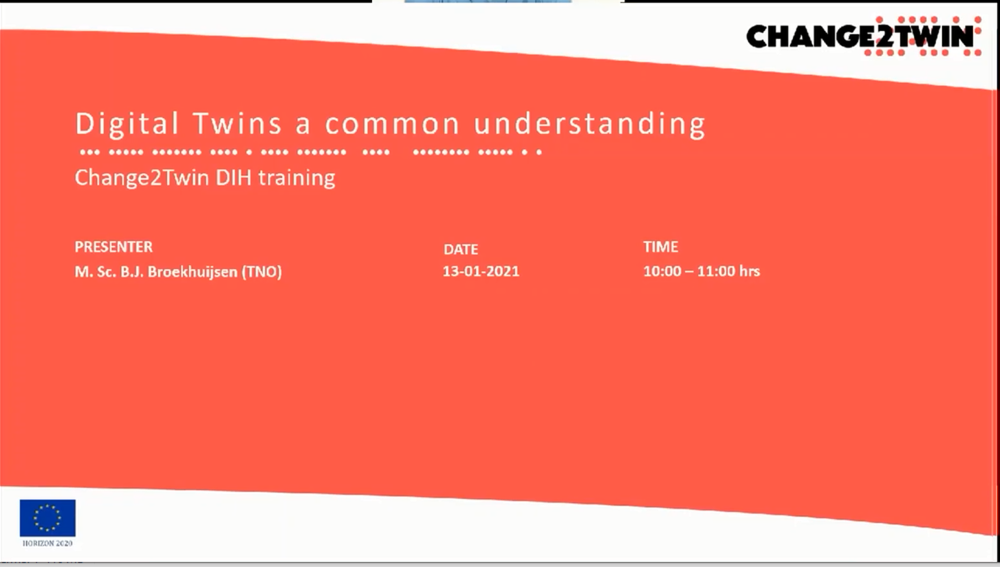

Я хотів би, щоб усі мали однакове спільне розуміння того, що ми насправді розуміємо під цифровими двійниками, навіщо вони потрібні та як їх розробляти. Саме тому я підготував цю презентацію. Слайди не будуть надто технічними, але я сподіваюся, що кожен зможе слідувати тим пунктам, які тут будуть наведені.

### [0:29](https://youtu.be/7T1laxyTbsk?t=29) Знайомтеся зі своїм тренером (Meet your trainer)

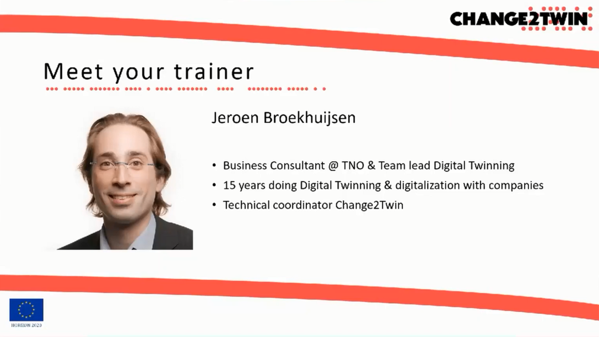

Отже, спочатку коротко про себе. Я бізнес-консультант, і зараз очолюю дослідницьку групу з цифрових двійників. Я працюю з цифровими двійниками вже 15 років. Протягом своєї професійної діяльності брав участь у цифровізації в багатьох компаніях. Я є технічним координатором change2twin. 

Зараз я скажу можливо неочікуване твердження. Уже 15 років я займаюся роботою з тим, що зараз називається цифровими двійниками, тому я не вважаю це чимось новим. Тобто це щось давно використовуване, яке ми назвали новою назвою, і це я поясню трохи пізніше.

### [1:10](https://youtu.be/7T1laxyTbsk?t=70) Після цього тренінгу ви дізнаєтесь (After this training you will know ...)

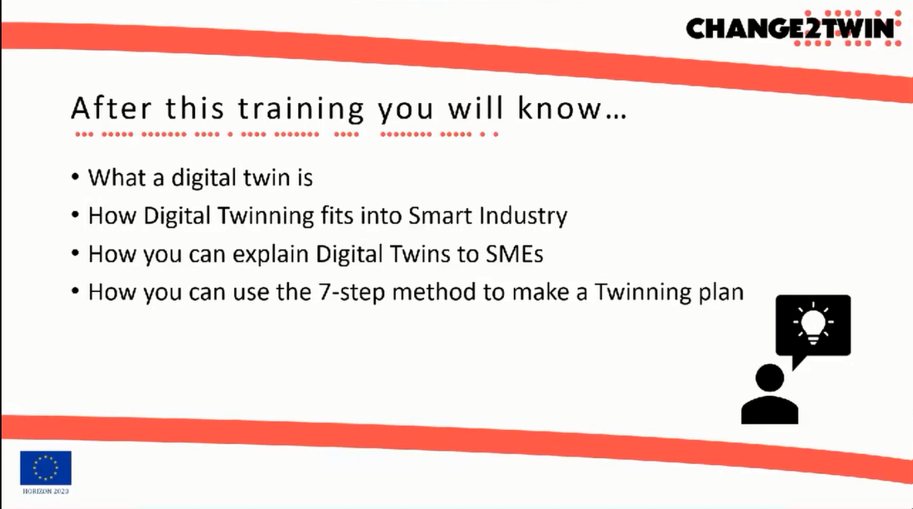

Тож я сподіваюся, що після цієї сесії найближчої години ви всі матимете базове розуміння того, про що ми говоримо в термінах цифрових двійників; як цифрові двійники вписуються в концепцію розумного виробництва; як ви можете пояснити про цифрові двійники для МСП. А також я надам короткий вступ до семиетапного методу для створення плану роботи над двійниками. Тому що мало знати, що двійник може зробити, треба його ще потім реалізувати.

### [1:48](https://youtu.be/7T1laxyTbsk?t=108) План (Agenda)

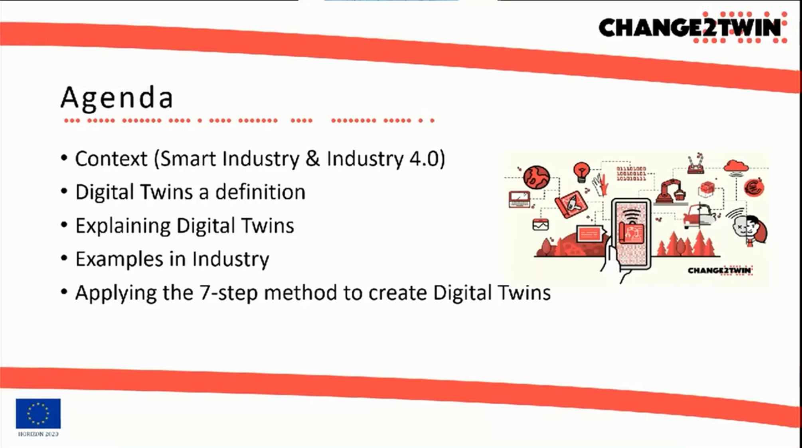

Спершу я надам трохи контексту з точки зору розумного виробництва (в англомовному варіанті Smart Industry) або Інудстрії 4.0. Потім я наведу означення цифрового двійника і детально поясню, чому воно саме таке. Далі я наведу деякі приклади з промисловості. Ну і зрештою коротко пройдуся по семиетапному методу, який може допомогти у створенні реального цифрового двійника.

### [2:17](https://www.youtube.com/watch?v=7T1laxyTbsk&t=137s) Організаційна інформація (Organizational information)

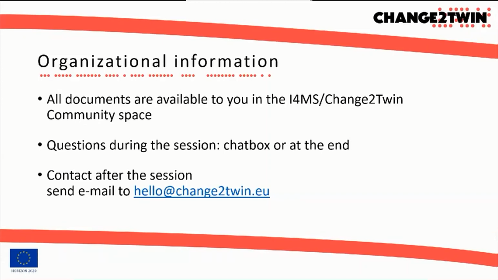

Трохи організаційної інформації. Усі документи а також ця презентація доступна на сайті спільноти change2twin. Також ви бачите загальну адреса email change2twin, якщо Ви хочете зв'язатися зі мною.

### [2:51](https://youtu.be/7T1laxyTbsk?t=171) Вступ до Smart Industry & Digital Twin (Introduction to Smart Industry & Digital Twin)

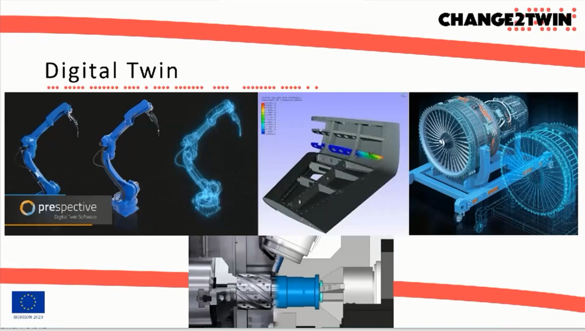

Давайте почнемо зі вступу до Smart Industry та до цифрових двійників.  

Для початку почнемо зі знайомством з цифровими двійниками. На даному слайді задля демонстрації показано кілька екранів з різного програмного забезпечення від наших партнерів, які входять до консорціуму.  Ліворуч екран з Perspective. Це дуже гарне програмне забезпечення, в якому ви можете моделювати реальну фізичну частину вашого заводу і представляти її в цифровому вигляді. Тут кілька екранів прикладів того, що вони роблять. 

Також на слайді ви бачите екрани з системи PLM від Jotner, в якій  ви можете проводити модельні розрахунки, наприклад, частин літака. Праворуч є фото, на якому показано порівняння реального двигуна із віртуальним. 

Внизу показано як ви переходите від, скажімо, шматка голого металу до фактичного продукту у металообробці. 

На всіх цих зображеннях показано як об’єднуються фізичний і цифровий світи. Цифровий двійник - це якраз про це поєднання. І щоб краще показати ці ідеї подивимося коротке відео.

### [4:17](https://www.youtube.com/watch?v=7T1laxyTbsk&t=257s) Цифровий двійник: приклад

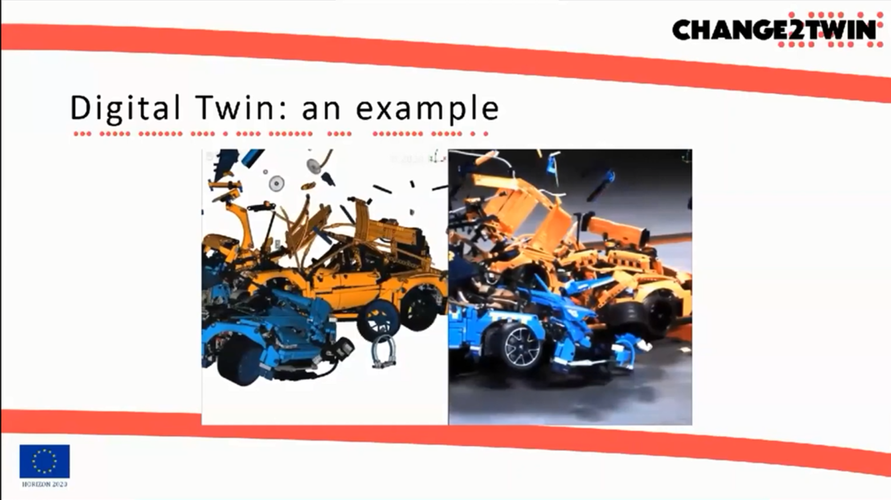

На цій відео-демонстрації, яку зробила компанія  Scale, праворуч показано  реальний світ, а ліворуч — віртуальний. Завдання в даному експерименті полягало в тому, щоб розробник, який займається моделюванням, дізнався, чи може імітаційна модель бути достатньо деталізованою, щоб вона відображала реальність і узгоджувалося з нею. І як ви бачите, машини розбиваються майже однаково як праворуч так і ліворуч. Це означає, що віртуальне представлення, тобто цифрова імітаційна модель є достатньо деталізованою для представлення фізичного світу. 

Навіщо ж з зрештою це потрібно робити? Звичайно, є багато краш-тестів для автомобілів. Але якщо ви зможете замінити віртуальними тестами вісімдесят відсотків усіх краш-тестів, виконавши обчислення перед фактичним тестом, ви заощадите багато автомобілів, і зекономите багато зусиль, які б пішли на проведення та оцінки реального керш-тесту.

Це схоже на те, що я робив із цифровими двійниками і в інших областях промисловості. Надто дорого просто зламати машину, щоб щось перевірити. Якщо ви можете зробити це віртуально, це має набагато більше сенсу. Але це лише один із прикладів застосування цифрового двійника.

### [6:02](https://www.youtube.com/watch?v=7T1laxyTbsk&t=362s) Smart Industry & Industry 4.0

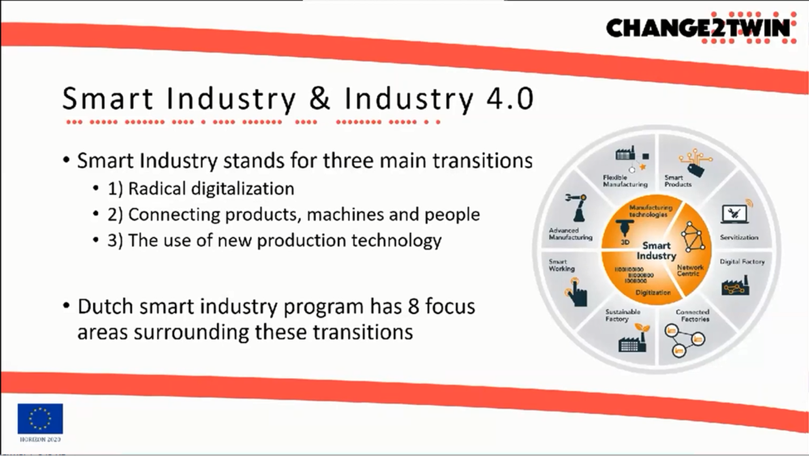

Добре, тепер поговоримо про smart industry (розумну промисловість) яку також називають Індустрією 4.0. Оскільки ми говоримо про виробничі компанії, то smart industry є важливим аспектом. 

Smart industry передбачає три основні переходи: це цифровізація; об’єднання продуктів, машин і людей; і використання нових виробничих технологій. Поєднання цих трьох речей і складають smart industry. Це поняття не має чітких означень та границь, тому ви можете рухатися в різних напрямках. 

Так в Нідерландах, де розташована моя компанія, є відповідна національна програма smart industry. Вони вирішили рухатися по восьми основних напрямках, пов’язаних із цими переходами. Тут ви можете побачити технічне облсуговування, чи цифрову фабрику, або гнучке виробництво і т.д. В цих напрямках закладено більше конкретики, так як це добре відомі на виробництві терміни. І, доречі, у більшості з них можуть використовуватися цифрові  двійники.

### [7:11](https://youtu.be/7T1laxyTbsk?t=431) Багато перспектив Smart Industry 

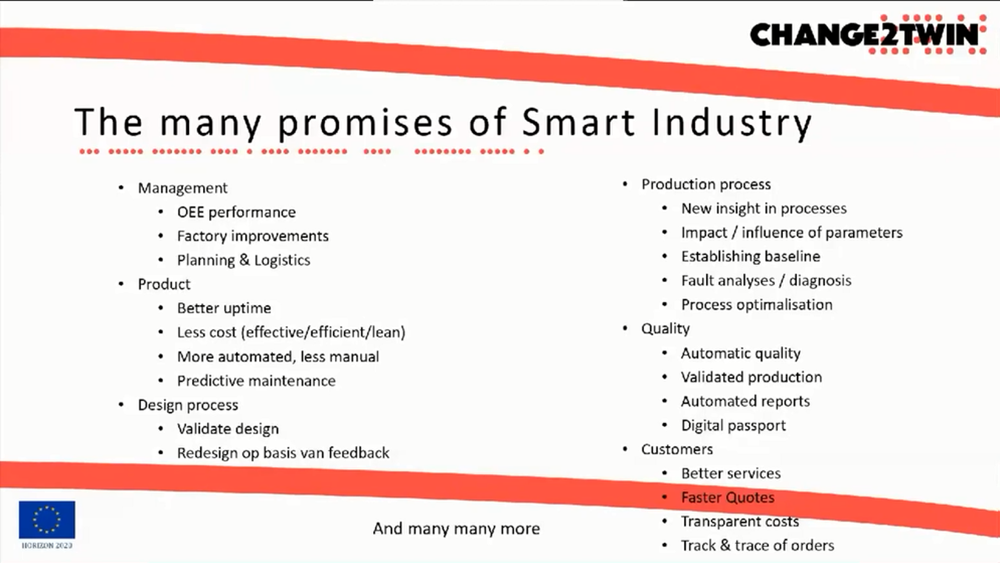

У smart industry є багато перспектив, тут показано декілька з них.  Ми в Нідерландах багато говоримо про це як з малими, так і з більшими компаніями, а також розповідаємо про те, як цього досягнути.

### [7:39](https://www.youtube.com/watch?v=7T1laxyTbsk&t=459s) Smart Industry, Digitalization, Digital Twinning

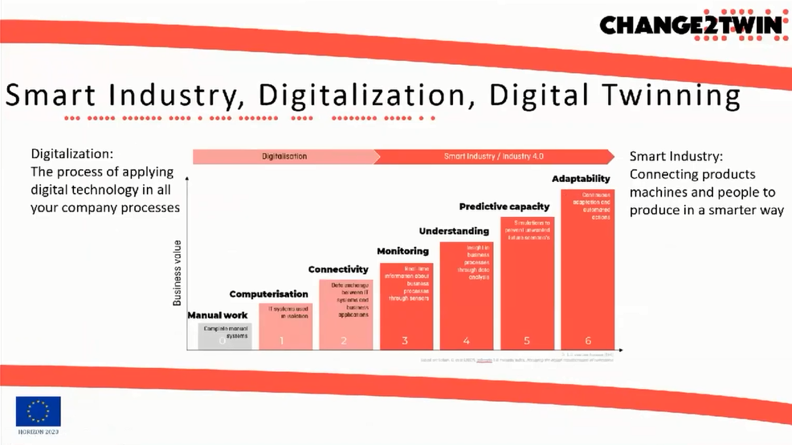

І найбільша проблема, яку ми маємо пов'язана з цифровізацією, тобто з процесами застосування цифрових технологій у всіх процесах вашої компанії. Це дуже серйозний виклик. І я думаю, що це якраз той базовий рівень, про який Нуно говорив до цього у своїй презентації, коли казав, що ми очікуємо мінімум другого рівня, але бажано третього. 

Те що ви бачите на цьому слайді зроблено на основі німецького дослідження. Вони виділили рівні зрілості смарт-індустрії і показують його у вигляді ось такої діаграми. Ми зробили тут деякі невеликі зміни, давайте пройдемося по ній. 

Отже, якщо ви у своїй компанії робите все вручну, і у вас немає нічого цифрового, то ви перебуваєте на нульовому рівні. Звичайно, це давно минуло, і значна більшість компаній далеко за межами цього етапу.

Сьогодні ми всі використовуємо комп’ютери та ІТ-системи, щоб реєструвати те, що ми робимо, зберігати наші замовлення, виконувати певну обробку. У нас є програмне забезпечення для імітаційного моделювання або підготовки до роботи, у нас є програмне забезпечення САПР для проектування, і інші види програмного забезпечення. Але якщо вони використовуються в компаніях ізольовано, це перший рівень цифровізації.

У цьому випадку великим кроком є з’єднання їх один з одним. Тоді ви матимете обмін даними між цими програмними системами та бізнес-застосунками, і тоді ви вже будете на другому рівні. Наприклад: якщо компанія отримує замовлення через свій веб-портал, а воно автоматично з'являється в системі ERP, потім можливо,  автоматично буде запланована підготовка до роботи та робоче замовлення, а потім видані правильні інструкції для машини, яка виготовляє продукт. Також автоматично система підключатиметься до машини, і машина звітуватиме про прогрес та результат виконання, і повідомлятиме про значення з певних датчиків.

Потім ви можете перейти до третього рівня - моніторингу, де ви в реальному часі можете використовувати всю цю інформацію, стежити за тим, що відбувається, і мати інформацію про бізнес-процеси .

Коли у вас є в доступі ця інформація, на основі отриманих даних ви можете перейти на четвертий рівень, рівень розуміння того, що відбувається у вашій компанії. Якщо щось піде не так, то ви про це дізнаєтеся і зможете взаємодіяти з бізнес-процесом. Але якщо компанія не на четвертому рівні розвитку, робити превентивні дії ви не можете.

Якщо ж ви добре розбираєтеся і можете передбачити що станеться на підприємстві протягом наступної години або, можливо, завтра чи наступного тижня, тоді підприємство на 4-му рівні зрілості, тобто здатності передбачати. І, можливо для цього використовуються імітаційні моделі, робота яких дає такі передбачення.

Останній, шостий рівень зрілості - це адаптивність. Якщо підприємство досягло цього рівня, на ньому постійно проводиться навчання для адаптування до нових змін і нових ситуацій. І це є найвищим рівнем зрілості, який ми можемо досягти на даний момент. 

Smart industry фактично об’єднує речі. Таким чином, це пов’язує ІТ-системи сумісно з людьми, які їх створюють, з машинами які їх створюють. Це велика зміна в розумінні того, як ми думаємо про промисловість і виробництво.

### [11:30](https://youtu.be/7T1laxyTbsk?t=690) Smart Industry, Digitalization, Digital Twinning (sel)

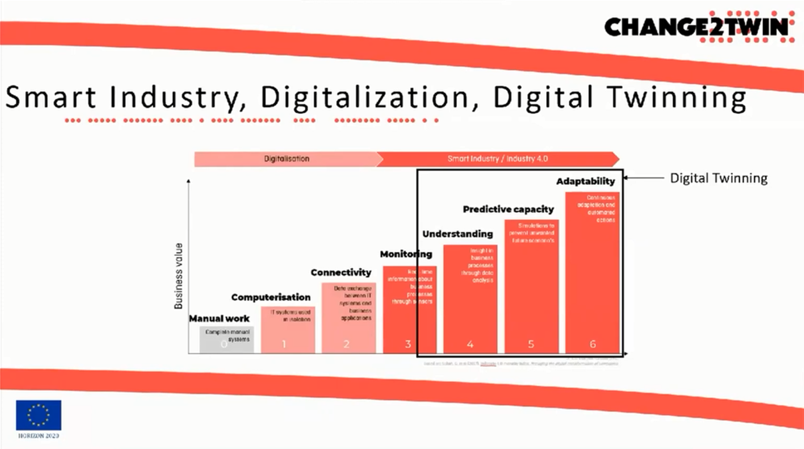

Якщо ми говоримо про створення та використання цифрових двійників - то це відбувається в основному в правій частині цього індексу зрілості. Тому те, що сказав Нуно щодо бажаного рівня 3, має сенс. Бо якщо у вас немає даних, дуже важко поєднати цифровий і віртуальний світ. Якщо у вас немає імітаційної моделі, буде дуже важко отримати фактичне уявлення про те, що ви маєте на заводі. Таким чином, це саме та область, де відбувається використання цифрових двійників.

### [12:03](https://youtu.be/7T1laxyTbsk?t=723) Перешкода

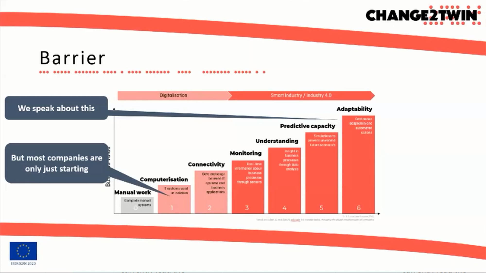

Розкажу про те, що я часто бачу в компаніях, коли спілкуюся з ними щодо створення розумного виробництва. Ми багато розмовляємо з ними про те, як зробити цю автономну фабрику, яка буде самонавчатись і використовувати штучний інтелект, і всілякі цікаві речі, які можуть відбутися. Але коли я починаю вникати в деталі реалізації існуючого виробництва, то здебільшого виявляється, що вони тільки на початкових рівнях зрілості. Тобто вони просто мають ізольовані комп’ютерні системи та лише намагаються з'єднати їх між собою. 

Я це називаю великою перешкодою.  Дуже важко перевести компанії малого та середнього бізнесу з першого або другого рівнів на третій. Тільки після цього переходу ми можемо використовувати технології цифрових двійників. 

Ви можете подумати, що це стосується лише МСП, тому що там процеси цифровізації відстають. Але по багатьом звітам країн ЄС я бачу, що та сама проблема і в транснаціональних компаніях. І навіть незважаючи на те, що деякі частини транснаціональних корпорацій можуть бути на вищому рівні, наприклад, на четвертому, більша частина все ще знаходиться на одному з перших двох. Тож не лише підприємства малого та середнього бізнесу, а й великі компанії намагаються зробити цей перехід.

### [13:24](https://www.youtube.com/watch?v=7T1laxyTbsk&t=804s) Історія успіху Smart Industry! 2019 Sandvik обрано Маяком у ЄС 

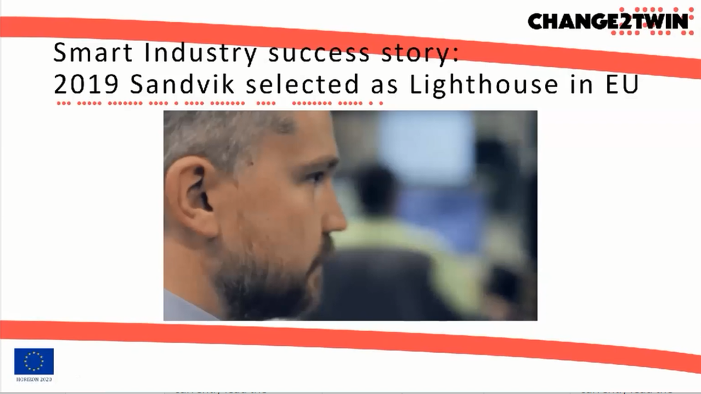

Я хочу показати свого роду історію успіху на прикладі [Sandvik](https://www.youtube.com/c/SandvikGroup/videos), які були обрані ЄС як маяк smart industry. Вони виклали кілька гарних відео на YouTube, і я вибрав уривок із одного з них щоб показати, як вони думають про об’єднання всіх цих різних частин своєї компанії.

Це результат використання того, що ми любимо називати цифровим потоком. Цифровий потік — це наша концепція автоматизації проектування, підготовки до виробництва та самого виробництво та обміну інформацією між цими системами. Ми збираємо багато даних із наших машин і процесів як із систем керування ними, так і безпосередньо з датчиків в самих машинах.

Ми також впроваджуємо програмне забезпечення для виявлення колізій і машинного навчання, яке допоможе нам у подальшому використовувати ці дані. Лише на цій фабриці ми виготовляємо майже 15 000 стандартних виробів, і замість створення 3D-моделей і креслень для кожного з них, ми використовуємо параметричне проектування. Це дає можливість автоматизувати процеси проектування, що, у свою чергу, дозволяє автоматизувати весь ланцюжок аж до самого виробництва.

Тобто вони фактично об’єднали всі свої процеси на фабриці, щоб перейти від початкового проектування деталей до фактичної доставки клієнту. Тут кожна окрема частина всього виробничого процесу пов’язана одна з одною

І це дає їм змогу краще відслідковувати і краще розуміти, що відбувається.

### [15:12](https://youtu.be/7T1laxyTbsk?t=912) Перешкода (Питання датчиків)

Я бачу в чаті питання щодо області використання датчиків на різних рівнях зрілості. Тому я повертаюся на цей слайд. Роль цих датчиків може бути дуже різною. 

Наприклад сфокусуємося на машинах. Припустимо у вас є виробничий процес і він пов’язаний, скажімо, з умовами навколишнього середовища, типу температури чи вологості або деяких інших аспектів. Ці умови якось приховано впливають на процес виробництва та якість вашої продукції. Тоді вам потрібно буде під’єднати датчики, скажімо, в цеху або на заводі до цієї машини разом з датчиками самої машини, щоб керувати цією якістю. Можливо, вам потрібно буде трохи підвищити температуру у виробничій машині, щоб зробити продукт кращої якості.

Інший приклад - використання датчиків вібрації. Ці датчики можуть вимірювати деградацію деталей машини. Тобто, якщо відбувається нетипова вібрація, це говорить про необхідність заміни деяких деталей. Тому це використовується для предиктивного обслуговування.

Таких прикладів є багато. Я повернуся ще до цього трохи пізніше.

### [16:44](https://www.youtube.com/watch?v=7T1laxyTbsk&t=1004s) Означення

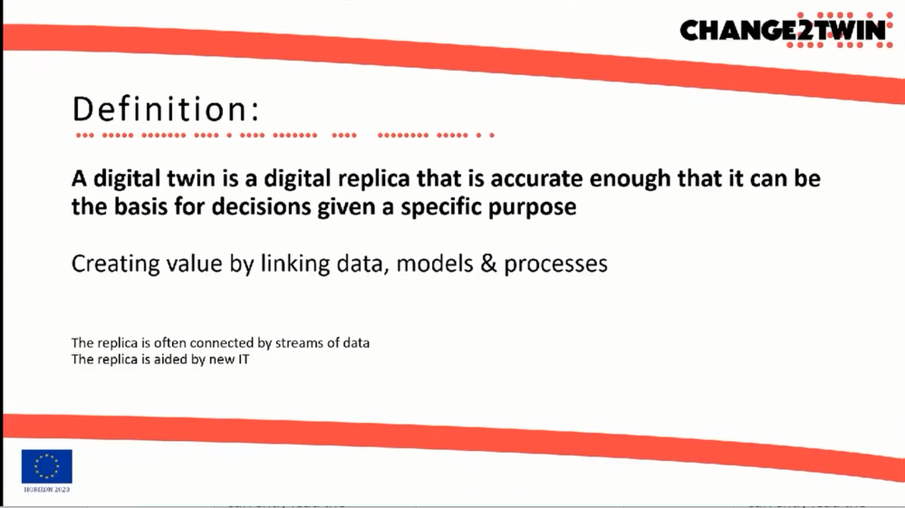

Нарешті дійшли до означення цифрового двійника. Зараз ми використовуємо таке твердження. Цифровий двійник — це цифрова копія, яка є достатньо деталізованою та точною, щоб бути основою для прийняття рішення відносно конкретної мети.

Стосовно копії - це цифрове тобто віртуальне представлення чогось фізичного. І це представлення має бути достатньо деталізованим та точним, щоб я міг приймати рішення. Якщо я НЕ використовую цифровий двійник для прийняття рішення то він і не потрібен. Зазвичай ми приймаємо рішення, маючи на увазі досягнення цілей, тобто того що ми тут називаємо метою.  

Припустимо хтось зробив якісну імітаційну модель. Але якщо імітаційне моделювання не використовується в бізнес-процесі або на основі цього моделювання не приймається рішення, тоді навіщо нам воно взагалі? І це перше, на що я звертаю увагу, коли ми говоримо про цифрові двійники. Я чув багато розмов про те, що є цікава технологія, нам потрібні датчики, нам потрібні дані, нам потрібна модель, ми створимо всю цю інфраструктуру і втілимо її в життя. Але при цьому ми чомусь забуваємо, що ми насправді намагаємося досягти певної мети. Для мене ця мета є ключовою, тому що без неї весь навчальний процес в даному напрямку дослідницьких пропозицій не буде цінним для МСП. Цією метою має бути створення реальної цінності для компанії.

Ми робимо це, об’єднуючи разом моделі даних і процеси. Тому власне для мене це також частина означення. Ця копія тобто ця цифрова система або імітаційна модель з’єднана потоками даних з фізичним світом, з метою підтримування її роботи в реальному часі. Цьому сприяють усілякі нові ІТ-технології. І ці нові ІТ-технології я продемонструю на наступному короткому слайді .

### [18:56](https://www.youtube.com/watch?v=7T1laxyTbsk&t=1136s) Що змінилося з минулого?

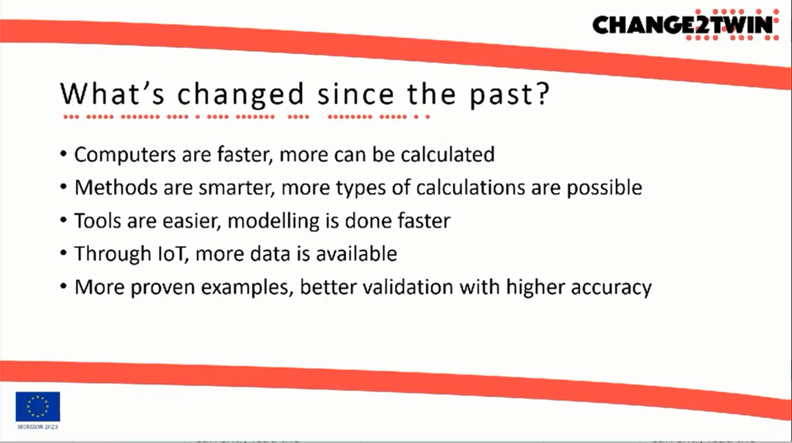

Отже, що змінилося з минулого? Комп’ютери стали швидше, тож ми можемо робити набагато більше обчислень, ніж раніше. Тому, як я вже сказав, цифрові двійники не є чимось новим, бо ми ними займаємося вже 20-30 років. Просто зараз ми можемо зробити більше, ніж могли раніше. 

І не лише комп’ютери стали швидшими, наші методи виконання розрахунків стали ефективнішими. Ми можемо робити більше типів обчислень. І в той же час є більше доступних інструментів, які дають нам можливість легше, швидше та краще моделювати. Також цю роботу можуть робити люди з меншими навиками. Використовуючи інтернет речей зараз стає доступним більше даних, ніж будь-коли раніше. Крім того є набагато більше перевірених прикладів. 

Отже, раніше все було добре, і тому з'явилася ця цікава концепція цифрового двійника. Але тепер є дійсно перевірені приклади, коли ми маємо дійсно валідовані результати, ми маємо дійсно валідовані значення, і ми дійсно маємо кращу деталізованість та точність. І це все відбувається прямо зараз. Тому зараз настав саме той час, коли треба впроваджувати цифрових двійників, бо це справді вже стало можливим

### [20:23](https://www.youtube.com/watch?v=7T1laxyTbsk&t=1223s) Ключові елементи цифрових двійників

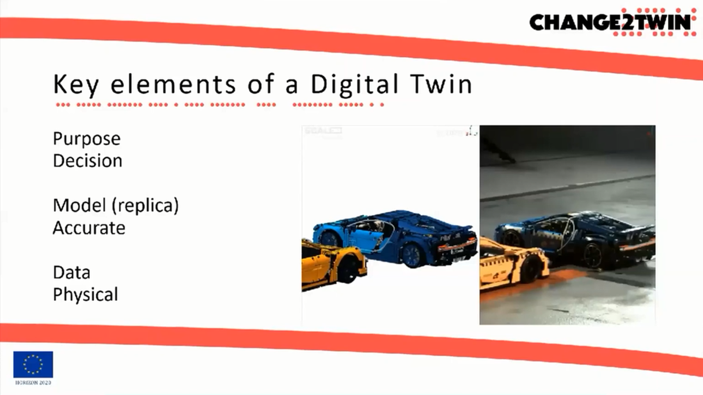

Тепер повертаємося до ключових елементів цифрового двійника. Я хотів би обговорити той приклад  із двома автомобілями, який я навів до цього. Це треба для ілюстрації того, чому розуміння цих ключових елементів таке важливе

І так, яка мета цього відео? Яка мета цього імітаційного моделювання? Може обійтися без руйнування автомобілів? Це виконання багатьох обчислень у цифровому вигляді, перш ніж ми справді розіб'ємо машину? Може для того, щоб перевірити двері на міцність при використанні іншого металу ? Або як ми можемо оптимізувати розташування деталей, щоб у нас була краща зона тертя? Або метою є просто створити гарне піар-відео, яке стане вірусним у Linkedin і продаватиме наші продукти?

Усе наведене є цілями, що мають право на існування. Але для кожного з них потрібна різна реалізація цифрового двійника. І я думаю, що для вас, як для центрів цифрових інновацій, важливою роботою буде з’ясувати цю мету і цілі разом із МСП.

Навіщо їм потрібен цифровий двійник? Як це насправді може допомогти їхньому бізнесу? Як це створить цінність? І я вважаю, що це найважливіші питання, які ви повинні їм задати. Оскільки технічно доступні будь які типи датчиків, ви можете отримати будь які дані. Ви можете створювати різні моделі, і це все можливо. Але якщо вони не розуміють, навіщо їм це робити, то це дуже складне питання.

Що мені ще подобається у цьому відео - воно не про реальні автомобілі, а про автомобілі Лего. Тож дослідники фактично використовували деталі Лего. Кожна з цих деталей, що ви бачите на відео, була окремо розрахована на здатність ламатися за певних умов. Отже, це складна фізична  імітаційна модель, де розраховується кожен фізичний аспект окремих частин.

Тільки уявіть, лише в цьому відео, я думаю, виконано близько ста мільйонів обчислень. І це лише на основних деталях Лего. Але ми можемо побачити це: що це працює, що саме відбувається, і на скільки це деталізовано та точно.

### [23:12](https://www.youtube.com/watch?v=7T1laxyTbsk&t=1392s) Типи двійників

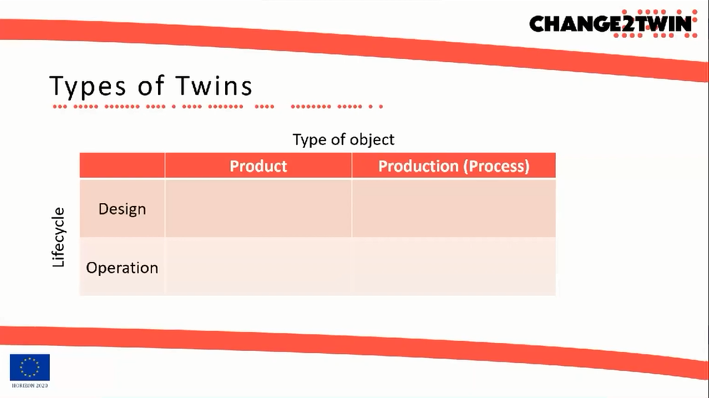

Я вже згадував раніше, що в залежності від місця в життєвому циклі та типу об'єкту є різні типи двійників. І є певні відмінності в них.

Ми можемо зробити цифрового двійника продукту, який ми створюємо, або цифрового двійника виробництва, що створює цей продукт. І ці два типи об'єкту дуже відрізняються і вимагають різних типів реалізації двійника. 

В той же час є різниця в тому, чи ми цей об'єкт (тобто продукт чи виробничий процес) проектуємо, чи продукт або виробнича машина знаходиться на стадії R&D, чи він вже функціонує на виробництві. І це також потребує зовсім різних підходів при створенні та використанні цифрових двійників. І пізніше для кожного з цих чотирьох випадків я наведу приклад

### [24:06](https://www.youtube.com/watch?v=7T1laxyTbsk&t=1446s) Види цілей

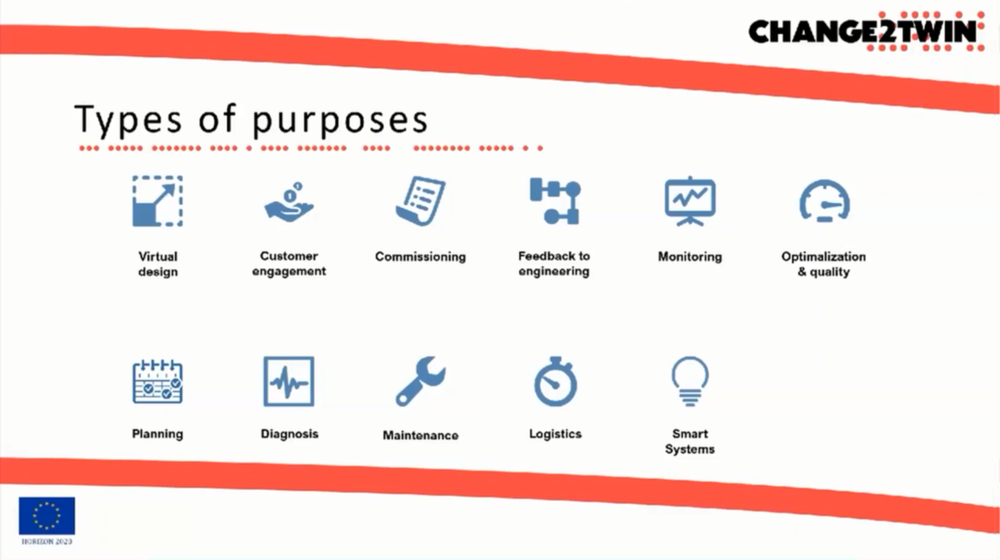

Ми можемо означити спільні цілі, які ми бачимо у виробничих компаніях, ту наведені більшість з них. 

Це може бути віртуальне проектування. У цьому випадку ми проектуємо якусь річ, і, скажімо, залучаємо до цього процесу інші відділи або замовників. Це може бути з ціллю залучення клієнтів. Використовуючи цифрові двійники потенційні замовники можуть побачити продукти в 3D, як вони працюють і що вони роблять. Це може бути як для демонстрації так і для піару. І це може бути один і той самий цифровий двійник. 

Також ціллю може бути введення в експлуатацію.  Коли перед тим як йти на завод ви готуєте більшу частину роботи вже зі свого офісу. Якщо ви можете зробити це віртуально, вам насправді не потрібно йти на завод, ви можете просто зробити це віддалено.

Це може бути зворотний зв'язок від інженерного персоналу. Наприклад, коли щось спроектовано, виготовлено і тепер йде дослідна експлуатація, необхідний зворотний зв'язок про його роботу. Тут можуть надати відгук інженери, що проводили дослідження, для того, щоб наступна ітерація продукту могла справді покращитися. Або використовуватися імітаційна модель для аналізу в процесі роботи.

Наступна ціль - це моніторинг. Ви можете порівняти роботу двійника з роботою його реальної фізичної сутності. Це дає можливість визначити  відмінності в їх роботі, і відповісти на запитання чи відбувається щось нетипове? Буквально вчора мав розмову з компанією, які розповіли що мають такий тип штучного інтелекту, який навчений на даних, зібраних з реальної машини. Цей двійник повідомляє персоналу про якісь нетипові зміни в роботі. Після цього вони відправляють команду працівників, щоб дізнатися, що насправді відбувається всередині машини. Тобто вони знають що щось не так, але не знають що саме і в чому причина.

Також можливою ціллю може бути оптимізація виробництва та якості продукту.

Якщо ви зосереджуєтеся не тільки на  машини чи продукту, а ще і на багато-асортиментності, то ціллю може бути планування  матеріалів на різних етапах виробничого процесу.

Цифровий двійник може бути задіяний в застосуваннях логістики. Як наприклад руху автоматично-керованих транспортів по  виробничому цеху.

Ви можете використати ті самі діагностичні дані машини не тільки для визначення факту неправильної роботи, але і дефектної частини. Про це можна повідомити технічному персоналу, і передати завдання на  технічне обслуговування. Це може бути також предиктивним обслуговуванням.

І нова тенденція - це розумні системи. Тут ви фактично продаєте цифрового двійника разом із вашим продуктом. Тепер ваш замовник може сам використовувати цей цифровий двійник для своїх цілей, наприклад самостійно проводити імітаційне моделювання. 

Це лише огляд цілей, для яких може слугувати використання цифрових двійників. Але ті самі цифрові двійники можна використовувати для кількох цілей одночасно.

### [27:58](https://www.youtube.com/watch?v=7T1laxyTbsk&t=1678s) Цілі в життєвому циклі

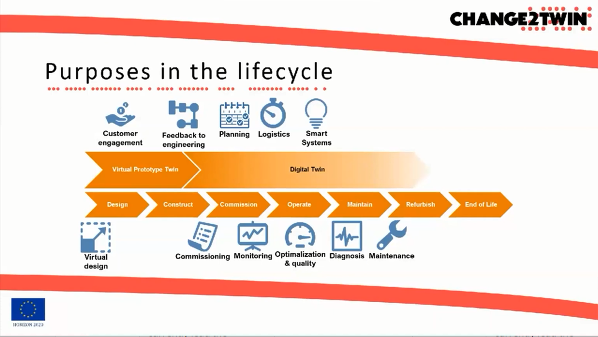

Я включив ці цілі в контекст життєвого циклу. І як видно вони з'являються в процесах всього життєвого циклу, деякі з них протягом всіх стадій. 

Так, наприклад, в процесах проектування і у введенні в експлуатацію задіяні однойменні цілі. Але на стадії експлуатації у нас є моніторинг, оптимізація, діагностика, технічне обслуговування і планування.  

Вгорі я розмістив деякі цілі, які є загальними, тому вони не є в контексті якоїсь частини  життєвого циклу. Ви можете використовувати їх будь-де протягом всіх стадій.

### [28:47](https://www.youtube.com/watch?v=7T1laxyTbsk&t=1727s) Ступені деталізованості та точності

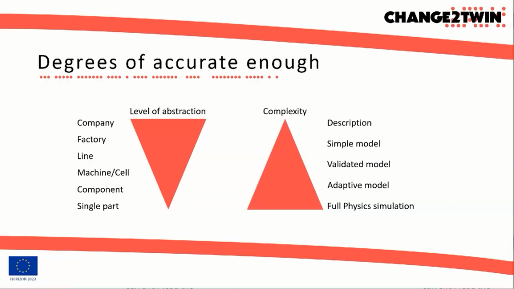

Тепер розглянемо питання деталізованості та точності. 

Я бачу в цифрових двійниках багато різних рівнів абстракції. Ми можемо розробляти цифровий двійник для окремої частини машини, або для всього заводу. І це два дуже різні об'єкти з точки зору абстракції, а також того, як вони стосуються вибраних цілей

Наступне питання - складність. Все залежить від цілі: цифровий двійник може надавати просту модель або якийсь опис, або  повну фізичну імітаційну модель, як скажімо автомобілів Лего, де ми фактично робимо моделювання руйнування пластикових деталей.

Тут дуже велика різниця відповідно до того, що вам потрібно і ви можете робити з двійником. Тому що імітаційне моделювання для повної фізичної моделі окремої частини або всієї машини - це нормально, але фізична модель для всього заводу - це неможливо. 

Між даталізованістю і складністю є баланс. Якщо ви хочете змоделювати всю фабрику, ймовірно, це має бути простіша модель. А якщо ви хочете створити машину чи компонент, ви можете мати щось схоже на імітаційну модель фізичних процесів.

### [30:13](https://youtu.be/7T1laxyTbsk?t=1813)  Найбільші перешкоди для цифрових двійників

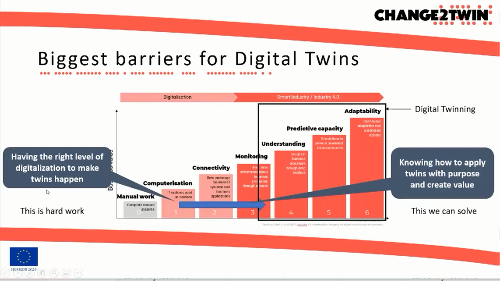

Повертаючись до цих бар’єрів можна зробити два головних висновки. По перше дуже важливо мати належний рівень оцифрування, щоб реалізувати цих двійників. По друге, це знати, як застосувати ці двійники для досягнення цілей та створення цінності

Отже, права сторона – це там, де ми можемо працювати разом з вами і змусити це працювати для МСП. Ліва сторона - це, я б сказав, другий ваучер на виконання фактичного впровадження, і це важка робота

### [30:53](https://www.youtube.com/watch?v=7T1laxyTbsk&t=1853s) Необхідний базовий рівень цифровізації

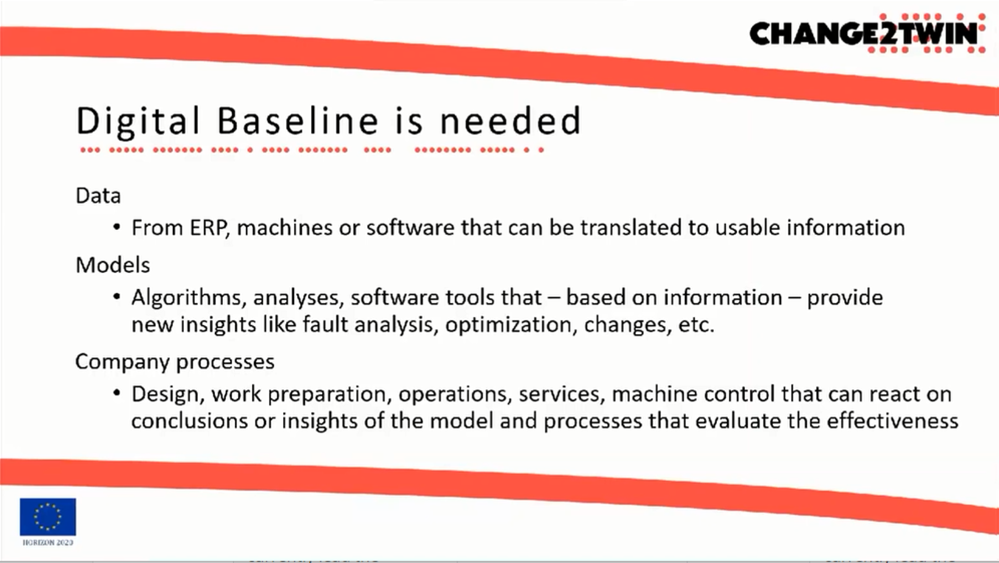

Отже потрібен базовий рівень цифровізації. Нам потрібно зв’язати разом моделі, дані і бізнес-процеси. 

Дані можуть іти з ERP, машин або іншого програмного забезпечення, що якимось чином можуть передаватися і бути задіяні в двійниках.

Моделі можуть бути представлені різним чином. Це може бути алгоритм, статистичні залежності, штучний інтелект, або фізична модель, тому ми не конкретизуємо що саме. Але вони повинні давати нові знання для виконання тих цілей, про які ми говорили.

І це має бути пов’язане з дійсними процесами на підприємстві. Це можуть бути процеси R&D, або виробничі операції, чи обслуговування обладнання, або інші пов'язані з підприємством процеси, на які зрештою і будуть впливати результати моделювання. 

Треба розуміти, що немає нічого більш марного, ніж дашбоард, коли на нього ніхто не дивиться.

### [32:07](https://www.youtube.com/watch?v=7T1laxyTbsk&t=1927s) Цифрове розширення можливостей 

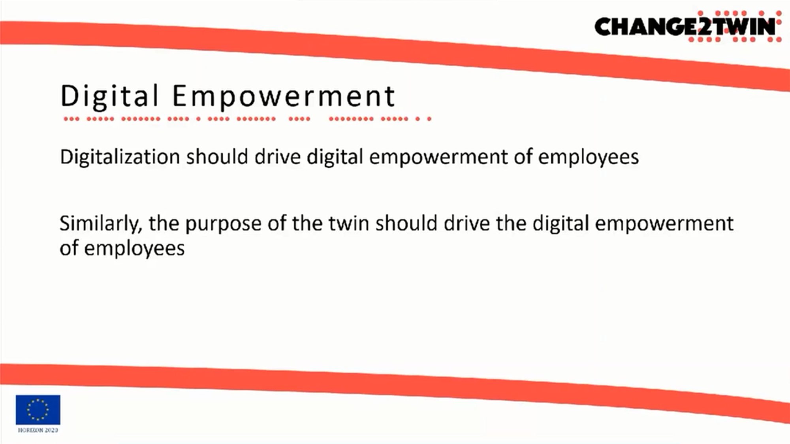

Коли я говорю про цифровізацію, smart industry та цифрових двійників, то відношу це все до цифрового розширення можливостей працівників підприємства.

Але стосовно цього є і інше бачення фабрики майбутнього — це завод з вимкненим світлом, який працює повністю автономно, на якому немає персоналу і є тільки пес, який не пускає туди людей. Все добре, але оскільки собаку потрібно годувати, то на заводі є ще хлопець, який там живе. Його єдина мета — годувати пса. Це не той тип компанії майбутнього, якому я б віддав перевагу. Цьому є хороша альтернатива. Подумайте про те, хто буде робити обслуговування обладнання коли щось піде не так, або вийде з ладу?  Хто має досвід, щоб це зробити? Чи не хотіли б ви ми мати таких працівників, які б могли виконувати свою роботу краще, і щоб змогли самі полагодити поломки на заводі?

Я кілька разів спілкувався з представниками обидвох наведених типів компаній. Так от, той, який казав що намагається підвищити цифровий рівень своїх співробітників насправді зміг найняти більше людей, працювати ефективніше та виробляти і заробляти більше. У той час як інший, який прагнув вимкнути світло, насправді відмовився. Звісно, це лише приклад, але мені цікаво дивитися на це. Якщо ви використовуєте ці ідеї на благо своїх співробітників, я думаю, ви справді створите хорошу цінність у своїй компанії

### [34:23](https://youtu.be/7T1laxyTbsk?t=2066) Приклад: Автоматизоване виробництво

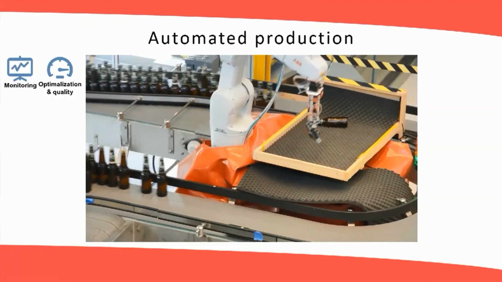

Тепер давайте розглянемо кілька прикладів реалізації цілей. Це виробнича лінія для фасування в пляшки. Ми провели кілька експериментів, під час яких робот сам навчився бачити навколишнє середовище, інтерпретувати ситуацію, і вирішувати, як рухатися самостійно без будь-яких заздалегідь запланованих операцій. Звичайно, цей робот не усвідомлює себе, але він здатний виконувати своє завдання без втручання людини. Тому що, якби людина виконувала цю роботу і випадково розбила б пляшку, скло б розлетілося і виробництво потрібно було б зупиняти. Тоді б ми мали великі проблеми на цій виробничій лінії.

Заздалегідь запрограмувати робота на забирання цієї пляшки з будь якої позиції було б неможливо. Використання цифрового двійника також допомогло підвищити рівень досвіду персоналу на заводі, який обслуговує цих роботів. Дало можливість зробити їх більш обізнаними про те, як цей робот може працювати на високошвидкісній лінії виробництва пляшок, і як вони насправді можуть впроваджувати інновації, щоб зробити цього професійного робота, скажімо так, адаптованими до навколишнього середовища. Тут ми бачимо приклад шостого рівня зрілості.

### [35:54](https://youtu.be/7T1laxyTbsk?t=2154) Приклад: Вимірювання якості

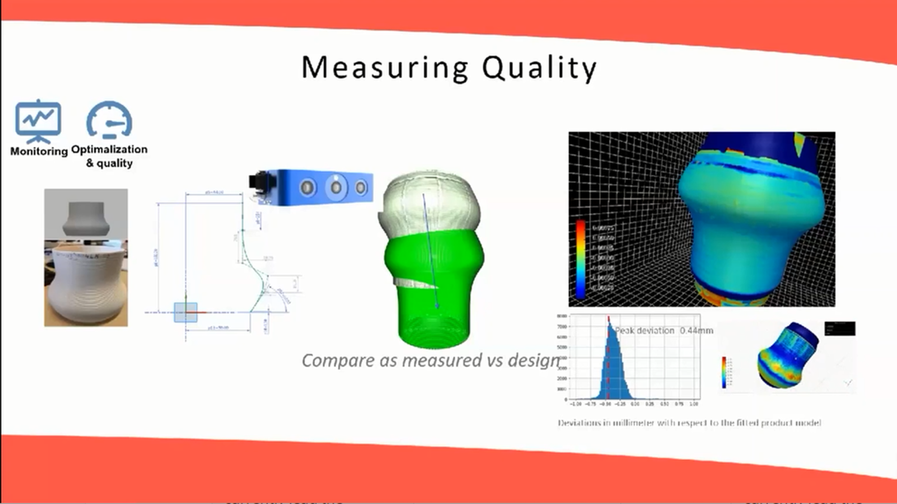

Наступний приклад стосується вимірювання якості друку на 3D-принтері. Після друку використовуються фотокамери для створення 3D-зображення надрукованих об’єктів. Створене зображення порівнюється з проектним для визначення відмінностей між ними. Також порівнюється як саме різні параметри процесу 3D-друку впливають на ці показники якості. Тут поєднані дві цілі: одна – це моніторинг, а інша – оптимізація та якість.

### [36:38](https://youtu.be/7T1laxyTbsk?t=2198) Приклад: допомога в обслуговуванні

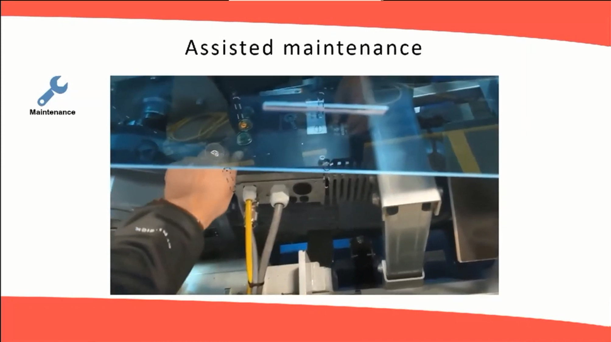

Інший приклад стосується обслуговування. Тут ви бачите цю людину з окулярами доповненої реальності [Hololens](https://www.microsoft.com/en-us/hololens), яка  знімає деталь із великої машини. Інструкції, які технік повинен виконати він отримує через окуляри Hololens. Там він бачить який має бути наступний крок і візуальне представлення операції, яку він повинен виконати.

### [37:13](https://youtu.be/7T1laxyTbsk?t=2233) Приклад у виробництві

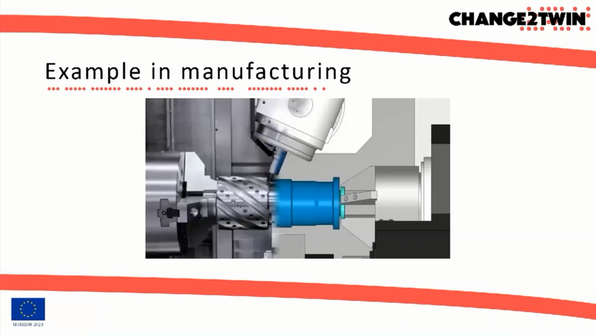

Тож тепер знову повертаємося до виробництва. Мені дуже подобається ця картинка, яку я нагуглив в Інтернеті. Я подумав, що це справді гарний приклад того, як зустрічаються віртуальне та цифрове. У контексті цифрових двійників у мене тут виникає питання. І це, власне, те питання, яке я б хотів щоб ви задали представникам МСП.

### [37:40](https://youtu.be/7T1laxyTbsk?t=2260) Для чого саме цифровий двійник?

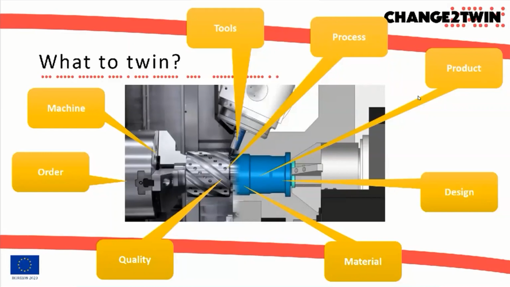

Так для чого саме ми будемо робити цифрового двійника? Може для машини, або проекту, або процесу, може інструменту? А може для матеріалу чи якості? Ми можемо робити багато різних двійників. І цей вибір критичний для МСП. 

Тож я хочу, щоб вони вибрали, які з цих речей насправді для них важливі. Тому що цей вибір зрештою має принести їм досягнення їх мети.

### [38:29](https://www.youtube.com/watch?v=7T1laxyTbsk&t=2309s) Можливі застосування

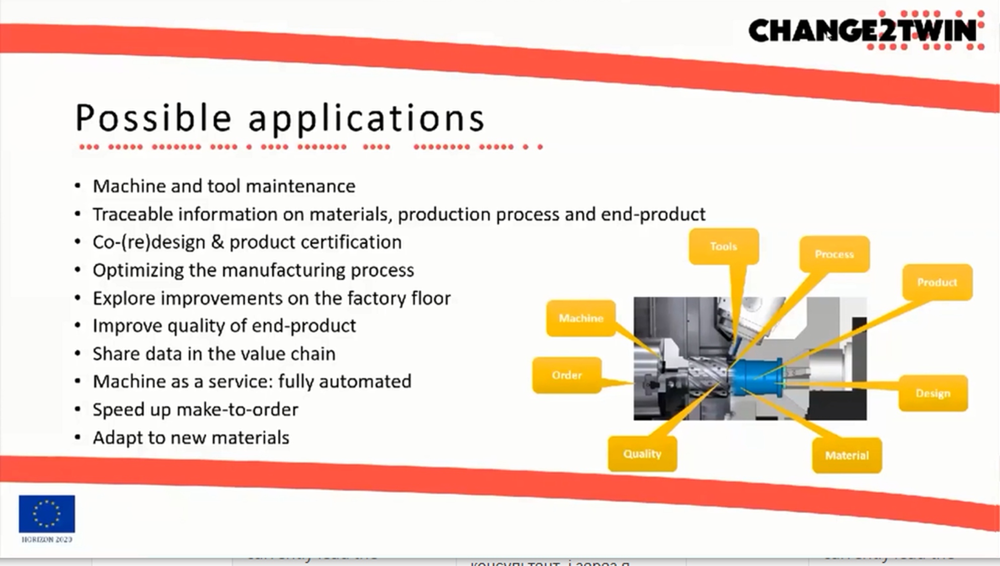

Тож тут наведено кілька прикладів застосувань, які ви можете реалізувати по відношенню до цього прикладу. Ви можете робити простеження інформації про матеріал, займатися спільним проектуванням або сертифікацією продукту, можете прискорити виготовлення продукту на замовлення, адаптувати продукт до нових матеріалів. Тобто усі види речей, які мають відношення до цієї організації.

Тому я очікую, що ви проведете обговорення про це з підприємствами, а також про те, як це впишеться в їхні бізнес-процеси. І я зараз кажу саме про застосування, а не про цифрових двійників,  оскільки цифровий двійник — це засіб, він не є самоціллю. Цифровий двійник є лише частиною застосування, тому що вихідні дані цифрового двійника повинні входити до певного бізнес-процесу для досягнення певної цілі. 

Тут я перерахував деякі приклади типів застосувань щоб проілюструвати, як ви можете використовувати двійник, і який тип застосування тоді може бути можливим

### [42:46](https://www.youtube.com/watch?v=7T1laxyTbsk&t=2566s) Приклади застосувань

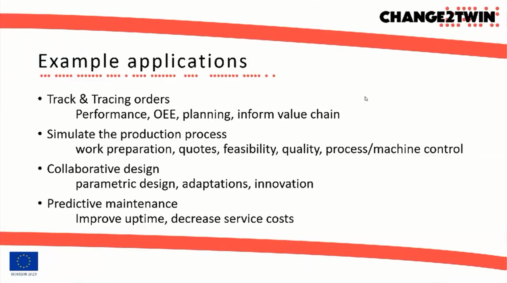

Розглянемо ці чотири приклади застосувань в контексті раніше наведеної таблиці типів цифрових двійників.

### [42:54](https://www.youtube.com/watch?v=7T1laxyTbsk&t=2574s) Приклади для типів і призначення двійників

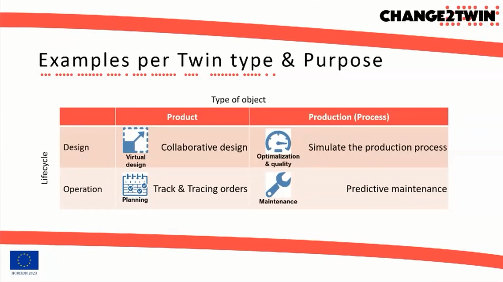

У наведеній раніше таблиці показані чотири застосування в контексті стадій проектування та експлуатації, а також типу об'єкту. Я пройдусь по ним дуже коротко, бо пізніше ви отримаєте докладний приклад від представників Perspective і Jodner

### [43:12](https://www.youtube.com/watch?v=7T1laxyTbsk&t=2592s) Спільне проектування

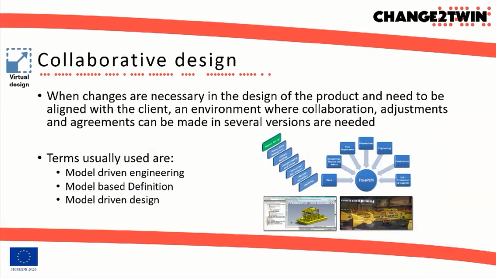

Почнемо зі спільного проектування. Припустимо проектант завантажує якийсь CAD файл для виробу. Перед виробництвом потрібно внести деякі коригування. У компанії може бути багато різних відділів, які працюють над одним і тим же проектом. Тому, щоб зробити це можливим необхідно сумісно працювати кільком відділам. Тоді виникає питання як саме працювати разом над одними моделями і ділитися цими даними? У цьому випадку, я думаю, вам знадобиться деяке програмне забезпечення, щоб об’єднати обидві ваші компанії або відділи.

Виходить CAD модель — це фактично ті дані, якими потрібно поділитися. І будь-які зміни, які вносяться необхідно проводити через керування версіями, і приймати рішення щодо того, яким буде кінцевий продукт. Основа для цього — це 3D-модель фактичного кінцевого продукту. І сама по собі CAD модель не є двійником, але це можуть бути дані, які ви фактично вводите в двійник, щоб отримати нову інформацію.

Це стосується як робіт в середині компанії так і сумісно з замовником. 

### [44:51](https://www.youtube.com/watch?v=7T1laxyTbsk&t=2691s) Параметричне проектування

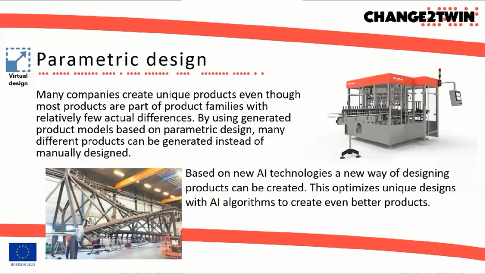

На цьому слайді праворуч показана фасувальна машина, яка  змодельована за допомогою параметричного проектування. При такому проектуванні ви можете наприклад вказати, скільки пляшок ви хочете наповнити і якого типу, або яка тривалість наповнення, скільки відсіків для цього потрібно і тому подібне. При розрахунку система моделювання автоматично відрегулює частини і модулі, а також налаштує фактичне CAD креслення для виготовлення машини

Внизу ліворуч на слайді показані конструкції створені за результатами перепроектування деталей з використанням технологій штучного інтелекту. Тут кожна деталь є унікальним елементом в конструкції кінцевого продукту. Ви можете мати кілька різних схем оптимізації, при розрахунку яких використовується цифровий двійник зі штучним інтелектом. При цьому на кожному циклі розраховується міцність деталей, міцність конструкції за мінімальних витрат матеріалів, та інші характеристики.

### [46:05](https://www.youtube.com/watch?v=7T1laxyTbsk&t=2765s) Моделювання виробничого процесу

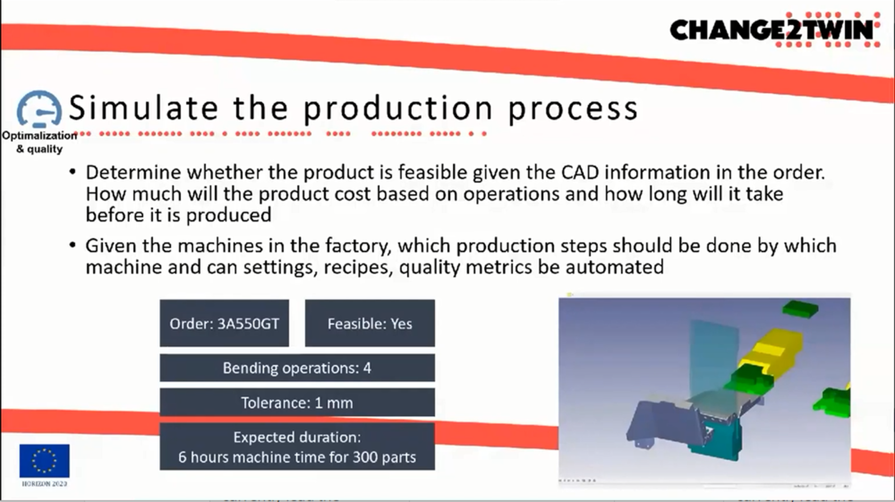

Інший приклад - імітаційна модель виробничого процесу. Ось, наприклад, у нас є металевий лист де потрібно робити вигини у вказаних місцях. Імітаційна модель дає можливість промоделювати роботу машини, отримати деякі показники з неї за різних значень параметрів, та отримати певні показники якості виробу. А потім зробити порівняння з тим, що було спроектовано.

### [46:40](https://youtu.be/7T1laxyTbsk?t=2800)  Моделювання виробничого процесу 2

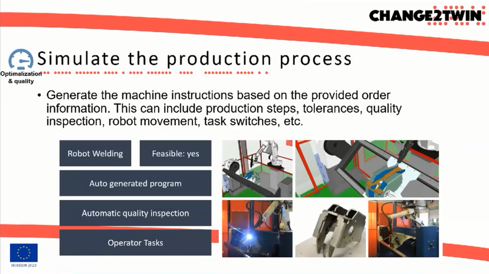

А ось інший приклад - це зварювальний робот. Тут спочатку на віртуальній установці робляться розрахунки для всього процесу зварювання. Після перевірки можливості такого зварювання, можна почати фактичне виконання роботи.

### [47:00](https://www.youtube.com/watch?v=7T1laxyTbsk&t=2820s) Відстеження замовлень

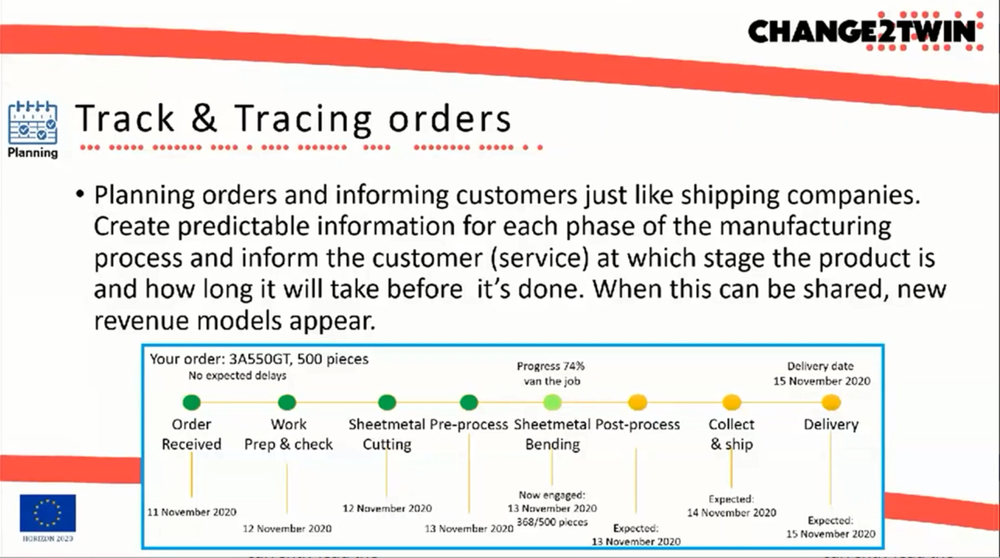

Я б сказав, що це зовсім інший тип двійників. Це більше відноситься до моделювання того, як працює бізнес-процес. Це може дати відповідь на питання: чи можна очікувати затримок у бізнес-процесі? Чи насправді правильно поінформується замовник, та коли він отримає доставку своїх товарів?

І якщо є якісь збої у виробничому процесі, чи можу я тоді впоратися з цим і все одно забезпечити доставку, чи я повинен повідомити замовника, що вона затримається. Або навпаки, можливо він отримає продукти раніше?

### [47:43](https://youtu.be/7T1laxyTbsk?t=2863) Відстеження замовлень (прод)

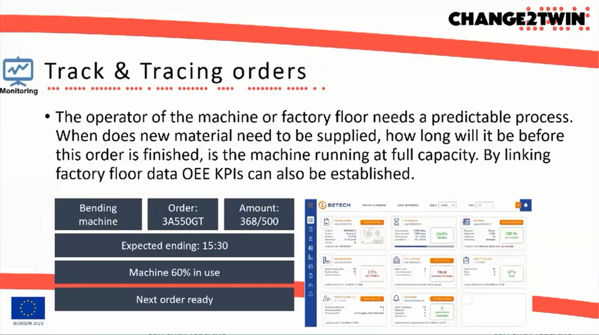

А ось цей приклад про моделювання виробничих потоків на виробництві. Ви можете отримати інформацію про те, як буде проходити виробництво, якщо вам потрібно внести якісь зміни. Наприклад, які затримки можуть бути за різних варіантів виконання послідовності замовлень.

### [48:06](https://www.youtube.com/watch?v=7T1laxyTbsk&t=2886s) Прогнозне (предиктивне) обслуговування

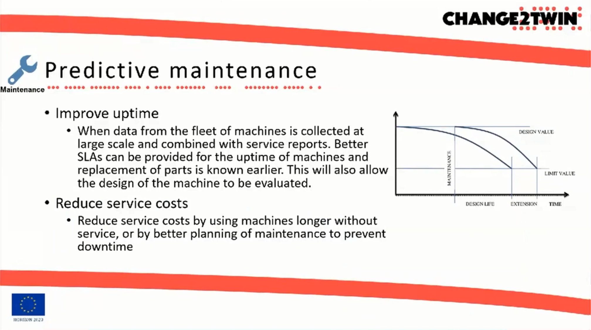

І, нарешті, короткий приклад предиктивного обслуговування. Тож я бачу два варіанти такого обслуговування. 

Перший - це збільшення фактичного часу безвідмовної роботи, тобто щоб машина працювала довше без простоїв або з їх скороченням. 

А другий – зниження фактичної вартості на обслуговування. І це також може включати оновлення деталей на більш досконалі, щоб зменшити вірогідність виходу з ладу наступного разу

Отже ми переглянули різні типи застосувань, де можна використовувати двійник

### [48:49](https://www.youtube.com/watch?v=7T1laxyTbsk&t=2929s) 7-кроковий метод

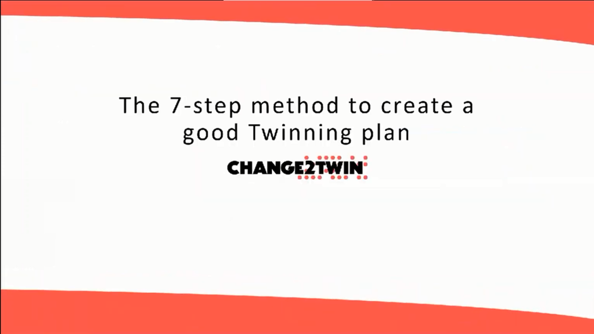

Добре, тепер розглянемо семиетапний метод розроблення застосувань з цифровими двійниками. Ми прийшли до нього, роблячи подібні дії з багатьма компаніями. Це остання частина моєї презентації.

Як ви можете здогадатися, все починається з того, щоб визначити навіщо необхідно розробляти  цифрового двійника. На цьому питанні сьогодні на інших семінарах буде зосереджено основну увагу. І це насправді керує вашою метою.

Отже, що саме двійник робитиме на вашому заводі? Що завод отримає від нього, як ви можете прив’язати його до необхідних бізнес-процесів, і яку цінність він зможе потім створити. І тільки після цього можна перейти до другого кроку. Тому що це каже, що саме вам потрібно, щоб зробити цього двійника.

Далі ви вибираєте для яких об'єктів або частин вам необхідно створити двійника. Це може бути машина, або продукт, або їх частини, а можливо весь цех заводу. Це може бути що завгодно. Але вам потрібно вибрати це, оскільки інакше ви не зможете його охопити. І це має бути пов’язане з тим, чого ви намагаєтеся досягти.

На наступному кроці ви проводите оцінку наявної інфраструктури. Тобто, чи є на об'єкті необхідне програмне забезпечення, яке може збирати і архівувати дані,  яке може виконувати моделювання, і яке може це зв'язати разом. І чи можете ви фактично забезпечити необхідний інформаційний потік.

На четвертому кроці ви вже розробляєте цифрового двійника, тобто переходите від фізичного до цифрового. Це створення фактичної моделі, яка представляє те, що ви намагаєтеся зробити. Тому що, зрештою, цифровий двійник — це модель, завдяки якій це відбувається. І я бачу, що якщо компанії мають різні цілі, вони матимуть різні моделі одного і того ж вибраного об'єкту. 

Якщо скажімо необхідно знати температуру, розподіл структурної міцності деталей, то це моделювання буде відрізнятися від моделювання швидкості їх руху в машині. Це два різні призначення та зовсім різне моделювання. Створення цих будівельних частин цифрового двійника — це і є суттю процесу його розроблення.

Наступним кроком є підключення двійника до операційної діяльності. Це робить результати роботи двійника доступними в застосуванні.

Потім, звісно, на шостому кроці відбувається підключення його до бізнес процесів. Там, отримана інформація з цифрового двійника використовується для рішення, щоб створити необхідну цінність.

І останній крок передбачає внесення змін в двійника за зміни контексту. Тож, можливо, якийсь механік змінить частину машини, або хтось вирішить, що знайшов новий алгоритм, або нове вдосконалення моделі. Цей крок передбачає що розроблений цифровий двійник буде залишатися завжди актуальним. Тобто це не просто модель, яка створюється один раз і залишається без змін. У майбутньому, якщо відбудуться будь-які зміни, хтось зможе адаптувати цю модель до цих змін.

Завтра вранці мій колега дасть більш детальне пояснення щодо цих кроків. А також пов’яже це з базовим рівнем, тобто з тим, що вам потрібно мати, щоб зробити цифрового двійника.

### [52:40](https://www.youtube.com/watch?v=7T1laxyTbsk&t=3160s) Резюме для загального розуміння

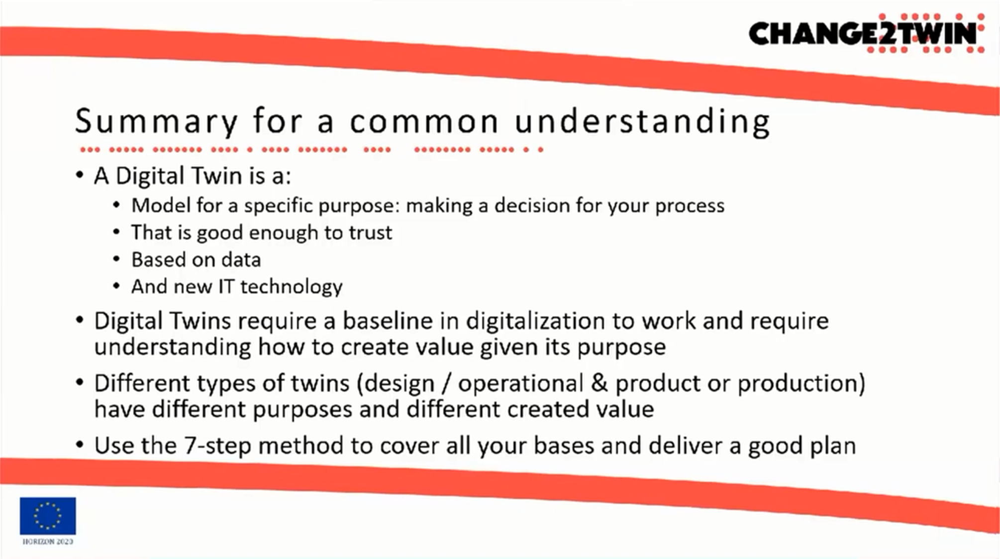

То ж підсумок на сьогодні. Сподіваюся, ви всі побачили, що цифровий двійник насправді є: 

- моделлю для досягнення певної мети, щоб можна було прийняти рішення для виконання пенвих процесів 
- це достатньо добре, щоб йому довіряти
- воно ґрунтується на даних
- він використовує нові ІТ-технології

У той же час для реалізації цифрових двійників необхідний базовий рівень цифровізації, і  розуміння того, як створити цінність з урахуванням мети. 

Існує багато різних типів двійників: для стадії проектування або експлуатації, для виробництва або продукції. І усі вони мають різні цілі та різну цінність.

І ми бачимо, що якщо ви використовуватиме наведені вище сім кроків, то покриваєте свої базові потреби і справді можете реалізувати хороший план.

### [53:43](https://youtu.be/7T1laxyTbsk?t=3223) Що тепер ви знаєте 

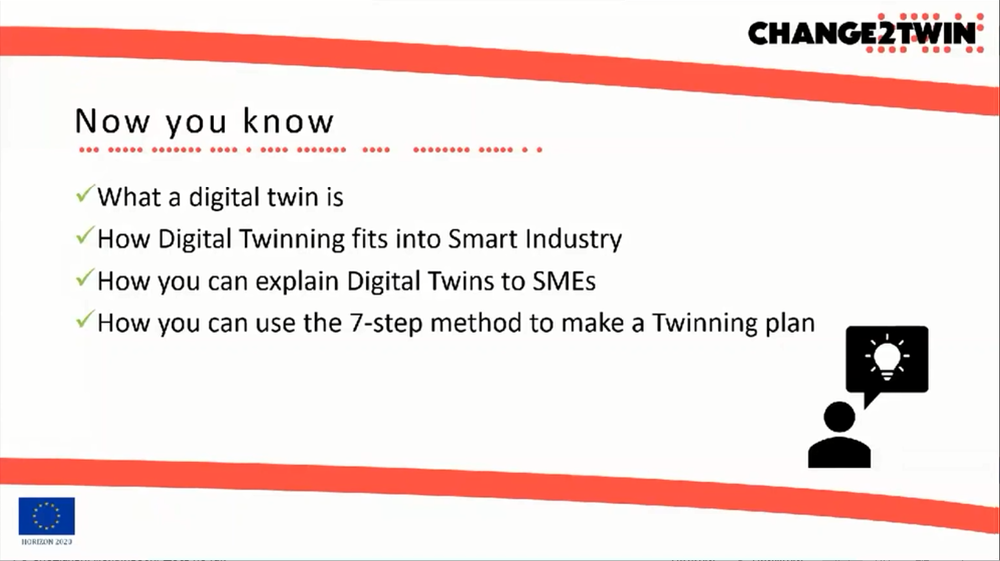

Тож я сподіваюся, що тепер ви всі знаєте, що таке цифровий двійник. Як цифровий двійник вписується в smart industry, як ви можете пояснити про цифрові двійники малим і середнім підприємствам і як ви можете використовувати метод семи кроків, щоб скласти план створення цифрового двійника. Тепер я думаю, що настав час запитань.

### [54:08](https://youtu.be/7T1laxyTbsk?t=3248) Запитання

Питання1: Чи введення даних у режимі реального часу від персоналу з планшету відноситься до сфери датчиків. 

Відповідь1: Для мене введення даних не обмежуються датчиками. Я думаю, що люди також є датчиками, як система ERP є свого роду датчиком. Не будемо це розділяти - для мене це пов’язано з підключенням даних на заводі.

Питання 2: Таким чином, цифровий двійник — це підсумковий термін для керування процесами виробництва що не відноситься до MES-застосунків.  

Відповідь2: Це те, що ми багато разів обговорювали. Сподіваюся, ви бачили, що цифровий двійник насправді є моделлю. І модель використовується в застосунках. Отже, якщо ви можете використовувати модель у своїх застосунках, ви можете використовувати цифрового двійника. Тому що цифровий двійник і модель — це щось подібне. Єдине, на чому я наголошую що зараз ми називаємо модель цифровим двійником, і наразі ця модель може робити більше, ніж 10 років тому. Тому ми маємо певні відмінності. Для мене така модель пов’язана з фактичними даними. Тож, якщо ми маємо лише модель без жодних даних, я вважаю це менше цифровим двійником, ніж якщо у вас є модель із фактичними даними. І це також новий спосіб поєднання, зв’язування моделі даних і бізнес-процесу. Я думаю, що це створює нові можливості для створення застосунків. І так, це усі відомі застосунки на виробництві. Але в той же час ні, це не всі відомі застосунки на виробництві. І це складний момент. І я сподіваюся, що зрозуміло, що якщо ви робите щось із моделлю, яка використовує дані та нові ІТ-технології, тоді ми говоримо про цифрових двійників. І якщо ви просто використовуєте свою систему керування виробництвом, то вона сама по собі не є цифровим двійником.

Питання 3: Чи є різниця між віртуальним прототипом та цифровим двійником.

Відповідь3: Для мене немає різниці між віртуальним прототипом та цифровим двійником. Але деякі інші вважають інакше. У мене були випадки, коли насправді не було фізичного продукту, і ми використовували віртуальний прототип для створення синтетичних даних. Потім ми навчали модель, використовуючи синтетичні дані, щоб пізніше передбачити щось для фактичного фізичного продукту. Тож для мене тоді дивно, це що просто віртуальний прототип? Ні, це не просто віртуальний прототип. Але це також не просто цифровий двійник. Тому ці терміни дещо розпливчасті. Я не люблю робити це занадто конкретним або занадто вузьким.

Питання 4: Ваша семиетапна модель стратегії розроблення цифрового двійника дуже нагадує стратегію  комп’ютерно інтегрованого виробничого підприємства. Крім того, важливо мати на увазі загальну стратегію бізнесу підприємства, а потім цілісно планувати всю інтеграцію процесів, інформаційних моделей з боку планування, а також з боку вимірювання даних, тобто даних з боку процесу. Тож це нагадує мені чомусь те саме. 

Відповідь 4: Я думаю, що це схоже, так. Я б також сказав, що ці сім кроків не обмежуються лише виробництвом. Я зробив ці сім кроків також для операторів зв’язку або для ферм і для певних аспектів. Так, це просто загальний спосіб поглянути на це більш цілісним способом. Я згоден.

Відповідь на питання 5: Я б сказав, що якщо у вас є імітаційна модель, яка робить щось, зазвичай це вже цифровий двійник. Питання полягає в тому, чи використовуєте ви дані для своєї імітаційної моделі чи це просто імітаційна модель. І як ви використовуєте результати моделювання. Тобто як петля зворотного зв’язку від вашої моделі повертається до цифрового двійника. Я думаю, що це великі частини, які відрізняють, скажімо, звичайну стару імітаційну модель від нового способу мислення цифрових близнюків.

Питання 6. Які технології дозволяють реалізувати цифрових двійників? 

Відповідь 6: Тож це також для розмови на завтра, а також у розмові після обіду від PErspective. Я думаю, це було б чудово побачити, як технології створюють цифрових двійників. Крім того, у Yotner є кілька хороших прикладів.

Відповідь на питання 7. Рівень інвестицій - це хороше питання. Треба щоб це знову пов’язувалося з вашою метою. Якщо ваша мета невелика, то сподіваємося, ваші інвестиції також будуть невеликими. Тому, що якщо перейти для усього виробництва з рівня другого до третього, це вартує значних зусиль. Це нелегко зробити. Але якщо ви виберете масштаб невеликий - це можливо, і ви також зможете досить легко показати цінність. І вже тоді, коли ви показали цінність, наступний крок буде у підключенні наступної машини, наступної виробничої лінії чи наступного продукту. Це вже буде легше, ніж якщо вам доведеться робити все одразу. І час для повернення інвестицій в цьому випадку, я думаю, може бути досить швидким. 

Так, наприклад, до мене звернулася компанія, яка попросили допомогти в плануванні виробництва, при тому що їх машини не підключені. Отже, на першому етапі треба підключити машини для того щоб отримати правильні показники з машини, і щоб знати, у якому порядку вони працюють. Потім визначити яке їхнє фактичне використання та як виробничий процес пов’язаний із цим. Потім необхідно створювати звіти. І визначити за скільки можна виконати план. І після цього у вас з'являються нові ідеї. Ми фактично бачимо, що машина не працює 20 % часу. Це тому, що з часом відбуваються зміни, або тому, що матеріалу недостатньо. І тут потрібно знайти причину, звичайно, це ручна робота. І вони виявили, що у них є повторні замовлення, які вони можуть розміщувати між іншими замовленнями, щоб фактично використовувати більше машинного часу. Але без уявлення про час роботи машини та повторення замовлення а також зіставлення цих двох один з одним вони б не змогли цього зробити. І тільки тоді постає питання: чи можемо ми автоматизувати весь процес планування, щоб мати справу з такими речами, і щоб хтось не планував надлишок.

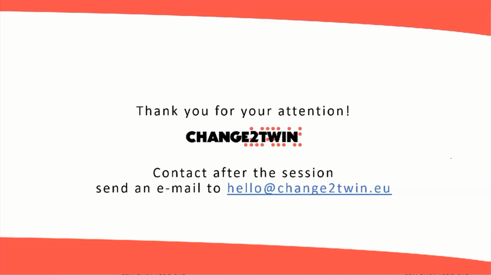

### Післямова від Industry4Ukraine 

Ми сподіваємося, що дане відео допоможе керівництву малих та середніх виробничих підприємств України зрозуміти цінність використання цифрових двійників та необхідність цифровізації. Також варто наголосити, що нині ви маєте можливість використати для цих переходів грантові кошти від Європейського Союзу. Ми допоможемо вам в цьому, але Вам необхідно проявити свою активність. Приєднуйтеся до спільноти. Контакти наведені в описі під відео.  

## Пост

Сьогодні виклав перекладене відео запису вебінару і обіцявся що щось напишу про сам процес. Ну от, виконую обіцянку.

На вебінарі з презентацією грантової заявки в EIF УКА, Олег Коцар, який розкрив деталі заявки на грант по впровадженню цифрових двійників, поділився посиланням про сам проект https://www.change2twin.eu/digital-twin/ . До речі, презентація Олега була чудовою, коли викладуть запис, я поділюся посиланням. Я нирнув туди і перше ж відео мене просто зачепило. Перші ж хвилини перегляду мені кричали - це відео варто того, щоб його побачило якомога більше людей в Україні! Тобто я ще його до кінця не подивився, а вже мав бажання це зробити! На цьому емоції мої закінчуються, далі хронологія з ремарками. Отже далі я розповім, як модно зараз казати, про кейс, як перекладати технічне відео. Я це робив від початку до кінця перший раз, так що  цей кейс явно не самий оптимальний. Думаю творці контенту для вітчизняної платформи Прометеус розказали б більше.

Крок 0 - найти те саме відео. Подивився я цей відосик на YouTube з використанням автоматично перекладених автоматично сформованих субтитрів. І це для мене вже було відкриттям. Воно реально дає можливість зловити основний сенс. Дивишся і слухаєш в оригіналі і читаєш субтитри українською. І в кінці вебінару ти вже знаєш, чи варто його розбирати на деталі. Тобто, якщо ти все зрозумів прямо з ходу, то наступні кроки мають сенс, тільки якщо їх робить хтось інший. У даному випадку мене цікавили деталі, тому я пішов на крок 1. Якщо ж ставити цей кейс на потік, то наступний крок може робити хто завгодно. Час - 1.5 год на 1 годинне відео.

Крок 0.5. Попитати, чи можна озвучити їх відео. Я (і не тільки я) питав, вони відморозилися. Крок закінчений з переходом на наступний. Принаймні поки що. Час - можна чекати вічно, я не став.  

Крок 1. Тупа механічна робота. 1.1. Отже беремо відео і скачуємо з YouTube. Сервісів що це вміють робити наразі багато, не думаю що варто вказувати тут, яким я користувався. Я скачав дві версії: оригінальний формат без звуку і гіршої якості зі звуком. Другий мені не пригодився. 1.2. Скачуємо також автоматичні субтитри, це значно економить час. У найденому мною сервісі можна було скачати два варіанти - з розчасовкою і просто текст. Обидва знадобилися. 1.3. Далі треба побити відео на слайди. Тобто тупо находиш перехід на інший слайд і робиш копію екрану з фіксацією часу. Якщо є презентація можна іти іншим шляхом, але в мене її не було (не з'явилася на кроці 0.5). 1.4. Робиш доку, де робиш відмітки з назвою слайду і часовою міткою  прямо з лінком переходу на YouTube. У моєму випадку перший варіант часових міток виклали самі автори, але мені прийшлося її доповнювати. Отже: назва з часовою міткою і скрин. 1.5. Ставиш текст в потрібні розділи даної доки. Існуючі субтитри з розміткою часу допомогають виділити потрібну частину і вставити. Але для правки, я потім його міняв іншою частиною тексту, вже без часових міток. Видалаяєш усі переноси і робиш цей текст сплошним набором слів. Отже, чорнова "тупа" дока готова. Час - біля 3-4 годин на 1 годину вебінару. Думаю якщо натренуватися можна звести до 1-2 годин. 

Крок 2. Механічна робота з початковими знаннями англійської. Тут треба виставити розділові знаки. Але для початку вичищаєш всякі `um` `uh` і повторення. Далі включаєш вебінар в режимі прослуховування і починаєш ставити розділові знаки. Бажано бачити саме відео. Я цей крок міксував з 3-м, але зараз я б робив саме так. Англійську треба знати як мінімум щоб читати і розпізнавати слова. Ну і хоча б примітивні конструкції, щоб розуміти де речення закінчується. Все одно буде ще як мінімум одна ітерація. Час- біля 3 годин на 1 годину вебінару. Думаю якщо натренуватися можна звести до часу вебінару. 

Крок 3. Робота для людини в темі вебінару зі знанням англійської. Ну з другим критерієм у мене є певні проблеми, але з технічним текстом в моїй області думаю нормально і так. На початок цієї роботи в моєму документі були 4-ри колонки: анл. текст, укр. текст, примітки і оригніальний текст. Остання колонка містила все сміття, що наплодив ютуб своїм автоматичним розпізнаванням тексту. Перша формувалася після виставлення розділових знаків на кроці 2 і змінювалася в процесі кожної ітерації правок. Отже я брав  першу колонку, вставляв гугл перекладач і включав відео на перегляд і прослуховування. Перед цим знайомився зі  змістом слайду, намагався його зрозуміти ще до того, як слухав (один раз я вже його дивився на 0-му кроці) і читав перший варіант машинного перекладу. Основна мета - вловити сенс і поправити розділові знаки. Правиш в англомовному тексті, дивишся на переклад. В темі треба бути і завжди сумніватися в субтитрах. Все лишнє видалялося. За необхідності вставлялися примітки. Це особливо корисно, коли Ютуб не знав що казали про людей, назви фірм або назви пристроїв. Правився тільки англійський варіант тексту. Все це поверталося в таблицю і чекало наступної ітерації. Час 4-5 годин на 1 годину вебінару. 

Крок 4. Формування кінцевого тексту.  Тут вже робиться кінцева версія тексту. Узгоджується вся презентація. Як мінімум два рази вона вже проходила через твої вуха. Головне - скласти все до купи. Узгодити поняття. Далі текст я вичищав не жаліючи. Основна мета - передати зміст, навіть якщо якихось речень не було і ти добавив для кращого розуміння, а якісь ти тупо видалив. Були проблемні ділянки, які я відверто до кінця не зрозумів, тут соррі, прийшлося давати якось так, як я переклав. У цьому проблема я так розумію всіх перекладачів, бо спитати було нікого (читай пункт 0.5). Цей крок у мене проходив у 2 ітерації. Час 2-3 години на 1 годину вебінару.

Крок 5. Зачитування тексту на диктофон. Включив телефон, почитав текст для кожного слайду в окремий файл. Мій тел пише файли з назвою що відповідає часу. Зручно, так як читаєш все підряд  послідовність залишається. Я проходив цей крок в 2 ітерації. Перша була затягнута, після прослуховування себе нападала зівота. По факту, деякі частини 2-ї ітерації треба б було переписувати, але я полінувався, чесно. Час - десь 1 година на 1 годину вебінару. 

Крок 6. Монтування відео. Тут краще поручити професіоналу. Але навіть в мене пішло десь 6 годин. У професіонала думаю це б зайняло в половину менше. Головне - не варто зберігати таймінг. Так набагато простіше. Я в основному скорочував, але інколи і нарощував фрагменти. Час: 3-6 годин на 1 годину вебінару.

Ітого в мене вийшло: (1.5) + (1-4) + (3) + (4-5) + (2-3) + (1) + (3-6) = 16.5 - 23.5. Звичайно, сюди накинуться  додаткові затримки і все таке. Якщо б ставити це на конвеєр, то думаю тут варто задіяти 3 людей: один для всієї механіки крім відео, 2-й для осмислення і правки перекладу, 3-й для створення відео. 

Навіщо це все потрібно? У світі купа цікавого просвітного і навчального контенту, а ми часто створюємо свій і часто - низькоякісний. Достатньо зайти на ту же Coursera, і побачите там купа кльових курсів. Це все можна заземлити до наших реалій. Були б зацікавлені особи, які б покрили витрати. У мене на сьогодні все.                       
