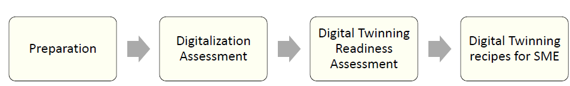
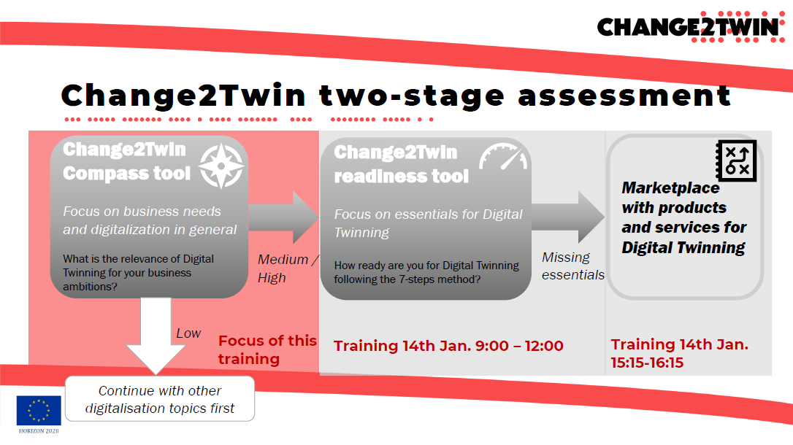

[На головну по грантам](../README.md)

# Проект change2twin

**Digital Twin для кожного малого та середнього підприємства!**

[Change2Twin](https://www.change2twin.eu/) – це європейський проект, який підтримує виробничі підприємства малого та середнього бізнесу в процесі цифровізації шляхом надання рішень цифрових двійників (Digital Twin). Концепція Digital Twin є однією з важливих змін у виробництві та дозволяє компаніям значно підвищити свою глобальну конкурентоспроможність.

## Про відкритий конкурс

Для прискорення впровадження цифрових двійників на виробництві для малих і середніх підприємств (МСП з чисельністю до 3000 співробітників), change2twin вже запустив три грантові пропозиції. Залишився останній відкритий конкурс:

- на **розгортання цифрового двійника** 
- надається тільки **виробничим МСП** 
- подати заявку до **16 квітня 2023 року**
- надається Ваучер на розгортання на суму до **90 000 євро** поетапно:
  - Початковий етап: після затвердження індивідуального плану **19%**
  - Експеримент: після підтвердження результату, визначеного в Угоді про субгрант  **81%** 
- Паушальна сума - контроль якості і термінів, а не бухгалтерії
- ваучер покриває **70% від заявлених** в бюджеті витрат на реалізацію та розгортання цифрового двійника
  - витрати на технології з [Change2Twin Marketplace.](https://marketplace.change2twin.eu/) або інших потенційних технологій
  - витрати на персонал
  - витрати на проїзд
  - витрати на матеріали
  - субпідряд
- **МСП має мати рівень оцифрування >=2** (цифрові системи в організації значною мірою пов’язані одна з одною та обмінюються даними, щоб надавати бізнес-додаткам і програмному забезпеченню відповідну інформацію), **проводиться самооцінкою з поясненнями** 
- заявка подається в онлайн за [цим посиланням](https://change2twin-dv2-opencall.fundingbox.com), методичка по заповненню знаходиться [за цим посиланням](application.md)  

- Ознайомтеся з [Посібником для заявників](GuideforApplicants.md) для більш детального розгляду.

- Перегляньте [Часті запитання](faq.md).

## Про цифрових двійників та їх створення

Якщо Ви представник виробничого підприємства і хочете зробити цифровий перехід, але не знаєте що таке цифрові двійники, можете почитати і подивитися наступні матеріали: 

- [Технології для забезпечення цифрових двійників на виробництві](DigitalTwinEnablingTechnology_positionpaper.md)
- [Вебінар по цифровим двійникам](DigitalTwinsVebinar.md)
- [Вебніар Сім кроків до цифрового двійника](SevenStepsToDigitalTwin.md)
- [Вебінар](https://youtu.be/3KsEQ1SjA_4) з презентацією Олега Коцара

## Що робити далі? 

### Самостійна робота МСП

Тут описані дії, які рекомендовано зробити МСП, який хоче впровадити цифрового двійника в рамках фінансування Change2twin перед заповненням заявки на [цій сторінці](https://change2twin-dv2-opencall.fundingbox.com/).  

Згідно методології Change2twin спочатку необхідно провести оцінювання стану підприємства та його переходу до вищого рівня зрілості Індустрії 4.0 за допомогою цифрового двійника а потім його розгортання. Тому в межах цього проекту є дві грантові пропозиції:

- на оцінювання стану та переходу
- на розгортання

Багато матеріалу є саме для оцінювання стану та переходу. Навіть якщо МСП не приймало участь в цих грантах, варто зробити приблизне оцінювання самостійно. Нижче наведена послідовність оцінювання, яка передбачалася в грантовій заявці для оцінювання стану та переходу. На мою думку для підвищення ймовірності виграшу гранту та успішної його реалізації, а також підготовки до інших подібних грантів варто пройти оцінювання до цієї методики. 

#### Оцінювання

Згідно [методики оцінювання](https://fundingbox-spaces.s3-eu-central-1.amazonaws.com/fmartineau/P9Gsm3xpCx/DAY-1---Change2Twin-DIHs-Webinar---Guidelines_for_the_assessment_-1---TNO--L.Aarssen-.pdf) МСП до розроблення цифрового двійника, то цей процес складається з 4-х етапів (рис.1):

 

  рис.1. Процес оцінювання МСП

1. Підготовка (Preparation)
2. Оцінювання цифровізації МСП (Digitalization Assessment)
3. Оцінювання готовності до створення цифрового двійника (Digital Twinning Readiness Assessment)
4. Рецепти створення цифрового двійника для МСП

Перший та другий етапи відноситься до першої стадії оцінювання (рис.2), на виході якої формуються відповіді на запитання Яке значення має створення цифрового двійника для бізнес-амбіцій МСП. У результаті буде визначено навіщо потрібен цифровий двійник для МСП і чи готове воно для його впровадження. Тільки якщо оцінка буде середньою або високою, то варто приймати участь в даному конкурсі  і переходити до третього етапу, тобто другої стадії, який потрібен для створення дорожньої карти цифрової трансформації за 7-ми ступеневою методико. 

Рис.2. Двостадійне оцінювання  

**Підготовка**. На першому етапі МСП варто переглянути в текстовому вигляді або подивитися вебінари:

- [Digital Twins в проекті Change2Twin  - загальне розуміння](DigitalTwinsVebinar.md) 
- [Сім кроків до цифрового двійника скорочена вресія](SevenStepsToDigitalTwin_brief.md)
- [Digital Twin demonstration: Jotne & Unit040](https://youtu.be/9_ejQPqvBYA) 
- [Технології для забезпечення цифрових двійників на виробництві](DigitalTwinEnablingTechnology_positionpaper.md)

**Оцінювання цифровізації МСП**. На цьому етапі варто скористатися утилітою Change2Twin Compass Tool, яка є в онлайн версії (однак там потрібна окрема реєстрація) і у вигляді файлу Excel. Тому треба завантажити файл [Compass-Tool-v1](https://fundingbox-spaces.s3-eu-central-1.amazonaws.com/fmartineau/pax4zJYQix/DAY1---Change2Twin-DIHs-Webinar---Compass-Tool-v1_0---non-plus.xlsx) заповнити його для визначення для чого саме МСП потрібен цифровий двійник і чи варто на даній стадії розвитку його робити. Зараз ведуться роботи над локалізацією даного документу українською. 

**Оцінювання готовності до створення цифрового двійника**. На цьому етапі варто скористатися Change2Twin readiness tool, яка є в онлайн версії (однак там потрібна окрема реєстрація) і у вигляді файлу Excel. Тому треба завантажити файл [DigitalTwin-Readiness-Assessment-v1_1](https://fundingbox-spaces.s3-eu-central-1.amazonaws.com/fmartineau/pKXmvNF296/DAY-2---Change2Twin-DIHs-Webinar---DigitalTwin-Readiness-Assessment-v1_1.xlsx) заповнити його для визначення подальшого плану щодо розроблення цифрового двійника.

**Рецепти створення цифрового двійника для МСП**. Для спрощення розгортання цифрового двійника можна скористатися готовими платформами або рішеннями, які можуть бути доступні на маркетплейсі, про який можна почитати за [цим посиланням](Change2TwinMarketplace.md). Використання маркетплейсу не є обовязковим. 

#### Заповнення заявки на розгортання

На мою думку послідовність має бути такою:

1) Ознайомтеся зі змістом заявки який наведений [в цьому файлі](application.md) з наявним українським перекладом.
2) Подивіться матеріали з пункту "Підготовка" що наведені в попередньому підрозділі, якщо Ви ще це не зробили.
3) Почитайте уважно [Посібник для заявників](GuideforApplicants.md) для більш детального розгляду та перегляньте [Часті запитання](faq.md).
4) Заповніть заявку у формі документу наведений [в цьому файлі](application.md) 
5) Зайдіть за [цим посиланням](https://change2twin-dv2-opencall.fundingbox.com) та подайте заявку, попередньо зареєструвавшись.

### Допомога EIF UCA

Якщо Вам потрібна допомога можете звертатися до експертів, які є в складі експертів EIF UCA. Вони допоможуть з формалізацією ваших очікувань та заповненням форми заявки. Однак при цьому ваша організація повинна бути членом якогось кластеру Українського Кластерного Альянсу ([УКА](https://www.clusters.org.ua/members-of-the-alliance/)), або стати ним прямо зараз. При цьому цю пропозицію та інші можна обговорювати на спеціальній платформі УКА <https://matchmaking.appau.org.ua> 

Олександр Пупена 

Для зворотного зв'язку:

- [Facebook](https://www.facebook.com/fieldbusbook/posts/pfbid022Y7JN42GNTZFh69fNaHPSWACnHYPhAfhKm9YrPpFywNo5ppMXPaRqQ6gk734CS7Jl)
- [Linkedin](https://www.linkedin.com/feed/update/urn:li:activity:7033470045070462976/)
- [GitHub](https://github.com/pupenasan/grants/issues/3)
