# Сім кроків до цифрового двійника

Оригінальна назва: Seven steps to digital twin

- [Запис вебінару Seven steps to digital twin - talk by Michael Borth (TNO/ESI) 15 січ. 2021](https://youtu.be/8jOqF3v6Se8)
- [Презентація](https://fundingbox-spaces.s3-eu-central-1.amazonaws.com/fmartineau/hF5SooDPqf/DAY-2---Change2Twin-DIHs-Webinar---2--Digital-Twin-Readiness-Assessment---MBorth.pdf)
- Додаткові матеріали
  - [Запис вебінару Get ready for a digital twin, the 7-steps method 24 May 2022](https://youtu.be/lq7rcaTjZmA)
  - Пропозиція від розробників [на маркетплейсі](https://marketplace.change2twin.eu/items/MI05.3/)
  - [The Road towards Digital Twins Dr. Michael Borth & Jeroen BroekhuijsenThe Road towards Digital Twins](https://a.storyblok.com/f/74249/x/5e8801d64d/1904-michael-borth.pdf)

  - схожа до вебінарів [презентація](https://a.storyblok.com/f/74249/x/5e8801d64d/1904-michael-borth.pdf)

Нижче наведені субтитри англійською мовою, зроблені обробленням автоматичних субтитрів з YouTube. Переклад зроблено Google перекладачем. Хоч на початку я намагався обробляти переклад для зручного представлення матеріалу, враховуючи низьку якість тексту, але достатню його репрезентативність, я вирішив не робити цього далі.   

## DT

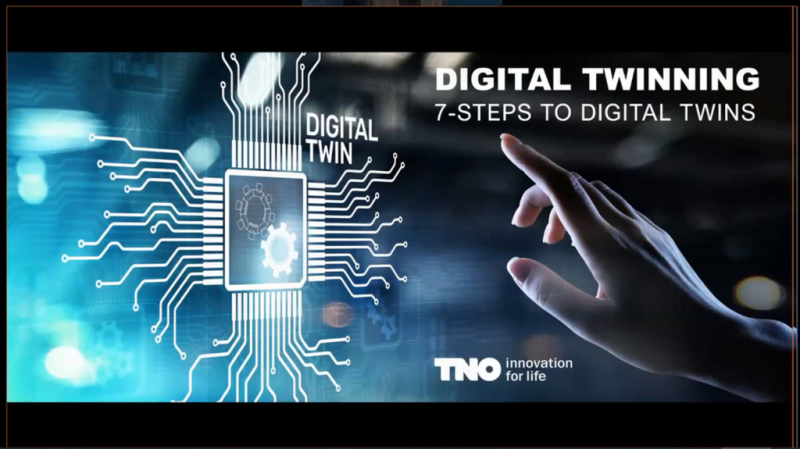

Like I said, it's a little bit standalone. So, the digital twinning -  seven steps to digital twins. How do we do that and what do we mean with  this?

Отже, створення цифрового двійника. Сім кроків до цифрового двійника. Як ми це робимо і що ми маємо на увазі.

## Start with why (DT at the heart of tomorrow's systems)

https://youtu.be/8jOqF3v6Se8?t=12

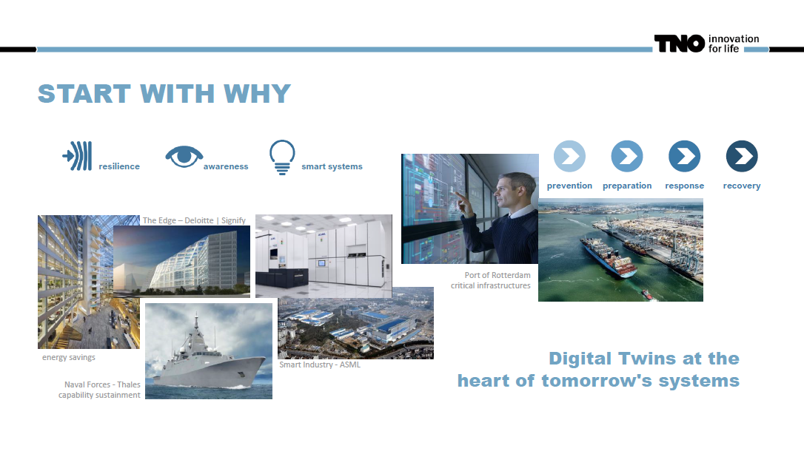

And, like I said, going a little bit easy as a reminder, we start with  the "why." And already when you look at these examples here, areas in  which we work actually, you see that why might of course be very, very  different.  

І, як я вже сказав, ми починаємо з відповіді на питання «Навіщо?». І якщо ви подивитеся на ці приклади, що наведені тут, зі сфера, в яких ми насправді працюємо, то побачите, що відповідь на питання "Навіщо", зазвичай може бути дуже, дуже різним. 

On the one hand side, we are talking about these digital  twins that are at the heart of tomorrow's systems. We are talking about  smart buildings. We are talking about maybe indeed seafaring vessels  which have extreme situations which they have to handle. We talk about  the smart industry, with the example here of ASML close to me in  Eindhoven. or the port of Rotterdam, the protection of critical  infrastructures with digital twins where you have a resilience problem.  Where you say, "I go from prevention, preparation, response, and  recovery for basically everything which is sensibly expecting to happen  just to say that this infrastructure has to work." And obviously, this  problem of protecting the port of Rotterdam against flooding, a  disaster, whatever, is very different from a smart building here with  the examples of Signify, formerly Philips Lighting Division, building a  smart lighting system in the Edge building and basically reducing your  energy bill.

З одного боку, ми говоримо про цих цифрових двійників, які є серцем систем майбутнього. Ми говоримо про розумні будівлі. Ми говоримо про, можливо морські судна, які мають екстремальні ситуації, з якими їм доводиться справлятися. Ми говоримо про розумну галузь, на прикладі близького мені прикладу ASML в Ейндховені. Або говоримо про порт Роттердама, про захист критичної інфраструктури за допомогою цифрових двійників, де у вас є проблема стійкості. Тут ви говорите: «Я переходжу від моделі передбачення-підготовка-реакція-відновлення для всього, що розумно очікується, просто щоб сказати, що ця інфраструктура має працювати». І очевидно, вирішення проблеми захисту порту Роттердаму від повені, катастрофи або чогось іншого дуже відрізняється від розумної будівлі наприклад від Signify, колишнього підрозділу Philips Lighting, який будує розумну систему освітлення в будівлі Edge та фактично зменшує ваш рахунок за  енергію.

## Start with why (DT in the manufacturing industry)

https://youtu.be/8jOqF3v6Se8?t=97

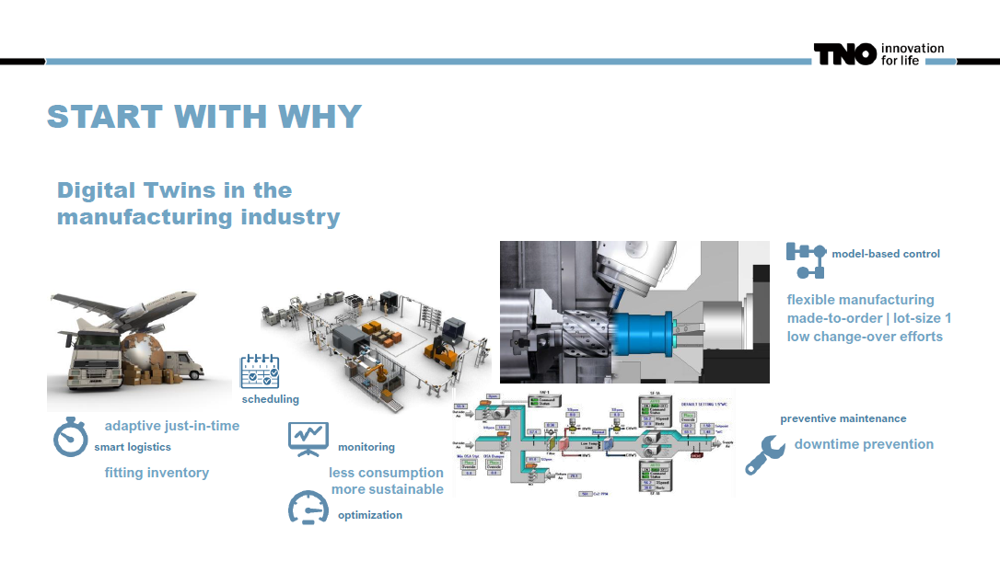

So, in that sense, for the most of us, these areas will actually be less important than maybe this one in the area of the manufacturing  industry. But also there, we still see that the "why" of the digital  twin is extremely wide. It could be about smart logistics, adaptive  just-in-time, having a fitting inventory to the task at hand. It could  be about the scheduling on the factory floor, about the monitoring of  the equipment. 

Отже, у цьому сенсі для більшості з нас ці сфери насправді будуть менш важливими, ніж, можливо, сфера промисловості. Але й тут ми все ще бачимо, що відповідь на питання «Навіщо» потрібен цифровий двійник надзвичайно різоманітна. Мова може йти про інтелектуальну логістику, адаптивну своєчасність, наявність запасів для поставлених завдань, про планування на заводі, про моніторинг обладнання.

There, really, that you say, less consumption, most sustainable, and optimization, reducing waste, all these things. But it  could also be about model-based control, flexible manufacturing,  made-to-order. That you have slot sizes of one and a little change-over  efforts betwin production ones. That the programming of the machines is low-code, no-code. And that you actually say, "Okay, this is with the  digital twin maybe several times faster than it was before." And of  course, very often it's about preventive maintenance, downtime  prevention. That no machine which is in the critical parts here for this production ever goes down in an unscheduled way. Of course, maintenance will be needed, but not as an emergency response. That is, of course,  something we are after.

Отже, насправді, ви говорите про зменшення споживання, збільшення стійкості, оптимізацію, зменшення відходів і т.д. Але це також може бути керування на основі моделі, гнучке виробництво, виготовлення на замовлення. Що у вас будуть невеликі партії для одиничних замовлень і потрібні невеликі зусилля для перемикання між їх виробництовм. І програмування машин буде з низьким рівнем кодування або взагалі без кодування. І ви насправді говорите: «Добре, це з цифровим близнюком, можливо, у кілька разів швидше, ніж було раніше». І звичайно, дуже часто мова йде про профілактичне обслуговування, попередження простоїв. Щоб жодна машина, яка є критично важливою для цього виробництва, ніколи не виходила з ладу позапланово. Звичайно, технічне обслуговування буде потрібне, але не як екстрена ситуація. Це, зазвичай, те, чого ми прагнемо.

## Start with why (DT are not free but offera large return of investment)

https://youtu.be/8jOqF3v6Se8?t=182

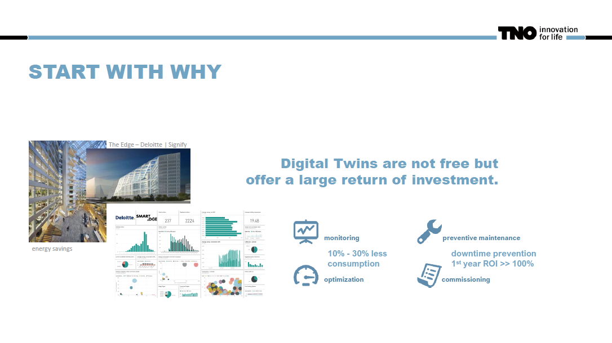

Now, with all of these digital twins, we know that they are not free. It is an effort to build something like that, and even if I contradict at  least one of the speakers of yesterday, we don't believe that it is  always that easy. You have to have a little bit of technical knowledge  here. You have to invest time. You really have to know what you want.  So, starting with the why is critical, but also the technical expertise  to do it, to make key decisions yourself in a company. 

Тепер, маючи всі ці цифрові двійники, ми знаємо, що вони не безкоштовні. Це зусилля побудувати щось подібне, і навіть якщо я заперечу принаймні одному з вчорашніх спікерів, ми не віримо, що це завжди так легко. Тут потрібно мати трохи технічних знань. Ви повинні інвестувати час. Ви дійсно повинні знати, чого ви хочете. Отже, починаючи з того, чому це важливо, а також маючи технічний досвід, щоб це зробити, щоб самостійно приймати ключові рішення в компанії.

So, if you advise the company, then of course it's a digital innovation hub needs a  technical expertise to also tell them what decision making in the  company will actually mean, so that they are also confident that they  own the decision, that this is not blindly following, but that this is  actually something where they say, "Okay, I get it. This is what I can  do in this call." So, that is then where you say, "Because I understand, I can do this investment, and the return of investment for the digital  twins, if done right, is normally a large one." 

Отже, якщо ви, DIH, консультуєте компанію, то, звісно, ви потребуєте технічної експертизи, щоб також розповісти їм, що насправді означатиме прийняття рішень у компанії. Щоб вони були впевнені, що вони також приймають рішення, а не сліпо слідуючи за вами. Це насправді має виглядіти так, щоб вони казали: «Добре, я зрозумів. Ось що я можу зробити під час цього виклику». Отже, саме тоді ви кажете: «Оскільки я розумію, я можу зробити цю інвестицію, і повернення інвестицій для цифрових двійників, якщо все зроблено правильно, зазвичай є велике». 

I give you some examples here: consumption numbers going down 10 to 30 percent, fuel for  vessels, for example, on energy bills. This is significant. So, a  business model of Philips here, for example, is indeed to say, "You  don't pay us, but we get the money that you're saving energy." So, they  are that confident in earning it back that they can make a business  offer like that. Preventive maintenance very often has a return of  investment in the first year, which was already over a hundred percent.  So, this is an area where taking the step towards to digital twins pays off, but you have to do it right.

Я наведу вам тут кілька прикладів: показники споживання зменшуються на 10-30 відсотків, паливо для суден, наприклад, у рахунках за електроенергію. Це суттєво. Отже, бізнес-модель Philips тут, наприклад, справді говорить: «Ви нам не платите, але ми отримуємо гроші за те, що ви економите енергію». Отже, вони настільки впевнені в тому, що повернуть ці інветсиції, що можуть зробити таку ділову пропозицію. Профілактичне технічне обслуговування дуже часто приносить окупність інвестицій, у перший же рік вона вже перевищує сто відсотків. Отже, це сфера, де крок до цифрових двійників окупається, але ви повинні зробити це правильно.

## The why (Is entitled to its own rationale)

https://youtu.be/8jOqF3v6Se8?t=302

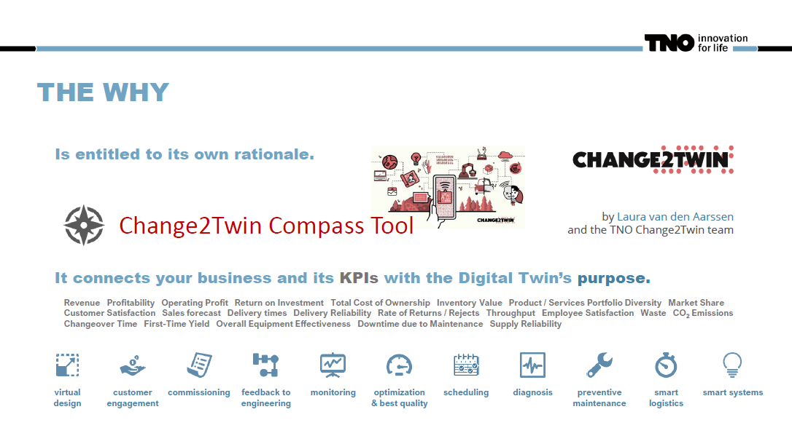

And starting with the 'why' is the right thing to do, and that is why we said it is entitled to its own rationale. The 'why' is so important  that you really have to get it, and this is why we developed the Change2twin Compass tool. Allow her to explain all of that to you so you  know it. However, I'm taking it over from here. The 'why' connects your  business and the KPIs that you are describing in this analysis, which is the digital twin purpose. Now, here in gray on the lower side of the  slide, you actually see these KPIs. So, we have many in this tooling many in the Compass tool - which basically then say in the analysis, you know that certain items are of critical importance to that company. 

І почати з відповіді на питання «Навіщо?» — є правильним, і тому ми сказали, що це має право на власне обґрунтування. Відповідь на питання «Навіщо?» настільки важливе, що його дійсно потрібно зрозуміти. Тому ми розробили інструмент Change2twin Compass. Дозвольте йому пояснити все це вам, щоб ви це знали. Однак зараз я беру це на себе. Відповідб на «Навіщо» поєднує ваш бізнес і KPI, які ви описуєте в цьому аналізі де вказуєте мету цифрового двійника. Тепер, сірим кольором у нижній частині слайда, ви дійсно бачите ці KPI. Отже, у нашому інструментарії, а саме в інструменті Compass, ми маємо  багато таких KPI, які, по суті, вказують на те, які саме елементи є критичними для цієї компанії.

So, from there on, the 'why' analysis basically says, 'Okay, then these are the  purposes of digital twins which should be pursued here.' For example, if downtime should be reduced to an unscheduled downtime zero, then  obviously preventive maintenance, diagnosis, and these areas are  critical to you. If, on the other hand, it's about the consumption of  energy, well, when it's monitoring and optimization which, of course,  also goes in the direction of best quality, you just optimize for a  different goal. But of course, it might be also be something very, very  different like customer engagement, virtual design, commissioning - so  the first steps of installing a system on a site - all of these things,  different KPIs, different 'why,' different purpose. And that is  something where we start with today.

Таким чином, звідси починається аналіз "Навіщо", який, по суті, вказує на  те, які цілі цифрових двійників слід тут досягати. Наприклад, якщо  потрібно зменшити час простою до нуля, то очевидно, що профілактичне  обслуговування, діагностика та інші сфери є для вас критичними. Якщо ж  мова йде про споживання енергії, то моніторинг та оптимізація, які,  звісно ж, також йдуть у напрямку найкращої якості, просто оптимізуються  для іншої мети. Але звичайно, це також може бути дуже, дуже різним,  наприклад, залученням клієнтів, віртуальним проектуванням, введення в експлуатацію (тобто першими кроками при встановленні системи на  майданчику) - всі ці речі, це різні KPI, різний "Навіщо", різна мета. І саме з цього ми сьогодні починаємо.

## Purposes differ greatly

https://youtu.be/8jOqF3v6Se8?t=417

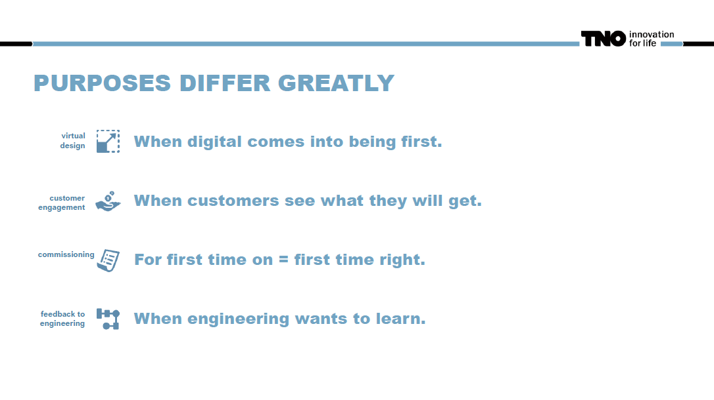

So when we say these purposes differ greatly, and then we basically  structured it in a set of typical purposes. 

The first for you see here, so the virtual design is basically when the digital comes first into  being. So that this is really about all the places where they say,  "Okay, I want to know what the system will be. I want to design it in the right way. I want validation before I build it. All of these  things." And this is actually one of the areas where my own  organization, Easy, is very strong, and that we say, "Okay, this  building of systems in a structured way, the system engineering part of  the full chain, this is our art and science." But of course, you can  immediately go further from that. You can say, "Okay, customer  engagement. The customer should see what they will get." And you have  seen Unit 40 yesterday, I would say they excel at that, so you  understand what will be there, which of course means you might already  have something virtual which you can use for training, but it might also be the decision that a customer says, "Yes, this is what I want to  buy." So if you have something like a flexible product where you say  there's a lot of customization going on, a lot of options for the  customer to choose, but it will be costly to change it later on, then of course this is what you do virtualization together with customer  engagement. The customer sees what they will get.  

Тож почнемо з пояснення того, що ми маємо на увазі, коли кажемо про різноманітні цілі. Ми структурували їх у вигляді типових цілей. 

Перша з них - віртуальне розроблення (virtual design) - означає, що цифрове представлення системи є першим кроком. Це включає всі етапи проектування системи: перевірку, її правильність та валідацію перед будівництвом. Моя власна організація, Easy, дуже сильна саме в цьому напрямку. 

Але можна також піти далі і зайнятися залученням клієнта. Клієнт може побачити, що він отримає. Можливо, вже є щось віртуальне, що можна використовувати для тренування, але це також може бути рішенням клієнта, який говорить: "Так, це те, що я хочу купити". Особливо це корисно в тих випадках, коли маєте гнучкий продукт з багатьма можливостями та налаштуваннями на вибір для клієнта, але змінити їх пізніше буде дуже дорого. Клієнт бачить, що він отримає.

Then comes the  commissioning step, so first time on is first time right. This is  something which you have definitely in areas like the smart buildings  where you say you have an awful lot of sensors, and all of them have  their ID numbers and they have their mappings where you have to say,  "Okay, this sensor is here and it's connected to that gateway, and then  it's doing this functionality," and of course it goes wrong, and a digital twin of course helps here say, "Okay, we really want it in an  orderly fashion. We do it step by step.  We know exactly if it's correct, and when we switch it on, we will not spend the next week hunting bucks in this installation looking for flipped cables or something like  this."

Далі йде етап пусконалагодження - "перший раз правильно". Це те, що ви точно маєте в таких сферах, як «розумні» будівлі, де ви кажете, що у вас дуже багато датчиків, і всі вони мають свої ідентифікаційні номери та свої відображення, де ви повинні сказати: «Добре, цей датчик тут і він підключений до шлюзу, а потім виконує цю функцію». І цифровий двійник допомагає нам впорядкувати послідовність дій крок за кроком. Ми точно знаємо, чи це правильно, і коли ми його ввімкнемо, ми не будемо витрачати наступний тиждень, шукаючи помилки в цій установці, наприклад перевернуті кабелі або щось подібне". 

But there are also very different purposes like feedback to  engineering. So you have the machines in the field. It's your product.  It's running somewhere, and now you want to know something about it.  Maybe you want to know why a certain machine fails more often than another. Maybe you want to learn how it's typically used to do the next  iteration, the next generation of the systems more suited to the needs  in the field. Maybe you want to estimate risks in safety-critical areas  where you actually say, "Okay, what do I need to protect myself  against?" All of these areas are something which is really a feedback  loop towards the own engineers of the company, and also that is of  course supported by a digital twin.

Але існують також зовсім інші цілі, такі як зворотний зв'язок до інженерії. Отже, у вас на виробничому майданчику є машини. Це ваш продукт. Він десь працює, і тепер ви хочете  щось про нього дізнатися. Можливо, ви хочете знати, чому певна машина виходить з ладу частіше, ніж інші. Можливо, ви хочете дізнатися, як вона зазвичай використовується, щоб зробити наступну ітерацію, тобто наступне покоління ваших машин, більш придатним до потреб на виробничому майданчику. Можливо, ви хочете оцінити ризики в критично важливих для безпеки областях, де ви насправді скажете: "Добре, від чого мені потрібно захиститися?". Усі ці напрямки є тим, що справді є зворотним зв’язком із власними інженерами компанії, а також, звичайно, підтримується цифровим двійником.

## Purposes differ greatly (as do needs)

https://youtu.be/8jOqF3v6Se8?t=628

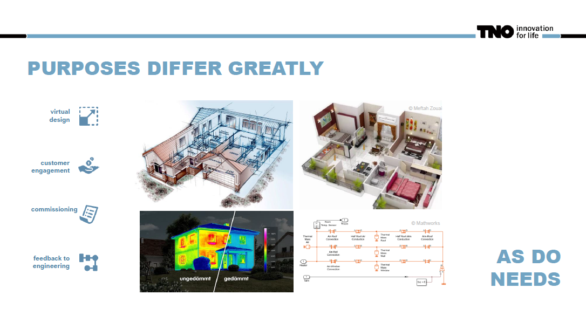

Now, when we look at these areas, we can immediately see that the needs  for the digital twin will also differ greatly. So, if I just give you  some nice examples here: customer engagement (upper right), our virtual  design (upper left), but also, let's say, feedback to engineering,  really seeing the effect of, for example, heat isolation by measurements outside the lab and just generating the data, or commissioning models  which basically say, "Okay, I'm basically simulating what I should see. I can see that I observe something different and I can immediately say  what must be wrong." All of these things are possible, and all of these  things mean this is a different digital twin. And of course, it is  possible to imagine that there is a core of this digital twin which  says, "I'm the same," and then I have extensions towards certain  purposes, certain user interfaces for different people. Commissioning is done by other people than the feedback to engineering, obviously, so it is possible to imagine that it's one digital twin which has different  aspects. But we can also, for the sake of simplicity, just say no, these are different digital twins, and we are building something different  here, and it will look different. So the needs will be different.

Тепер, коли ми розглядаємо ці області, ми відразу можемо побачити, що  потреби в цифровому двійнику також значно будуть відрізнятися. Отже, я просто наведу вам тут кілька гарних прикладів: залучення клієнтів (угорі праворуч), віртуальне розроблення (угорі ліворуч), а також, скажімо, зворотний зв’язок з інженерами для реального спостереження ефекту, наприклад, теплоізоляції за допомогою вимірювань за межами лабораторії та просто генеруючи дані, та моделі введення в дію, які в основному кажуть: «Гаразд, я в основному симулюю те, що я повинен побачити. Я бачу, що спостерігаю щось інше, і можу відразу сказати, що має бути не так». Усе це можливо, і все це означає, що це інший цифровий двійник. І, звісно, можна уявити, що є ядро цього цифрового двійника, яке каже: «Я такий самий». А потім у мене є розширення для певних цілей, певних інтерфейсів користувача для різних людей. Очевидно, введення в експлуатацію здійснюється іншими людьми, а не інженерами для яких потрібен зворотній зв’язок, тому можна уявити, що це один цифровий двійник, який має різні аспекти. Але ми також можемо, заради простоти, просто сказати «ні», це різні цифрові двійники, і ми будуємо тут щось інше, і воно виглядатиме по-іншому. Тому потреби будуть різними.

## Purposes differ greatly (When ...)

https://youtu.be/8jOqF3v6Se8?t=723

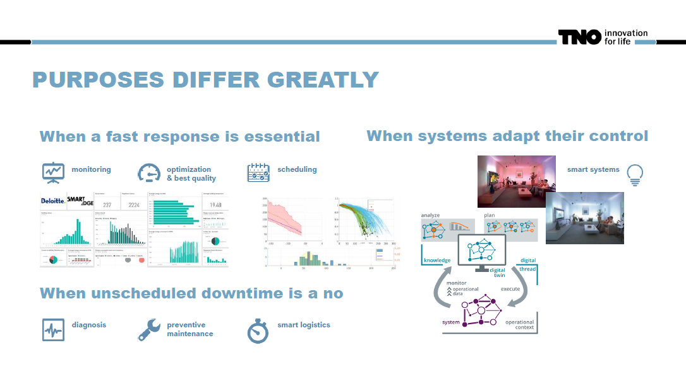

Now, the story goes on, so let me give you the list, basically, of the  purposes we will be investigating a little bit today. So, the next one  is basically when you say in operations, the fast response is essential, so monitoring optimization best quality problems, scheduling. This  is this area, especially for everything where you have that smart in the name, the smart building, the smart factory, and stuff like that. And  you will remember that my colleague  Jeroen, told you that digital twins are very much about the decision they support decision-making. I think  this is where it's very clearly seen. They support it because they  notify you something is going on, you, a human, need to respond, or if  they go a little bit higher, but that is a smart system, they actually  say, "Okay, I can handle this." 

Тепер історія продовжується, тож дозвольте мені дати вам перелік цілей, які ми сьогодні трохи досліджуватимемо. Наступна мета полягає в тому, щоб досягнути швидкої реакції що є вирішальним в операціях, тому тут важливий моніторинг, оптимізація та найкраща якість, планування.  Це та область, особливо для всього, де у назві є слово "розумний": розумна будівля, розумна фабрика тощо. І ви пам’ятаєте, що мій колега Джерун сказав вам, що цифрові двійники дуже важливі для прийняття рішень, вони підтримують це прийняття рішень. Я думаю, що тут це дуже чітко видно. Вони підтримують прийняття рішень, бо повідомляють вам, коли щось стається, а ви, як людина, повинні відреагувати на це. Або якщо ці двійники більш просунуті і це вже розумна система, вони насправді можуть прийнтяти рішення самосітйно. 

Now, the picture in the middle is  something in the area of preventive maintenance, where I compare one  system, the red line in this picture, to other symptoms I have seen in  the past and actually say, "Okay, um, this is how the performance is  degrading. I have seen this before, therefore I'm predicting a breakdown in that in the time span," which, of course, gives me the opportunity  to schedule my maintenance earlier than that. Next to that, of course,  we have the smart systems themselves when they say, "Okay, they adapt  control." So, this is the area where the system starts to analyze,  starts to plan, and then executes an action and changes something based  on the computations in the digital twin. So, this is far beyond  monitoring. This is far beyond giving you a picture of what is going on. This is decision-taking by the digital twin. Now, you can imagine that  some people will say, "Hey, this is where the AI technology goes in.  This is where the smart system is where all the fancy stuff happens."  You will also find some people who say, "Well, you know, come on. This  is control. We have done this for decades. So, what is the difference  here?" And that gets to be very technical to say whether or not there is a dividing line in between. I think this is actually not important for  us here. The fact is that basically, the digital twin takes information  that we would see on the slide on the left side and says, "Okay, the  analysis and the planning is done in the computer, and the computer  takes a decision. The digital twin is computing and not only showing,  and then it takes an action."

Тепер картинка посередині — це щось у сфері профілактичного обслуговування, де я порівнюю в системі, червону лінію на цьому зображенні, з іншими симптомами, які я бачив у минулому, і насправді кажу: «Добре, гм, ось як продуктивність погіршується. Я бачив це раніше, тому я прогнозую збій у цьому проміжку часу", що, звичайно, дає мені можливість запланувати технічне обслуговування раніше. Окрім цього, звичайно, у нас є розумні системи, коли вони самі адаптують керування. Отже, це область, де система починає аналізувати, починає планувати, а потім виконує дію та щось змінює на основі обчислень у цифровому двійнику. Отже, це далеко за межами моніторингу. Це набагато більше, ніж дати вам просто картину того, що відбувається. Це прийняття рішень цифровим двійником. Ви можете собі уявити, що деякі люди скажуть: «Гей, ось тут використовується технологія ШІ. Ось де розумна система — це місце, де відбуваються всі дивовижні речі». Але ви також знайдете людей, які кажуть: «Т, знаєте, це ж просто керування. Ми робили це десятиліттями. Отже, яка тут різниця?» І це стає дуже технічним, щоб сказати, чи є між ними лінія розмежування. Я думаю, що для нас це насправді не важливо. Справа в тому, що в основному цифровий двійник отримує інформацію, яку ми бачили б на слайді ліворуч, і  на основі неї робить аналіз, робить планування на комп’ютері, і комп’ютер приймає рішення.  Цифровий двійник обчислює, а не тільки показує, а потім ще виконує дію.

## Physical and digital twin connect

https://youtu.be/8jOqF3v6Se8?t=908

So with this, I can basically say, "Okay, if we know that. What is still  the same thing in all of these areas," and of course, you have learned  that yesterday they digital twin mirror aspects of real systems,  processes, or products. So I'm showing you one example here, which is in the area of jet engine maintenance, and actually, Atlas Copco is one of the companies with a very nice flagship story about how to build  something like this. But it's only an illustration. It will always be looking the same. The ultimate goal here is to connect the digital twin to data fields. So that the digital twin can monitor, assess, and maybe  predict what is going on. But that will not be enough. You need the  integration with business processes. 

Таким чином, я можу по суті сказати: «Добре, якщо ми знаємо це. Що те саме в усіх цих сферах вони відображають аспекти цифрового подвійника відзеркалюючи реальні системи, процеси або продукти. Тож я показую вам тут один приклад, який стосується технічного обслуговування реактивних двигунів, і насправді Atlas Copco є однією з компаній із дуже гарною флагманською історією про те, як створити щось подібне. Але це лише ілюстрація. Вона завжди виглядатиме однаково. Кінцевою метою тут є підключення цифрового двійника до даних з поля. Щоб цифровий двійник міг контролювати, оцінювати та, можливо, передбачати, що відбувається. Але цього буде недостатньо. Вам потрібна інтеграція з бізнес-процесами.

So in the area of preventive  maintenance, I think this becomes immediately obvious. If the digital  twin tells you that this system is on a decline, that its performance  gets more and more lousy, and in five days, if things continue like  that, it will not fulfill its function any longer, and within 10 days,  it will most likely break, you know that a service team has to take an action. The digital twin is not going to do that. Therefore, the  integration with business processes is obviously the crucial item here.  So someone who tells you, "I will build you the digital twin," well,  that still means that the company who has the digital twin has some work to do here, and that needs to fit. And all of that is indeed in the  seven-step stone.

Тож у сфері профілактичного обслуговування, я думаю, це стає очевидним одразу. Якщо цифровий двійник повідомляє вам, що ця система занепадає, що її продуктивність стає дедалі поганішою, і через п’ять днів, якщо так триватиме, вона більше не виконуватиме своїх функцій, а протягом 10 днів вона почне швидше за все, ви знаєте, що команда обслуговування має вжити заходів. Цифровий двійник цього не зробить. Тому інтеграція з бізнес-процесами тут, очевидно, є вирішальним пунктом. Тож хтось, хто скаже вам: «Я створю вам цифрового близнюка», ну, це все одно означає, що компанії, яка має цифрового близнюка, є над чим працювати, і це має відповідати. І все це дійсно є в камені-семиступені.

## We build a roadmap: the 7-steps (but the journey is not the same for everyone)

https://youtu.be/8jOqF3v6Se8?t=1018

So this is why we built a roadmap - the stepping steps that we say,  'okay, we have a certain blueprint' because there are similarities, but  the journey to do so is definitely not the same for everyone. So, even  though I could tell it here for a single example and you would see this, this is how you do it, I still urge you to understand from the point of view, especially of the digital innovation hacks. If you give advice,  it is not the same for everyone. Very strongly of course, you see this  in the part that digitally effort digitalization efforts could be part  of a large transformation. You could indeed say, 'hey, this company is  going into a new market with smart products. They never did something  like this before, so this is a major change.' Or it could be that you  just say the company wants to avoid waste, and they have chosen the  digital twin technology for monitoring to do this better, so it becomes  more sustainable. They are responding maybe to a requirement by law, but in essence, they want to do the business they always did, but they make it more sustainable. 

Ось чому ми створили дорожню карту — кроки, які ми кажемо: «добре, у нас є певний план», тому що є схожість, але шлях до цього точно не для всіх однаковий. Тож, незважаючи на те, що я міг би розповісти це тут на одному прикладі, і ви побачили б це, ось як ви це робите, я все одно закликаю вас зрозуміти з точки зору, особливо з хаків цифрових інновацій. Якщо давати поради, то не для всіх однаково. Звичайно, ви бачите це в тій частині, що зусилля з оцифрування цифрових технологій можуть стати частиною великої трансформації. Ви справді можете сказати: «Гей, ця компанія виходить на новий ринок із розумними продуктами». Вони ніколи раніше не робили нічого подібного, тому це серйозна зміна». Або може бути так, що ви просто скажете, що компанія хоче уникнути марнотратства, і вони обрали цифрову подвійну технологію для моніторингу, щоб зробити це краще, щоб воно стало більш стійким. Можливо, вони відповідають вимогам закону, але, по суті, вони хочуть вести бізнес, яким вони займалися завжди, але вони роблять його більш стійким.

So, that will not be the same game, but in the  same manner, the starting point is also very different betwin  companies. There will be companies where I go and say, 'okay, what do you have? Do you have, for example, engineering models of the systems  that you want to monitor?' If so, it might be an easy transformation, a  relatively easy transformation to go to a digital twin monitoring  them because you have all the understanding of how this system works in a computable readable form. Or you might say, 'no green field, this is  about the next generation, and I never did anything in a digital way, so let's start with everything from virtual design towards the digital twin with nothing in legacy, with nothing which I have to consider,  just rolling out the best possible way for the future.' So, very  different starting point, very different approach. But another thing is  the journey has its own needs too, and the digital innovation hubs they  will differ here. 

Отже, це не буде та сама гра, але в однаковій манері, відправною точкою також є дуже різні компанії-бетвін. Будуть компанії, куди я прийду і скажу: «Добре, що у вас є?» У вас є, наприклад, інженерні моделі систем, які ви хочете контролювати?» Якщо так, можливо, це буде легка трансформація, відносно легка трансформація, щоб перейти до цифрового двійника, який стежить за ними, тому що ви маєте повне розуміння того, як ця система працює в обчислюваній формі. Або ви можете сказати: «Нічого зеленого поля, це про наступне покоління, і я ніколи нічого не робив цифровим способом, тож давайте почнемо з усього, від віртуального дизайну до цифрового близнюка, без жодної спадщини, без нічого, що мені потрібно подумайте, просто розгортайте найкращий спосіб для майбутнього». Отже, зовсім інша відправна точка, зовсім інший підхід. Але інша річ, у подорожі також є свої потреби, і центри цифрових інновацій тут відрізнятимуться.

Some of you, I assume, will actually offer very  technical advice, some others will look into business processes more  strongly, and some others might actually have a strong angle for change  management as well. Innovation normally means change. And with change,  you are on a journey. That journey has its own needs. I give you some of them here. It's basically the management is all in. If management is  not supporting that, and normally the journey fails. Communication,  obviously open and directional, people listening. Competence for  decisions in-house. Now, the digital innovation hubs support the digital innovation helps advice, but in the end, it has to be someone who says, 'I'm going to do this, I'm going to sign this,' and at least that inner gut feeling of, 'I'm confident because I understand enough,' or that  feeling of, 'Oh wow, ah, this is so complicated, I cannot sleep.' So,  this is now that I know I need to learn more. That kind of competence  for in-house decision doesn't mean every technical detail. You can  outsource that. That is what the innovation have with the marketplace is for, but decisions are taken by people in the companies. They have to  be familiar enough with this. Then, of course, you do it for the  end-user, and you do it with them, and this digital twin which is  showing information, and the management looks at this and says, 'This is a beautiful picture,' and then the service people say, 'Yeah, but it's  not showing what I need for preventive maintenance.

Дехто з вас, я припускаю, справді запропонує технічні поради, дехто більш детально вивчатиме бізнес-процеси, а дехто також може мати сильний погляд на управління змінами. Інновація зазвичай означає зміни. А зі змінами ви вирушаєте в подорож. Ця подорож має свої потреби. Я наведу вам деякі з них тут. В основному це все, що вдається керівництву. Якщо керівництво не підтримує цього, зазвичай подорож провалюється. Спілкування, явно відкрите та спрямоване, люди слухають. Компетентність для прийняття рішень всередині компанії. Зараз центри цифрових інновацій підтримують поради щодо цифрових інновацій, але врешті-решт має бути хтось, хто скаже: «Я зроблю це, я підпишу це», і принаймні цей внутрішній розум відчуття: «Я впевнений, тому що я достатньо розумію» або відчуття: «Ой, вау, ах, це так складно, я не можу спати». Отже, тепер я знаю, що мені потрібно дізнатися більше. Така компетенція для прийняття внутрішніх рішень не стосується кожної технічної деталі. Ви можете це аутсорсувати. Саме для цього існують інновації на ринку, але рішення приймаються людьми в компаніях. Вони повинні бути достатньо знайомі з цим. Тоді, звісно, ви робите це для кінцевого користувача, і ви робите це з ним, і цей цифровий двійник, який показує інформацію, і керівництво дивиться на це і каже: "Це гарне зображення", а потім обслуговуючий персонал каже: «Так, але це не те, що мені потрібно для профілактичного обслуговування».

That is a failure. So, with the end user, what are their needs? How are they thinking? What can they cope with? That kind of story? And then,  indeed, it is about change. So, help everyone involved. Digitalization  like this, digital twins might very well mean that some people fear for  their jobs, that some people say, 'I'm going to be left behind. This is  new computer fancy stuff. I don't even have a PC at home. What are you  talking about? I don't want this.' So, it's a company's responsibility  to say, 'Guys, we are doing this together. There is training.' And then, of course, the digital innovation hubs can also offer support in this.  But help everyone on board. Make that clear to the customers of the  digital innovation hubs. It's a journey, and a journey has its own  needs. So, you have to think about this.

Це провал. Отже, які потреби кінцевого користувача? Як вони думають? З чим вони можуть впоратися? Така історія? І тоді, справді, йдеться про зміни. Тож допоможіть усім причетним. Подібна цифровізація, цифрові близнюки цілком можуть означати, що деякі люди бояться за свою роботу, що деякі люди кажуть: «Мене покинуть». Це нова комп’ютерна мода. У мене навіть комп’ютера вдома немає. Про що ти говориш? Я не хочу цього». Отже, компанія зобов’язана сказати: «Хлопці, ми робимо це разом». Є навчання». І тоді, звичайно, центри цифрових інновацій також можуть запропонувати підтримку в цьому. Але допомагайте всім на борту. Поясніть це клієнтам центрів цифрових інновацій. Це подорож, а в подорожі є свої потреби. Отже, ви повинні подумати про це.

## Realizing digital twins in seven steps (1)

https://youtu.be/8jOqF3v6Se8?t=1338

We actually wrote this down, so this picture on the left here, "Ready  for Digital Twins", that's a nice flyer. I think it has a nice level of  abstraction. Here, it basically doesn't assume too much. It starts with  explaining what all of this is about, and what I just spoke about,  basically this intro which I now gave you a little bit on paper format.  It explains this seven steps method which we are following here. So, in  that sense, it's a little bit of easy reading, and I advise you to use  it. Actually, the seven steps are listed here on the right, and we  definitely talked about to start with the "why" enough, so I will not go into that any further, but basically run through these seven steps now  for the remainder of the presentation, and in that way, tell you a  little bit about how to approach it.

Ми насправді записали це, тож ця картинка ліворуч тут, «Готовий до цифрових близнюків», це гарна листівка. Я думаю, що це має гарний рівень абстракції. Тут, в основному, не передбачається занадто багато. Він починається з пояснення, про що все це і про що я щойно говорив, по суті, це вступне слово, яке я зараз трохи надав вам на папері. У ньому пояснюється метод із семи кроків, який ми тут дотримуємося. Тож у цьому сенсі це трохи легке читання, і я раджу вам його використовувати. Насправді, сім кроків перераховані тут праворуч, і ми точно говорили про те, щоб почати з «чому» достатньо, тому я не буду вдаватися в це далі, але в основному пробіжу ці сім кроків зараз для решти презентації. , і таким чином розповім вам трохи про те, як до цього підійти.

## Asset selection:: the physical twin (2)

https://youtu.be/8jOqF3v6Se8?t=1393

And the first one for this is actually the asset selection. Now, the  asset selection is about the physical twin. And like I said before,  digital twin mirrors aspects of real system processes or products. So  this is a choice. Even when I say I'm staying in this example of  manufacturing, I could narrow the logistic chain, the shop for  processes, the machines on that factory floor, or I could mirror the  product and say, "This is about the control of the machine which has to  be digital." But the twin is about the product. So what do I choose?  Which asset is the one that I want to mirror? And from that asset, which aspects are essential? Even if I twin a machine, do I do this for the  purpose of maintenance or do I do this for the purpose of control? Or do I do it for those? That's a decision. So, asset selection, the physical twin, that is basically the first step.

І першим для цього є вибір активів. Тепер вибір активів стосується фізичного близнюка. І, як я вже говорив раніше, цифрові двійники відображають аспекти реальних системних процесів або продуктів. Так що це вибір. Навіть коли я кажу, що залишаюся на цьому прикладі виробництва, я міг би звузити логістичний ланцюг, цех для процесів, машини на цій фабриці, або я міг би віддзеркалити продукт і сказати: «Це стосується контролю над машина, яка має бути цифровою». Але близнюк стосується продукту. Отже, що я вибираю? Який ресурс я хочу віддзеркалити? І які аспекти є важливими з цього активу? Навіть якщо я здвою машину, я роблю це з метою обслуговування чи з метою контролю? Або я роблю це для них? Це рішення. Отже, вибір активів, фізичного близнюка, це, по суті, перший крок.

## Realizing digital twins (3,4)

https://youtu.be/8jOqF3v6Se8?t=1463

And after that, we are already going into the realization of the digital twin. So now we know what our physical twin is and we want to start  building. We have two aspects in this, and these are steps three and  four: the infrastructure and a twin building. The infrastructure is about the  data flowing from the physical twin towards the digital. So, bringing  the sensors to life, enabling information flows. So, here we see terms  like IoT, the Internet of Things. Basically, the technology which is  readily available to connect from sensor towards the data distribution,  maybe connect to databases, merge it with other information. So, this is where the term "cyber-physical" comes in. Maybe you will find, "Oh wait a second, I actually need to share data with some other people to be  most effective." So then, I have to talk about trust and maybe  protecting my data sharing. All of that is an area which is to be  considered. And so, you see here this nice picture, and when I say it is to be considered, you already realize we have a choice here. Trusted  data sharing might not be necessary; the cyber-physical connection to  other databases might not be necessary. But if it's a digitally twin having live sensors and having a data chain from the live sensors to the digital twin is essential.

І після цього ми вже переходимо до реалізації цифрового двійника. Тепер ми знаємо, що таке наш фізичний двійник, і хочемо почати будувати. У нас є два аспекти в цьому, і це кроки третій і четвертий: побудова інфраструктури(3) і побудова двійника(4). Інфраструктура стосується даних, що надходять від фізичного двійника до цифрового. Отже, оживлення датчиків, уможливлення потоків інформації. Отже, тут ми бачимо такі терміни, як IoT, Інтернет речей. По суті, технологія, яка доступна для підключення від датчика до розповсюдження даних, можливо, підключення до баз даних, об’єднання її з іншою інформацією. Ось тут і з’являється термін «кіберфізичний». Можливо, ви побачите: «О, зачекайте секундочку, мені справді потрібно поділитися даними з іншими людьми, щоб бути найбільш ефективним». Отже, я маю говорити про довіру та, можливо, захист мого обміну даними. Все це є областю, яку потрібно враховувати. Отже, ви бачите тут цю гарну картинку, і коли я кажу, що це потрібно враховувати, ви вже розумієте, що у нас тут є вибір. Довірений обмін даними може не знадобитися; кіберфізичне підключення до інших баз даних може не знадобитися. Але якщо це цифровий близнюк, наявність живих датчиків і наявність ланцюжка даних від живих датчиків до цифрового близнюка є важливим.

So, this is the area where you say, "Okay, some of these parts you will  need, and some others you might need." And remember when I said that  this is about consultancy, that this is about understanding of needs given a purpose and mapping them towards technical options? This is where the  consultancy comes in to make that mapping. So, in that sense, when I say here these are five major items in the area of infrastructure and data  transport, and my statement is they have to be considered if they are  needed, and the answer can easily be no. And if the answer is yes, well  then let's look into it. Same with the data, also the world from the  physical to the digital. 

Отже, це та область, де ви говорите: «Добре, деякі з цих частин вам знадобляться, а деякі інші вам можуть знадобитися». І пам’ятайте, коли я казав, що мова йде про консультації, що мова йде про розуміння потреб з урахуванням мети та їх відображення з технічними варіантами? Ось тут на допомогу приходить консультант, щоб зробити це відображення. Отже, у цьому сенсі, коли я кажу, що це п’ять основних пунктів у сфері інфраструктури та транспортування даних, я стверджую, що їх потрібно враховувати, якщо вони потрібні, і відповідь може бути легкою: ні. І якщо відповідь ствердна, то давайте розберемося. Те саме з даними, а також світом від фізичного до цифрового. 

So, here you see terms like the  virtualization, but also failure modes and effect and criticality analysis (FMECA), the link betwin data and knowledge. So basically, knowing  that, "Hey, I have some models about my digit about my physical thing."  So, this is what describes the physical object in the computer. This is  the digital twin, but that sensor over here that is actually providing  data for that part of the model. So, really understanding this mapping,  it is certainly not often that straightforward. This is part of it,  understanding what happens if something goes wrong in the system so that you can interpret the virtualization itself of course. But also some  other items, which are sometimes overlooked here. So, this is why we  like to have all these boxes on the paper. The one is to ensure  fidelity, ensure trust. A running digital twin is a system. So treat it  accordingly. If there's a company building a system, they, of course,  understand that they have to have quality control, that they have to  have test runs, and so on and so on and so on. Same here, so if you're  building a digital twin with someone for someone, if you're helping them plan accordingly and understand that the first goal of the digital twin might still have some hiccups, bugs, things you didn't think of,  therefore you test it, you get user feedback, you revise it, you make it ready, and then it works. 

Отже, тут ви бачите такі терміни, як віртуалізація, а також режими відмов і аналіз ефектів і критичності (FMECA), зв’язок між даними та знаннями. Отже, по суті, знаючи, що: «Гей, у мене є деякі моделі щодо моєї цифри щодо моєї фізичної речі». Отже, це те, що описує фізичний об’єкт у комп’ютері. Це цифровий двійник, але цей датчик тут фактично надає дані для цієї частини моделі. Отже, справжнє розуміння цього відображення, звичайно, не часто буває таким простим. Це частина цього, розуміння того, що станеться, якщо в системі щось піде не так, щоб ви, звичайно, могли інтерпретувати саму віртуалізацію. Але також деякі інші предмети, які іноді залишаються без уваги. Ось чому ми любимо мати всі ці коробки на папері. Перше — забезпечити вірність, забезпечити довіру. Цифровий двійник, що працює, — це система. Тож ставтеся до цього відповідно. Якщо є компанія, яка будує систему, вони, звісно, розуміють, що їм потрібен контроль якості, що вони мають проводити тестування, і так далі, і так далі, і так далі. Те ж саме, якщо ви створюєте цифрового близнюка з кимось для когось, якщо ви допомагаєте їм спланувати відповідним чином і розумієте, що перша мета цифрового близнюка все ще може мати деякі недоліки, помилки, речі, про які ви не думали , тому ви тестуєте його, ви отримуєте відгуки користувачів, ви переглядаєте його, ви готуєте його, і тоді він працює.

And more importantly, see to it that people have a reason to trust it. So the big black box, where then someone stands in front of and says, "Yes, it is brewing up the information that I should do maintenance now," and I don't understand how it's doing that, and I don't understand why it's telling me that I'm standing in front of the machine and the machine looks fine too. No trust, no action. Because of that lack of trust, the service guy might simply say, "You know, I'm not opening this. This is running," so stepping away, and then it breaks down a week later, and he says, "Okay, you were right, but I still don't get it why, so I don't trust." So in that sense, ensure the fidelity, but do it in a way that the people using the digital twin understand, "Yes, this is what is happening inside. This is why I can trust it." And that doesn't mean that they have to understand every detail, but enough to trust.

І що важливіше, подбайте про те, щоб люди мали підстави йому довіряти. Отже, великий чорний ящик, перед яким хтось стоїть і каже: «Так, він збирає інформацію про те, що я повинен зараз виконати технічне обслуговування», і я не розумію, як він це робить, і я не розумію чому він говорить мені, що я стою перед машиною, і машина теж виглядає добре. Ні довіри, ні дій. Через брак довіри обслуговуючий хлопець може просто сказати: «Ви знаєте, я не відкриваю це. Це запущено», тож відійти, а потім через тиждень це зламається, і він каже: «Добре, ти мав рацію, але я досі не розумію чому, тому я не вірю». Тож у цьому сенсі забезпечте точність, але робіть це так, щоб люди, які використовують цифрового близнюка, розуміли: «Так, це те, що відбувається всередині. Ось чому я можу цьому довіряти». І це не означає, що вони повинні розуміти кожну деталь, але достатньо, щоб довіряти.

Another area here, by the way, is then configuration management. So we have many customers in the high-tech domain, and there is this one mode that the only constant for them, of course, is change. There are software updates to the machines, there are maintenance operations, the situation changes, and stuff like that. So I have data over a certain machine, and I'm looking at the machine right now. I say, "That doesn't make sense. I'm seeing a timeline for data here, but actually, there is no sensor producing that data. How can that be?" Then someone tells me, "Oh yeah, we changed the software, so this is no longer captured." "Oh great, so you are telling me that I'm looking at data which doesn't apply any longer for the machine I'm looking at." So I need to know the configuration of the machine so that I can configure the digital twin in the same way. So configuration management, also one of the items often overlooked, has to be taken into account.

Іншою сферою тут, до речі, є керування конфігурацією. Таким чином, у нас є багато клієнтів у сфері високих технологій, і є один режим, єдиною постійною для них, звичайно, є зміни. Є оновлення програмного забезпечення для машин, є операції з технічного обслуговування, змінюється ситуація і тому подібне. Отже, у мене є дані на певній машині, і я зараз дивлюся на машину. Я кажу: «Це не має сенсу. Я бачу тут часову шкалу для даних, але насправді немає датчика, який видає ці дані. Як таке може бути?» Потім хтось каже мені: «О так, ми змінили програмне забезпечення, тому це більше не записується». «О, чудово, ви хочете мені сказати, що я переглядаю дані, які більше не застосовуються до машини, яку я переглядаю». Тож мені потрібно знати конфігурацію машини, щоб я міг налаштувати цифровий близнюк таким же чином. Таким чином, керування конфігурацією, також один із пунктів, який часто забувають, має бути взято до уваги.

## Operating digital twins (5,6)

https://youtu.be/8jOqF3v6Se8?t=1853

Now, with that, we can finally say we have a digital twin, and I can finally drink something. So, operating the digital twin betwin life operation and business action steps, five and six in the seven steps. Now, the digital twin is supposed to be always on and always in sync. But what does it do now?

Тепер, маючи це, ми нарешті можемо сказати, що у нас є цифровий двійник, і я нарешті можу щось випити. Отже, робота цифрового близнюка поєднує п’ять і шість у семи етапах життєвої експлуатації та бізнес-дій. Тепер цифровий двійник має бути завжди ввімкненим і завжди синхронізованим. Але що він робить зараз?

Our advice here, for example, is that there are certain parts of the digital twin which really should run autonomously, especially everything about detection. So, if, for example, there is an anomaly you're monitoring something and out of the sudden the numbers really don't look normal any longer, you want this digital twin to notify you. You do not want the situation that once in a day someone looks at the data and then he might notice this. And this thinking, of course, is something that everyone running machines is used to. This is about process control, that you are saying, "Hey, there's a certain bandwidth of fluctuation in my sensor readings which I'm willing to accept, and everything beyond that is so unlikely that I want a human to think whether or not we need to respond and to change something."

Наша порада тут, наприклад, полягає в тому, що є певні частини цифрового двійника, які дійсно повинні працювати автономно, особливо все, що стосується виявлення. Отже, якщо, наприклад, виникла аномалія, яку ви спостерігаєте за чимось, і раптово цифри дійсно перестали виглядати нормально, ви хочете, щоб цей цифровий двійник сповістив вас. Вам не потрібна ситуація, коли раз на день хтось дивиться на дані, а потім може це помітити. І до такого мислення, звичайно, звикли всі, хто керує машинами. Це стосується керування процесом, що ви говорите: «Гей, є певна смуга коливань у показаннях мого датчика, яку я готовий прийняти, і все, що виходить за межі цього, настільки малоймовірне, що я хочу, щоб людина думала, чи ми чи ні потрібно реагувати і щось змінювати».

So, this is where areas like the western electric rules player role in every expert will know that change detection anomaly detection based on life monitoring, and then enabling process control. This is a well-understood chain. Now, the reasoning on, "Okay, what did just happen? Why do we see these numbers? Is this a problem or a glitch? Was this just unlikely, or is this now something which really goes wrong and needs an in that response?" That is the area of reasoning. A root cause analysis is now this "why" question that is something that doesn't need to happen autonomously. That is something I can do on demand after. I was notified that something is going on, but that is a design decision.

Таким чином, це де такі сфери, як роль гравця західних електричних правил у кожному експерті, знатиме, що виявлення змін виявлення аномалій на основі моніторингу життєвого циклу, а потім увімкнення керування процесом. Це добре зрозумілий ланцюжок. Тепер міркування на тему: «Гаразд, що щойно сталося? Чому ми бачимо ці цифри? Це проблема чи збій? Чи це було малоймовірно, чи це щось дійсно пішло не так і потребує відповіді?» " Це сфера міркувань. Аналіз першопричини тепер це питання «чому», яке не має відбуватися автономно. Це те, що я можу зробити на вимогу після. Мене повідомили, що щось відбувається, але це проектне рішення.

So, you have to think about what is needed here, what are the response times needed for that, and all of that, and then you build a calling. Similar of course with the point of prediction.

Отже, ви повинні подумати про те, що тут потрібно, який час відповіді для цього потрібен, і все це, а потім ви створюєте виклик. Подібне, звичайно, і з точкою прогнозу.

So yes, if I have data coming in from the physical system to my digital  twin, and the digital twin says, "Okay, this is a nice curve," then of  course we have algorithms these days that just say, "Okay, then most  likely this curve will go down like this and it will hit rock bottom  within seven days." And this can be very simple, it can be very  elaborate with knowledge about the building blocks in your systems and  everything, but prediction is possible. So what will happen in the  future? But then again, how often do you do this? Who picks it up? This  is again a question of the design of the digital twin, but also of the  business actions. So in that sense, everyone has to understand that they need to be ready to reap the benefits here, that they have to have  business processes that consume the information. And I already gave you  the example of the predictive maintenance. That it doesn't matter if the digital twin knew that the breakdown would happen if no service team  responds to it. So a process that the company might establish and say,  "You know, when the service department opens up the computers in the  morning, they get a report, and the report tells them we are flagging  six machines in the field now, as please take an action." So start  scheduling stuff like that. That is a business process. It can be that  simple, but someone has to have it. So the process that consumes the  information that the digital twin provides has to be in place. And then  assess your success. So, digital twin once numbers are generated,  service department takes action. Was this always in time, or was this  hit and miss?

Тож так, якщо я маю дані, які надходять із фізичної системи до мого цифрового близнюка, і цифровий близнюк каже: «Добре, це гарна крива», тоді, звичайно, у нас є алгоритми, які просто кажуть: «Добре, тоді Швидше за все, ця крива буде йти нижче, і вона досягне дна протягом семи днів». І це може бути дуже просто, це може бути дуже детально зі знанням про будівельні блоки у ваших системах і таке інше, але передбачення можливо. Отже, що буде в майбутньому? Але знову ж таки, як часто ви це робите? Хто це забирає? Це знову ж таки питання дизайну цифрового близнюка, але також і бізнес-дій. Тож у цьому сенсі кожен має розуміти, що він має бути готовий пожинати переваги тут, що він має мати бізнес-процеси, які споживають інформацію. І я вже наводив вам приклад прогнозного обслуговування. Неважливо, чи знав цифровий двійник, що поломка станеться, якщо на неї не відреагує сервісна команда. Отже, процес, який компанія може запровадити і сказати: «Ви знаєте, коли відділ обслуговування відкриває комп’ютери вранці, вони отримують звіт, і звіт повідомляє їм, що ми зараз позначаємо шість машин у полі, як, будь ласка, дія». Тож почніть планувати такі речі. Це бізнес-процес. Це може бути так просто, але хтось це має мати. Отже, процес, який споживає інформацію, яку надає цифровий двійник, має бути на місці. А потім оцініть свій успіх. Отже, цифровий двійник, як тільки номери згенеровані, сервісний відділ вживає заходів. Це завжди було вчасно, чи це було випадково?

Do we, in the end, find that the digital twin is internally seemingly  warning dice and maybe has a one in five hit rate, missing too many  machines which it should have been predicted that they needed service  but didn't? Or is this a system which is that accurate and basically  saying "no, I know everything which is going on here"? So as a test,  think about success criteria, build them in, and basically have now and  then every vision of the success of the digital twin and whether or not, just like with any other running system, it might need an update.

Чи ми, зрештою, виявимо, що цифровий двійник внутрішньо виглядає як попереджувальний кубик і, можливо, має один із п’яти влучень, пропускаючи занадто багато машин, які, як слід було передбачити, потребують обслуговування, але цього не зробили? Або це така точна система, яка в основному каже «ні, я знаю все, що тут відбувається»? Тож як перевірку подумайте про критерії успіху, вбудуйте їх і, по суті, час від часу майте кожне бачення успіху цифрового близнюка та чи ні, як і будь-яка інша запущена система, може потребувати оновлення.

## Operating digital twins (5,6) 2

https://youtu.be/8jOqF3v6Se8?t=2173

The interweaving of the live operations and the business action is, by  the way, also pretty interesting. If you use this picture here, which  is, by the way, the map key - monitoring, analyzing, planning, and  execution - so, in that sense, when you think about it, does it tell you something about how to build the digital twin? And we believe it does.  It will often be seen in a way that, yes, I'm giving you the digital  twin, and now you have to do your business accordingly. But think about  it, this is actually not smart. If, for example, your service department says, "you know, my machines in the field are all over the world, and  we cannot afford a service organization which has people all over the  world, which means if you notify me, I have to get there together with all the right parts, and that takes four days," well then, the digital  twin better announce the need for service something like seven days in advance and not three days because then it is no longer possible to  prevent the breakdown in time. So it's the business action in this case  which says, "you have to be on that deadline, you have to have those  four cars, then we are successful," and not the live operation. That the technical guy says, "yes, I built it and I believe it has a 90 percent  accuracy on three days but only 60% accuracy on seven days," no, then you have to do better, change the digital twin because changing the  business process so that it can respond to three days is by far too costly. So they are interwoven, but the business action might be the one leading the requirements for the live operation. So, this is also something to understand here, 

Переплетення живих операцій і бізнес-дійства, до речі, теж досить цікаве. Якщо ви використовуєте цю картинку тут, яка, до речі, є ключем до карти – моніторинг, аналіз, планування та виконання – отже, у цьому сенсі, коли ви думаєте про це, чи говорить вона вам щось про те, як створити цифровий близнюк? І ми віримо, що так. Часто буде видно так, що так, я даю вам цифрового близнюка, і тепер ви повинні робити свій бізнес відповідно. Але подумайте, це насправді не розумно. Якщо, наприклад, ваш сервісний відділ каже: «Ви знаєте, мої машини в полі знаходяться по всьому світу, і ми не можемо дозволити собі сервісну організацію, яка має людей по всьому світу, а це означає, що якщо ви повідомите мене, я повинен дістатися туди разом із усіма потрібними деталями, і це займає чотири дні", тоді цифровому близнюку краще оголосити про потребу в обслуговуванні приблизно за сім днів, а не за три дні, тому що тоді вже неможливо запобігти поломці час. Отже, у цьому випадку йдеться про ділову дію, яка говорить: «Ви повинні вкластися в цей термін, у вас повинні бути ці чотири машини, тоді ми досягнемо успіху», а не поточна операція. Технічний хлопець каже: «Так, я створив його, і я вважаю, що він має 90-відсоткову точність за три дні, але лише 60% точність за сім днів». Ні, тоді вам потрібно зробити краще, змінити цифровий двійник, тому що зміна бізнес-процес, щоб він міг реагувати протягом трьох днів, є занадто дорогим. Таким чином, вони переплітаються, але бізнес-дія може бути головною вимогою для живої роботи. Отже, тут також є те, що потрібно зрозуміти,

## Change happens (7)

https://youtu.be/8jOqF3v6Se8?t=2309

And in terms of that,  things change, which I already mentioned. Just realize, change happens.  So, this is cradle-to-grave thinking. Keep it alive, keep it useful.  Step seven of the seven-step method. So, there's this notion of a  digital thread that reads the traceability of the digitalization and the system from cradle to grave, meaning that these items which I mentioned earlier - data collected at one point in time, system description for another point in time - things don't match. That kind of stuff, here.  So, you know sooner or later, this system will change. The digital twin  has to change accordingly, or you find a bug in the digital twin, now it gives different advice. You have to understand that, for example, the  analysis of your success rate changed at that point in time and stuff  like that. So, this is another step which we often seem to overlook. So, change happens, and tell everyone that this is something which will  continue. You build it once, you put your effort there, the better you  are in that moment, the less work you will have over time, but you will  have work later on. So, this is not something where you go to a vendor  and then say, "Yeah, install it, and then get out of my company, and I  never need to see you again, and I don't have the competence in-house to touch it. So, I will just trust it for the rest of my life? It will not work like  this." 

І в цьому плані все змінюється, про що я вже говорив. Просто усвідомте, зміни відбуваються. Отже, це мислення від колиски до могили. Тримайте його живим, тримайте його корисним. Крок сьомий методу семи кроків. Отже, існує поняття цифрового потоку, який зчитує відстежуваність цифровізації та системи від колиски до могили, тобто ці елементи, про які я згадував раніше – дані, зібрані в один момент часу, опис системи для іншого моменту часу – речі не збігаються. Ось такі речі. Отже, ви знаєте, рано чи пізно ця система зміниться. Цифровий близнюк має змінитися відповідним чином, або ви знайдете помилку в цифровому близнюку, тепер він дає інші поради. Ви повинні розуміти, що, наприклад, аналіз вашого показника успіху змінився в той момент часу і тому подібне. Отже, це ще один крок, який ми часто не помічаємо. Отже, зміни відбуваються, і скажіть усім, що це те, що триватиме. Ви будуєте це один раз, ви докладаєте зусиль, чим краще ви будете в цей момент, тим менше роботи у вас буде з часом, але у вас буде робота пізніше. Отже, це не те, що ви йдете до постачальника, а потім говорите: «Так, встановіть його, а потім підіть із моєї компанії, і мені більше ніколи не потрібно буде вас бачити, і я не маю внутрішньої компетенції доторкнутися до нього. Отже, я буду просто довіряти йому до кінця свого життя? Це не працюватиме так».

But there's a benefit if you do it like this. You're also solving a very, very strong problem in areas where systems run for a long time,  and that is the knowledge management, especially people looking at  infrastructure systems. They face that they say, "Okay, we built this 30 years ago. We updated it 20 years ago, then we did a minor extension 10 years ago, and now the customer comes back and says they need another  extension but they also want a new update at the same time. And  actually, whoever knew what the system is doing is in retirement, oops,  because we cannot even find the files. So, we have no clue what is going on. Now, this cradle to grave thinking with a digital twin is actually  addressing that problem. You really say, "I'm bringing together the  information over time, and I know what happened over time to my system,  so I also know in which state it is now, what is the software now, which parts are in there now, and all of that. So, knowledge management over  time to keep your systems running as well as digital twin. So that is  addressed in step number seven.

Але є користь, якщо ви робите це так. Ви також вирішуєте дуже, дуже серйозну проблему в тих сферах, де системи працюють протягом тривалого часу, і це управління знаннями, особливо люди, які дивляться на інфраструктурні системи. Вони стикаються з тим, що вони кажуть: «Добре, ми побудували це 30 років тому. Ми оновили це 20 років тому, потім ми зробили незначне розширення 10 років тому, і тепер клієнт повертається і каже, що їм потрібно ще одне розширення, але вони також хочуть нове оновлення в той же час. І насправді, той, хто знав, що робить система, перебуває на пенсії, на жаль, тому що ми навіть не можемо знайти файли. Отже, ми не маємо уявлення, що відбувається. Тепер це мислення від колиски до могили з Цифровий двійник фактично вирішує цю проблему. Ви дійсно говорите: "Я об’єдную інформацію з часом і знаю, що з часом сталося з моєю системою, тож я також знаю, у якому стані вона зараз, яке програмне забезпечення тепер, які частини там зараз, і все це. Отже, керування знаннями з часом, щоб ваші системи працювали так добре, як цифровий двійник. Тож це розглядається на кроці номер сім.

## Digital twin: core activities

https://youtu.be/8jOqF3v6Se8?t=2494

And with this, I basically gave you the whole list, and I'm also giving  you now, for the first time, the picture of the core activities of this seven-step message, nicely arranged or not so nicely depending on how  you look at it. I like it. Um, they are a little bit color-coded in this picture. You also have this umbrella of purposes around it, and they are roughly placed in this right area so that you know, okay, customer engagement, virtual design, these things are lower left, and optimization monitoring is upper right, things like that. But basically, the message here is, "Hey, this is a set of activities that we are  looking at when we are building a digital twin."

І разом із цим я, по суті, дав вам весь список, і я також даю вам зараз, вперше, картину основних дій цього повідомлення із семи кроків, красиво чи не дуже, залежно від того, як ви виглядаєте на нього. Мені це подобається. Гм, на цій картинці вони трохи різнокольорові. Ви також маєте цю парасольку цілей навколо нього, і вони приблизно розташовані в цій правій області, щоб ви знали, гаразд, залучення клієнтів, віртуальний дизайн, ці речі внизу ліворуч, а моніторинг оптимізації – угорі праворуч, подібні речі. Але в основному повідомлення тут таке: «Гей, це набір заходів, які ми розглядаємо, коли створюємо цифрового двійника».

## Change2twin support for DIH

https://youtu.be/8jOqF3v6Se8?t=2549

And with this, I introduce the next concept. I say, "Okay, now you have  seen the core activities for the seven steps method, so let's talk about pathways." Pathways are basically a notion that, for a certain purpose, you need a certain part, a certain path in that graph. So, these are  the required competencies of the company building the digital twin, and  this is, of course, also what opens the door to this readiness  assessment. This is the point where I say, "Okay, if I look at this  company and I basically say, 'This is what they have,' and I do  understand what is required, I can do the delta analysis. And if I have a delta, if I say, 'You are not ready to do this,' well, then I know in  which areas I need an uplift, in which areas I can direct you to the change2twin marketplace, for example, and tell you, 'Yeah, there is  someone who is selling this, so you can ask them,' or 'They are someone  who is offering training in this area, so train your people, and then  you are there, and then you can do it.'"

І цим я представляю наступне поняття. Я кажу: «Добре, тепер ви бачили основні дії для методу семи кроків, тож давайте поговоримо про шляхи». Шляхи — це в основному уявлення про те, що для певної мети вам потрібна певна частина, певний шлях у цьому графіку. Отже, це необхідні компетенції компанії, яка будує цифрового близнюка, і це, звичайно, також те, що відкриває двері для цієї оцінки готовності. Це момент, коли я кажу: «Добре, якщо я подивлюся на цю компанію і по суті кажу: «Це те, що вони мають», і я розумію, що потрібно, я можу зробити дельта-аналіз. І якщо я маю дельта, якщо я скажу: «Ти не готовий це зробити», тоді я знаю, у яких сферах мені потрібне підвищення, у яких сферах я можу направити тебе, наприклад, на marketplace change2twin і сказати тобі: Так, є хтось, хто продає це, тож ви можете запитати в них», або «Це хтось, хто пропонує навчання в цій сфері, тому навчіть своїх людей, і тоді ви будете там, і тоді ви зможете це зробити».

## Digital twinning 7-steps pathways

https://youtu.be/8jOqF3v6Se8?t=2629

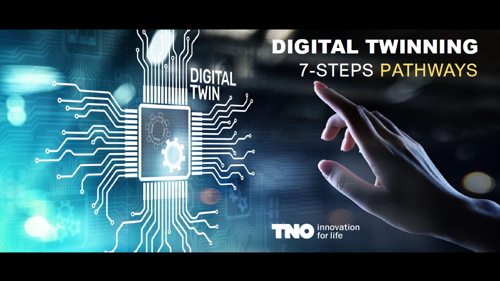

So, in that sense, we are going into these pathways now for the remainder of this presentation, and then we will take our break.

Отже, у цьому сенсі ми зараз розглядаємо ці шляхи до кінця цієї презентації, а потім зробимо перерву.

## Pathways:: dedicated core activity sets

https://youtu.be/8jOqF3v6Se8?t=2639

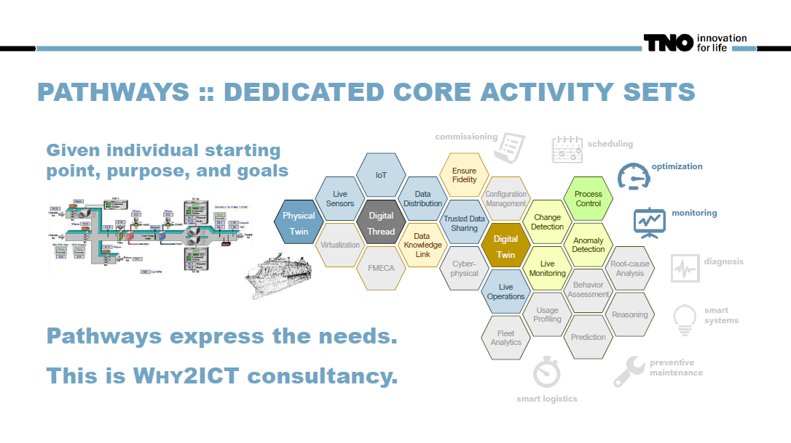

So, the pathways are basically the notion that, given a starting point,  purpose, and goals, I'm expressing the needs. Remember, again, this is  the consultancy part, so this is Why2ICT, you could argue, and I'm giving  you one example here: optimization monitoring. And you see that I grayed out many, many areas of this. So basically, I'm saying it might be that simple. So I gave you a big picture, it might be a scary one saying,  "whoa, I have to do all of that?" No, no, no, no, no, wait a second. You want a simple digital twin. You don't. But you will have to have live  operations. You will have to have live sensors, and they need to  connect. So this blue line, for example, is absolutely essential. No way around it if you want to do an optimization process. This one's  concurrently, no way around it. You have to have that. So this is the notion: a dedicated set of core activities for a certain purpose.

Отже, шляхи - це в основному уявлення про те, що, враховуючи початкову точку, мету та цілі, я висловлюю потреби. Знову ж таки, пам’ятайте, що це консультаційна частина, тож це Why2ICT, ви можете сперечатися, і я наведу вам тут один приклад: моніторинг і оптимізація. І ви бачите, що я затінив багато, багато областей цього. Тож, по суті, я кажу, що це може бути так просто. Тож я дав вам велику картину, яка може бути страшною: «Ого, я маю все це зробити?» Ні, ні, ні, ні, ні, зачекайте секундочку. Вам потрібен простий цифровий двійник. Ви не робите. Але вам доведеться робити живі операції. У вас повинні бути живі датчики, і вони повинні підключатися. Тож ця синя лінія, наприклад, абсолютно необхідна. Не обійтися, якщо ви хочете виконати процес оптимізації. Це одночасно, ніяк не обійтися. Ви повинні це мати. Отже, це поняття: виділений набір основних дій для певної мети.

## Pathway:: smart systems

https://youtu.be/8jOqF3v6Se8?t=2704

Now, let me give you some examples. Smart systems. Now, this is the big  one. Adaptive control based on live data. So the inner digital twin now  is part of the system and the process is alive. There's no human in the  loop and you see this is basically the full picture. There's very few  blocks missing here. So the pathway for smart systems is a large one.

Тепер дозвольте навести вам кілька прикладів. Розумні системи. Тепер, це великий. Адаптивне керування на основі живих даних. Таким чином, внутрішній цифровий близнюк тепер є частиною системи, і процес живий. У циклі немає людини, і ви бачите, що це в основному повна картина. Тут бракує дуже мало блоків. Отже, шлях до розумних систем великий.

## Pathway:: on the way to a product 

https://youtu.be/8jOqF3v6Se8?t=2734

Now, if we are just on the way to a product, so when the digital domain  comes first into being, this is model-based system engineering, this is  virtual design, this is simulation and analysis. When you are engaging  with the customer at the same time, it's about customer solutions,  experience, value, and use beforehand. This is another part of the  story, but in both cases, the pathway to success is a very small one.  You might go into great detail here, but you do not need live  operations, life monitoring data, all of that. No, you do it on that  side, it's fine.

Тепер, якщо ми тільки на шляху до продукту, тож коли цифровий домен з’являється вперше, це системна інженерія на основі моделей, це віртуальне проектування, це моделювання та аналіз. Коли ви одночасно взаємодієте з клієнтом, мова йде про клієнтські рішення, досвід, цінність і використання заздалегідь. Це інша частина історії, але в обох випадках шлях до успіху дуже маленький. Ви можете вдаватись у великі деталі, але вам не потрібні живі операції, дані моніторингу життя тощо. Ні, ти зроби це з того боку, це добре.

## Pathway:: bringing the system online 

https://youtu.be/8jOqF3v6Se8?t=2779

Now, the pathways for bringing systems online involve the challenge of  commissioning, especially imporatant in either large installations or in installations where you say this is very fine-tuned configuration fitting to the environment a lot of parameters in my system which really need to fit to the place where i install it. So this first time on is first time right um that is the commissioning problem and so here it's very important that on the one inside we have a match betwin the physical and the digital twin. And we look into the fitness of the physical twin its purpose. This is a verification and validation process or a life monitoring process where you bring it online step by step and you just check against steps. But in that sense the pathway of course has many parts already inside we need the virtual part we need the live feed but things like process control change detections and all of that not there because it's not running yet you are still building it up. but you might want to have that root cause analysis which wasn't present in the earlier picture because if something is not fitting if you do detect the anomaly and you say "no this is not how i specified the system i actually want to find out where did i go wrong and you have that part "

Тепер шляхи для переведення систем в режим онлайн пов’язані з проблемою введення в експлуатацію, особливо важливою для великих інсталяцій або інсталяцій, де ви кажете, що це дуже тонко налаштована конфігурація, що відповідає навколишньому середовищу, багато параметрів у моїй системі, які справді повинні відповідати місце, де я його встановлюю. Отже, цей перший раз увімкнено – це перший раз, ну це проблема введення в експлуатацію, і тому тут дуже важливо, щоб усередині ми мали відповідність між фізичним і цифровим двійниками. І ми розглядаємо придатність фізичного близнюка, його призначення. Це процес верифікації та підтвердження або процес моніторингу життя, де ви передаєте його в режим онлайн крок за кроком і просто перевіряєте кроки. Але в цьому сенсі шлях, звичайно, вже містить багато частин, нам потрібна віртуальна частина, нам потрібен живий канал, але таких речей, як виявлення змін у управлінні процесом і всього цього немає, тому що він ще не запущений, ви все ще його створюєте. але ви можете захотіти провести аналіз першопричини, якого не було на попередньому зображенні, тому що якщо щось не підходить, якщо ви виявите аномалію та скажете "ні, це не те, як я вказав систему, я насправді хочу з’ясувати де я помилився, і у вас є ця частина "

## Pathway:: understanding the install base 

https://youtu.be/8jOqF3v6Se8?t=2875

So, another pathway is the understanding of the installed base and the feedback towards engineering. Here, you see that the right side gets a  little bit stronger. So, dedicated analysis of an inner issue, but maybe in concert with understanding usage patterns and their effects. If  someone is constantly switching the equipment on and off, and by that,  they are using it in a different way, and they are wearing something out more strongly, that is something that you want to understand here.  Maybe effects due to configuration - hey, this special piece of my  configuration is absolutely fine, and that one is also absolutely fine,  but the moment someone builds a system with both of them at the same  time, things start to break - that kind of understanding so that you can do improvements or maybe understand what the next generation of needs  is. This is where other parts now of the digital twin are rising in  importance, so all of a sudden, as this usage profiling, you have fleet  analytics, these building blocks which are otherwise not necessarily  relevant.

Отже, ще один шлях — це розуміння встановленої бази та зворотний зв’язок з інженерами. Тут ви бачите, що права сторона стає трохи сильнішою. Отже, спеціальний аналіз внутрішньої проблеми, але, можливо, разом із розумінням моделей використання та їхніх наслідків. Якщо хтось постійно вмикає і вимикає техніку, і тим самим використовує її по-іншому, і щось сильніше зношує, це те, що тут потрібно розуміти. Можливо, ефекти через конфігурацію - ей, цей особливий фрагмент моєї конфігурації абсолютно правильний, і той також абсолютно правильний, але в той момент, коли хтось створює систему з обома ними одночасно, щось починає ламатися - такого роду розуміння, щоб ви могли вдосконалити або, можливо, зрозуміти, що таке наступне покоління потреб. Саме тут дедалі важливіші інші частини цифрового двійника, тож раптом, як це профілювання використання, ви маєте аналітику автопарку, ці будівельні блоки, які інакше не обов’язково є актуальними.

## Pathway:: live processes

https://youtu.be/8jOqF3v6Se8?t=2950

Another pathway, which we already discussed, is of course the one for  the life processes. This is what I spoke about earlier in detail when a  fast response is essential. So, live view on ongoing processes, control  based on live data, alerts on issues, and events of interest. The area  of scheduling, optimization, and monitoring that you detect something  requires an action has this pathway. 

Інший шлях, який ми вже обговорювали, це, звичайно, шлях для життєвих процесів. Це те, про що я детально говорив раніше, коли потрібна швидка відповідь. Отже, перегляд поточних процесів у реальному часі, контроль на основі даних у реальному часі, сповіщення про проблеми та цікаві події. Сфера планування, оптимізації та моніторингу, коли ви виявляєте, що щось вимагає дії, має цей шлях.

## Pathway:: guaranteed availability

https://youtu.be/8jOqF3v6Se8?t=2980

 And then we have the one for guaranteed availability, especially in  areas where unscheduled downtime is a big no-no. Minimal service times  with no breakdowns, everything at the right place on time if you have to do a service action. So nothing like a secondary visit where the  service person comes and says, "Yeah, I understand what's wrong, but I  don't have the parts." A non-acceptable message here. Prediction of  needed parts, needed actions, and the immediate expertise of the service teams. That, of course, means understanding causes and effects. So, the pathway now goes into this area of root cause analysis but also on  prediction so that this information comes in time.

Крім того, ми маємо гарантовану доступність, особливо в регіонах, де незаплановані простої є великим ні-ні. Мінімальний час обслуговування без поломок, все в потрібному місці вчасно, якщо вам потрібно виконати сервісне обслуговування. Тож нічого схожого на вторинний візит, коли приходить обслуговуючий персонал і каже: «Так, я розумію, що не так, але в мене немає запчастин». Тут неприйнятне повідомлення. Прогнозування необхідних частин, необхідних дій і негайна експертиза команд обслуговування. Це, звичайно, означає розуміння причин і наслідків. Таким чином, шлях зараз йде в цю сферу аналізу першопричин, а також на прогнозування, щоб ця інформація надходила вчасно.

## Digital twinning 7-steps readiness

https://youtu.be/8jOqF3v6Se8?t=3025

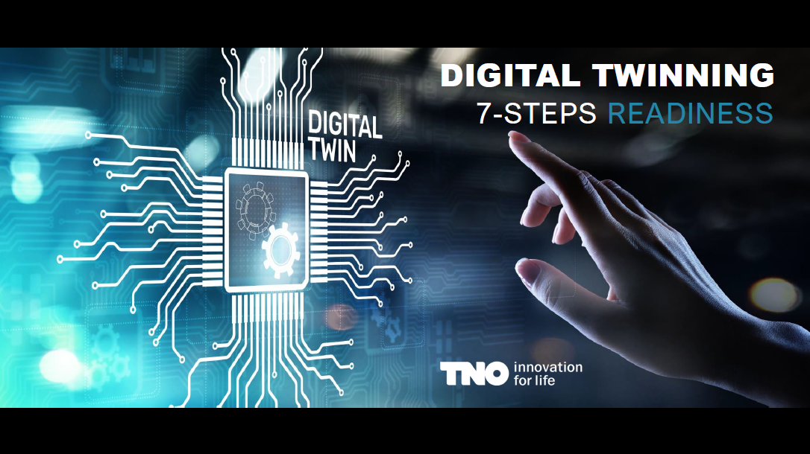

And with this, the pathways themselves are done. The understanding, as I said earlier, has detailed information available. But let me finish  this part of my presentation with those readiness thinking.

І на цьому самі шляхи закінчені. Розуміння, як я сказав раніше, має доступну детальну інформацію. Але дозвольте мені завершити цю частину моєї презентації роздумами про готовність.

## 7-steps ready for digital twin assessment

https://youtu.be/8jOqF3v6Se8?t=3045

So, because we have this area here where we say the seven steps, we want to understand how ready a company is. We basically want to say in each of these areas, how good are you? Now we streamlined this experience a  ittle bit, so instead of saying we want you to ask a company a set of  questions for all of these individual shapes, we are basically saying, now " 10 sections, and you see them here so Like life sensors, which is  the light blue, or the twin fidelity, which is the yellow one. For these ten sections and cultures, we basically want to assess the readiness of a company. And then we also have the pathways for the main purposes.  And then we can do it within the tooling and already set assessment." Of  course, you can always do a more detailed assessment by a safety  consultant. That is always an option, so you can say this customer  really needs to understand a certain part of this graph in detail, so we will look into this. Maybe also because in a certain innovation app,  you really have the expertise to go deep into something and you really  want to offer something here, absolutely fine. But based on the tooling  that we offer right now, we streamlined this a little bit, so we are  talking about these sections which you see highlighted here.

Отже, оскільки у нас є ця сфера, де ми говоримо про сім кроків, ми хочемо зрозуміти, наскільки готова компанія. По суті, ми хочемо сказати, наскільки ви хороші в кожній із цих сфер? Тепер ми трохи оптимізували цей досвід, тож замість того, щоб говорити, що ми хочемо, щоб ви поставили компанії набір запитань щодо всіх цих окремих форм, ми, по суті, говоримо, що тепер «10 розділів, і ви бачите їх тут, як датчики життя , який є світло-блакитним, або подвійну вірність, який є жовтим. Для цих десяти розділів і культур ми в основному хочемо оцінити готовність компанії. Крім того, у нас також є шляхи для основних цілей. А потім ми можемо зробити це в рамках інструментів і вже встановленої оцінки». Звичайно, ви завжди можете зробити більш детальну оцінку консультантом з безпеки. Це завжди варіант, тому ви можете сказати, що цьому клієнту дійсно потрібно детально зрозуміти певну частину цього графіка, тому ми розглянемо це. Можливо, також тому, що в певному інноваційному додатку ви справді маєте досвід, щоб щось глибоко досліджувати, і ви дійсно хочете щось запропонувати тут, абсолютно добре. Але на основі інструментів, які ми пропонуємо зараз, ми трохи оптимізували це, тому ми говоримо про ці розділи, які ви бачите тут виділеними.

## 7-steps ready for digital twin assessment (Delta anlysis)

https://youtu.be/8jOqF3v6Se8?t=3145

And then the idea is like this: we are matching the readiness levels, we have the requirements to succeed, and we're doing the delta analysis  with the assessment of the readiness level at company. So, we might, for  example, say, "Okay, there's a set of numbers popping up in these boxes, and there's a set of numbers popping up for the pathways that we  believe we need." And we just say, "Hey, wherever you are lower, you  have to do something." In that sense, that's simple. We are always using six comparable levels, so zero (absolutely nothing) to SPX (absolutely  everything) which is imaginable, and very often you will not need the  six.

І тоді ідея така: ми зіставляємо рівні готовності, у нас є вимоги до успіху, і ми робимо дельта-аналіз з оцінкою рівня готовності в компанії. Отже, ми можемо, наприклад, сказати: «Добре, у цих віконцях з’являється набір чисел, і є набір чисел, що з’являються для шляхів, які, як ми вважаємо, нам потрібні». І ми просто кажемо: «Гей, де б ти не був нижчим, ти повинен щось робити». У цьому сенсі все просто. Ми завжди використовуємо шість порівнянних рівнів, тому від нуля (абсолютно нічого) до SPX (абсолютно все), що можна собі уявити, і дуже часто вам не знадобляться шість.

## 7-steps assessment:: readiness levels

https://youtu.be/8jOqF3v6Se8?t=3202

And these levels, they are based on these digitalization levels which  were developed for the smart industry, and you have also seen this  picture yesterday already. So, the questions we are asking, the  information we are after is always similar to this. We are following  this, but of course, this is an overview picture here, and the moment  you go into a detailed picture, you can ask the questions more  specifically. But still, in terms of these levels, we basically say we  are following this idea from there is nothing towards everything is  already automated, live, and in an adaptive way.

І ці рівні, вони базуються на цих рівнях цифровізації, які були розроблені для розумної індустрії, і ви також бачили цю картину вчора. Отже, питання, які ми ставимо, інформація, яку ми шукаємо, завжди подібні до цього. Ми слідкуємо за цим, але, звичайно, це оглядове зображення, і коли ви переходите до детального зображення, ви можете поставити запитання більш конкретно. Але все ж, з точки зору цих рівнів, ми в основному кажемо, що ми дотримуємося цієї ідеї, оскільки немає нічого до того, що все вже автоматизоване, живе та адаптивне.

## 7-steps assessment:: readiness levels (2)

https://youtu.be/8jOqF3v6Se8?t=3247

So we see that there's a certain, let's say, order of things here, where you say you can understand that in the top two, if someone is in that  area, they are just not there yet. They really can't do a digital twin with just having some digital documents but no digital processes  whatsoever. But the moment you go to level two and three, we are in the  area where you say, "Okay, connected information, digital processes,  maybe already the live data view level three" This is where training starts, but this kind of twinning only gives you awareness, and then a human in the loop acts. With level 4, we are talking about twins where the  digital processes that consume live data come into place, so automation  becomes possible. So, response, recent business authoring processes,  meaning it could be that the service process is automatically triggered  by the twin, but then still the humans do it, but it could also be that  the twin itself is already taking actions, filling out order forms, or  whatever because it just knows what parts will be needed and things like this.

Таким чином, ми бачимо, що тут є певний, скажімо так, порядок речей, де ви можете зрозуміти, що в перших двох, якщо хтось є в цій області, вони просто ще не там. Вони справді не можуть створити цифрового двійника, маючи лише деякі цифрові документи, але без жодних цифрових процесів. Але в той момент, коли ви переходите на другий і третій рівень, ми знаходимося в зоні, де ви говорите: «Добре, підключена інформація, цифрові процеси, можливо, вже перегляд даних у реальному часі, рівень три». Саме тут починається навчання, але цей вид побратимства лише дає вам усвідомлення, а потім людина в циклі діє. З рівнем 4 ми говоримо про двійники, де цифрові процеси, які споживають живі дані, стають на місце, тому автоматизація стає можливою. Отже, відповідь, нещодавні бізнес-авторські процеси, це означає, що процес обслуговування автоматично запускається близнюком, але все одно це роблять люди, але також може бути, що сам близнюк уже виконує дії, заповнюючи форми замовлень , або що завгодно, тому що він просто знає, які частини знадобляться, тощо.

So, levels four, five, and six are the areas where automation becomes possible, with digital processes that consume live data in place. They might become predictive, which is then the next level, number five, or even fully automated, changing operations. The area of the twin which takes decisions, that is then level six. We always follow the idea of six levels like this.

Отже, четвертий, п’ятий і шостий рівні – це сфери, де стає можливою автоматизація з використанням цифрових процесів, які споживають живі дані. Вони можуть стати прогнозними, тобто наступним рівнем, номер п’ять, або навіть повністю автоматизованими змінними операціями. Область близнюка, яка приймає рішення, тобто шостий рівень. Ми завжди дотримуємося ідеї шести таких рівнів.

## 7-steps assessment:: attention points

https://youtu.be/8jOqF3v6Se8?t=3362

So, when you do an assessment following these ideas, there are a few attention points which I want to announce now. First, you can imagine when we are talking about all these different parts of the graph, from data to business processes, and so on, you see that the interview might need replies from several stakeholders. Now, it's absolutely possible that there's a CEO who is in every bit and detail of our company, and he can answer all of these questions. Absolutely fine, it's possible, of course. However, it might also be that that CEO says, "Okay, you know, I did the business analysis with you yesterday with this great tool from Laura, but these kinds of questions, I have no clue." So now, I'm calling in my lead people for these areas, and you all get half an hour with them because that's all it takes, and then the interview is over In that way.

Отже, коли ви проводите оцінювання за цими ідеями, є кілька моментів, які я хочу оголосити зараз. По-перше, ви можете собі уявити, коли ми говоримо про всі ці різні частини графіка, від даних до бізнес-процесів і так далі, ви бачите, що для інтерв’ю можуть знадобитися відповіді від кількох зацікавлених сторін. Цілком можливо, що є генеральний директор, який знає кожну деталь нашої компанії, і він може відповісти на всі ці запитання. Абсолютно добре, це можливо, звичайно. Однак також може бути так, що генеральний директор каже: «Добре, знаєте, я вчора провів з вами бізнес-аналіз за допомогою цього чудового інструменту від Лаури, але я не маю жодного уявлення про такі питання». Тож тепер я викликаю своїх провідних людей у цих областях, і ви всі отримаєте півгодини з ними, тому що це все, що потрібно, і тоді співбесіда закінчується. Таким чином. 

Another attention point we observe is a trend to overestimations in self-assessments. So, principally speaking, this could be done without a consultant. You could just say, "Okay, hey, these are example areas. What do you think? Where are you?" People like your own experience consultants find that, "Hey, if I look at this, I would have given you a lower number."

Іншим моментом, який ми спостерігаємо, є тенденція до завищення самооцінок. Тож, принципово кажучи, це можна зробити без консультанта. Ви можете просто сказати: «Добре, привіт, це приклади областей. Що ви думаєте? Де ви?» Такі люди, як консультанти з вашого власного досвіду, вважають, що «Гей, якщо я подивлюся на це, я б дав вам менше число».

So in that sense, we caution everyone against an overestimation here.  Take it with a grain of salt and maybe err on the cautious side a little bit. On the other hand, in this assessment, we check against the  minimal readiness level to succeed. That is not the statement that  having more would not be better. So, you can easily imagine that there  is a point where you say, "Now I have a running digital twin, and it's  running on that level." But, for example, it's just showing what is  there now. It did not make the step from four to five, it did not go too predictive. Now, if it would, the business success might actually be  far greater, but it is a success already on level four. So, in that  sense, the check we are proposing here is against the minimum readiness  level. So, whenever our check says you are not there, we really believe now the company needs to make a step. But, as a consultant in the Digital  Innovation Hub, I still say the level for optimal benefits is often one  higher, normally only one. So, still think about it. Just the fact that  we give you a nice presentation and a tool and everything would never  ever mean you stop thinking. So, that is the point where people come in, experts come in, and I believe this is the game the Digital Innovation  Hubs play best. So, I wish you best success with that.

Тож у цьому сенсі ми застерігаємо всіх від переоцінки. Поставтеся до цього з недовірою і, можливо, трохи обережніше. З іншого боку, у цій оцінці ми перевіряємо мінімальний рівень готовності до успіху. Це не означає, що мати більше не буде кращим. Отже, ви можете легко уявити, що є момент, коли ви говорите: «Тепер у мене працює цифровий двійник, і він працює на такому рівні». Але, наприклад, це просто показ того, що є зараз. Не зробив крок від чотирьох до п’ятірки, не вийшов надто прогнозним. Якби це було так, бізнес-успіх міг би бути набагато більшим, але це успіх уже на четвертому рівні. Отже, у цьому сенсі перевірка, яку ми тут пропонуємо, не відповідає мінімальному рівню готовності. Тому щоразу, коли наша перевірка показує, що вас немає, ми справді віримо, що зараз компанії потрібно зробити крок. Але, як консультант Центру цифрових інновацій, я все ще кажу, що рівень оптимальних переваг часто на один вищий, зазвичай лише один. Так що, все ж подумайте про це. Сам факт того, що ми пропонуємо вам гарну презентацію, інструмент і все, ніколи не означає, що ви перестаєте думати. Отже, це момент, куди приходять люди, приходять експерти, і я вважаю, що це гра, в яку цифрові інноваційні центри грають найкраще. Тож я бажаю вам успіхів у цьому.

## Further information

https://youtu.be/8jOqF3v6Se8?t=3562

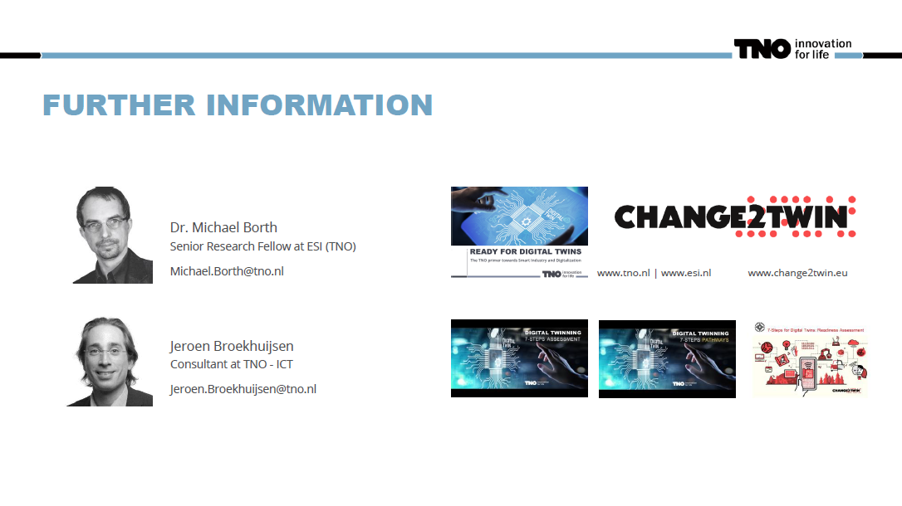

Um, we will take a break now, and then we will actually see the tool a  little bit, and then I will also give you more detailed information. So, if there are any questions, I'm the one here on top, aboard. Of course, you can get in touch with me if there are any questions. I'm working  for Easy, which is a subdivision, a joint innovation center under the  umbrella of TMO. When you go to our website, Easy and Health, for  example, you can also easily find more information about what we think  about it. But remember, we are a research innovation center, not a  general innovation hub. However, Jeroon, of course, you got to know  him yesterday, he is a consultant of us in the area of ICT. So, the  process of doing consultancy with this work is something where he can  give excellent advice upon. But in terms of material, and I will show it to you after a short break here, we still basically have three things.  Now, on the one hand, we have the tool itself.

Гм, зараз ми зробимо перерву, а потім трішки ознайомимося з інструментом, а потім я також надам вам більш детальну інформацію. Отже, якщо є якісь запитання, я тут зверху, на борту. Звичайно, ви можете зв'язатися зі мною, якщо виникнуть запитання. Я працюю в Easy, який є підрозділом, спільним інноваційним центром під егідою TMO. Коли ви заходите на наш веб-сайт, наприклад, Easy and Health, ви також можете легко знайти більше інформації про те, що ми думаємо про це. Але пам’ятайте, що ми дослідницький інноваційний центр, а не загальний інноваційний центр. Але Джерун, звичайно, ви з ним познайомилися вчора, він наш консультант у сфері ІКТ. Отже, процес консультування з цією роботою – це те, про що він може дати чудову пораду. Але з точки зору матеріалу, і я покажу його вам після короткої перерви тут, у нас все ще є три речі. Тепер, з одного боку, ми маємо сам інструмент.

So, similar to what Laura showed you yesterday, we have an assessment tool. Next to that, there are two presentations here: the assessment presentation and the pathway presentation. They have different content, and I will show it to you a little bit later. So, there is the last part of my time slot where I show you basically which material is available to you. But the idea here is that the pathway presentation explains to you our thinking about the numbers on these pathways. The moment you say you are assessing a company and you have the feeling that none of the pathways that we already prepared is suitable for that company, they want a different digital twin. This is basically the statement you're making; they are more unique than our pre-compiled cases. Then you're working on that level of that pathways. You are finding out new numbers of what these guys might need.

Отже, подібно до того, що Лаура показала вам учора, у нас є інструмент оцінювання. Крім того, тут є дві презентації: презентація оцінювання та презентація шляху. Вони різного змісту, і я покажу його вам трохи пізніше. Отже, є остання частина мого тимчасового інтервалу, де я покажу вам, який матеріал доступний для вас. Але ідея полягає в тому, що презентація шляхів пояснює вам наше мислення про числа на цих шляхах. У той момент, коли ви говорите, що оцінюєте компанію, і у вас виникає відчуття, що жоден із підготовлених нами шляхів не підходить для цієї компанії, вони хочуть іншого цифрового двійника. Це в основному твердження, яке ви робите; вони більш унікальні, ніж наші попередньо скомпільовані випадки. Тоді ви працюєте на цьому рівні цих шляхів. Ви дізнаєтеся нові цифри того, що може знадобитися цим хлопцям.

Now, the other presentation, the seven steps assessment presentation, is the one that basically tells you the kind of concern which is in that area. So, when you're assessing this, this is the kind of topic you are talking about, and this is the kind of question you are asking to assess if someone is on that level or not, and I will show you that a little bit. It makes perfect sense, for example, to have the assessment presentation open while you're asking questions and then filling in the answers in the tool. So, just as a way of working, if you need other numbers, the pathway presentation gives you some pointers from that one.

And with this, allow me to call a break. I talk for an hour.

Тепер інша презентація, презентація оцінки з семи кроків, це та, яка в основному розповідає вам про те, яка проблема є у цій сфері. Отже, коли ви оцінюєте це, це тема, про яку ви говорите, і це тип запитання, яке ви ставите, щоб оцінити, чи хтось на цьому рівні чи ні, і я покажу вам це трохи . Цілком розумно, наприклад, відкрити презентацію оцінювання, коли ви ставите запитання, а потім заповнюєте відповіді в інструменті. Отже, як спосіб роботи, якщо вам потрібні інші цифри, презентація шляху дає вам деякі вказівки з цього.

І на цьому дозвольте мені оголосити перерву. Розмовляю годину.