# Сім кроків до цифрового двійника

Коротка версія нотаток по вебінарам

- [Запис вебінару Seven steps to digital twin - talk by Michael Borth (TNO/ESI) 15 січ. 2021](https://youtu.be/8jOqF3v6Se8)
- [Презентація](https://fundingbox-spaces.s3-eu-central-1.amazonaws.com/fmartineau/hF5SooDPqf/DAY-2---Change2Twin-DIHs-Webinar---2--Digital-Twin-Readiness-Assessment---MBorth.pdf)
- [Усі нотатки](SevenStepsToDigitalTwin.md)

## Ми будуємо дорожню карту: 7 кроків (але шлях не для всіх однаковий)

https://youtu.be/8jOqF3v6Se8?t=1018

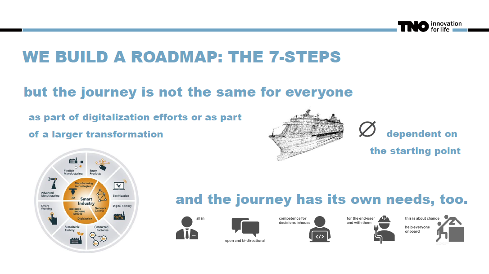

Дорожня карта — схожі кроки, але різний шлях. Відправною точкою також є дуже різні компанії:

- можуть бути інженерні моделі систем, які ви хочете контролювати, тоді це буде відносно легка трансформація, щоб перейти до цифрового двійника, який стежить за ними, тому що ви маєте повне розуміння того, як ця система працює в обчислюваній формі 
- нічого немає, треба починтати з усього, від віртуального дизайну до цифрового двійника, 

Ця подорож має свої потреби, деякі з них:

- підтримка керівництва
- відкрите і спрямоване спілкування
- компетентність для прийняття рішень всередині компанії: має бути хтось, хто примйає рішення щодо виконання 
- враховувати потреби кінцевого користувача рішення
- допомога усім причетним до рішення

## Створення цифрових двійників за сім кроків (Крок 1)

https://youtu.be/8jOqF3v6Se8?t=1338

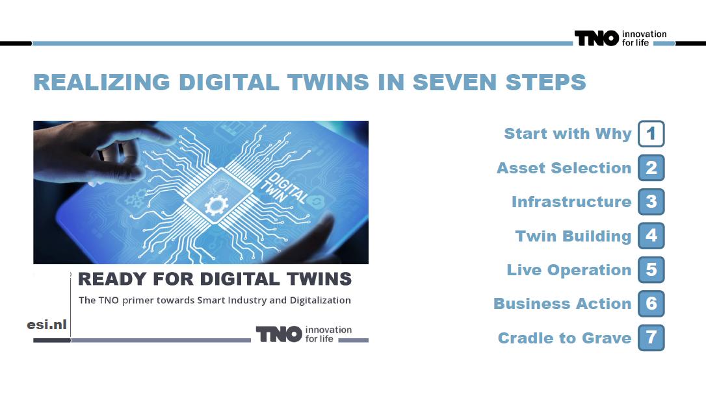

Починається з відповіді на питання "Навіщо", можна подивитися [цей вебінар](DigitalTwinsVebinar.md)

## Вибір активів: фізичний двійник (Крок 2)

https://youtu.be/8jOqF3v6Se8?t=1393

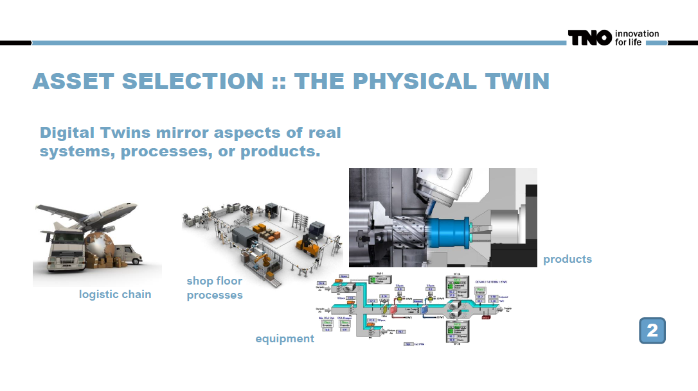

Треба вибрати той актив, який необхідно відзеркалити:

- реальних систем
- процесів 
- обладнання
- продуктів

Треба вибрати аспекти активу, які відображають цифрові двійники, для чого. Можна подивитися [цей вебінар](DigitalTwinsVebinar.md)

Вибір активу з урахуванням:

- Критичність і вплив на бізнес
   - Наскільки важлива система для основних процесів?
   - Наскільки дорого обходиться будь-який нещасний випадок?
- Часова критичність інформаційних потреб
   - Де найбільші переваги розуміння майже в реальному часі?
   - Які процеси найбільше виграють від живої бізнес-аналітики?
- Включення нового інтелекту управління
   - Де фокусні точки нових розумних сервісів і процесів?
   - Які системи повинні стати розумними?

- Бізнес і процеси
   - Залежність процесів від своєчасної інформації
   - Переваги від швидшої інформації
   - Витрати на пропущені терміни надання інформації
- Охорона активів
   - Імовірність впливу
   - Витрати на простої | невдачі | відхилення процесу
- Digital Twin як можливість для бізнесу
   - Інформаційні вимоги до нових послуг
   - Інформаційні вимоги управління новою системою

Ви готові вибрати свій актив? Впевненість у прийнятті рішень:

0: не може прийняти зважене рішення

1: має відчуття з цього приводу

2: має частини цієї головоломки

3: має номери

4: рішення щодо розуміння на основі даних

5: рішення про прогноз майбутніх потреб

6: рішення в рамках автоматизованих процесів

## Реалізація цифрових двійників (кроки 3,4)

https://youtu.be/8jOqF3v6Se8?t=1463

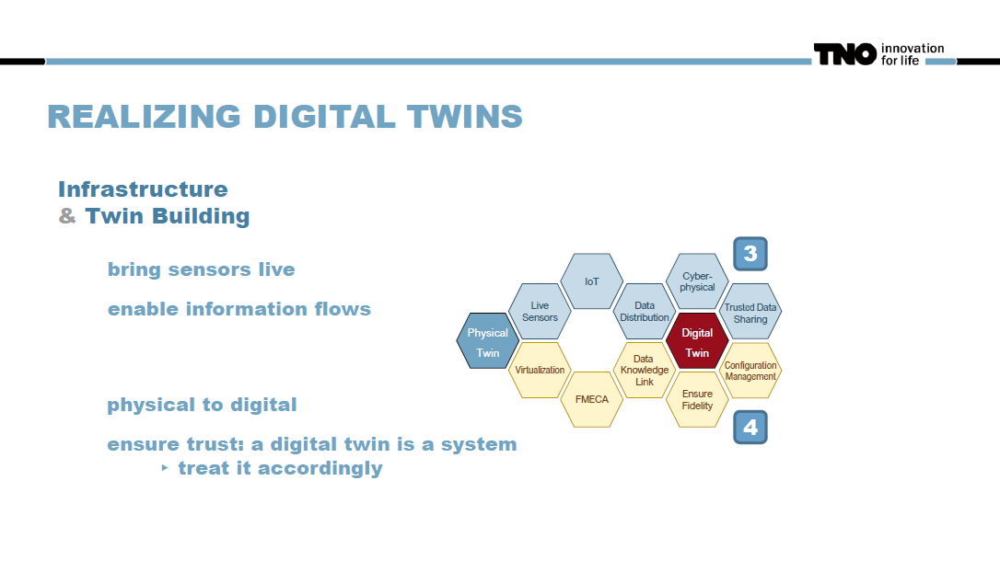

Є два аспекти побудови: 

- побудова інфраструктури та транспортування даних (крок 3) 
- побудова двійника (крок 4). 

Інфраструктура стосується даних, що надходять від фізичного двійника до цифрового, де вибираються необхідні частини:

- поставити датчики, реалізувати вхідні потоки даних від фізичного двійника - обов'язково
- застосувати IoT, потоку даних до цифрового двійника - обов'язково
- реалізувати підключення до баз даних, об’єднання її з іншою інформацією (не обов'язково)
- зробити кіберфізичне підключення до інших баз даних () 
- реалізувати розповсюдження даних з іншими, захист даних, довірча віддача даних (не обов'язково)

Побудова двійника передбачає вибір необхідних частин:

- віртуалізація - побудова моделі для відображення аспектів фізичної моделі
- реалізувати FMECA (Failure Modes, Effects, and Criticality Analysis) — це метод, який використовується в розробці та управлінні якістю для виявлення й оцінки потенційних збоїв або несправностей у системі чи продукті. Це може допомогти виявити й усунути потенційні збої до їх виникнення, покращуючи безпеку, якість і загальну продуктивність системи.
- Data Knowledge Link - Посилання на знання даних, використання моделі та FMECA?   
- Ensure Fidelity - забезпечити довіру персоналу до цифрового двійника
- Configuration Management - забезпечити керування конфігурацією, можливість зміни системи при зміні в фізичному двійнику 

### Підключення датчиків до системи

- Підключення датчиків до системи
  - Для контролю часто використовуються наявні датчики, які можуть вже покривати значну частину потреб, проте можуть бути додатково доповнені для вирішення завдання

#### Оцінка

Активуйте датчики (Bring sensors live)

- Покриття датчиками, яке відповідає поставленій задачі
- Точність та часова роздільна здатність датчиків, що відповідає поставленій задачі
- Якість даних: співвідношення сигнал/шум та відсоток пропущених даних
- Механізми моніторингу якості даних в реальному часі
- Чітка відповідальність та процеси для забезпечення якості даних
- Розширюваність: зусилля для додавання / зміни датчиків пізніше
- Можливість покриття майбутніх завдань
- Механізми Інтернету речей (IoT) на пристроях та рівні edge належним чином налаштовані
- Надійність механізмів Інтернету речей (IoT)

Are you ready to tap into your sensors? Technology and process readiness

- 0: no sensor / process data collected
- 1: sensor / process data stored
- 2: data from different sources aligned
- 3: live view is possible (dashboards, …)
- 4: annotations for understanding & quality in place
- 5: outlook on future data generation exists
- 6: automated processes ready to bring sensors live

### Забезпечення потоку інформації

Забезпечення потоку інформації

- Правильні дані в правильному місці в правильний час
- Архітектури обміну інформацією та даними
- Служби моніторингу
- Захист конфіденційної інформації

Enable information flows

- Data distribution mechanisms in place
- Timeliness of data distribution
- Data storage suitable for application needs
- Data storage suitable for legal requirements
- Complex event processing across data streams
- Link towards information systems
- Clear responsibility and processes for data governance
- Mechanisms to monitor and ensure data consistency
- Data sharing between parties and across purposes
- Protection of private or sensible data

Забезпечити потік інформації

- Механізми розподілу даних на місці
- Своєчасність розподілу даних
- Зберігання даних, яке відповідає потребам додатку
- Зберігання даних, яке відповідає правовим вимогам
- Обробка складних подій по потоках даних
- Зв'язок з інформаційними системами
- Чітка відповідальність та процеси управління даними
- Механізми моніторингу та забезпечення консистентності даних
- Обмін даними між сторонами та для різних цілей
- Захист приватних або конфіденційних даних

## Експлуатація цифрових близнюків (5,6)

https://youtu.be/8jOqF3v6Se8?t=1853

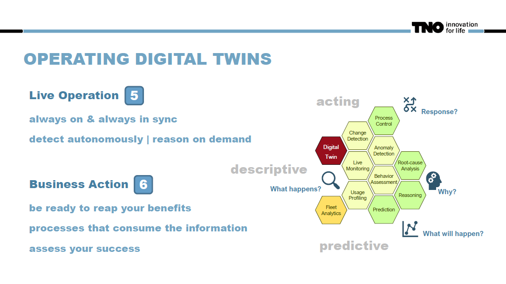

5 Робота в реальному часі (Live Operation)

- Change detection - реалізувати виявлення змін
- Live Monitoring - зробити пожиттєвий моніторинг  
- Usage Profiling - зробити Профілювання використання
- Anomaly Detection - зробити виявлення аномалій
- Behavior Assessment - Оцінювання поведінки

6 Бізнес дії (Business Action)

- Process Control - реалізувати керування технологічним процесом 
- Root-cause Analysis - реалізувати аналіз першопричини аномалій, "чому це сталося"?  
- Reasoning - реалізувати прийняття рішень
- Prediction - реалізувати прогнозування

## Експлуатація цифрових близнюків (5,6) 2

https://youtu.be/8jOqF3v6Se8?t=2173

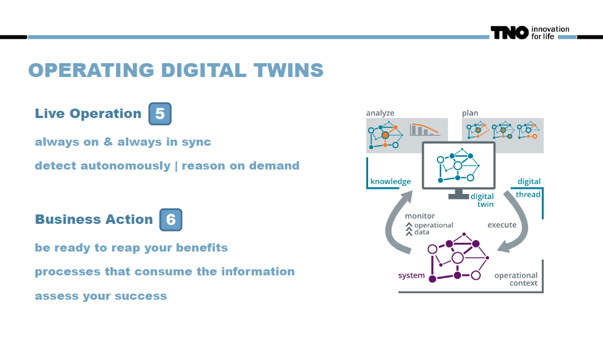

## Зміни трапляються (7)

https://youtu.be/8jOqF3v6Se8?t=2309

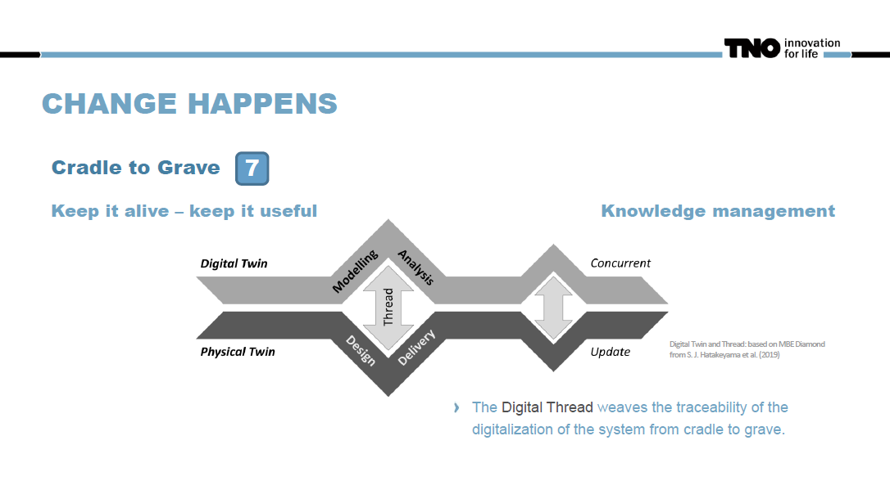

7 Від колиски до могили (Cradle to Grave)

Цифрова нитка (Digital Thread) плете відстежуваність оцифровування системи від колиски до могили.

Підтримуйте його, зберігайте його корисним. Зміни  в реальному активі повинні відображатися в двійнику. Управління знаннями. Вся історія змін зберігається в цифровому двійнику. 

## Цифровий двійник: основна діяльність

https://youtu.be/8jOqF3v6Se8?t=2494

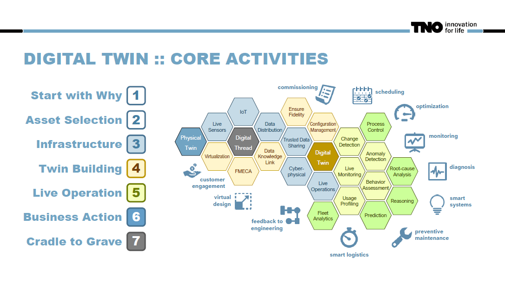

## Change2twin підтримка для DIH

https://youtu.be/8jOqF3v6Se8?t=2549

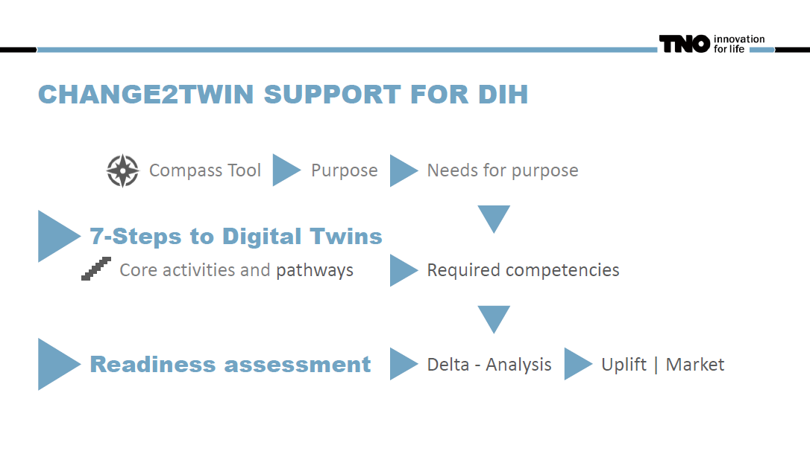

## Шлях: розумні системи

https://youtu.be/8jOqF3v6Se8?t=2704

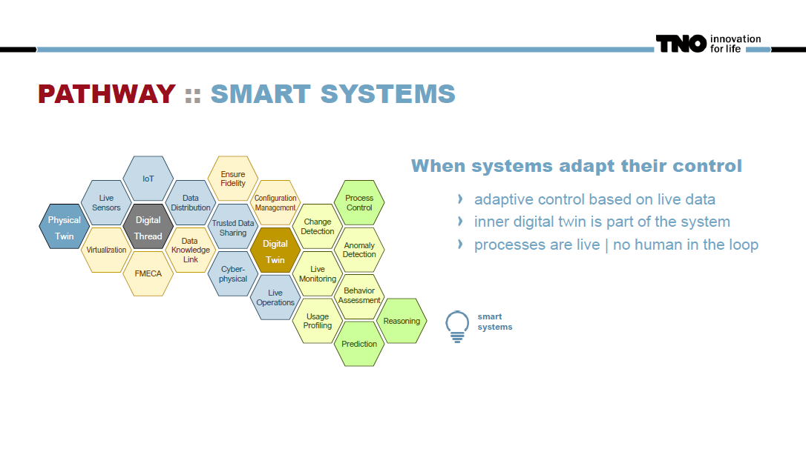

Розумні системи - адаптивне керування на основі живих даних. У контурі немає людини, і в шляху практично усі блоки.

Коли системи адаптують своє керування

- адаптивне керування на основі живих даних
- внутрішній цифровий двійник є частиною системи
- процеси живі | немає людини в контурі

## Шлях: на шляху до продукту

https://youtu.be/8jOqF3v6Se8?t=2734

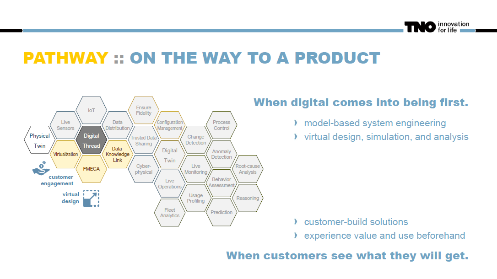

Коли спочатку з’являється цифрове.

- системна інженерія на основі моделі
- віртуальне проектування, імітаційне моделювання та аналіз

Коли клієнти бачать, що вони отримають.

- рішення створені для клієнта
- випробувати цінність і використовувати заздалегідь

## Шлях: переведення системи в режим онлайн

https://youtu.be/8jOqF3v6Se8?t=2779

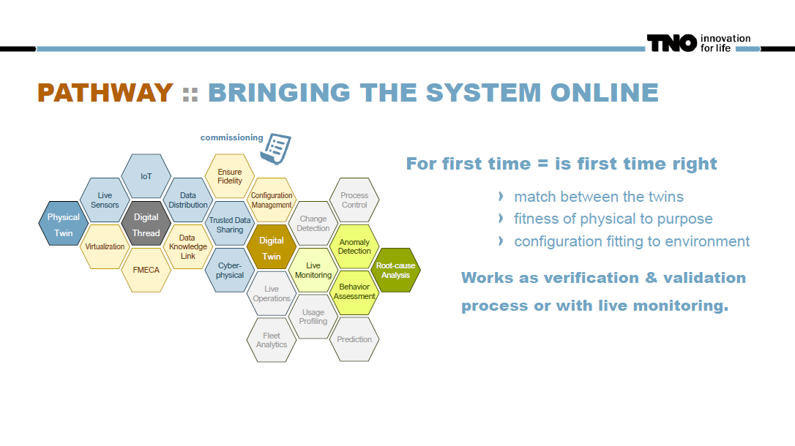

перший раз = перший раз правильно 

- поєднання між близнюками 
- пристосування фізичного активу до цілі 
- адаптація конфігурації до середовища 

Працює як процес перевірки та підтвердження або з моніторингом у реальному часі.

Шляхи для переведення систем в режим онлайн пов’язані з проблемою введення в експлуатацію, особливо важливою для великих інсталяцій або інсталяцій, де дуже тонко налаштована конфігурація, що відповідає навколишньому середовищу з багатьма параметрами. Отже, цей перший раз увімкнено – це перший раз правильно. Тут дуже важливо, щоб усередині ми мали відповідність між фізичним і цифровим двійниками. І ми розглядаємо придатність фізичного двійника до його призначення. Це процес верифікації та підтвердження або процес моніторингу життя, де ви передаєте його в режим онлайн крок за кроком і просто перевіряєте кроки. 

Але в цьому сенсі шлях, звичайно, вже містить багато частин, нам потрібна віртуальна частина, нам потрібен живий канал, але таких речей, як виявлення змін у управлінні процесом і всього цього немає, тому що він ще не запущений, ви все ще його створюєте. Але ви можете захотіти провести аналіз першопричини, якого не було у попередньому випадку, тому що якщо щось не підходить, якщо ви виявите аномалію та скажете "ні, це не те, як я вказав систему, я насправді хочу з’ясувати де я помилився", і у вас є ця частина

## Шлях: розуміння бази встановлення

https://youtu.be/8jOqF3v6Se8?t=2875

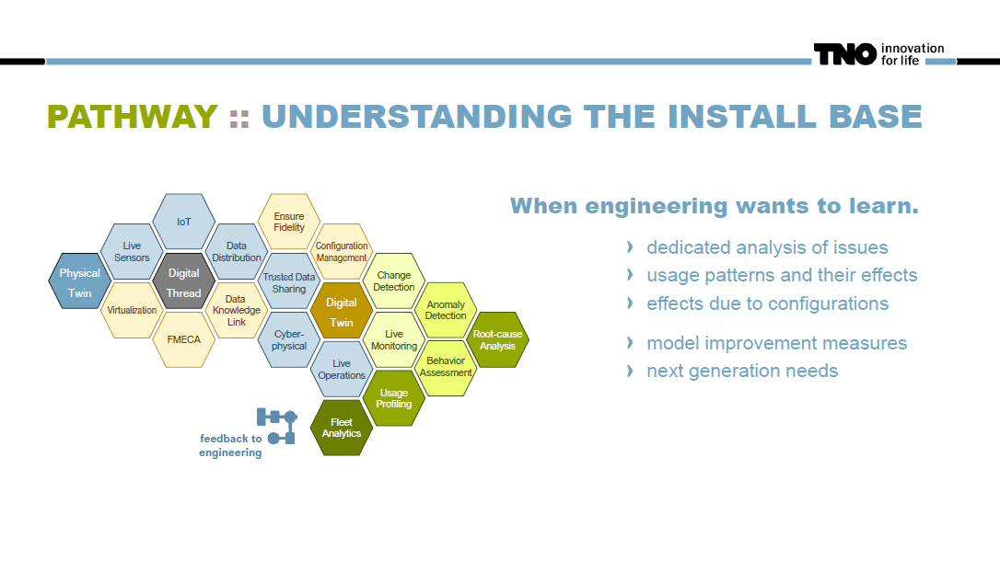

Коли інженерія хоче вчитися.

- цілеспрямований аналіз питань
- шаблони використання та їх вплив
- ефекти через конфігурації
- заходи щодо вдосконалення моделі
- потреби наступного покоління

Отже, ще один шлях — це розуміння встановленої бази та зворотний зв’язок з інженерами. Тут ви бачите, що права сторона стає трохи сильнішою. Спеціальний аналіз внутрішньої проблеми, але, можливо, разом із розумінням моделей використання та їхніх наслідків. Якщо хтось постійно вмикає і вимикає техніку, і тим самим використовує її по-іншому, і щось сильніше зношує, це те, що тут потрібно розуміти. Виявлення ефектів через конфігурацію - в той момент, коли хтось створює систему з обома правильними конфігураціями одночасно, щось починає ламатися.  Такого роду розуміння, щоб ви могли вдосконалити або, можливо, зрозуміти, що таке наступне покоління потреб. 

## Шлях: живі процеси

https://youtu.be/8jOqF3v6Se8?t=2950

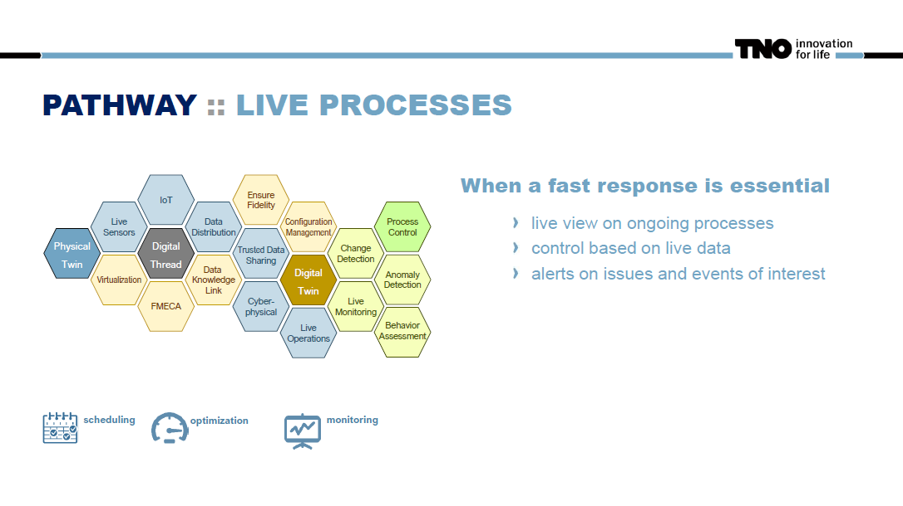

Коли важлива швидка відповідь

- живий перегляд поточних процесів
- контроль на основі живих даних
- сповіщення про проблеми та події, що цікавлять

Інший шлях, який ми вже обговорювали, це, звичайно, шлях для життєвих процесів. Це те, про що я детально говорив раніше, коли потрібна швидка відповідь. Отже, перегляд поточних процесів у реальному часі, контроль на основі даних у реальному часі, сповіщення про проблеми та цікаві події. Сфера планування, оптимізації та моніторингу, коли ви виявляєте, що щось вимагає дії.

## Шлях : гарантована доступність

https://youtu.be/8jOqF3v6Se8?t=2980

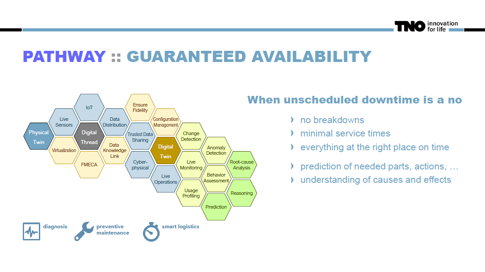

 Коли треба позбутися позапланових простоїв

- відсутність поломок
- мінімальний час обслуговування
- все в потрібному місці вчасно
- передбачення необхідних запчастин, дій, …
- розуміння причин і наслідків

Крім того, ми маємо гарантовану доступність, особливо в областях, де незаплановані простої є великою проблемою. Мінімальний час обслуговування без поломок, все в потрібному місці вчасно, якщо вам потрібно виконати сервісне обслуговування. Обслуговуючий персонал приходить з потрібними запчастинами, робить необхідні дії і робить негайну експертизу. Це, звичайно, означає розуміння причин і наслідків. Таким чином, шлях зараз йде в цю сферу аналізу першопричин, а також на прогнозування, щоб ця інформація надходила вчасно.

## Оцінка готовності 7-крокової розробки цифрових двійників

https://youtu.be/8jOqF3v6Se8?t=3045

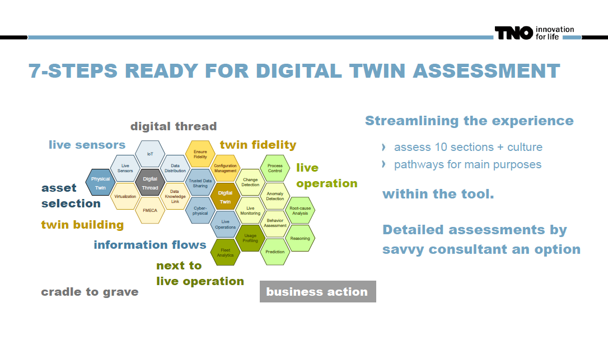

Спрощення роботи в інструменті:

- оцінити 10 розділів + культура
- шляхи за основними цілями

Детальна оцінка досвідченим консультантом як варіант

- asset selection (вибір активів)
- live sensors (датчики)
- twin building (побудова двійника)
- twin fidelity (точність двійника)
- information flows (інформаційні потоки)
- next to live operation ()
- business action (бізнес дії)
- cradle to grave (від колиски до могили)
- live operation (жива робота)
- digital thread (цифрова нитка)

Отже, оскільки у нас є ця сфера, де ми говоримо про сім кроків, ми хочемо зрозуміти, наскільки готова компанія. По суті, ми хочемо сказати, наскільки ви хороші в кожній із цих сфер? Тепер ми трохи оптимізували цей досвід, тож замість того, щоб говорити, що ми хочемо, щоб ви поставили компанії набір запитань щодо всіх цих окремих форм, ми, по суті, говоримо, що тепер. Для цих десяти розділів і культури ми в основному хочемо оцінити готовність компанії. Крім того, у нас також є шляхи для основних цілей. А потім ми можемо зробити це в рамках інструментів і вже встановленої оцінки.

Але на основі інструментів, які ми пропонуємо зараз, ми трохи оптимізували це, тому ми говоримо про ці розділи, які ви бачите тут виділеними.

## Оцінка готовності 7-крокової розробки цифрових двійників (Delta anlysis)

https://youtu.be/8jOqF3v6Se8?t=3145

And then the idea is like this: we are matching the readiness levels, we have the requirements to succeed, and we're doing the delta analysis  with the assessment of the readiness level at company. So, we might, for  example, say, "Okay, there's a set of numbers popping up in these boxes, and there's a set of numbers popping up for the pathways that we  believe we need." And we just say, "Hey, wherever you are lower, you  have to do something." In that sense, that's simple. We are always using six comparable levels, so zero (absolutely nothing) to SPX (absolutely  everything) which is imaginable, and very often you will not need the  six.

І тоді ідея така: ми зіставляємо рівні готовності, у нас є вимоги до успіху, і ми робимо дельта-аналіз з оцінкою рівня готовності в компанії. Отже, ми можемо, наприклад, сказати: «Добре, у цих віконцях з’являється набір чисел, і є набір чисел, що з’являються для шляхів, які, як ми вважаємо, нам потрібні». І ми просто кажемо: «Гей, де б ти не був нижчим, ти повинен щось робити». У цьому сенсі все просто. Ми завжди використовуємо шість порівнянних рівнів, тому від нуля (абсолютно нічого) до SPX (абсолютно все), що можна собі уявити, і дуже часто вам не знадобляться шість.

## Оцінка 7 кроків: рівні готовності

https://youtu.be/8jOqF3v6Se8?t=3202

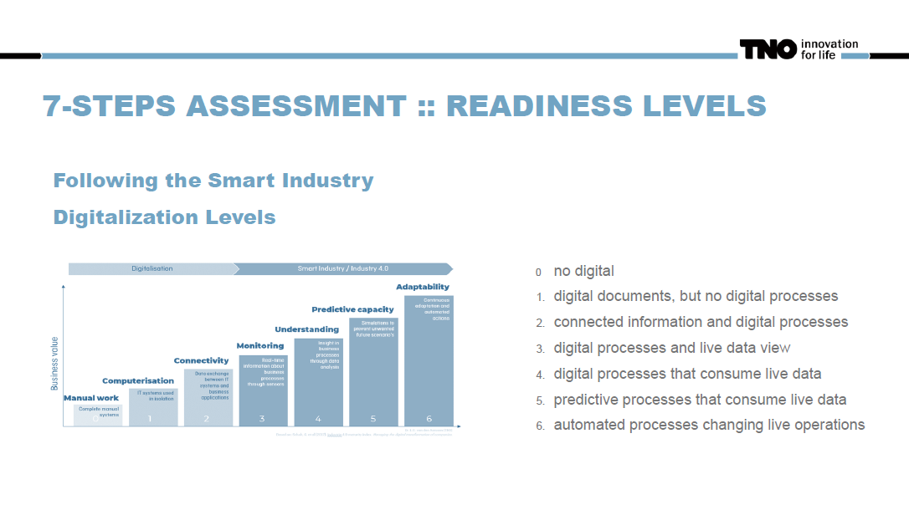

І ці рівні, вони базуються на цих рівнях цифровізації, які були розроблені для розумної індустрії, і ви також бачили цю картину вчора. Отже, питання, які ми ставимо, інформація, яку ми шукаємо, завжди подібні до цього. Ми слідкуємо за цим, але, звичайно, це оглядове зображення, і коли ви переходите до детального зображення, ви можете поставити запитання більш конкретно. Але все ж, з точки зору цих рівнів, ми в основному кажемо, що ми дотримуємося цієї ідеї, оскільки немає нічого до того, що все вже автоматизоване, живе та адаптивне.

## Оцінка 7 кроків : рівні готовності (2)

https://youtu.be/8jOqF3v6Se8?t=3247

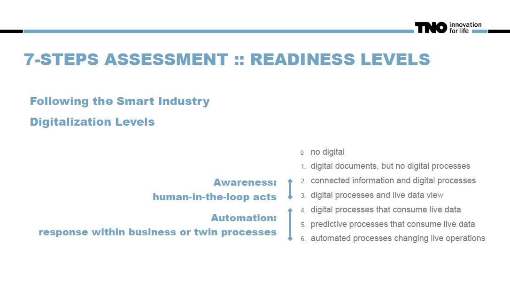

Таким чином, ми бачимо, що тут є певний, скажімо так, порядок речей, де ви можете зрозуміти, що в перших двох, якщо хтось є в цій області, вони просто ще не там. Вони справді не можуть створити цифрового двійника, маючи лише деякі цифрові документи, але без жодних цифрових процесів. Але в той момент, коли ви переходите на другий і третій рівень, ми знаходимося в зоні, де ви говорите: «Добре, підключена інформація, цифрові процеси, можливо, вже перегляд даних у реальному часі, рівень три». Саме тут починається навчання, але цей вид побратимства лише дає вам усвідомлення, а потім людина в циклі діє. З рівнем 4 ми говоримо про двійники, де цифрові процеси, які споживають живі дані, стають на місце, тому автоматизація стає можливою. Отже, відповідь, нещодавні бізнес-авторські процеси, це означає, що процес обслуговування автоматично запускається близнюком, але все одно це роблять люди, але також може бути, що сам близнюк уже виконує дії, заповнюючи форми замовлень , або що завгодно, тому що він просто знає, які частини знадобляться, тощо.

Отже, четвертий, п’ятий і шостий рівні – це сфери, де стає можливою автоматизація з використанням цифрових процесів, які споживають живі дані. Вони можуть стати прогнозними, тобто наступним рівнем, номер п’ять, або навіть повністю автоматизованими змінними операціями. Область близнюка, яка приймає рішення, тобто шостий рівень. Ми завжди дотримуємося ідеї шести таких рівнів.

## Оцінка 7 кроків : точки уваги

https://youtu.be/8jOqF3v6Se8?t=3362

Отже, коли ви проводите оцінювання за цими ідеями, є кілька моментів, які я хочу оголосити зараз. По-перше, ви можете собі уявити, коли ми говоримо про всі ці різні частини графіка, від даних до бізнес-процесів і так далі, ви бачите, що для інтерв’ю можуть знадобитися відповіді від кількох зацікавлених сторін. Цілком можливо, що є генеральний директор, який знає кожну деталь нашої компанії, і він може відповісти на всі ці запитання. Абсолютно добре, це можливо, звичайно. Однак також може бути так, що генеральний директор каже: «Добре, знаєте, я вчора провів з вами бізнес-аналіз за допомогою цього чудового інструменту від Лаури, але я не маю жодного уявлення про такі питання». Тож тепер я викликаю своїх провідних людей у цих областях, і ви всі отримаєте півгодини з ними, тому що це все, що потрібно, і тоді співбесіда закінчується. Таким чином. 

Іншим моментом, який ми спостерігаємо, є тенденція до завищення самооцінок. Тож, принципово кажучи, це можна зробити без консультанта. Ви можете просто сказати: «Добре, привіт, це приклади областей. Що ви думаєте? Де ви?» Такі люди, як консультанти з вашого власного досвіду, вважають, що «Гей, якщо я подивлюся на це, я б дав вам менше число».

Тож у цьому сенсі ми застерігаємо всіх від переоцінки. Поставтеся до цього з недовірою і, можливо, трохи обережніше. З іншого боку, у цій оцінці ми перевіряємо мінімальний рівень готовності до успіху. Це не означає, що мати більше не буде кращим. Отже, ви можете легко уявити, що є момент, коли ви говорите: «Тепер у мене працює цифровий двійник, і він працює на такому рівні». Але, наприклад, це просто показ того, що є зараз. Не зробив крок від чотирьох до п’ятірки, не вийшов надто прогнозним. Якби це було так, бізнес-успіх міг би бути набагато більшим, але це успіх уже на четвертому рівні. Отже, у цьому сенсі перевірка, яку ми тут пропонуємо, не відповідає мінімальному рівню готовності. Тому щоразу, коли наша перевірка показує, що вас немає, ми справді віримо, що зараз компанії потрібно зробити крок. Але, як консультант Центру цифрових інновацій, я все ще кажу, що рівень оптимальних переваг часто на один вищий, зазвичай лише один. Так що, все ж подумайте про це. Сам факт того, що ми пропонуємо вам гарну презентацію, інструмент і все, ніколи не означає, що ви перестаєте думати. Отже, це момент, куди приходять люди, приходять експерти, і я вважаю, що це гра, в яку цифрові інноваційні центри грають найкраще. Тож я бажаю вам успіхів у цьому.
