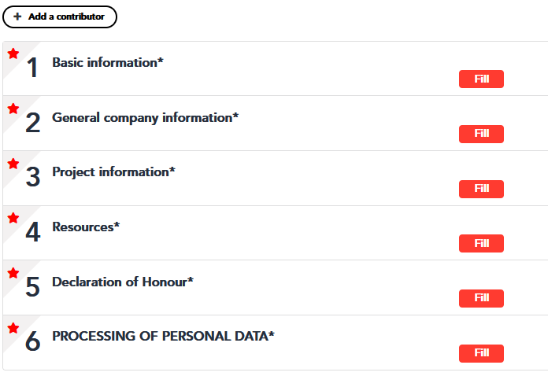

# Заповнення заявки

Заявка подається за [цим посиланням](https://change2twin-dv2-opencall.fundingbox.com/), нижче наведені питання з форм та пояснення щодо їх заповнення.

## 1 Basic information

| Поле                                                         | Укр  | En   | примітка |
| ------------------------------------------------------------ | ---- | ---- | -------- |
| Project acronym / абревіатура проекту                        |      |      |          |
| Project Title / Назва проекту                                |      |      |          |
| Name and Surname of the contact person / Прізвище та ім'я контактної особи |      |      |          |
| Contact person email address / Адреса електронної пошти контактної особи |      |      |          |
| Contact person phone number / Номер телефону контактної особи |      |      |          |

## 2 General company information

| Поле                                                         | Укр  | En   | примітка |
| ------------------------------------------------------------ | ---- | ---- | -------- |
| Legal name of the company / Юридична назва підприємства      |      |      |          |
| VAT number / ІПН                                             |      |      |          |
| Country where the company is registered / Країна, де зареєстрована компанія |      |      |          |
| Date of creation of the company (DD/MM/YYYY) / Дата створення компанії (ДД/ММ/РРРР) |      |      |          |
| Address of the company / Адреса підприємства                 |      |      |          |
| Website (URL) / Адреса вебсайту)                             |      |      |          |
| Are you an end-user SME or mid-cap in the manufacturing sector? (Please note that if you answer no your application will be considered ineligible)  /  Ви є кінцевим споживачем МСП або середньої капіталізації у виробничому секторі? (Будь ласка, зауважте, що якщо ви відповісте «ні», ваша заявка буде вважатися неприйнятною) |      |      | Yes/No   |
| Specify your sector / Вкажіть свій сектор:  - Construction / Будівництво  - Basic metals and fabricated metal products / Основні метали та готові металеві вироби  - Textiles, wearing apparel and leather / Текстиль, одяг та шкіра  - Beverages and food /  Напої та їжа  - Other (please specify): / Інше (будь ласка, вкажіть): |      |      |          |
| Company description. Please describe the company briefly (statistics (FTE, location(s), sector, turn-over etc), vision and strategy, product portfolio, etc.  /  Опис компанії. Будь ласка, коротко опишіть компанію (статистичні дані (FTE, місце(-а), галузь, товарообіг тощо), бачення та стратегію, портфоліо продуктів тощо. |      |      |          |

## 3 Project information

### Excellence / Вдосконалення

| Поле                                                         | Укр  | En   | примітка                                                     |
| ------------------------------------------------------------ | ---- | ---- | ------------------------------------------------------------ |
| Why is your company interested in digitalization and considering the  implementation of a digital twin? How does this connect to your business and its KPIs. /  Чому ваша компанія зацікавлена в цифровізації та розглядає впровадження цифрового двійника? Як це пов’язано з вашим бізнесом і його KPI. |      |      |                                                              |
| What KPIs are important for your future business operations? Which  purpose for digital twinning do you think offers more advantages? What  part of your company has the greatest potential for improvement? /  Які ключові показники ефективності важливі для вашої майбутньої діяльності? Яка з цілей для створення цифрового двійника, на вашу думку, пропонує більше переваг? Яка частина вашої компанії має найбільший потенціал для вдосконалення? |      |      | [Див.3.2 Guide](GuideforApplicants.md)                       |
| Please describe the current production process(es) that you want to  improve. Which systems or services need to become smart and why? Do you  aim at autonomous behaviour or at supporting human operators or users? /  Будь ласка, опишіть поточні виробничі процеси, які ви хочете покращити. Які системи чи служби мають стати розумними і чому? Ви прагнете автономної поведінки чи підтримки людей-операторів або користувачів? |      |      |                                                              |
| Please describe the company culture, and the level of support in the  company for change towards Digital Twins.  /  Будь ласка, опишіть культуру компанії та рівень підтримки в компанії для змін на користь цифрових двійників. |      |      |                                                              |
| Please identify and explain  the use of digital twin related standards in your solution. /  Будь ласка, визначте та поясніть  використання стандартів, пов'язаних з цифровими двійниками, у вашому  рішенні. |      |      |                                                              |
| What is your current level of digitalization? Indicate one of the six stages of the aca tech Industrie 4.0 Maturity Index. /  Який ваш поточний рівень цифровізації? Укажіть один із шести ступенів індексу зрілості acatech Industrie 4.0.  |      |      | Вибір: Stage 1: Computerisation Stage 2: Connectivity Stage 3: Visibility Stage 4: Transparency Stage 5: Predictive capacity Stage 6: Adaptability. Див. [Індекс зрілості](https://github.com/pupenasan/dt/blob/main/articles/MatInd_2020.md) |
| Explain why you have chosen this level of digitalization. /  Поясніть, чому ви обрали цей рівень цифровізації. |      |      |                                                              |

### Impact / Вплив

| Поле                                                         | Укр  | En   | примітка |
| ------------------------------------------------------------ | ---- | ---- | -------- |
| How can you improve your offer through digitisation? What aspects can  you improve and what aspects would your customers like to see improved?  What is the European dimension in your approach? /  Як ви можете покращити свою пропозицію за допомогою оцифрування? Які аспекти ви можете покращити, а які аспекти хотіли б покращити ваші клієнти? Який європейський вимір у вашому підході? |      |      |          |
| Which parts of your business will benefit most and why? How essential is the envisioned digital twin technology to (future) core processes or  products? Do you aim at an improvement of existing products or services  or at new market opportunities, e.g., with the introduction of smart  systems? /  Які частини вашого бізнесу принесуть найбільшу користь і чому? Наскільки важлива передбачувана технологія цифрового двійника для (майбутніх) основних процесів або продуктів? Ви націлені на вдосконалення існуючих продуктів чи послуг або на нові ринкові можливості, наприклад, із впровадженням розумних систем? |      |      |          |
| Where are the envisioned advantages of near real-time insights provided  by envisioned digital twins? Are your business processes and people  prepared to act on live data or near real-time insights? How costly is  any failure to act in time and who bears these costs?  / Де очікуються переваги використання цифрових двійників у плані надання  інформації в мякому реальному часі? Чи готові ваші бізнес-процеси та люди діяти на основі цих отриманих даних? Наскільки дорого коштує будь-яке невчасне вжиття заходів і хто понесе ці витрати? |      |      |          |

### Implementation / реалізація

| Поле                                                         | Укр  | En   | примітка |
| ------------------------------------------------------------ | ---- | ---- | -------- |
| Team and experience. What is your experience with digitalization  projects? Include a brief description of the most important skills and  experience of the main people that will be working on the project. /  Команда та досвід. Який ваш досвід роботи з проектами цифровізації? Включіть короткий опис найважливіших навичок і досвіду основних людей, які працюватимуть над проектом. |      |      |          |
| Describe the asset(s) or processes that the digital twin mirrors. Why did you select this/these? /  Опишіть актив(и) або процеси, які відзеркалюють цифрові двійники. Чому ви вибрали це/ці? |      |      |          |
| What sensors are needed to collect the data? What are the relevant  data-sources? What is required to collect sensor/process data needed for this purpose? Please describe what is already available, what needs to  be added? Які датчики потрібні для збору даних? Які відповідні джерела даних? Що потрібно для збору даних датчика/процесу, необхідних для цієї мети? Опишіть, будь ласка, що вже є, що потрібно додати? |      |      |          |
| What infrastructure is required to enable access to all the data needed  for this purpose, e.g. connectivity, data storage, etc. Please describe  what is already available, what needs to be added. /  Яка інфраструктура потрібна для забезпечення доступу до всіх даних, необхідних для цієї мети, напр. підключення, зберігання даних тощо. Опишіть, що вже доступно, що потрібно додати. |      |      |          |
| What products/services from solution providers will complete the  necessary infrastructure? Please list the products/services, the  providing company and the projected use. /  Які продукти/послуги від постачальників рішень доповнять необхідну інфраструктуру? Будь ласка, перерахуйте продукти/послуги, компанію-постачальника та плановане використання. |      |      |          |
| What is needed to realise the Digital Twin Core model? Describe the  operational and engineering expertise needed to build the digital twin.  Please differentiate the part that can be done in house and what needs  to be purchased. /  Що потрібно для реалізації моделі Digital Twin Core? Опишіть експлуатаційні та інженерні знання, необхідні для створення цифрового двійника. Будь ласка, розмежуйте деталі, які можна зробити вдома, і те, що потрібно придбати. |      |      |          |
| What is needed to make sure the Digital Twin is fit for purpose and  stays reliable? Please describe how you will validate and test your  digital twin to ensure trust. /  Що потрібно для того, щоб Digital Twin відповідав цілям і залишався надійним? Будь ласка, опишіть, як ви будете перевіряти та тестувати свого цифрового двійника, щоб забезпечити довіру. |      |      |          |
| Does your solution require the use of at least one technology available on the Change2Twin MarketPlace? /  Чи вимагає ваше рішення використання принаймні однієї технології, доступної на Change2Twin MarketPlace? |      |      | Yes/No   |
| If Yes, please name the technology(ies). /  Якщо так, назвіть технологію (технології). |      |      |          |
| If No, please name the technology(ies) you are considering and their corresponding provider(s). /  Якщо ні, будь ласка, назвіть технологію(-и), яку ви розглядаєте, та відповідного(их) постачальника(ів). |      |      |          |
| How will you bring the twin live? Is the twin in autonomous or manual operation? /  Як ви переведете двійник в режим роботи? Двійник працює в автономному чи ручному режимі? |      |      |          |
| How will you set up business processes that use the information of the  digital twin? How will you act upon the information provided by the  digital twin? How will you monitor your KPIs? / Як ви налаштуєте бізнес-процеси, які використовують інформацію цифрового двійника? Як ви будете діяти на основі інформації, наданої цифровим двійником? Як ви будете контролювати свої KPI? |      |      |          |
| Please describe the timeline of the steps you are planning to take. /  Будь ласка, опишіть графік кроків, які ви плануєте зробити |      |      |          |

## 4 Resources

Budget

| Поле                                                         | Укр  | En   | примітка |
| ------------------------------------------------------------ | ---- | ---- | -------- |
| (1) Personnel cost / Витрати на персонал                     |      |      |          |
| (2) Travel costs / Витрати на відрядження                    |      |      |          |
| (3) Consumables, equipment depreciation, etc. / Витратні матеріали, амортизація обладнання тощо. |      |      |          |
| (4) Subcontracting / Субпідряд                               |      |      |          |
| (5) Overheads (25% of sum of 1 + 2 + 3) / Накладні витрати (25% від суми 1 + 2 + 3) |      |      |          |
| (6) Total costs (sum of 1 + 2 + 3 + 4 + 5) / Загальні витрати (сума 1 + 2 + 3 + 4 + 5) |      |      |          |
| (7) Requested amount (70% of 6. Maximum amount 90 000 Euro) / Запитана сума (70% від 6. Максимальна сума 90 000 євро) |      |      |          |
| Has your company received financial support via open calls (FSTP) from Horizon 2020 I4MS and SAE projects? /  Чи отримувала ваша компанія фінансову підтримку через відкриті конкурси (FSTP) від проектів Horizon 2020 I4MS та SAE? |      |      | Yes/No   |

​        

## 5 Declaration of Honour

Please read carefully the statements below. You will not be able to change the statements after submission. / Будь ласка, уважно прочитайте наведені нижче твердження. Ви не зможете змінити виписки після надсилання.

- I have read and understood the information about the project, as provided in the Guide for Applicants (GfA) / Я прочитав і зрозумів інформацію про проект, надану в Посібнику для аплікантів (GfA)
  - Yes
  - No
- I have been given the opportunity to ask questions about the project and my participation via helpdesk address / Мені була надана можливість поставити запитання щодо проекту та моєї участі через адресу служби підтримки
  - Yes
  - No
- I voluntarily agree to participate in the Change2Twin project / Я добровільно погоджуюсь брати участь у проекті Change2Twin
  - Yes
  - No
- I understand I can withdraw at any time without giving reasons and that I will not be penalised for withdrawing nor will I be questioned on why I have withdrawn / Я розумію, що можу відмовитися в будь-який час без пояснення причин і що я не буду покараний за вихід, а також мене не запитуватимуть, чому я відмовився
  - Yes
  - No
- I acknowledge that the evaluators and the European Commission and its bodies and agencies may have access to the data collected under the open call / Я визнаю, що оцінювачі та Європейська комісія та її органи та агентства можуть мати доступ до даних, зібраних у рамках відкритого конкурсу
  - Yes
  - No
- The data provided in the application form are true and up-to-date / Дані, надані в анкеті, є правдивими та актуальними
  - Yes
  - No
- The entity I represent meets the eligiblity conditions described in the GfA, in particular is an SME or MID-CAP / Організація, яку я представляю, відповідає умовам прийнятності, описаним у GfA, зокрема є SME або MID-CAP
  - Yes
  - No
- There is no conflict of interest between the company I represent and any of the consortium partners / Між компанією, яку я представляю, та будь-яким із партнерів консорціуму немає конфлікту інтересів
  - True
  - False

- Moreover, the entity I represent, or persons with power of representation, decision-making or control over the aforementioned legal entity: / Крім того, особа, яку я представляю, або особи, які мають повноваження представництва, прийняття рішень або контролю над вищезазначеною юридичною особою:
  - is /are not bankrupt or being wound up, is not having its affairs administered by the courts, has not entered into an arrangement with creditors, has not suspended business activities, is not the subject of proceedings concerning those matters, or is not in any analogous situation arising from a similar procedure provided for in national legislation or regulations; / не є/є банкрутом чи ліквідацією, не перебуває у веденні судів, не уклав угоди з кредиторами, не призупиняв підприємницьку діяльність, не є суб’єктом провадження щодо цих справ або не перебуває в будь-якій аналогічна ситуація, що виникає внаслідок подібної процедури, передбаченої національним законодавством чи правилами;
    - True
    - False
  - has/have not been convicted of an offence concerning their professional conduct by a judgment which has the force of res judicata / був/не був засуджений за правопорушення щодо їхньої професійної поведінки вироком, який набрав чинності res judicata
    - True
    - False
  - has/have not been guilty of grave professional misconduct proven by any means which the contracting authority can justify, including by decisions of the European Investment Bank and international organisations / був/не був винним у серйозному професійному проступку, доведеному будь-якими засобами, які може виправдати замовник, у тому числі рішеннями Європейського інвестиційного банку та міжнародних організацій
    - True
    - False
  - is/are in compliance with their obligations relating to the payment of social security contributions or the payment of taxes in accordance with the legal provisions of the country in which it is established or with those of the country of the contracting authority or those of the country where the contract is to be performed / виконує(ють) свої зобов’язання щодо сплати внесків на соціальне страхування чи сплату податків відповідно до законодавчих положень країни, в якій вона заснована, або країни замовника, чи країни де має бути виконано договір
    - True
    - False
  - has/have not been the subject of a judgment which has the force of res judicata for fraud, corruption, involvement in a criminal organisation or any other illegal activity, where such illegal activity is detrimental to the Union’s financial interests / був/не був предметом судового рішення, яке має силу res judicata (рішення що набрало законної сили), за шахрайство, корупцію, участь у злочинній організації чи будь-якій іншій незаконній діяльності, якщо така незаконна діяльність завдає шкоди фінансовим інтересам Союзу
    - True
    - False
  - is/are not subject to an administrative penalty for being guilty of misrepresenting the information required by the contracting authority as a condition of participation in a grant award procedure or another procurement procedure, or failing to supply this information, or has/have not been declared to be in serious breach of their obligations under contracts or grants covered by the Union's budget / є/не підлягають адміністративному стягненню за те, що вони винні у спотворенні інформації, яка вимагається замовником як умова участі в процедурі надання гранту чи іншій процедурі закупівлі, або ненадання цієї інформації, або була/не була заявлена серйозно порушувати свої зобов'язання за контрактами або грантами, що покриваються з бюджету Союзу
    - True
    - False
- I confirm that the legal entity I represent has not received more than 100.000 EUR via open calls (Financial Support to Third Parties = FSTP = cascade funding) from H2020 I4MS (https://i4ms.eu/) and SAE (https://smartanythingeverywhere.eu/) projects. Я підтверджую, що юридична особа, яку я представляю, не отримала понад 100 000 євро через відкриті конкурси (фінансова підтримка третіх сторін = FSTP = каскадне фінансування) від H2020 I4MS (https://i4ms.eu/) та SAE (https:// проекти smartanythingeverywhere.eu/).
  - True
  - False
- I did not make false declarations in supplying the information required, as a condition of participation in the Open Call or do not fail to supply this information / Я не робив неправдивих заяв, надаючи інформацію, необхідну як умову участі у Відкритому конкурсі, або не зміг надати цю інформацію
  - True
  - False
- I voluntarily agree to be registered at Change2Twin Community at https://spaces.fundingbox.com/spaces/i4ms-change2twin/ and I understand that I can delete my profile from the above-mentioned Community by informing the Change2Twin Team via helpdesk mail / Я добровільно погоджуюся зареєструватися в спільноті Change2Twin за адресою https://spaces.fundingbox.com/spaces/i4ms-change2twin/ і розумію, що можу видалити свій профіль із вищезгаданої спільноти, повідомивши про це команду Change2Twin електронною поштою в службу підтримки.
  - Yes
  - No

## 6 PROCESSING OF PERSONAL DATA

You can read the GDPR (processing of personal data) information clause for this open call here / Ви можете прочитати інформаційний пункт GDPR (обробка персональних даних) для цього відкритого конкурсу тут

- I confirm that I read and understood the information clause concerning processing of the personal data provided above: / Я підтверджую, що прочитав і зрозумів інформаційний пункт щодо обробки персональних даних, наведений вище
  - Yes
- I will pass the information clause provided above to all team members mentioned in the application form: / Я передам наведену вище інформацію всім членам команди, зазначеним у формі заявки:
  - Yes
- I confirm that I have legal basis for processing personal data of the team members listed in the application form. / Я підтверджую, що маю законні підстави для обробки персональних даних членів команди, зазначених у анкеті.
  - Yes