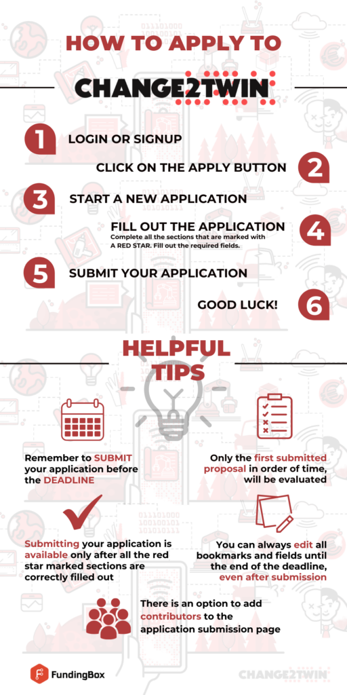

# Відкрита грантова пропозиція: ваучер на розгортання

https://www.change2twin.eu/open-calls/deployment-voucher/

Поточний відкритий конкурс завершується **16 квітня 2023 року**. Подайте заявку на фінансування [тут](https://change2twin-dv2-opencall.fundingbox.com/)!

Ми шукаємо [виробничі підприємства малого та середнього бізнесу та середньої капіталізації](https://www.change2twin.eu/sme/) (тобто компанії з чисельністю до 3000 співробітників), які хочуть підвищити свою конкурентоспроможність шляхом впровадження технології Digital Twinning. Наша програма підтримки, що включає фінансування та технічне наставництво, допоможе вам подолати цю проблему шляхом розробки та впровадження технології цифрових близнюків.

До **16 обраних заявників** отримають **Ваучер на розгортання на суму до 90 000 євро** для розгортання цифрового двійника у своєму виробничому бізнесі.

**Важливо:** Заявка на ваучер на розгортання також відкрита для компаній, які не отримали або не подали заявку на підтримку ваучера на оцінку (Assessment Voucher). У цьому випадку вони можуть підготувати рецепт за шаблоном, використовуючи [Change2Twin Marketplace](Change2TwinMarketplace.md) для вибору компонентів або використовуючи інші технології, які там ще недоступні.

Компанії, які подають заявку на цей відкритий конкурс, в ідеалі вже досягли **рівня оцифрування 3**, що означає, що вони переважно вже використовують інформаційні панелі, а дані важливих бізнес-процесів, таких як виробництво, стають доступними за допомогою датчиків.

**Мінімальний рівень оцифрування для компаній, які подають заявку на відкритий конкурс, становить 2**, за якого цифрові системи в організації значною мірою пов’язані одна з одною та обмінюються даними, щоб надавати бізнес-додаткам і програмному забезпеченню відповідну інформацію.

Щоб дізнатися більше про рівні оцифрування, прочитайте [FAQ](faq.md).

**Коли можна подати заявку?**
Конкурс розпочнеться 16 січня 2023 року о 09:00 за центральноєвропейським часом і закінчиться 16 квітня 2023 року о 17:00 за центральноєвропейським часом. [Приєднуйтеся до нашої спільноти](https://spaces.fundingbox.com/spaces/i4ms-change2twin/5f6dfbbff9a7a75c28f34419) і слідкуйте за нами в [LinkedIn](https://www.linkedin.com/company/change2twin/), щоб отримувати оновлення ці дати.

**Що це дасть МСП?**
Ви візьмете участь в 11-місячній програмі підтримки для впровадження цифрової технології Twinning для підвищення конкурентоспроможності вашої компанії. Ви отримаєте:

- **До 90 000 євро** як разова сума для покриття витрат на розгортання та впровадження технологій і систем, застосовних до цифрових близнюків для виробництва.
- Технічне наставництво для підтримки розгортання Digital Twin на кожному етапі його впровадження від вимог користувача до специфікацій проекту.

Після того, як ви підтвердите свій статус SME/mid-cap і підтвердите, що ви перебуваєте в країні, яка відповідає вимогам, ви можете продовжити:

1. Ознайомлення з [Посібником для заявників](GuideforApplicants.md) (документ, що пояснює процедури подання заявки та оцінювання).
2. Перегляньте [Часті запитання](faq.md), щоб дізнатися, чи є відповіді на ваші сумніви мати.
3. Натисніть кнопку застосувати та підготуйте заявку.

