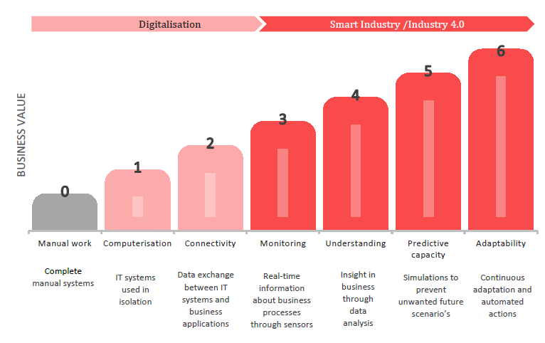
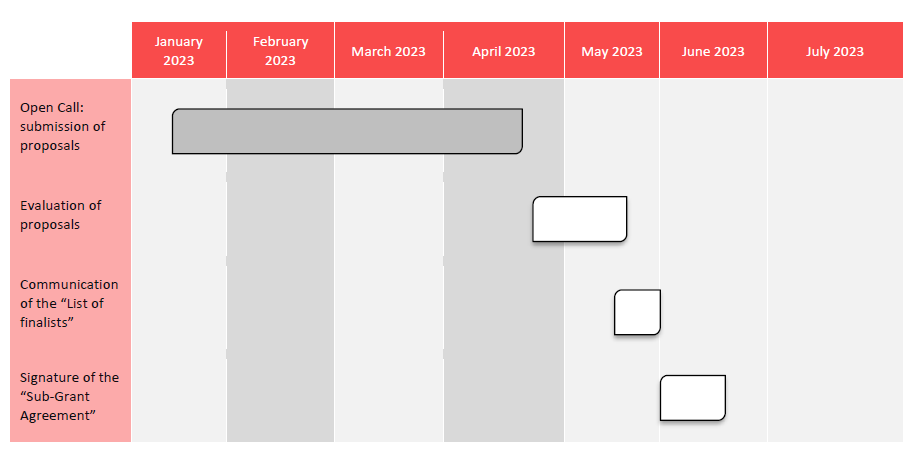

# FREQUENTLY ASKED QUESTIONS

https://s3.amazonaws.com/fundingbox-sites/gear%2F1671719031316-CHANGE2TWIN_FAQ_Deployment+voucher_20221117_FINAL.pdf

#### 1 ЧИ МОЖУ Я ПОДАТИ ЗАЯВКУ, ЯКЩО МОЯ КОМПАНІЯ ЩЕ НЕ СТВОРЕНА?

Ні, ви не можете. Щоб відповідати вимогам, ваше МСП або підприємство середньої капіталізації має бути юридично зареєстроване як компанія на одній із територій, згаданих у розділі 3.1 Посібника для заявників, перш ніж ви подасте заявку.

#### 2 ЩО МОЖЕ БУТИ ІДЕАЛЬНИМ КАНДИДАТОМ ДЛЯ CHANGE2TWIN?

Ваучер на розгортання орієнтований на фізичних (одну) юридичних осіб, які відповідають таким вимогам:

- Працювати у виробничому секторі; вииробничі компанії (Manufacturing companies) – це підприємства малого та середнього бізнесу або підприємства середньої капіталізації, зареєстровані згідно з національним законодавством для здійснення господарської діяльності відповідно до Кодексу, пов’язаного з виробничими секторами.

- Мати статус SME або mid-cap; An SME will be considered as such if it complies with the European Commission’[s Recommendation 2003/361/EC. ](https://ec.europa.eu/growth/smes/sme-definition_en)As summary, the criteria defining an SME are: Headcount in Annual Work Unit (AWU) less than 250; Annual turnover less or equal to €50 million or annual balance sheet total less or equal to €43 million.  Note that the figures of partners and linked enterprises should also be considered as stated in the SME user guide. ‘Middle-capitalization company’ or ‘mid-cap’ means an enterprise that is not an SME and has up to 3 000 employees, knowing that the staff headcount is calculated pe[r Articles 3 to 6 of the Annex to Commission Recommendation 2003/361/EC.](https://eurlex.europa.eu/LexUriServ/LexUriServ.do?uri=OJ:L:2003:124:0036:0041:EN:PDF)

- Досягти щонайменше 2 рівня оцифрування згідно з індексом зрілості acatech Industrie 4.0;[5 https://en.acatech.de/publication/industrie-4-0-maturity-index-update-2020/ . ](https://en.acatech.de/publication/industrie-4-0-maturity-index-update-2020/)This definition includes also Slightly Bigger companies (in accordance with the EU recommendation Slightly Bigger Companies are defined as organisations with a staff headcount below 500 employees and a turnover less or equal to below €100M or an annual balance sheet total less or equal to €86 million).

- Мати інтерес до розробки та впровадження технології цифрових близнюків;

- Знаходяться в державах-членах Європейського Союзу та його заморських країнах і територіях (OCT), в [Асоційованих країнах до H2020, ](https://ec.europa.eu/research/participants/data/ref/h2020/ grants_manual/hi/3cpart/h2020-hi-list-ac_en.pdf) або Великобританії.

#### 3 ЧИ МОЖЕ БЕНЕФІЦІАР ВАУЧЕРА НА ОЦІНКУ ПОДАТИ ЗАЯВКУ НА ОТРИМАННЯ ВАУЧЕРА НА ПРЕДСТАВЛЕННЯ?

Так, бенефіціари обох відкритих конкурсів на ваучери оцінки мають право подати заявку на 2-й відкритий конкурс на ваучери на розгортання. Бенефіціари 1-го відкритого конкурсу ваучерів на розгортання не можуть подавати заявки на другий відкритий конкурс.

#### 4 ЧИ МОЖЕТЕ ВИ НАВЕСТИ ПРИКЛАДИ ВПРОВАДЖЕННЯ ЦИФРОВИХ БЛИЗНЮКІВ?

Проект Change2Twin виконується для пілотних проектів, які можуть стати джерелом натхнення для заявників на наші відкриті конкурси. Ви можете дізнатися більше про наші пілотні експерименти [тут.](https://www.change2twin.eu/experiments/)

#### 5   WHAT IS THE MINIMUM LEVEL OF DIGITIZATION FOR COMPANIES THAT APPLY TO CHANGE2TWIN?

To assess the digitalization level of the applicants, Change2Twin follows the [Acatech Industrie 4.0](https://en.acatech.de/publication/industrie-4-0-maturity-index-update-2020/) [Maturity Index6](https://en.acatech.de/publication/industrie-4-0-maturity-index-update-2020/). This index identifies 6 stages of digitalization:

#### 5 ЯКИЙ МІНІМАЛЬНИЙ РІВЕНЬ ЦИФРОВАННЯ ДЛЯ КОМПАНІЙ, ЩО ПОДАЮТЬ ЗАЯВКУ В CHANGE2TWIN?

Щоб оцінити рівень цифровізації заявників, Change2Twin дотримується [Acatech Industrie 4.0](https://en.acatech.de/publication/industrie-4-0-maturity-index-update-2020/) [Maturity Index]( https://en.acatech.de/publication/industrie-4-0-maturity-index-update-2020/).  Цей індекс визначає 6 етапів цифровізації:

1. Комп’ютеризація: цей етап забезпечує основу для цифровізації (digitalisation); різні інформаційні технології використовуються ізольовано одна від одної всередині компанії та використовуються для більш ефективного виконання повторюваних завдань.

2. Зв’язок (Connectivity): цифрові системи в організації значною мірою пов’язані одна з одною та обмінюються даними, щоб забезпечити бізнес-додатки та програмне забезпечення відповідною інформацією.

3. Моніторинг: датчики дозволяють фіксувати процеси від початку до кінця з великою кількістю точок даних. Події та стани тепер можна записувати в режимі реального часу в усій компанії та за її межами, а не лише в окремих областях, як-от виробничі клітини.

4. Розуміння: цей етап передбачає створення цифрової тіні поточної ситуації компанії, щоб зрозуміти, чому щось відбувається, і використовувати це розуміння для отримання знань за допомогою аналізу першопричин.

5. Здатність передбачення (Predictive capacity): компанія здатна моделювати різні сценарії майбутнього та визначати найбільш ймовірні, проектуючи цифрову тінь у майбутнє. Завдяки цьому компанії можуть передбачати майбутні події, щоб своєчасно приймати рішення та впроваджувати відповідні заходи.

6. Адаптивність: компанія здатна використовувати дані з цифрової тіні для прийняття рішень, які мають найкращі результати в найкоротші терміни, і впроваджувати відповідні заходи автоматично, тобто без допомоги людини.

Figure 1: Stages in the Industrie 4.0 development path (source: FIR e. V. at RWTH Aachen University)

Мінімальний рівень цифровізації для компаній, які подають заявку на відкритий конкурс, становить 2.

Ми запрошуємо вас уважно прочитати опис кожного етапу перед подачею заявки на Change2Twin. У формі заявки вас попросять надати пояснення, чому ви вважаєте, що ваша компанія перебуває на вибраному рівні цифровізації.

#### 6 ЯК НАМ ОЦІНЮВАТИ БЮДЖЕТ?

Кожна проектна пропозиція включатиме розрахунок витрат у розділі Реалізація форми заявки. Перевірка узгодженості між цими витратами та очікуваною роботою проекту буде частиною оцінки пропозицій.

Загальну вартість кожного проекту «знизу вверх» слід оцінювати на основі таких критеріїв:

1) Витрати на персонал: витрати слід розраховувати на основі оцінки необхідних зусиль і із застосуванням стандартних ставок, передбачених у програмі «Горизонт на 2020 рік» — Програма дій Марії Склодовської-Кюрі (MSCA), де місячна середня ставка витрат на персонал становить 4 880 євро на місяць.
2) Витрати на проїзд: місячна вартість проїзду (на основі Програми дій Марії Склодовської-Кюрі) становить 600 євро/місяць.
3) Витратні матеріали, амортизація обладнання тощо: оцінюється за стандартною практикою заявника. 
4) Субпідряд
5) Накладні витрати (25% від суми 1+2+3) 
6) Загальні витрати (1+2+3+4+5)
7) Запитана сума фінансування: 70% загальних витрат (максимальна сума 90 000 євро).

#### 7 ЯКІ ВИТРАТИ Є ПРИЙНЯТНИМИ?

Прийнятні витрати – це прямі та непрямі витрати, які відповідають бюджету Проекту, визначеному в Індивідуальному плані наставництва, і вони є прийнятними, якщо відповідні завдання або частини Проекту виконуються належним чином (включаючи витрати на персонал, придбання товарів і послуг, поїздки витрати, ліцензійні збори).

#### 8 ЩО СТАНЕТЬСЯ, ЯКЩО Я НЕ ПОДАМ ЗАЯВКУ В ТЕРМІН?

Ми не приймаємо заявки після закінчення терміну. Ми настійно рекомендуємо вам не чекати до останньої хвилини, щоб подати свою пропозицію. Недотримання терміну подання з будь-якої причини, включаючи пом’якшувальні обставини, призведе до відхилення пропозиції.

#### 9 СКІЛЬКИ ЧАСУ ЗАПОВНЕННЯ ЗАЯВКИ?

Ймовірно, для написання хорошої програми знадобиться близько 1-2 днів, але ви зможете додавати співавторів, щоб роботу можна було розподілити між членами команди. Ви можете будь-коли зберегти свою заявку як чернетку та продовжити пізніше.

Візьміть до уваги, що в кожному полі онлайн-форми заявки встановлено обмеження кількості символів, тому ми рекомендуємо вам зосереджувати свою пропозицію на запитуваній інформації.

#### 10 ЧИ МОЖЕ КОМПАНІЯ ПОДАТИ ДВІ ІДЕЇ ПРОЕКТУ?

Ні, ви не можете. Якщо подано більше ніж одну заявку від одного заявника, буде оцінено лише останню пропозицію, яка була подана за часом, а будь-яку іншу буде відхилено.

#### 11 ЯКІ КРИТЕРІЇ ДЛЯ ОЦІНКИ ПРОПОЗИЦІЙ?

Під час оцінки пропозицій оцінювачі враховуватимуть 3 основні критерії:

- Досконалість (аналіз амбіційності, інноваційності та надійності підходу та довіри до запропонованої методології).

- Вплив (оцінка ринкових можливостей, впливу на бізнес і використання інформації про критичність часу).

- Впровадження (оцінюватиме команду, ресурси та інші наскрізні критерії).

Повна інформація про це міститься в Розділі 4 Посібника для аплікантів для цього конкурсу.

#### 12 ЯКИЙ ТИП ПІДТРИМКИ ДОСТУПНИЙ ДЛЯ ПІДГОТОВКИ ПРОПОЗИЦІЇ?

«Посібник для абітурієнта» є основним довідковим документом. Він містить детальну інформацію про вимоги до процесу оцінювання та відбору, а також про фінансову підтримку, яку пропонує Change2Twin.

Служба підтримки Open Call готова розв’язати будь-які сумніви, які у вас можуть виникнути щодо процесу подання заявки (правила відповідності, запити інформації у формі заявки тощо). Він буде доступний у спільнотах Open Call, доступних для такої мети за адресою https://spaces.fundingbox.com/spaces/i4ms-change2twin-open-call-help-desk

Нарешті, служба технічної підтримки [(opencalls@change2twin.eu) ](mailto:opencalls@change2twin.eu) також доступна, якщо у вас виникнуть будь-які технічні проблеми під час заповнення форми заявки.

#### 13 ЯКИЙ ОЧІКУВАНИЙ РОЗКЛАД?

Орієнтовний розклад 2-го відкритого конкурсу ваучера на розгортання такий:

Зверніть увагу, що цей графік може змінитися в будь-який час.

#### 14 ЯК МИ ПЕРЕВІРИМО ВАШ СТАТУС МСП АБО ПІДПРИЄМСТВА СЕРЕДНЬОЇ КАПІТАЛІЗАЦІЇ?

Перед підписанням субгрантової угоди ми перевіримо ваш статус малого та середнього бізнесу або компанії середньої капіталізації. Зокрема, ми просимо вас надати наступну документацію:

- Інформація про статус бенефіціарів.

- Документ, який демонструє холдингову структуру підприємства-бенефіціара - акціонерів та відсоток акцій, якими вони володіють у підприємстві-бенефіціарі.

- Контрольний список підприємств малого та середнього бізнесу/середньої капіталізації. У випадку, якщо вони заявляють про несамостійність: баланс і звіт про прибутки та збитки (з додатками) за останній період для організацій, що знаходяться на першому та нижчому рівнях.

- Фінансова інформація. Він включає чисельність персоналу (AWU), баланс, звіти про прибутки та збитки за останні 3 роки (за останні 3 роки або, якщо це не стосується, за період, починаючи з дати реєстрації), а також співвідношення, вище та нижче за течією, будь-якої пов’язаної або партнерської компанії.

- Легальне існування. Реєстр компаній, офіційний журнал або подібний документ із зазначенням назви організації, юридичної адреси та реєстраційного номера та, якщо є, копії документа, що підтверджує реєстрацію платника ПДВ (якщо номер платника ПДВ не вказано у витягу про реєстрацію або його еквіваленті ).

- У випадках, коли чи кількість співробітників, чи право власності чітко не визначено: будь-які інші підтверджуючі документи, які підтверджують чисельність персоналу та право власності, наприклад відомості про заробітну плату, річні звіти, національні регіональні записи, записи асоціацій тощо.

- Бланк ідентифікації банку.

- Інформація про участь в інших акселераційних програмах та інші отримані гранти H2020.

#### 15 ЯКІ УМОВИ ОПЛАТИ?

Щоб отримати фінансову підтримку, ми проведемо такі перевірки:

Етап 1. Початковий етап: під час початкового етапу вам потрібно буде надати індивідуальний план наставництва, розроблений за допомогою технічних наставників, протягом кінцевого терміну, зазначеного в Угоді про субгрант (заявники матимуть 2 місяці з моменту підписання субгранту Згода на надання результату). Ви отримаєте 19% фінансової підтримки після підтвердження індивідуального плану наставництва. 

Етап 2 – Експеримент: під час етапу експерименту бенефіціари отримають 81% фінансової підтримки після підтвердження результату, визначеного в Угоді про субгрант для цього етапу.

Комітет з наставництва, до складу якого входять технічні наставники, перевірить, чи результати, які потрібно надати для кожного етапу, відповідають стандартам якості та що вони були подані в установлений термін. Комітет з наставництва також оцінюватиме ділові та технічні показники ефективності.

Правління AE, що складається з 10 основних партнерів Change2Twin (тобто SINTEF, TTTECH-IND, Jotne, FBA, TNO, BOC, UNIBO, CLOUDBROKER, IR та PSNC), перегляне та підтвердить пропозицію Наставницького комітету та продовжить роботу над остаточна перевірка результатів.

Ви отримаєте фіксовану одноразову суму, як визначено в Угоді про субгрант.

#### 16 ЩО Я ОТРИМАЮ, ЯКЩО МОЮ ПРОГРАМУ ВИБЕРУТЬ?

Ви отримаєте до 90 000 євро як одноразову суму для покриття витрат на впровадження технології цифрового близнюка у вашій виробничій компанії. Ви також отримаєте технічне наставництво та підтримку від консорціуму Change2Twin.

#### 17 ЧИ ПОТРІБНА БУДЬ-ЯКА ЗВІТНІСТЬ ЗА СПОСІБ ВИКОРИСТАННЯ КОШТІВ, НАПРИКЛАД, РАХУНКИ-ФАКТУРИ ТА ІНШІ ФІНАНСОВІ ДОКУМЕНТИ? ЧИ ІСНУЮТЬ СПЕЦІАЛЬНІ ОБМЕЖЕННЯ ЩОДО ВИКОРИСТАННЯ КОШТІВ?

Бенефіціари отримають одноразову допомогу в розмірі до 90 000 євро.

Паушальна сума — це спрощений метод, який означає, що одержувач FSTP не зобов’язаний надавати бухгалтерські документи, як-от рахунки-фактури, табелі тощо, щоб підтвердити, що витрати були дійсно понесені. Однак Change2Twin оцінюватиме якість і дотримання термінів наданого результату, а не вашу бухгалтерію. У будь-якому випадку методологія одноразової виплати не звільняє вас від обов’язку збирати документацію для підтвердження витрат згідно з фіскальним регулюванням.

#### 18 ЩО ОЗНАЧАЄ, ЩО ОТРИМАНИЙ ГРАНТ СТАНЕ 70% ВИТРАТ?

Ставка фінансування розраховуватиметься відповідно до ставки фінансування інноваційних заходів, тобто 70% прийнятних витрат (комерційні організації). Це означає, що кожен аплікант повинен буде вказати в бюджеті, що отриманий грант дорівнюватиме 70% від кошторису витрат на реалізацію проекту. Це означає, що якщо ви надасте бюджет загальною вартістю 128 571 євро, загальна сума гранту, яку ви отримаєте, становитиме 89 999,7 євро (70%).

#### 19 ЩО БУДЕ, ЯКЩО МІЙ БЮДЖЕТ ПЕРЕВИЩАЄ 128 571 ЄВРО?

Беручи до уваги ліміт фінансової підтримки в 90 000 євро, будь-який бюджет, який перевищує 128 571 євро, отримає лише 90 000 євро фінансової підтримки. Це означає, що вашу заявку все одно буде прийнято, але якщо вас виберуть для отримання фінансової підтримки, сума, яку ви отримаєте, становитиме менше 70% загальних витрат бюджету, який ви подаєте.

#### 20 ІНДЕКС ЗРІЛОСТІ INDUSTRIE 4.0 ЦЕ САМООЦІНЮВАННЯ ЧИ ВІН ПОТРІБНО БУТИ ЯКИСЬ СЕРТИФІКОВАНО ЯКОЮ ОРГАНІЗАЦІЄЮ?

Це самооцінка. Тому ми просимо вас коротко пояснити, чому ви оцінили свою компанію на певному рівні в наступному питанні.

#### 21 ЧИ МОЖУТЬ ДЕЯКІ ЛЮДИНО-МІСЯЦІ ПЕРСОНАЛУ-БЕНЕФІЦІАРА ТАКОЖ ЗАРАХУВАТИСЯ ДО ПРИЙНЯТНИХ ВИТРАТ?

Так, витрати на персонал від бенефіціарів є допустимими витратами.

#### 22 ЯКІ ДОКУМЕНТИ ПОТРІБНО НАДАТИ МСП, ЩОБ ОТРИМАТИ РЕЗУЛЬТАТИ?

Документи та результати, які малі та середні підприємства повинні будуть надати:

- На початковому етапі вас попросять надати Індивідуальний план наставництва, розроблений за допомогою технічних наставників, протягом терміну, зазначеного в Угоді про субгрант.

- Для етапу експерименту вам потрібно буде надати результати, визначені в Угоді про субгрант для цього етапу.

#### 23 СКІЛЬКИ БЕНЕФІЦІАРІВ ВИ ОЧІКУЄТЕ ВИБРАТИ ДЛЯ КОЖНОЇ КРАЇНИ?

Пропозиції ранжуватимуться за якістю, а не за країною. Отже, немає встановленого обмеження чи бажаної кількості для кожної країни.

#### 24 ЧИ МОЖЕ МСП БУТИ ПОЧАТКОВОЮ КОМПАНІЄЮ (МІКРО МСП) ЯК КООРДИНАТОРОМ У КОНСОРЦІУМІ З КОМПАНІЄЮ-ВИРОБНИКОМ?

Що стосується 2-го відкритого конкурсу ваучерів на розгортання, цей відкритий конкурс призначений лише для окремих заявників. Консорціуми не можуть подати заявку. Заявник має бути виробничим малим і середнім підприємством із середньою капіталізацією, зареєстрованим не пізніше 16 січня 2023 року як компанія в одній із прийнятних країн.

#### 25 У ВИПАДКУ, ЯКЩО ПРОЕКТ DIGITAL TWIN СТОСУЄТЬСЯ ПОСЛУГИ З ПІДТРИМКИ ВИРОБНИЦТВА МАШИН ТА УСТАНОВОК ДЛЯ НАШИХ КІНЦЕВИХ КЛІЄНТІВ, ЧИ ВІН ВСЕ ВСЕ ДОПУСКАЄТЬСЯ?

Метою Change2Twin є допомога виробничим підприємствам малого та середнього бізнесу та компаніям із середньою капіталізацією у впровадженні технології цифрового твінінгу. Таким чином, саме кінцеві користувачі цифрової технології Twinning мають застосовувати.

#### 26 ЯКЩО ПІДПРИЄМСТВО МСП БУЛО ПРИЙНЯТО ДО ВАУЧЕРА НА ОЦІНКУ, ЧИ ЦЕ ПЕРЕВАГА ДЛЯ ВІДКРИТОГО КОНКУРСУ ЗА ВАУЧЕРОМ НА ПРЕДСТАВЛЕННЯ?

Ні. Незважаючи на те, що в разі вибору звіт, який отримають бенефіціари, буде надійною основою для подання заявки на ваучер на розгортання, компаніям, які брали участь у ваучері оцінки, перевага не буде надаватися під час оцінки пропозицій на розгортання. Ваучер.

#### 27 ЧИ ОБМЕЖЕННЯ РІЧНОГО ОБОРОТУ ДЛЯ КОМПАНІЙ СЕРЕДНЬОЇ КАПІТАЛІЗАЦІЇ МЕНША АБО ДОРІВНЮЄ 50 МІЛЬЙОНАМ ЄВРО, ЯК ЦЕ ДЛЯ МСП?

Для цілей цього відкритого конкурсу підприємства із середньою капіталізацією визначаються як підприємства, кількість працівників яких становить до 3000 (з чисельністю персоналу, розрахованою відповідно до статей 3, 4, 5 та 6 розділу I додатку до Рекомендації Комісії 2003/361/ЄС). Критерії, що стосуються загальної суми балансу або обороту, не мають значення в контексті цього визначення середньої капіталізації.

#### 28 ЧИ МОЖНА ДІЗНАТИСЯ КІЛЬКІСТЬ ОТРИМАНИХ ЗАЯВ НА МОМЕНТ ЗАКРИТТЯ ПЕРШОГО ВИКЛИКУ?

Так, команда Open Call поширює всі дані щодо кількості заявок.