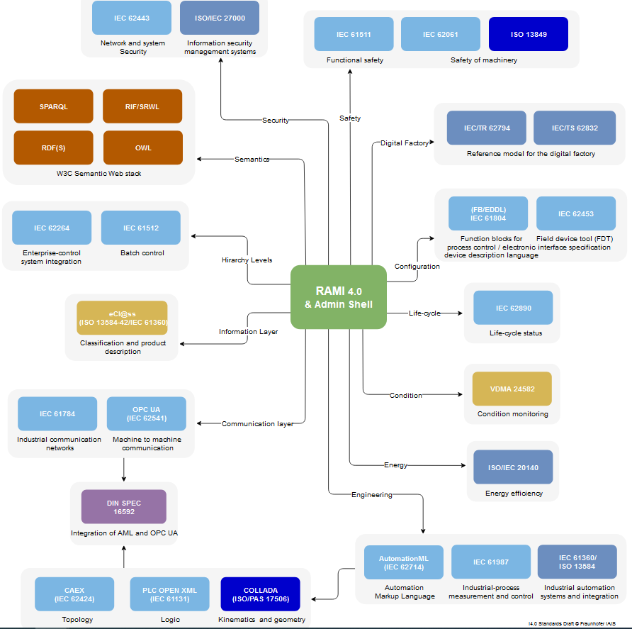
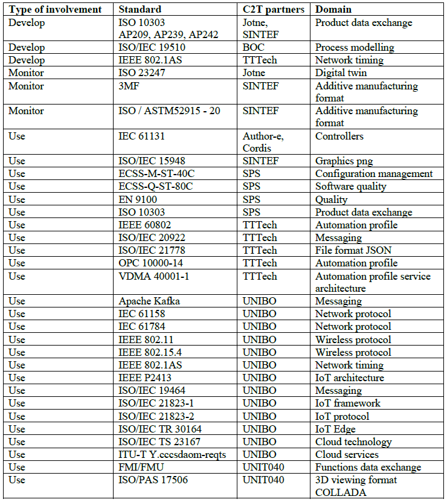

# FIRST REPORT ON STANDARDS RELEVANT FOR DIGITAL TWINS

Переклад оригіналу [FIRST REPORT ON STANDARDS RELEVANT FOR DIGITAL TWINS](https://www.change2twin.eu/wp-content/uploads/2021/11/D1.2-First-report-on-standards-relevant-for-digital-twins.pdf)

## 1 DOCUMENT SCOPE

Використання стандартів є важливим для цифрових двійників. Стандарти допомагають подолати бар’єри для цифрових двійників, наприклад той, що називається «[BAR-T5] Об’єднання всього разом» у Change2Twin [D1.1 «Бар’єри для цифрових двійників»](https://www.change2twin.eu/wp-content/uploads/2021/11/D1.1-Digital-Twin-Barriers.pdf). Сумісність апаратного забезпечення, програмного забезпечення та даних із гетерогенного середовища є одним із важливих прикладів, який потребує широко визнаних і перевірених домовленостей. Особливо малі та середні підприємства (МСП) через свої обмежені ресурси отримують велику користь від існування стандартів. Проте існування документів у чистому вигляді недостатньо, і їх потрібно поєднувати з посібниками з найкращої практики та підтримкою стандартів на ринку.

Change2Twin розглядає стандарти як забезпечувальну (enabling) технологію. Ось чому Завдання 1.5 «Зв’язок між різними стандартами» є частиною робочого пакету 1 «Забезпечувальні технології для цифрових двійників» разом з іншими технологіями для цифрових двійників, такими як зв’язок, безпека, якість, взаємодія з користувачем/ергономіка та інженерія . Стандарти полегшують використання передових технологій у цифрових двійниках. Як і інші технології, стандарти необхідно розробляти, перевіряти та підтримувати; це входить до завдання 1.5. Наша діяльність включає перегляд стандартів, рекомендації користувачам і відгуки до органів стандартизації. Наші результати підтримають, серед іншого, надання можливості постачальникам технологій у Завданні 1.3 «Адаптація технологій постачальників рішень для більш загального підходу» покращити свою конкурентоспроможність на ринку.

Цей звіт D1.2 «Перший звіт щодо стандартів, які стосуються цифрових  двійників», представляє початковий аналіз відповідних стандартів на  основі опитувань, що були опубліковані іншими проектами та  організаціями, а також на основі внеску партнерів Change2Twin (C2T).  Редакційна команда зібрала стандарти, які можуть бути відповідними для  рішень Change2Twin з метою представлення широкого спектру стандартів  проекту. Партнери проекту визначили стандарти, які є важливими для  їхнього внеску в рішення щодо цифрових двійників. Вони вказали, як вони  будуть працювати над розробкою цих стандартів протягом періоду проекту.

Цей документ адресований громадській аудиторії наступних типів читачів:

- Розробники стандартів цифрових двійників,
- Розробники цифрових рішень зі створення цифрових двійників,
- Люди з робочим досвідом складних системних архітектур та рішень в галузі інформаційно-комунікаційних технологій.

Розділ 3 дає огляд органів стандартизації, які розробляють стандарти для цифрових двійників і інтелектуального виробництва.

Розділ 4 представляє опитування, які інші проекти та організації проводили для визначення таких стандартів і які були враховані як корисний внесок у цей звіт.

У розділі 5 партнери C2T зобов'язуються використовувати стандарти для аспектів цифрових двійників, які вони підтримують. Висвітлені ролі стандартів у досягненні цілей C2T .

У розділі 6 наводиться висновок звіту та перспективні активності до другого звіту про стандарти в травні 2022 року.

Крім того, Додаток А містить найбільш повний список відповідних стандартів, який проект зміг знайти, доповнений стандартами, які Консорціум C2T вважає важливими. Список також вказує типи залучення партнерів C2T до перелічених елементів, тобто, чи вони використовують, моніторять або розробляють ці стандарти.

## 2 ACRONYMS

[Table 1 ](https://docs.google.com/document/d/1-cILDKHZ6DqKbZAfK1vvgfgZ2Vg2M-EO/edit#heading=h.3dy6vkm)lists the most used acronyms in this document. Acronyms that only appear in the listings of standards are not included here.

TABLE 1: ACRONYMS

3D
Three-dimensional
3MF
3D Manufacturing Format
AI
Artificial Intelligence
AP
Application Protocol
AP209
ISO 10303-209, Multidisciplinary analysis and design
AP239
ISO 10303-239, Product Lifecycle Support (PLCS)
AP242
ISO 10303-242, Managed model based 3D engineering
API
Application Programming Interface
ASTM
American Society for Testing and Materials
C2T
Change2Twin, EU-project
CAD
Computer-Aided Design
CEN
European Committee for Standardization
CENELEC
DDS
Data Distribution Service
DIN
Deutsche Industrienorm
DMP
Digital Manufacturing Platforms
ECSS
European Cooperation on Space Standardisation
EFFRA
European Factories of the Future Research Association
EFPF
European Connected Factory Platform for Agile Manufacturing
EFTA
European Free Trade Association
ESA
European Space Agency
ETSI
European Telecommunications Standards Institute
EU
European Union
HPC
High Performance Computing
ICT
Information and Communications Technology
IEC
International Electrotechnical Commission
IEEE
Institute of Electrical and Electronics Engineers
IoT
Internet of Things
ISO
International Organization for Standardization

JTC
Joint technical committee
JWG
Joint working group
ML
Machine Learning
MQTT
Message Queuing Telemetry Transport
NIST
National Institute of Standards and Technology (USA)
OASIS
Organization for the Advancement of Structured Information Standards
OCC
Open Cloud Consortium
OCF
Open Connectivity Foundation
OMG
Object Management Group
OPC
Open Platform Communication
R&D
Research and Development
RAMI
Reference Architectural Model for Industrie 4.0
RD
Reference Document
SBS
Small Business Standards
SC
Sub-commitee
SME
Small and Medium-sized Enterprises
SPEC
Standard Performance Evaluation Corporation
STEP
STandard for the Exchange of Product model data
TC
Technical committee
TR
Technical Report
TS
Technical Specification
VDMA
Verband Deutscher Maschinen- und Anlagenbau
W3C
World Wide Web Consortium
WP
Work Package

## 3 STANDARDISATION BODIES FOR DIGITAL TWINS

Some standards for digital twins support the infrastructure of a digital twin implementation; they may be categorized as generally applicable. They concern matters of reference architectures, the Internet of Things, hardware interfaces, low level network protocols including cloud communication, data interoperability (low level), data archival, data security including blockchain, data quality, sensors, big data, artificial intelligence and machine learning, and many more.

Other standards are domain specific. Their applicability depends on the purpose of a digital twin, which may be manufacturing or predictive maintenance for example. Such domain specific standards address processes, process specific hardware and software (such as manufacturing machines or robots), the data semantics of the application (for example manufacturing data or maintenance data), messaging, key performance indicators, and more.

Due to this large scope of two major categories – generally and domain specific – and many sub-categories, standards with relevance for digital twins stem from many standardisation bodies. There is not one standard for digital twin, there are rather hundreds, and there is not one responsible standardisation body, rather ten. Therefore, it is difficult to find one’s way through the huge amount of standard related information. Below, we introduce some major standardisation bodies – we focus on the international ones, although also some national ones are listed; most of the standards mentioned in this document originate from the organizations listed below.

Key standardisation bodies or organizations with relevance to digital twins:

-	 International Organization for Standardization (ISO) is an independent, non-governmental international organization consisting of 165 national standards bodies. It unites experts for the sake of sharing knowledge and to develop voluntary, consensus-based, market relevant standards to support innovation and provide solutions to global challenges, like using digital twins to ensure smart production and system operation in smart industry context. ISO is developing standards in all domains that are not covered by IEC. ISO and IEC harmonize their activities closely, currently especially in the areas of smart manufacturing and digital twins.

-	International Electrotechnical Commission (IEC) is similarly structured and also a well-attended international standardisation organization as ISO. IEC publishes international standards for all electrical, electronic and related technologies. IEC standards include energy production and distribution, electronics, magnetics and electromagnetics, electroacoustics, multimedia, telecommunication and medical technology, as well as associated general disciplines such as terminology and symbols, electromagnetic compatibility, measurement and performance, dependability, design and development, safety and the environment.

-	European Committee for Standardization (CEN) and European Committee for Electrotechnical Standardization (CENELEC) are private international non-profit standardisation organizations controlled by 34 national members. They consider themselves as “business catalysts in Europe, removing trade barriers for European industry and consumers. Their mission is to foster the European economy in global trading, the welfare of European citizens and the environment. Through their services they provide platforms for the development of European Standards and other technical specs.” CEN and CENELEC cooperate with their international “sister” organizations ISO and IEC for global standards to facilitate international trade. In distinction from ISO and IEC, CEN and CENELEC work closely with the European Commission to develop standards that correspond with relevant EU legislation (“Harmonised Standards”). Digital twin related contributions seem to be focused on product maintenance processes.

- European Telecommunications Standards Institute (ETSI) is the third European Standards Organization that is officially recognized by the EU and may, thus, provide “Harmonised Standards”. ETSI supports else the development and testing of global information and communications technology (ICT) standards across all sectors of industry and society. ETSI is an independent, not-for-profit, membership-based standardisation organization. In this survey, we have not met specifically digital twin related material by ETSI.

-	 European Space Agency (ESA) “has a strong commitment to support the European Cooperation for Space Standardisation (ECSS), an initiative established to develop a coherent, single set of user-friendly standards for all European space activities”[2](https://docs.google.com/document/d/1-cILDKHZ6DqKbZAfK1vvgfgZ2Vg2M-EO/edit#heading=h.2s8eyo1). ECSS documents have controlled the lifecycle of space systems for a long time, and they are involved in one of the Change2Twin pilots. Thus, digital twin solutions will need to take those standards into account, and ECSS standards will change to accommodate digital twins for the space industry.

-	American Society for Testing and Materials (ASTM) is an international standards organization consisting of individual and organizational members that publishes standards for a wide range of materials, products, processes and services. ASTM operates over 12,000 voluntary consensus standards globally. In relation to digital twins, ASTM standards may provide the semantics of aspects of a product, such as geometric dimensions and tolerances.

-	World Wide Web Consortium (W3C) is an international membership organization of individuals and organizations that “develops open standards to ensure the long-term growth of the Web”[3](https://docs.google.com/document/d/1-cILDKHZ6DqKbZAfK1vvgfgZ2Vg2M-EO/edit#heading=h.2s8eyo1). Examples of W3C standards include HTML, XML, URI, RDF, OWL, SOAP and SPARQL. Several W3C standards are also published as ISO standards. W3C standards play an important role in digital twin solutions.

-	 Object Management Group (OMG) is a not-for-profit standards consortium founded in 1989. Vendors, end-users, academic institutions and government agencies develop internationally enterprise integration standards for a wide range of technologies and industries. For digital twins highly relevant consortia currently include the Industrial Internet Consortium (IIC), with over 250 members and formed to accelerate development, adoption and widespread use of interconnected machines and devices and intelligent analytics. More recently, a sister consortium of the IIC, called the Digital Twin Consortium (DTC), coalesces industry, government and academia to drive towards consistent vocabulary, architecture, security, and interoperability of digital twin technology. Key industries of theirs include manufacturing, and aerospace & defense.

-	 Organization for the Advancement of Structured Information Standards (OASIS) is a global not-for-profit membership-based consortium that works on the development, convergence and adoption of open standards for cybersecurity, blockchain, Internet of Things (IoT), emergency management, cloud computing, legal data exchange, energy, content technologies, and other areas. Although the topics sound relevant for the context at hand, this survey could not identify a specific interest in OASIS deliverables.

-	 Institute of Electrical and Electronics Engineers (IEEE) is a professional association dedicated to advancing technology for the benefit of humanity. With nearly 1300 standards and projects under development, IEEE develops industry standards in a broad range of technologies that drive functionality, capabilities, and interoperability of products and services, transforming industries, like smart industry, and are critical to advanced digitization trends like the digital twin.

-	Standard Performance Evaluation Corporation (SPEC): SPEC is a non-profit corporation that aims to establish, maintain and endorse standardized benchmarks and tools that evaluate performance and energy efficiency for the newest generation of computing systems. This is essential, especially for the storage, processing and transportation of data using systems like cloud computing, edge computing, and High Performance Computing (HPC) used by smart industry digital twin solutions.

-	Verband Deutscher Maschinen- und Anlagenbau (VDMA) is the German Mechanical Engineering Industrial Association. VDMA is one of the key association service providers in Europe and offers the largest engineering industry network in Europe. VDMA represents the entire process - from the component to the system, to the system suppliers on the system integrator and to service providers. VDMA integrates sector-specific developments around Industry 4.0 and has an active role in the development of Industry 4.0 standards under the umbrella of the NAM (DIN department for mechanical engineering).

-	 3D Manufacturing Format (3MF) is a consortium of industrial partners working to define a 3D printing format that "will allow design applications to send full-fidelity 3D models to a mix of other applications, platforms, services and printers"[4](https://docs.google.com/document/d/1-cILDKHZ6DqKbZAfK1vvgfgZ2Vg2M-EO/edit#heading=h.17dp8vu). The consortium consists of partners representing CAD industry as well as 3D printing vendors and technology companies. 3MF, thus, provides one of the many interoperability formats that are so important in cost-efficient digital twin solutions.

## 4 RELATED STANDARDS SURVEYS

Many resources are available to express the digital twin example studies or implementations, tools, or views of academics and companies [[RD7\], ](https://docs.google.com/document/d/1-cILDKHZ6DqKbZAfK1vvgfgZ2Vg2M-EO/edit#heading=h.vx1227)like Deloitte [[RD8\]. ](https://docs.google.com/document/d/1-cILDKHZ6DqKbZAfK1vvgfgZ2Vg2M-EO/edit#heading=h.vx1227)Particularly, a standardized framework would provide a means to manage the large and quite complex set of standards, technologies, and processes involved in such an implementation. Although the importance of standards for data and connectivity are highlighted in Deloitte’s conceptual architecture, no explicit reference is provided. However, they do form a fundamental part of the manufacturing digital twin.

Especially ISO and IEC have recognized the need of frameworks of standards, not only to help those who want to apply standards, but also to better coordinate the work of the many standards committees. Standards that serve a common industrial purpose are collected and their contributions categorized. A terminology is established to make this possible. Current focus is manufacturing under the headings of “Smart manufacturing” and “Digital twins for manufacturing” and the most prominent representatives of this class of standards are the following ones that are listed with increasing applicability to Change2Twin:

- ISO/TR 23087:2018 - Automation systems and integration — The Big Picture of standards o Aims at monitoring the consistency of published standards and current or future standardisation projects for manufacturing in general. -	ISO/IEC 63306 - Smart manufacturing standards map

  - Part 1 - Framework (2020): Describes the framework and the vocabulary that are used for the development of entries in the Smart Manufacturing Standards Map Catalogue. These enable the mapping and linking of standards and standard projects related to various aspects of smart manufacturing (product, production, supply chain, industrial services ...).

  - Part 2 - Catalogue (under development)

-	ISO 23247 Digital Twin manufacturing framework
  - Part 1 to Part 4 (under development): A framework to support the creation of digital twins of observable manufacturing elements including personnel, equipment, materials, manufacturing processes, facilities, environment, products, and supporting documents.

Whereas it is good news that existing and future manufacturing standards will be better harmonized and accessible, the work is tedious and time consuming. Of the three initiatives listed above, we consider ISO 23247 to be the most supportive one for immediate implementations and the Change2Twin platform.

Besides these overviews that are initiated by standardisation bodies themselves, standards surveys have been published or are still in work by industrial groups and projects. We have studied a selection of those driven by the wish to reuse relevant results. Thus, we were able to start our survey of standards that Change2Twin partners consider relevant, which is summarized in Chapter [5, ](https://docs.google.com/document/d/1-cILDKHZ6DqKbZAfK1vvgfgZ2Vg2M-EO/edit#heading=h.1y810tw)with an existing list of applicable standards. As a result of this survey, we want to extend the most comprehensive survey by Change2Twin identified standards; see [Appendix A.](https://docs.google.com/document/d/1-cILDKHZ6DqKbZAfK1vvgfgZ2Vg2M-EO/edit#heading=h.3fwokq0)

The following [Table 2 ](https://docs.google.com/document/d/1-cILDKHZ6DqKbZAfK1vvgfgZ2Vg2M-EO/edit#heading=h.3rdcrjn)includes the sources that we have consulted. Each source references many standards and is further discussed in the chapter reference in the rightmost column.

TABLE 2: LIST OF SOURCES OF EVALUATED STANDARDS SURVEYS

1 ECSEL JU - Productive 4.0 - Electronics and ICT as enabler for digital industry and optimized supply chain management covering the entire product lifecycle
Productive40_D6.1_Standards_ Guide_version_1_final.pdf
Ch 4.1
2 European Connected Factory Platform for Agile Manufacturing
www.efpf.org
Ch 4.2
3 Zero Defects Manufacturing Platform
www.zdmp.eu
Ch 4.3
4 Industry 4.0 by Fraunhofer IAIS (2017/18)
http://i40.semantic-interoperability.org/
Ch 4.4
5 Digital Manufacturing Platforms (DMP) cluster
https://www.efpf.org/event/DMP-Cluster-Meeting
Ch 4.5

### 4.1 PRODUCTIVE 4.0 STANDARDS

Productive 4.0 is a recently completed innovation project in the field of the Digitising Industry, which involved 109 partners around Europe. Its focus is to develop a framework to efficiently design and integrate hardware and software solutions of the IoT within the entire value chain. In 2018 the project partners released a document about their standardisation activities, see [[RD5\], ](https://docs.google.com/document/d/1-cILDKHZ6DqKbZAfK1vvgfgZ2Vg2M-EO/edit#heading=h.vx1227)which have been classified into six major categories. The following list assigns the committees and the standards that were considered relevant for the implementation of the project, to these categories.

Functional safety, reliability, (cyber-) security and co-engineering: ∙	IEC TC65 SC65A - IEC 61508[5](https://docs.google.com/document/d/1-cILDKHZ6DqKbZAfK1vvgfgZ2Vg2M-EO/edit#heading=h.26in1rg)

- ∙	IEC TC65 WG10 - IEC 62443
- ∙	IEC TC65 WG20, WG22 - IEC 63069, IEC 63164 ∙	IEC TC56 Dependability - IEC 62853
- ∙	IEC TC56 - IEC 62741
- ∙	IEC SC65E - Function Blocks
- ∙	Ind. Control, safety performance levels EN/ISO 13849 ∙	ISO/IEC JTC1 SC27 Security - ISO 27000-series
- ∙	NIST (Guide to Ind. Control Systems, event recovery) - NIST Special Publ. 800-82, 800-184

Security (authentication, internet) and communication (wireless, bus systems): 

- ∙	ISO/IEC JTC1 SC27 - ISO/IEC 15408
- ∙	BSI (HW security elements for I40) BSI 314 ∙	CENELEC WG 26 CENELEC IT Security
- ∙	FIDO Alliance FIDO2.0
- ∙	ETSI ISG-QKD ETSI QKD (Quantum Key Distrib.) ∙	ETSI Smart M2M/IoT, oneM2M
- ∙	ETSI ITS
- ∙	TG41 ETSI Wireless
- ∙	WG 802.11, .15 - IEEE Wireless
- ∙	IEC SC65C IEC 62948 etc. Wireless ∙	IEC SC65C ProfiBus
- ∙	VDMA Fieldbus
- ∙	TTEthernet SAE AS6802
- ∙	Deterministic Ethernet IEEE 802.1

Smart manufacturing, enterprise architectures:

- ∙	OPC Foundation - OPC-UA, DA, HDA IEC SC65E
- ∙	IEC AHG3, ISO/IEC TC65 JWG21, SC65E 
- Smart Manuf. AHG3, Modeling AHG1 
- ∙	DKE WG Ind. 4.0 - RAMI40
- ∙	IEC TC65 SC65B - IEC 62453 (Field device tool interface) 
- ∙	VDI/VDE GMA FA6.23 
- Plant Asset Mgmnt.

Semiconductors and computing platforms: ∙	SEMI TF - SEMI-series

- ∙	TCG - TPM2.0
- ∙	IEEE WG (VHDL mixed signal ext.) - IEEE 1076.1-2017
- ∙	Accellera - SCV, UVM-SystemC group
- ∙	IRDS - Wafer environmental Contamination control

Domain-specific standards such as automotive, railways, building and home automation, machinery and robotics, etc.:

- ∙	ISO TC2 SC32 WG08 ISO 26262, ISO PAS 21488
- ∙	ISO/SAE JWG1, ISO TC22 SC32 WG11 - ISO 21434 ∙	ISO TC22 SC31 - Extended Vehicles Stds.
- ∙	ISO TC 110 SC2 - Industrial Trucks Safety ∙	ISO TC 299 - Robotics
- ∙	IEC TC44, ISO TC184 - Safety of Machinery ∙	DIN (UAS) - DIN 5452-1
- ∙	VDI (Planning of electrical systems in buildings) - VDI 2166 ∙	CEN, ISO - (Security)Cards and Ticketing Systems
- ∙	VDI Driverless transport systems - VDI 2510, 4451 ∙	Financial services ISO 20022
- ∙	Railway Stds. Bodies (ÖVE, TSK, TMA) - EN 50126, 50128, 50129 ∙	CENELEC TC205, 59 - Home-und Building electronics
- ∙	RTCA/EUROCAE - DO 178C, 254

Simulation, modelling, AI and machine learning, Big Data, data exchange formats, service ontologies: 

- ∙	VDI 3633.x - Simulation Stds.
- ∙	SISO (Core manufacturing simulation data) - SISO 008-01-2012 ∙	ISO/IEC JTC1 SC41; IIC - IoT, sensor networks
- ∙	ISO/IEC JTC1 SC42 - AI, Machine Learning ∙	CENELEC TC 106X - EMC, EMF
- ∙	IEC (Data Exchange Format) - IEC 62714
- ∙	ISO (High level Petri Nets) - ISO 15909-2:2011 ∙	Modellica Ass. - Modelica
- ∙	OMG, IEC TC 211 - UML, IEC 19505 ∙	OMG - SysML
- ∙	OMG - CVL
- ∙	IIB - IIB-Standards
- ∙	ISO/IEC JTC1 Big Data - ISO/IEC 20546, 20547 ∙	ISO TC211 - Service Ontologies
- ∙	Topology/Orchestration for the Cloud - OASIS TOSCA ∙	3D Modeling, Open Geodata - OGC
- ∙	ISO 10303, 18876, 15531 - STEP, IIDEAS, MANDATE ∙	MAP - FMI2.0, SSP1.0
- ∙	Google, many open-source tools - Trip planning, Google GTFS

### 4.2 EFPF STANDARDS

The European Connected Factory Platform for Agile Manufacturing (EFPF) is an EU H2020 funded Factory of the Future project. Its goal is to grow an ecosystem that enables the transition from “analog” mass production to “digital twins” and “lot-size-one” manufacturing using solutions from Industry 4.0, IoT, AI, Big Data and Digital Manufacturing domains. In 2019, they published a standardisation plan [[RD1\] ](https://docs.google.com/document/d/1-cILDKHZ6DqKbZAfK1vvgfgZ2Vg2M-EO/edit#heading=h.vx1227)that assigns relevant standardisation bodies and standards to categories of industrial use. The following bulleted lists are abbreviated citations from Chapter 3 of [[RD1\].](https://docs.google.com/document/d/1-cILDKHZ6DqKbZAfK1vvgfgZ2Vg2M-EO/edit#heading=h.vx1227)

Digital / Smart Manufacturing:

- •	ISO/TC 184/ IEC/TC 65/JWG 21
-  •	IEC/TC 65/WG 23
- •	IEC System Committee SyC Smart Manufacturing 
- •	OPC (https://opcfoundation.org/)
- IIC for Reference Architecture Model Industry 4.0/Smart manufacturing (https://www.iiconsortium.org/)
- •	OASIS activities for the Production Planning & Scheduling (https://www.oasis-open.org/)

Digital Twins:

- ISO/TC 184/SC 4 and ISO/IEC JTC 1/SC 27 for Digital Twin Manufacturing Framework

Integration and Interoperability:

- ISO/TC 184/SC 5 for Interoperability, integration, and architectures for enterprise systems and automation applications
- ISO/IEC JTC 1 /SC 41 
- ETSI TC smartM2M
- oneM2M (http://www.onem2m.org/) 
- IEEE (https://www.ieee.org/)
- W3C (http://www.w3.org/)
- AIOTI https://aioti.eu/ Initiatives for Internet of Things and related technologies

Blockchain:

- ISO/TC 307
- IEEE (https://www.ieee.org/)
- W3C (http://www.w3.org/) for Blockchain and distributed ledger technologies

Cloud Computing:

- ISO/IEC JTC 1 /SC 38
- OASIS (https://www.oasis-open.org/)
- Open Cloud Consortium (OCC) (http://opencloudconsortium.org/) for activities on Cloud Computing and Distributed Platforms

Chapter 4.3 of [[RD1\] ](https://docs.google.com/document/d/1-cILDKHZ6DqKbZAfK1vvgfgZ2Vg2M-EO/edit#heading=h.vx1227)includes a table of standards – which are authored by the above-mentioned standardisation bodies - that EFPF considers important for an open ecosystem. Although EFPF contributes to the efforts of the Digital Manufacturing Platforms (DMP) cluster (see Chapter [4.5,](https://docs.google.com/document/d/1-cILDKHZ6DqKbZAfK1vvgfgZ2Vg2M-EO/edit#heading=h.z337ya) below), [Table 3 ](https://docs.google.com/document/d/1-cILDKHZ6DqKbZAfK1vvgfgZ2Vg2M-EO/edit#heading=h.1ksv4uv)is inserted below because not all of the standards are part of the DMP cluster listing that can be found in [Appendix A.](https://docs.google.com/document/d/1-cILDKHZ6DqKbZAfK1vvgfgZ2Vg2M-EO/edit#heading=h.3fwokq0)

TABLE 3: EFPF CATEGORIZATION OF STANDARDS FOR AN INTEROPERABLE PLATFORM

#### Category : Industry 4.0 Standards

- •AIOTI (Alliance for IoT Innovation) WG3 on IoT Standardisation & WG11 on Smart Manufacturing
- oneM2M standards for M2M and the IoT covering many different industries
- IEEE P2413 standard for an IoT Architectural Framework (based in ISO/IEC/IEEE 42010 Systems and software engineering – Architecture description)
- RAMI 4.0, IEC PAS 63088:2017, Smart Manufacturing Reference Model(s); (drafted in JWG 21 between IEC/TC 65 and ISO/TC 184)
- Special attention shall be given to IEC/TC 65/WG 23 dealing with Smart Manufacturing Framework and System Architecture having the potential to become an overlap with the work in JWG 21
- OCF (Open Connectivity Foundation) and ISO/IEC 30118, Information technology and OCF specification
- OPC (Open Platform Communication) Unified Architecture for M2M Communication in Automation; OPC-UA
- OASIS MQTT (Message Queuing Telemetry Transport); OASIS AMQP (Advanced Message Queuing Protocol)
- ISO 11354, Advanced automation technologies and their applications -- Requirements for establishing manufacturing enterprise process interoperability (multipart standard)
- ISO 15745, Industrial automation systems and integration -- Open systems application integration framework (multipart standard)
- ISO 20534 Industrial automation systems and integration, Formal semantic models for the configuration of global production networks
- ISO 22549 Assessment on convergence of informatisation and industrialisation for industrial enterprises (draft)
- ISO 23247 Digital Twin manufacturing framework

#### Category : Cybersecurity Standards

- IEC 62443 Industrial communication networks – Network and system security
- ISO/IEC JTC 1/SC 27, IT Security techniques
- ISO 13849 safety requirements and guidance
- ISO/IEC TS 33052:2016 - Information technology -- Process reference model (PRM) for information security management
- ISO/IEC 27017:2015 – Security Techniques – Code of Practice for Information Security Controls Based on ISO/IEC 27002 for Cloud Services
- NIST SP 800-82 – Guide to Industrial Control Systems (ICS) Security
- NIST Cybersecurity Framework – CSF
- ENISA - Information Security and Privacy standards for Small and Medium Enterprises (SMEs)
- ENISA - Procure Secure - A guide to monitoring of security service levels in cloud contracts
- ISO/IEC TS 33052:2016 - Information technology -- Process reference model (PRM) for information security management
- ETSI TS 103 457 CYBER; Trusted Cross-Domain Interface: Interface to offload sensitive functions to a trusted domain

#### Category : Cloud Computing and Distributed Platforms Standards

- ISO/IEC TR 22678:2019 Information technology - Cloud computing - Guidance for policy development
- ISO/IEC TR 23186:2018 Information technology - Cloud computing - Framework of trust for processing of multi-sourced data
- ISO/IEC 19086-2:2018 Cloud computing - Service level agreement (SLA) framework - Part 2: Metric model
- ISO/IEC 19941:2017 Information technology - Cloud computing - Interoperability and portability
- ISO/IEC 19944:2017 Information technology - Cloud computing - Cloud services and devices: Data flow, data categories and data use
- ISO/IEC 19086-3:2017 Information technology - Cloud computing - Service level agreement (SLA) framework -- Part 3: Core conformance requirements

### 4.3 ZERO DEFECTS MANUFACTURING PLATFORM (ZDMP)

The EU H2020 Factory of the Future project Zero Defects Manufacturing Platform (ZDMP) aims to establish and develop by the end of 2022 a digital platform for connected smart factories for achieving excellence in manufacturing through zero-defect processes and products.

Mid 2020 the project prepared an overview of standardisation bodies and standards with relevance for, among others, smart manufacturing and predictive maintenance, see [[RD2\]. ](https://docs.google.com/document/d/1-cILDKHZ6DqKbZAfK1vvgfgZ2Vg2M-EO/edit#heading=h.vx1227)Change2Twin enabling technologies and pilots focus mainly on these two use cases. Therefore, we below summarize the overviews of Chapters 1.2.3 and 1.2.5 of [[RD2\].](https://docs.google.com/document/d/1-cILDKHZ6DqKbZAfK1vvgfgZ2Vg2M-EO/edit#heading=h.vx1227)

[[RD2\] ](https://docs.google.com/document/d/1-cILDKHZ6DqKbZAfK1vvgfgZ2Vg2M-EO/edit#heading=h.vx1227)Chapter 1.2.3:

“One of the most important aspects in smart manufacturing is the interoperability between the various types of machines, sensors, and devices. Unified connections between them and the overall semantics can be seen as enabler for smart manufacturing and as one of the main tasks of standardisation.

The most important standards to ensure interoperability are perceived to be:

-	OPC UA (IEC 62541 series) – OPC Unified Architectures OPC UA Open Platform Communications United Architecture Series of standards, developed by the OPC foundation

-	W3C World Wide Web Consortium standards HTML, XHTML, XML, RDF, OWL, CSS, SVG

-	 MQTT (ISO/IEC 20922:2016) – Information technology – Message Queuing Telemetry Transport (MQTT) v3.1.1 Message Queuing Telemetry Transport is a publish-subscribe-based messaging protocol. It works on top of the TCP/IP protocol

-	ETSI TS 118112 V 2.0.0:2016 – oneM2M – Base Ontology Contains the specification of the oneM2M base ontology”

[[RD2\] ](https://docs.google.com/document/d/1-cILDKHZ6DqKbZAfK1vvgfgZ2Vg2M-EO/edit#heading=h.vx1227)Chapter 1.2.5:

“Maintenance is a topic which is well established in standardisation. Nevertheless, maintenance is experiencing substantial changes in connection with smart manufacturing. Reactive and periodic preventative maintenance strategies are increasingly being replaced by predictive ones. In the future, smart, interconnected factories will identify a large proportion of their faults before they occur. This will be enabled by different condition monitoring technologies so that a wide range of data related to a plant will be captured and analysed.

Most relevant basic standards are:

-	 EN 13306:2017 – Maintenance – Maintenance terminology Uniform definitions of the concepts underlying all types of maintenance and maintenance management have already been formulated in EN 13306:2018-02, irrespective of the objects or maintenance stakeholders involved.

-	 EN 17007:2017 – Maintenance process and associated indicators A detailed specification of the essential processes that form part of an overarching maintenance organisation and the associated reciprocal relationships can be found in EN 17007:2017, thereby ensuring that all entities involved in maintenance share the same understanding of the process.”

[[RD2\] ](https://docs.google.com/document/d/1-cILDKHZ6DqKbZAfK1vvgfgZ2Vg2M-EO/edit#heading=h.vx1227)includes also, in its Figure 6, “Most important standards in ZDMP”, a top 20 list of standards that resulted from a survey among project partners responsible for architecture components. This list is not included here because, ZDMP contributes to the more comprehensive efforts of the Digital Manufacturing Platforms (DMP) cluster (see Chapter [4.5, ](https://docs.google.com/document/d/1-cILDKHZ6DqKbZAfK1vvgfgZ2Vg2M-EO/edit#heading=h.z337ya)below). Thus, the ZDMP identified standards are included in the listing of [Appendix A.](https://docs.google.com/document/d/1-cILDKHZ6DqKbZAfK1vvgfgZ2Vg2M-EO/edit#heading=h.3fwokq0)

### 4.4 INDUSTRY 4.0 STANDARDS OVERVIEW BY FRAUNHOFER IAIS

[[RD4\] ](https://docs.google.com/document/d/1-cILDKHZ6DqKbZAfK1vvgfgZ2Vg2M-EO/edit#heading=h.vx1227)provides a webpage that classifies a set of standards by topics and relates them to the Industry 4.0 framework RAMI 4.0 by an interactive graphical representation. This representation is not as complete as some of the other standards surveys in this document, but the way of presenting the standards is user-friendly and may be considered for future Change2Twin T1.5 deliverables; see [Figure 1, ](https://docs.google.com/document/d/1-cILDKHZ6DqKbZAfK1vvgfgZ2Vg2M-EO/edit#heading=h.z337ya)below.

Updated information and alternative ways of representation are available from the following GitHub page that is referenced by [[RD4\]:](https://docs.google.com/document/d/1-cILDKHZ6DqKbZAfK1vvgfgZ2Vg2M-EO/edit#heading=h.vx1227)

https://i40-tools.github.io/StandardOntologyVisualization/

This updated web presentation is a valuable source of information and a good entry point to the standards listed. The presented information, however, needs a thorough quality review.

Therefore, this source of input has not been and will not be further pursued by T1.5 except for its user-friendly layout.

FIGURE 1: FRAUNHOFER IAIS OVERVIEW OF INDUSTRY 4.0 RELATED STANDARDS

### 4.5 DIGITAL MANUFACTURING PLATFORMS CLUSTER

The DMP cluster [[RD6\] ](https://docs.google.com/document/d/1-cILDKHZ6DqKbZAfK1vvgfgZ2Vg2M-EO/edit#heading=h.vx1227)is composed of six projects funded by EU R&D funds through the DT-ICT-07 calls in 2018 and 2019. The DMP cluster is pursuing joint activities in several areas (platform interoperability, dissemination, business models, standardisation, etc.) to synchronise related activities that take place in the different projects. For details, see [https://www.efpf.org/event/DMP-Cluster-Meeting ](https://www.efpf.org/event/DMP-Cluster-Meeting).

The European Factories of the Future Research Association (EFFRA) is a non-for-profit, industry-driven association promoting the development of new and innovative production technologies. It is the official representative of the private side in the 'Factories of the Future' public-private partnership. For details, see [https://www.effra.eu/ ](https://www.effra.eu/).

With contributions by various organizations, EFFRA has prepared a table, see [[RD3\], ](https://docs.google.com/document/d/1-cILDKHZ6DqKbZAfK1vvgfgZ2Vg2M-EO/edit#heading=h.vx1227)that is on the one hand an overview of standards and on the other hand a mapping of those standards to the concepts of the Industry 4.0 architecture RAMI 4.0. The table is still work in progress.

This is the most comprehensive overview of standards with relevance for the Change2Twin world of discourse. The T1.5 team has, therefore, attached it to the standards survey among the Change2Twin partners. Partners could either just mark listed standards as relevant or add missing standards to the list.

The survey result is documented in an excerpt of the original DMP table in [Appendix A ](https://docs.google.com/document/d/1-cILDKHZ6DqKbZAfK1vvgfgZ2Vg2M-EO/edit#heading=h.3fwokq0)that has been adapted for this purpose. In [Table 5 ](https://docs.google.com/document/d/1-cILDKHZ6DqKbZAfK1vvgfgZ2Vg2M-EO/edit#heading=h.3fwokq0)in the appendix, Change2Twin partners have indicated their interests in the listed standards in the third column, called “C2T partner(s)”. Standards that were not yet in the original DMP table have been added in the subsequent [Table 6.](https://docs.google.com/document/d/1-cILDKHZ6DqKbZAfK1vvgfgZ2Vg2M-EO/edit#heading=h.3hv69ve)

In this column 3, the acronym of interested Change2Twin partners is followed by a letter in parentheses; this letter indicates the level of partner involvement as follows:

- U: using the standard,
- M: monitoring the development of the standard, and
- D: developing the standard, that is, contributing to the work of the standardisation body in maintaining the standard.

For each Change2Twin entry in [Table 5 ](https://docs.google.com/document/d/1-cILDKHZ6DqKbZAfK1vvgfgZ2Vg2M-EO/edit#heading=h.3fwokq0)and [Table 6, ](https://docs.google.com/document/d/1-cILDKHZ6DqKbZAfK1vvgfgZ2Vg2M-EO/edit#heading=h.3hv69ve)the respective Change2Twin partner added a sub-chapter to Chapter [5 ](https://docs.google.com/document/d/1-cILDKHZ6DqKbZAfK1vvgfgZ2Vg2M-EO/edit#heading=h.1y810tw)including details of the role of the standard in the project.

## 5 STANDARDS IN FOCUS OF C2T

У цьому розділі описано стандарти, які партнери C2T визначили в таблиці 5  і таблиці 6 Додатку A як такі, що представляють особливий інтерес під час впровадження цифрових двійників для малих і середніх підприємств. Кожен такий стандарт представлений окремим підрозділом і таблицею. У кожній таблиці висвітлено основні характеристики стандарту. Крім того, наголошується на таких аспектах:

- Використання в C2T,

- Підтримка інструментів у C2T,

- внески C2T і
- Питання МСП.

Визначені стандарти, їхня роль у Change2Twin та їхні розробки в органах стандартизації будуть розглянуті в подальшому виконанні Change2Twin і, зокрема, у Завданні 1.5.

### 5.1 ISO 10303-209 (AP209)

Name - Multidisciplinary analysis and design 

Version  - 2014

Availability - [www.iso.org](http://www.iso.org/) 

Category  - Data model

Use case: Data exchange, sharing, archival

#### In scope

- All that is in ISO 10303-242
  - a generic framework to represent mesh and mesh-less engineering analyses;
  - digital data on structured and unstructured analysis model grids; ∙	linear static finite element analysis;
  - linear modes and frequencies finite element analysis;
  - the finite element analysis model, analysis controls, and analysis results information;
  - the plane stress and simple plane strain types of linear static and linear modes and frequencies finite element structural analyses;
  - data describing steady or unsteady fluid dynamics flow-fields;
  - data describing the fluid dynamics model including analysis model grid description, grid inter-connectivity, boundary conditions, and modeling parameters;
  - data from solutions of equation sets commonly used in fluid dynamics analysis: Navier- Stokes equations, Euler equations, linear and nonlinear potential flow equations, small disturbance equations, boundary layer equations, and stream function equations;
  - single-phase flow of a liquid or a gas;
  - laminar flow, transitional flow, turbulent flow (direct representation of turbulence, or represented by Reynolds-averaged data);
  - incompressible or compressible flow; ∙	unsteady flow;
  - perfect gas, or variable chemical composition (equilibrium flow, frozen flow, or finite-rate chemical reactions);
  - data regarding the exchange of energy by molecular transport including convection, conduction, and advectation;
  - rotating flowfields (e.g., turbomachinery); ∙	inertial and rotating frames of reference; ∙	Newtonian transport laws;
  - reference to product geometry from the fluid dynamic flow fields; ∙	administrative information necessary to track the approval and
  - configuration control of the analysis of a product; ∙	transfer of partial fluid dynamics data;
  - the graphical presentation of: ∙	analysis model maps;
  - analysis output information displays on top of the analysis model mesh; ∙	line drawings or images which document the part aspects subjected to detail analysis.

- The tabular presentation of:
  - the analysis assumptions such as those for structural idealizations, materials, boundary conditions, and applied loadings;
  - critical locations in analysis models and the associated detail analysis performed.

#### Use in C2T

Обмін файлами даних аналізу продукту та фізичних випробувань для додавання та підтримки сховища цифрового двійника 

#### Tool support in C2T

SINTEF/SISL; SINTEF/go-tools; Jotne/EDMopenSimDM

#### C2T contributions

SINTEF:

- Update STEP integrated resources for IGA (analysis share)

Jotne:

- Extend AP209 for non-linear analyses and for other types of analyses than structural ones (thermal, optical, etc.)

#### SME issues	

Залежність від постачальників програм аналізу та моделювання та їхня (обмежена) підтримка AP209

### 5.2 ISO 10303-242 (AP242)

Name  - Managed model-based 3D engineering 

Version - 2020

Availability  - [www.iso.org](http://www.iso.org/) 

Category  - Data model

Use case - Data exchange, sharing, archival

#### In scope

∙	products of automotive, aerospace and other mechanical manufacturers and of their suppliers, including parts, assemblies of parts, tools, assemblies of tools, and raw materials

∙	engineering and product data for the purpose of long-term archiving and retrieval

∙	product data management ∙	process planning

∙	mechanical design

o different types of 2D/3D shape models, including wireframe, surface, solid, tessellated, parametric and scanned ones

o presentation of the shape of the product

o representation of portions of the shape of a part or a tool by manufacturing features

o surface conditions

o dimensional and geometrical tolerance data

o quality criteria and inspection results of given three-dimensional product shape data

o product documentation as annotated 3D models and as drawings ∙	message

∙	interface ∙	mating

∙	kinematics

∙	analysis management ∙	composite design

∙	electrical harness assembly design ∙	additive manufacturing part design ∙	requirements management

#### Use in C2T

Tool support in C2T

#### C2T contributions

Обмін файлами проектних даних продукту (CAD, PLM, кінематика, електропроводка тощо) для створення та підтримки сховища цифрового двійника

SINTEF/SISL; SINTEF/go-tools; Jotne/EDMopenSimDM; Jotne/EDMtruePLM

SINTEF:

∙	Update STEP resource modules for locally refined splines 

∙	Update STEP integrated resources for IGA (design share)

Jotne:

∙	Validation of the emerging minor revision of AP242 edition 2 by processing of test data

#### SME issues

Залежність від виробників САПР і їхня (обмежена) підтримка AP242

### 5.3 ISO 15948 (PNG)

Name Information technology — Computer graphics and image processing — Portable Network Graphics (PNG): Functional specification

Version - Edition 1

Availability - https://www.iso.org/standard/29581.html

Category - Data model

Use case - Data exchange, sharing, archival

#### In scope

∙	exchange, sharing and archival of image data and other data in regular pixel form (e.g., thermal imaging data, segmentation masks)

#### Use in C2T

∙	input and output to (convolutional) neural networks and other image processing algorithms

∙	storage of reconstructed models

#### Tool support in C2T

SINTEF segmentation software (under development)

#### C2T contributions 

SINTEF segmentation software will use PNG as an input format.

#### SME issues

To be analysed

### 5.4 ISO 23247 DIGITAL TWIN FRAMEWORK FOR MANUFACTURING

Name - Digital twin framework for manufacturing 

Version  - DIS of edition 1

Availability  - For Experts only from ISO/TC 184/SC 4/WG 15

Category - Framework to support the creation of digital twins of observable manufacturing elements

#### In scope 

- ∙	ISO 23247-1: Overview and general principles;
- ∙	ISO 23247-2: Reference architecture;

- ∙	ISO 23247-3: Digital representation of manufacturing elements; 
- ∙	ISO 23247-4: Information exchange.

#### Use in C2T

Validate the applicability of the ISO 23247 reference architecture to Change2Twin manufacturing processes and pilot architectures.

#### Use case 

Design of architectures for digital twins of observable manufacturing elements

#### Tool support in C2T

Деякі з рекомендованих механізмів представлення даних і обміну підтримуються кількома технологіями Change2Twin (SINTEF, Jotne, …).

#### C2T contributions 

Зверніться до робочої групи стандартизації за результатами перевірки (ISO/TC 184/SC 4/WG 15).

#### SME issues

To be analysed

### 5.5 ISO/ASTM 52915:2020 (AMF)

Name  - Specification for additive manufacturing file format (AMF) 

Version  - Version 1.2

Availability - https://www.astm.org/Standards/ISOASTM52915.htm iso.org (TC 261)

Category - Data model

Use case - Data exchange, sharing, archival

#### In scope

Representing data that is suitable for 3D printing/additive manufacturing. 

#### Use in C2T

Representing 3D model data reconstructed from image segmentation algorithms. 

#### Tool support in C2T

SINTEF segmentation software (under development)

C2T contributions 

#### SME issues

To be analysed

### 5.6 ISO/IEC 20922:2016 (MQTT)

Name Version Availability

Category Use case

In scope

Use in C2T Tool support in C2T

C2T contributions SME issues

Message Queuing Telemetry Transport (MQTT) 2016-06 - v3.1.1

iso.org; ISO/IEC JTC 1 Information Technology http://mqtt.org/documentation

Open standard messaging protocol for the Internet of Things https://mqtt.org/use-cases/

It is a publish/subscribe, extremely simple and lightweight messaging protocol, designed for constrained devices and low-bandwidth, high-latency or unreliable networks.

The design principles aim at minimizing network bandwidth and device resource requirements whilst also attempting to ensure reliability and some degree of assurance of delivery. These principles also turn out to make the protocol ideal of the emerging machine-to-machine (M2M) or Internet of Things world of connected devices, and for mobile applications where bandwidth and battery power are at a premium.

MQTT defines three Quality of Service (QoS) levels to satisfy the different requirements of data delivery:

-	QoS 0 - represents a best effort message delivery and does not guarantee that the message reaches the destination.

-	QoS 1 - guarantees that the sent messages arrive at subscriber nodes at least once, but possible repetitions can happen.

-	QoS 2 - guarantees that the messages are delivered to the subscriber nodes only once.

Communication protocols TTTech/Nerve Blue

Use of the standard

Open protocols for M2M and IoT

### 5.7 ISO/IEC 21778:2017 (JSON)

Name Version Availability

Category Use case In scope

Use in C2T

The JSON data interchange syntax 2017-11

iso.org; ISO/IEC JTC 1 Information Technology https://www.json.org/json-en.html

Open standard file and data interchange format Payload format for REST-type web-services

JSON (JavaScript Object Notation) is a lightweight data-interchange format. It is easy for humans to read and write. It is easy for machines to parse and generate. It is based on a subset of the JavaScript Programming Language Standard ECMA-262 3rd Edition - December 1999. JSON is a text format that is completely language independent but uses conventions that are familiar to programmers of the C-family of languages, including C, C++, C#, Java, JavaScript, Perl, Python, and many others. These properties make JSON an ideal data-interchange language.

Communication protocols

Tool support in C2T

C2T contributions SME issues

TTTech/Nerve Blue

Use of the standard

Open protocols for M2M and IoT

### 5.8 ISO/IEC 19464:2014 (MESSAGE)

#### Use in C2T

UNIBO: Reliable, secure, binary format, general purpose message broker allowing for point-to-point or publish-subscribe communication.

#### Tool support in C2T

Open source projects (i) RabitMQ (AMQP pre-v.1.0) and (ii) Apache ActiveMQ (AMQP v.1.0).

#### SME issues

Secure and reliable message broker allowing structured communication among interested parties.

### 5.9 ISO/IEC 21823-1:2019 (IOT)

Use in C2T

Tool support in C2T

SME issues

UNIBO: Design guidelines and standards aimed at guaranteeing peer-to-peer interoperability among IoT systems.

N/A

To be analysed

### 5.10 ISO/IEC 21823-2:2020 (IOT)

Use in C2T

Tool support in C2T

SME issues

UNIBO: Recommendations and principles aimed at guaranteeing transport interoperability among IoT systems.

N/A

To be analysed

### 5.11 ISO/IEC TR 30164:2020 (IOT)

Use in C2T

Tool support in C2T

SME issues

UNIBO: Design principles, solutions and technologies applying to edge computing for IoT systems and applications.

N/A

To be analysed

### 5.12 ISO/IEC TS 23167 (CLOUD)

Use in C2T

Tool support in C2T

SME issues

UNIBO: Technologies and techniques applying to and used conjunction with cloud computing.

Highly reliable, secure, multi-Cloud middleware solutions for data at rest and data in motion scenarios developed by the Mobile Middleware Group.

To be analysed

### 5.13 ISO/IEC 19510:2013 (BPMN)

Name

Version Availability

Category Use case

In scope

Business Process Model & NotationTM (BPMNTM)

2.0.2, January 2014

http://www.omg.org/oceb-2/ ISO 19510:2013

Process modelling, workflow

Modelling Production Process

Describe	the	processes	and	provide	requirements	and	managing	of information/documentation and data during production.

Use in C2T

Tool support in C2T

Describe the production process and enable a digital model of the production process at the SME manufacturer site.

BOC ADONIS

C2T contributions

BOC:

∙	Model production processes

∙	Identify concepts for manufacturing that are yet not considered

∙	Develop an add-on for “Industrial Business Process Management”

∙	Integrate data – coming from sensors or 3rd party databases – into the digital model of the production process

SME issues	To be analysed

### 5.14 ISO/PAS 17506:2012 (COLLADA)

Name Version Availability Category Use case

In scope

COLLADA 2020

https://www.khronos.org/collada/ Data model

Data exchange, sharing

COLLADA (COLLAborative Design Activity) is an interchange file format for interactive 3D applications and has been adopted by ISO as a publicly available specification, ISO/PAS 17506. COLLADA defines an open standard XML schema for exchanging digital assets among various graphics software applications that might otherwise store their assets in incompatible file formats. COLLADA documents that describe digital assets are XML files, usually identified with a .dae (digital asset exchange) filename extension.

COLLADA was originally intended as an intermediate format for transporting data from one digital content creation (DCC) tool to another application.

Use in C2T Tool support in C2T

C2T contributions SME issues

Unit040: Used for the exchange of 3D models with internal and external partners. Prespective

Unit040: Use it to import 3D models from different sources to create digital twins.

none

### 5.15 IEC 61131-3 (CONTROLLERS)

Name Version Availability Category Use case

In scope

Use in C2T

Tool support in C2T

C2T contributions

SME issues

IEC 61131-3 , Programmable controllers: programming languages 2020-01-06

[iec.ch](https://nor01.safelinks.protection.outlook.com/?url=https%3A%2F%2Fwebstore.iec.ch%2Fpublication%2F62427&data=04|01|Jochen.Haenisch@jotne.com|6a58fddba8ed439673e008d8bee2db22|6d9ef5c7544749228dcdbe62e046f384|1|0|637469228845653004|Unknown|TWFpbGZsb3d8eyJWIjoiMC4wLjAwMDAiLCJQIjoiV2luMzIiLCJBTiI6Ik1haWwiLCJXVCI6Mn0%3D|1000&sdata=UMYqZcoiFFecscGuueV7f9HF0xMdkjHrTKg6OX%2B9Ccs%3D&reserved=0)

Structured Text (ST), textual Textual modeling language

Applies to programmable controllers (PLC) and their associated peri-pherals such as programming and debugging tools (PADTs), human-machine interfaces (HMIs), etc., which have as their intended use the control and command of machines and industrial processes. It gives the definitions of terms used in this standard. It identifies the principal functional characteristics of programmable controller systems.

IEC 61131-3, Structured Text [IEC 61131-3 - Wikipedia](https://nor01.safelinks.protection.outlook.com/?url=https%3A%2F%2Fen.wikipedia.org%2Fwiki%2FIEC_61131-3&data=04|01|Jochen.Haenisch@jotne.com|6a58fddba8ed439673e008d8bee2db22|6d9ef5c7544749228dcdbe62e046f384|1|0|637469228845653004|Unknown|TWFpbGZsb3d8eyJWIjoiMC4wLjAwMDAiLCJQIjoiV2luMzIiLCJBTiI6Ik1haWwiLCJXVCI6Mn0%3D|1000&sdata=MeZ6iHjsESDcEXkRanl6Z4Mlr0Y3nEl3FEVLwxrA%2FgE%3D&reserved=0)

Textual description language - to enrich the graphical modelling language (UML)

Cordis SUITE and Author-e

N/A

None

27 of 75

### 5.16 EN9100 – 2018 (QUALITY)

Name

Version

Availability

Category Use case

In scope

Documented Information

Quality Management Systems – Requirements for Aviation, Space and Defence Organizations

2018

https://www.beuth.de/en/standard

Quality management

Quality management system requirements, definitions and nots for aviation, space and defence industry

7.5.2: When creating and updating documented information, the organization shall ensure appropriate:

a) identification and description (e. g., a title, date, author, or reference number); b) format (e. g., language, software version, graphics) and media (e. g., paper,

electronic);

c) review and approval for suitability and adequacy.

7.5.3.2: For the control of documented information, the organization shall address thefollowing activities, as applicable:

a) distribution, access, retrieval and use;

b) storage and preservation, including preservation of legibility; c) control of changes (e. g., version control);

d) retention and disposition;

e) prevention of the unintended use of obsolete documented information by removal or by application of suitable identification or controls if kept for any purpose.

Use in C2T

Tool support in C2T

C2T contributions SME issues

Documented information of external origin determined by the organization to be necessary for the planning and operation of the quality management system shall be identified as appropriate and be controlled.

Documented information retained as evidence of conformity shall be protected from unintended alterations.

When documented information is managed electronically, data protection processes shall be defined (e. g., protection from loss, unauthorized changes, unintended alteration, corruption, physical damage).

All documentation related to product development

N/A

To be analysed

### 5.17 ETSI MEC - MULTI-ACCESS EDGE COMPUTING

Use in C2T

Tool support in C2T

SME issues

UNIBO: Multi-Access Edge Computing (MEC) reference architecture and integration with the telco domain.

Open source ETSI-compliant projects like Open Baton and Open Source MANO (OSM) with custom built extensions.

To be analysed

### 5.18 ECSS-M-ST-40C_REV.1

Name Version Availability Category Use case

In scope

Use in C2T

Tool support in C2T

Configuration and information management 3rd Issue, Revision 1, 2009

[https://ecss.nl](https://ecss.nl/) Configuration management

Documentation and configurations of space products

Describe the processes and provide the requirements for managing the information/documentation and configuration of products within a space program or project.

∙	configuration management ∙	change management

∙	documentation

Version control for product requirement, design files and analysis files, update the files and connect it to the correct requirements

Jotne/EDMtruePLM

C2T contributions

Jotne:

∙	Extend EDMtruePLM support for PDM ∙	Monitor standard development

SME issues	To be analysed

### 5.19 ECSS-Q-ST-80C-REV.1

Name Version Availability Category

Use case

Software product assurance 3rd Issue, Revision 1, 2017 [https://ecss.nl](https://ecss.nl/)

Product assurance

Development and maintenance of space systems

In scope	∙

manned and unmanned spacecraft, launchers, payloads, experiments and their associated ground equipment and facilities

software components of firmware

∙	development and reuse of software that affects the quality of the space products and services

∙	supplier selection and procurement

Use in C2T

Tool support in C2T

C2T contributions SME issues

In each step of product development, manufacturing, and testing related to the space industry.

N/A

To be analysed

### 5.20 IEEE 802.1 TIME-SENSITIVE NETWORKING (TSN)

Name Version Availability Category Use case

In scope

Use in C2T Tool support in C2T

C2T contributions SME issues

Time sensitive networking

[Time-Sensitive Networking (TSN) Task Group | (ieee802.org)](https://1.ieee802.org/tsn/#:~:text=Time-Sensitive Networking (TSN) is a set of standards,part of the IEEE 802.1 Working Group (WG).) https://www.techstreet.com/ieee

Deterministic communication Communication of critical information

Ensuring bounded latency, low packet loss and delay variation Industrial machines and plants today use specialized fieldbuses that are

incompatible with each another and set strict requirements for networks in order to help achieve the necessary communication guarantees for applications. The advent of Time Sensitive Networking (TSN) now means that industrial communication can standardize on Ethernet in the same way that enterprise IT has done.

TSN provides benefits to industrial automation by providing network services that include:

•	bounded latency guaranties, •	reliable delivery of data,

•	increased availability of network services for end-devices,

•	easy integration of innovations from open networks (more bandwidth, reliability and options), and

•	ability to converge applications and traffic on a single, open network.

TSN adds a range of functions and capabilities to Ethernet to make it more applicable to industrial applications that require more deterministic characteristics than possible in previous Ethernet implementations.

TTTech/Nerve Blue

TTTech: Extend OPC UA over TSN

By using open and standard technologies like OPC UA and TSN in combination, SMEs can avoid the danger that fieldbus providers simply add new layers of proprietary technology on top of TSN (vendor lock-in).

### 5.21 IEEE 802.1 AS - TIMING AND SYNCHRONIZATION FOR TIME-SENSITIVE APPLICATIONS

Name Version Availability Category Use case

In scope

Use in C2T Tool support in C2T

C2T contributions SME issues

Timing and Synchronization for Time-Sensitive Applications D8.3 08.11.2019

https://www.techstreet.com/ieee Deterministic communication

Real-time monitoring of machine/devices (Anomaly detection, Predictive Maintenance, Asset performance management/Operations optimisation)

IEEE 802.1AS is being developed in the 802.1 working group as part of a set of standards for audio/video bridging (AVB).

This standard specifies the protocol and procedures used to ensure that the synchronization requirements are met for time-sensitive applications, such as audio, video, and time-sensitive control, across networks; for example, IEEE 802 and similar media.

This includes the maintenance of synchronized time during normal operation and following addition, removal, or failure of network components and network reconfiguration.

It specifies the use of IEEE 1588 standard specifications where applicable in the context of IEEE Std 802.1Q. Synchronization to an externally provided timing signal (e.g., a recognized timing standard such as UTC or TAI) is not part of this standard but is not precluded.

Software stack for IEEE 802.1AS TTTech/Nerve Blue

TTTech: Contribute to the standard development To be analysed

### 5.22 IEEE 1934-2018 - STANDARD FOR ADOPTION OF OPENFOG REFERENCE ARCHITECTURE FOR FOG COMPUTING

Use in C2T

Tool support in C2T

SME issues

UNIBO: Reference architecture and design guidelines for a distributed, fog-based architecture.

Eclipse Fog05 open source project and custom extensions made to the platform.

To be analysed

### 5.23 IEEE 2413:2019 ARCHITECTURAL FRAMEWORK FOR THE INTERNET OF THINGS (IOT)

Use in C2T

Tool support in C2T

SME issues

UNIBO: Design guidelines and principles for a distributed IoT environment.

N/A

To be analysed

### 5.24 3D MANUFACTURING FORMAT (3MF)

Name

Version Availability Category Use case

In scope

Use in C2T

Tool support in C2T

C2T contributions SME issues

3D Manufacturing Format

Version 1.2.3

3MF Consortium [(https://3mf.io/specification/)](https://3mf.io/specification/) Data model

Additive manufacturing - Data exchange, sharing, archival

Representing geometry and material data that is suitable for 3D printing/additive manufacturing.

Representing 3D model data reconstructed from image segmentation algorithms.

SINTEF segmentation software (under development)

To be analysed

### 5.25 ANSI/MTC1.4-2018 (MTCONNECT)

Use in C2T

Tool support in C2T

SME issues

UNIBO: Definition of semantic vocabulary for device/process modeling enabling data extraction and transport through XML/ReST endpoints. Open source implementations and components available from public repositories, maintained and extended depending on the needs.

Provides domain specific, vendor-agnostic data modeling and extraction

capabilities alleviating the vendor lock-in phenomena.

### 5.26 APACHE KAFKA

Use in C2T

Tool support in C2T

SME issues

UNIBO: Message-oriented middleware acting as data conveyor between data producers (e.g., shop floor devices) and consumers (e.g., analytic components).

Open source project (Apache Kafka) with many integrations (connectors) built and maintained by the Mobile Middelware lab.

Highly scalable, high throughput, policy-based integration layer

alleviating the data chaos.

### 5.27 FMU/FMI

Name Version Availability Category

FMU/FMI 2020

https://fmi-standard.org/ Data model

Use case In scope

Use in C2T

Tool support in C2T

C2T contributions

SME issues

Data exchange, sharing

FMU/FMI is an interface to exchange dynamic models using a combination of XML files, binaries and C code zipped into a single file.

Used for the exchange of models with internal and external partners using different modelling tools (e.g. Siemens, Dassault, Ansys, Altair etc.). Prespective (Digital Twin Software)

Unit040:

∙	Extend the support for the FMI/FMU standard within Prespective. ∙	Enable SME’s to create their own FMU models and use them in

Prespective.

The FMU/FMI standard is now still mostly used by OEM and larger tool providers.

### 5.28 IETF - HTTP/REST STANDARDS

Use in C2T

Tool support in C2T

SME issues

UNIBO: Information exchange through well-defined, stateless application-layer endpoints.

Open architectural style, achieving interoperability among software components through well-defined endpoints.

De-facto standard for interactive applications as opposed to using

proprietary protocols.

### 5.29 INDUSTRIAL INTERNET CONSORTIUM - IIRA:2019

Use in C2T

Tool support in C2T

C2T Contributions

SME issues

UNIBO: Reference architecture for a distributed IIoT environment

N/A

Develop edge-related functional architecture and design principles.

To be analysed

### 5.30 ITU-T Y.CCCSDAOM-REQTS - CLOUD COMPUTING -REQUIREMENTS FOR CLOUD SERVICE DEVELOPMENT AND OPERATION MANAGEMENT

Use in C2T

Tool support in C2T

SME issues

UNIBO: Technologies and techniques applying to and used conjunction with cloud computing.

Highly reliable, secure, multi-Cloud middleware solutions for data at rest and data in motion scenarios developed by the Mobile Middleware Group. Highly reliable, secure, multi-Cloud middleware solutions for data at rest

and data in motion scenarios developed by the Mobile Middleware Group.

### 5.31 OMG DATA-DISTRIBUTION SERVICE (DDS) FOR REAL-TIME SYSTEMS STANDARD

Name Version Availability Category Use case

In scope

Use in C2T Tool support in C2T

C2T contributions SME issues

Data Distribution Service (DDS) standard v 1.4

https://www.dds-foundation.org/omg-dds-standard/

Open standard messaging middleware for the Internet of Things https://www.dds-foundation.org/who-is-using-dds-2/

DDS is an open international data-centric connectivity standard to address publish-subscribe messaging that supports needs of enterprise, real-time and embedded systems. Open interfaces and advanced integration capabilities reduce cost across system lifecycle, i.e., from development through integration and maintenance activities.

Communication protocols Not yet; to be considered

N/A

To be analysed

### 5.32 OPC 10000-14 - PART 14: PUB/SUB

Name Version Availability Category Use case

In scope

OPC UA PubSub (UDP/IP and MQTT) 2018-02-16 Release 1.04

OPC Foundation; https://reference.opcfoundation.org/v104/Core/docs/Part14/ Extension of OPC UA over Internet (WAN)

Enabling secure end-to-end data exchange in highly scalable cloud-based applications

OPC UA PubSub defines an OPC UA publish-subscribe communication model which complements the client-server pattern already existing.

PubSub allows distributing data and events from an OPC UA information source to interested observers. It enables the integration of OPC UA in two important ways. The first is at shop floor level where low power and low-latency communications on local networks are required. The second application is the integration of OPC UA in scalable cloud-based applications.

In PubSub the participating OPC UA Applications with their roles as Publishers and Subscribers are decoupled. The number of Subscribers receiving data from a Publisher does not influence the Publisher. This makes PubSub suitable for applications where location independence and scalability are required.

OPC UA Part 14 defines a Pub/Sub architecture for both LAN and WAN based communications. The difference between the two is what type of transport is used since there are different challenges to overcome in different environments:

•	for lateral connectivity (subnets, LANs): UDP

•	for vertical connectivity (cloud environments, WANs): MQTT or AMQP

#### OPC UA PubSub UDP

OPC UA PubSub enables use of the User Data Protocol (UDP) as transporting protocol for establishing low-latency, loss tolerating connections on LANs.

OPC UA UDP is used to transport UADP NetworkMessages. For OPC UA UDP it is recommended to limit the MaxNetworkMessageSize plus additional headers to an MTU size. The number of frames used for a UADP NetworkMessage influences the probability that UADP NetworkMessages get lost.

OPC UA PubSub with UDP is a solution that fits the needs of complex automation set-ups and can be integrated across all OT layers and embedded systems. UDP creates a low amount of overhead since error checking and processing are not performed at the level of the network interface but can be executed in the application. Thus e.g. if a package is missing there is no delay due to waiting for a correction.

Hence the combination of OPC UA PubSub and UDP is well suited for use in TSN networks and devices with constrained resources like sensor nodes and low-power processors.

#### OPC UA PubSub MQTT

The Message Queue Telemetry Transport (MQTT) is an open standard application layer protocol for Message Oriented Middleware. MQTT is often used with a Broker that relays messages between applications that cannot communicate directly.

Publishers send MQTT messages to MQTT brokers. Subscribers subscribe to MQTT brokers for messages. A Broker may persist messages so they can be delivered even if the subscriber is not online. Brokers may also allow messages to be sent to multiple Subscribers.

The MQTT protocol defines a binary protocol used to send and receive messages from and to topics. The body is a binary file that can contain any data serialized using an encoding chosen by the application. The specification defines two possible encodings for the message body: the binary encoded DataSetMessage and a JSON encoded DataSetMessage. MQTT does not provide a mechanism for specifying the encoding of the MQTT message which means the Subscribers shall be configured in advance with knowledge of the expected encoding. Publishers should only publish NetworkMessages using a single encoding to a unique MQTT topic name.

Use in C2T Tool support in C2T

C2T contributions SME issues

MQTT is typically suited for IT/OT integrations as well as cloud based applications. The messaging protocol is extremely simple and lightweight. Therefore, MQTT is a good fit for constrained devices and low-bandwidth, high-latency networks without deterministic requirements. Another advantage of MQTT is that it is supported by several industry heavyweights like Microsoft as the company’s Azure IoT Hub natively supports communication over the MQTT, AMQP, and HTTP protocols.

Data exchange communication protocols TTTech/Nerve Blue

Use of the standard

Open protocols for M2M and IIoT

### 5.33 VDMA 40001-1: OPC UA FOR MACHINERY

Name Version Availability Category Use case

In scope

OPC UA for Machinery 2020-06 https://opcua.vdma.org/ Information data model

•	identification and name tag of machines •	finding all machines in the server

With the Companion Specifications, the OPC Foundation has created the possibility to define special information models for OPC UA. To date, the specifications for robotics, machine tools and CNC systems, among others, have been published. Further information models are in draft status. The Companion Specification OPC UA for Machinery is currently available in a draft version from the VDMA. It plays a special role within the information models.

Machine components are defined in Building Blocks for Machinery in order to ultimately be able to represent entire machines.

Use in C2T Tool support in C2T

C2T contributions SME issues

The goal of the VDMA and the OPC Foundation is not a single information model that can map all machines, but a generalised concepts that allow individual machines to be composed of building blocks and described more precisely using the Companion Specifications. In summary, the goals of OPC UA for Machinery are the harmonisation of information models in mechanical and plant engineering and the definition of information building blocks for modelling machines and plants.

TTTech/Nerve Blue

TTTech: Use of the standard

Support communication interfaces across machines/devices

## 6	CONCLUSIONS

In this report, we described standards with relevance for digital twins in the smart industry context. We used internal and external sources to collect and categorize these standards. By a survey among Change2Twin partners, we identified 33 standards of particular interest, namely the usage of the standards in digital twin implementations. In some cases, project partners aim to further develop the standards. [Table 4 ](https://docs.google.com/document/d/1-cILDKHZ6DqKbZAfK1vvgfgZ2Vg2M-EO/edit#heading=h.41mghml)is a summary of current C2T partner involvements with these standards.

TABLE 4: SUMMARY OF C2T PARTNER INVOLVEMENTS WITH STANDARDS

Deliverable 1.5 “Second report on standards relevant for digital twins” is the next deliverable of Change2Twin Task 1.5 and is due in May 2022.

This report will support the following activities:

- Validate the identified standards for their use in existing pilots and the emerging open-call experiments;
- Monitor the developments of the identified standards in their respective standardisation bodies including the contributions by Change2Twin partners;
- Evaluate recommendations concerning competing standards, such as, MQTT and OMG DDS; ∙   Convince the DMP Cluster to include the Change2Twin identified standards in their standards overview;
- Prepare a user-friendly best practice guide to the most important standards that accelerate digital twin implementations for SMEs (coordinate with WP6);
- Perform the SME compatibility test for the identified standards. Change2Twin focusses on SMEs, also with respect to their access to relevant standards. Small Business Standards (SBS) is a European non-profit association co-financed by the European Commission and EFTA Member States to represent and defend small and medium-sized enterprises’ interests in the standardisation process at European and international levels. SBS has developed a test that evaluates the SME friendliness of standards:
  - For the test, see [https://www.sbs-sme.eu/sme-compatibility-test-standards ](https://www.sbs-sme.eu/sme-compatibility-test-standards).
- Ensure that standards compliance is a selection criterion for enabling technologies in the marketplace listings; coordinate with WP2 and with the D1.3 editing team.

## 7	REFERENCES

[RD1]	EFPF: European Connected Factory Platform for Agile Manufacturing, D11.11 Standardisation Plan”, 2019-03, “D11.11 - Standardisation Plan.pdf

[RD2]	 ZDMP: Zero Defects Manufacturing Platform, 2020-05, “EU-ID DX4 - ZDMP-ID DX4 -Informal Pre-Version of EU ID D057 Standardisation Plan and Status Report - For Information V2.0.6 .pdf

[RD3]	EFFRA Standards overview and mapping matrix, “201209_CF2_DMP_T1.2_StandardsMatrix_v0.2.xlsx”, 2020-12-09, [https://cloud.effra.eu/index.php/s/sX3CGEIYrCTUW0W?path=%2FWGs%2FWG1_Standar](https://cloud.effra.eu/index.php/s/sX3CGEIYrCTUW0W?path=%2FWGs%2FWG1_Standardisation%2FT1.2 Common standards) [disation%2FT1.2%20Common%20standards.](https://cloud.effra.eu/index.php/s/sX3CGEIYrCTUW0W?path=%2FWGs%2FWG1_Standardisation%2FT1.2 Common standards)

[RD4]	Industry 4.0 Standards, Fraunhofer IAIS, 2017-2018, http://i40.semantic-interoperability.org/ [RD5]	Productive4.0, [(https://productive40.eu)](https://productive40.eu/), « D6.1 Standards Guide », 2018-05-03

[RD6]	DMP Cluster, https://www.efpf.org/event/DMP-Cluster-Meeting

[RD7]	 Framework for a digital twin in manufacturing: Scope and requirements, Guodong Shao and Moneer Helu, Journal: Manufacturing Letters 24, 2020, pages 105-107

[RD8]	Industry 4.0 and the digital twin - Manufacturing meets its match, Parrott, Aaron; Warshaw, Lane, Report: Deloitte University Press, 2017

## Appendix A	EFFRA Manufacturing Standards overview and C2T involvements

EFFRA is preparing a table, see [[RD3\] ](https://docs.google.com/document/d/1-cILDKHZ6DqKbZAfK1vvgfgZ2Vg2M-EO/edit#heading=h.vx1227)that is on the one hand an overview of standards and on the other hand a mapping of those to the concepts of the Industry 4.0 architecture RAMI 4.0. This table is work in progress. The list of standards may not be complete, and the mappings to the RAMI 4.0 framework are not finalized. An excerpt of version 0.2 of this table is listed in [Table 5, ](https://docs.google.com/document/d/1-cILDKHZ6DqKbZAfK1vvgfgZ2Vg2M-EO/edit#heading=h.3fwokq0)below.

Change2Twin partners have in [Table 5 ](https://docs.google.com/document/d/1-cILDKHZ6DqKbZAfK1vvgfgZ2Vg2M-EO/edit#heading=h.3fwokq0)indicated their interests in the listed digital twin related standards in the third column, called “C2T partner(s)”. Standards that were not yet in the original table have been added in [Table 6.](https://docs.google.com/document/d/1-cILDKHZ6DqKbZAfK1vvgfgZ2Vg2M-EO/edit#heading=h.3hv69ve)

The acronym of interested partners in [Table 5 ](https://docs.google.com/document/d/1-cILDKHZ6DqKbZAfK1vvgfgZ2Vg2M-EO/edit#heading=h.3fwokq0)and [Table 6 ](https://docs.google.com/document/d/1-cILDKHZ6DqKbZAfK1vvgfgZ2Vg2M-EO/edit#heading=h.3hv69ve)is followed by a letter in parentheses; this letter indicates the level of partner involvement as follows: 

-	U: using the standard,

-	M: monitoring the development of the standard, and

-	D: developing the standard, that is, contributing to the work of the standardisation body in maintaining the standard.

TABLE 5: C2T STANDARDS INVOLVEMENTS BASED ON EFFRA STANDARDS OVERVIEW AND MAPPING MATRIX

[FIRST REPORT ON STANDARDS RELEVANT FOR DIGITAL TWINS](https://www.change2twin.eu/wp-content/uploads/2021/11/D1.2-First-report-on-standards-relevant-for-digital-twins.pdf)

