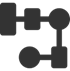

# Цілі створення цифрового двійника

Цифрову технологію створення цифрового двійника слід використовувати для **однієї або кількох із наступних цілей**:

- **Віртуальне проектування** Модельно-орієнтована системна інженерія, включаючи аналіз і проектування, що гарантує виконання вимог і безперебійну інтеграцію, тестування, верифікацію та валідацію.
- **Залучення клієнтів.** Інтерактивне відображення системи та її можливостей, щоб клієнти могли зрозуміти, наскільки вона відповідає їхнім потребам і як вони її використовуватимуть.
- **Введення в експлуатацію.** Перевірка впровадження системи на місці з її проектом, зафіксованим у цифровому двійнику, для виявлення помилок або аномалій під час введення в експлуатацію.

- **Зворотній зв’язок з інженерами.** Отримання характеристик використання за допомогою цифрового двійника для інформування інженерів про потреби змінити проекти, про майбутні проекти або про операційні ризики.
- **Моніторинг.** Моніторинг роботи системи за допомогою цифрового двійника, який потім може, наприклад, виявляти аномалії, зниження продуктивності тощо.

- **Оптимізація та найкраща якість.** Керування процесом за допомогою цифрового двійника для оптимізації роботи системи для досягнення найкращої продуктивності та ефективності.
- **Планування.** Організація робочих процесів на основі фактичних даних і аналізу, наданих цифровим двійником.
- **Діагностика.** Дослідження причини або характеру несправності, ситуації чи проблеми у фізичній системі шляхом обґрунтування реальних даних у цифровому двійнику.

- **Профілактичне обслуговування.** Технічне обслуговування та обслуговування фізичної системи, яке зменшує ймовірність збоїв на основі спостережуваного та передбачуваного стану системи, видимого в цифровому двійнику.
- **Розумна логістика.** Логістичні процеси, які адаптуються до поточних даних про потреби та параметри, як це видно в цифровому двійнику.
- **Розумні системи.** Системи, які адаптуються до свого динамічного середовища, стану чи завдань і, можливо, вчаться робити це найкраще. Тоді цифровий двійник є основною частиною керування системою.

Запропонований проект має **підвищити цифрову зрілість кінцевого користувача**, привести до доведених бізнес-вигод для малого та середнього бізнесу з використанням технологій цифрових двійників, а впровадження має врешті-решт **надати чіткі уроки, якими можна поділитися** зі спільнотою виробників. в Європі. 

Цифровий двійник можна розробляти для виробничої лінії або окремого компонента цієї лінії. Але також можливо, що компанія хоче створити цифровий двійник для своїх продуктів, або на етапі проектування, або на етапі використання продукту.

Вили цілей у вебінарі українською [за посиланням](https://www.youtube.com/watch?v=NzLlyQ5TgCo&t=1339s)

##  Віртуальне проектування / Virtual  Design

Модельно-орієнтована системна інженерія, включаючи аналіз і проектування, що гарантує виконання вимог і безперебійну інтеграцію, тестування, верифікацію та валідацію.

Пов'язані KPI:

- Загальна вартість володіння (TCO) (власні активи)
- Різноманітність портфоліо продуктів / послуг

Приклади застосувань

- **Design Twin**: Імітаційне моделювання може бути використане під час проектування для створення даних, які допоможуть покращити процес проектування та призвести до кращого дизайну.
- **Collaborative Desighn** ([вебінар](https://www.youtube.com/watch?v=NzLlyQ5TgCo&t=2145s)): Припустимо проектант завантажує якийсь CAD файл для виробу. Перед виробництвом потрібно внести деякі коригування. У компанії може бути багато різних відділів, які працюють над одним і тим же проектом. Тому, щоб зробити це можливим необхідно сумісно працювати кільком відділам. Тоді виникає питання як саме працювати разом над одними моделями і ділитися цими даними? У цьому випадку знадобиться деяке програмне забезпечення, щоб об’єднати обидві ваші компанії або відділи. Виходить CAD модель — це фактично ті дані, якими потрібно поділитися. І будь-які зміни, які вносяться необхідно проводити через керування версіями, і приймати рішення щодо того, яким буде кінцевий продукт. Основа для цього — це 3D-модель фактичного кінцевого продукту. І сама по собі CAD модель не є двійником, але це можуть бути дані, які ви фактично вводите в двійник, щоб отримати нову інформацію. Це стосується як робіт в середині компанії так і сумісно з замовником. 
- **Rapid Prototyping**: Запустивши проект в робочому контексті, помилки в прототипі можна виявити раніше.
- **Parametric Design** ([вебінар](https://www.youtube.com/watch?v=NzLlyQ5TgCo&t=2216s)): Створення дизайнів на основі параметрів замість ручного створення нових продуктів. Наприклад машина, яка  змодельована за допомогою параметричного проектування. При такому проектуванні можна наприклад вказати, скільки пляшок ви хочете наповнити і якого типу, або яка тривалість наповнення, скільки відсіків для цього потрібно і тому подібне. При розрахунку система моделювання автоматично відрегулює частини і модулі, а також налаштує фактичне CAD креслення для виготовлення машини. Інший приклад - конструкції створені за результатами перепроектування деталей з використанням технологій штучного інтелекту. Тут кожна деталь є унікальним елементом в конструкції кінцевого продукту. Ви можете мати кілька різних схем оптимізації, при розрахунку яких використовується цифровий двійник зі штучним інтелектом. При цьому на кожному циклі розраховується міцність деталей, міцність конструкції за мінімальних витрат матеріалів, та інші характеристики.

##  Залучення клієнтів / Customer  Engagement

Інтерактивне відображення системи та її можливостей, щоб клієнти могли зрозуміти, наскільки вона відповідає їхнім потребам і як вони її використовуватимуть.

Пов'язані KPI:

- Ринкова частка     
- Задоволеності клієнтів

Приклади застосувань:

- **Promo, Marketing, Pre-sales**: Наявність візуальної моделі продукту, щоб потенційні клієнти могли бачити, що вони отримають
- **Customer Engagement**: Дозволяє клієнту змінити модель і побачити, як це вплине на витрати, продуктивність тощо.
- **Make2Order**: Дозволяє клієнту створювати власну модель і відразу бачити, що він отримає за яку ціну, і мати можливість натиснути «зробити»

##  Введення в експлуатацію / Commissioning

Перевірка впровадження системи на місці з її проектом, зафіксованим у цифровому двійнику, для виявлення помилок або аномалій під час введення в експлуатацію.

Пов'язані KPI:

- Вихід  з першої спроби / First Time Yield (FTY)

Приклади застосувань

- **Virtual Commisioning**: За допомогою симуляції правильні параметри можна виявити до того, як машина буде повністю встановлена замовником. Також можуть бути знайдені будь-які невідповідні частини, які не відповідають фактичній ситуації в місці встановлення

##  Зворотній зв’язок з інженерами / Feedback  to Engineering

Отримання характеристик використання за допомогою цифрового двійника для інформування інженерів про потреби змінити проекти, про майбутні проекти або про операційні ризики.

Пов'язані KPI:

- Вихід  з першої спроби / First Time Yield (FTY)

Приклади застосувань

- **Process Engineering simulation**:  Моделювання процесу та його ключових відповідних параметрів, щоб побачити, як  процес можна покращити     
- **Process Insights with Data Science**: Використання аналітики для виявлення нових механізмів у  поточному процесі

##  Моніторинг / Monitoring

Моніторинг роботи системи за допомогою цифрового двійника, який потім може, наприклад, виявляти аномалії, зниження продуктивності тощо.

Пов'язані KPI:

- Загальна вартість володіння (TCO) (own assets)     
- Загальна ефективність обладнання (OEE)

Приклади застосувань

- **Anomaly detection**: Вихід моделі  порівнюється з фактичним виходом реального пристрою. Будь-які розбіжності  можуть вказувати на те, що щось відбувається.     
- **OEE**: Визначає  загальну ефективність обладнання     
- **Fleet Management:** Надає  огляд усього обладнання та його відповідні показники

Приклади

- **Автоматизоване виробництво** [вебінар](https://www.youtube.com/watch?v=NzLlyQ5TgCo&t=1859s) . Виробнича лінія для фасування в пляшки де робот витягує пляшки які лежать горизонтально. Заздалегідь запрограмувати робота на забирання цієї пляшки з будь якої позиції було б неможливо. Використання цифрового двійника допомогло підвищити рівень досвіду персоналу на заводі, який обслуговує цих роботів. Дало можливість зробити їх більш обізнаними про те, як цей робот може працювати на високошвидкісній лінії виробництва пляшок, і як вони насправді можуть впроваджувати інновації, щоб зробити цього професійного робота, скажімо так, адаптованими до навколишнього середовища. 
- **Вимірювання якості** [вебінар](https://www.youtube.com/watch?v=NzLlyQ5TgCo&t=1936s) . Вимірювання якості друку на 3D-принтері. Після друку використовуються фотокамери для створення 3D-зображення надрукованих об’єктів. Створене зображення порівнюється з проектним для визначення відмінностей між ними. Також порівнюється як саме різні параметри процесу 3D-друку впливають на ці показники якості. Тут поєднані дві цілі: одна – це моніторинг, а інша – оптимізація та якість.
- **Відстеження замовлень** ([вебінар](https://www.youtube.com/watch?v=NzLlyQ5TgCo&t=2361s)): Моделювання виробничих потоків на виробництві. Ви можете отримати інформацію про те, як буде проходити виробництво, якщо вам потрібно внести якісь зміни. Наприклад, які затримки можуть бути за різних варіантів виконання послідовності замовлень.

##  Оптимізація та найкраща якість / Optimization  & Best Quality

Керування процесом за допомогою цифрового двійника для оптимізації роботи системи для досягнення найкращої продуктивності та ефективності.

Пов'язані KPI:

- Коефіцієнт повернень/відмов      
- Пропускна здатність     
- Час зміни     
- Загальна ефективність обладнання (OEE)

Приклади застосувань

- **Process mining**:  створювати фактичні процеси за допомогою  аналітики даних для порівняння з офіційними процесами     
- **Work preparation**:  Створення робочих інструкцій замість їх проектування вручну     
- **Zero programming**: Створення  машинних інструкцій замість їх створення вручну     
- **optimization strategies**: моделі / симуляції для виявлення різних типів  оптимізації     
- **plant coordination**:  залишатися під контролем і розуміти, які вдосконалення застосовувати в  конкретних ситуаціях.     
- **first time right**: Передбачте  матеріали / налаштування / інструкції / програмування, щоб створити новий  продукт у правильний спосіб з першого разу     
- **dynamic recipes**:  Можливість перемикати рецепти/налаштування залежно від поточної ситуації  продукту/машини/матеріалу     
- **modular production**:  Можливість змінювати інструменти без перепрограмування для різних  продуктів     
- **quality control/zero defects**: модель для прогнозування якості продукту та можливість  налаштувати контроль процесу для гарантування якості     
- **operator support**: Використання  моделей і моделювання для створення інструкцій для оператора, щоб краще  керувати машиною

Приклади

- **Автоматизоване виробництво** [вебінар](https://www.youtube.com/watch?v=NzLlyQ5TgCo&t=1859s) . Виробнича лінія для фасування в пляшки де робот витягує пляшки які лежать горизонтально. Заздалегідь запрограмувати робота на забирання цієї пляшки з будь якої позиції було б неможливо. Використання цифрового двійника допомогло підвищити рівень досвіду персоналу на заводі, який обслуговує цих роботів. Дало можливість зробити їх більш обізнаними про те, як цей робот може працювати на високошвидкісній лінії виробництва пляшок, і як вони насправді можуть впроваджувати інновації, щоб зробити цього професійного робота, скажімо так, адаптованими до навколишнього середовища. 
- **Вимірювання якості** [вебінар](https://www.youtube.com/watch?v=NzLlyQ5TgCo&t=1936s) . Вимірювання якості друку на 3D-принтері. Після друку використовуються фотокамери для створення 3D-зображення надрукованих об’єктів. Створене зображення порівнюється з проектним для визначення відмінностей між ними. Також порівнюється як саме різні параметри процесу 3D-друку впливають на ці показники якості. Тут поєднані дві цілі: одна – це моніторинг, а інша – оптимізація та якість.
- **Моделювання виробничого процесу** ([вебінар](https://www.youtube.com/watch?v=NzLlyQ5TgCo&t=2278s)). Імітаційна модель виробничого процесу, де є металевий лист, де потрібно робити вигини у вказаних місцях. Імітаційна модель дає можливість промоделювати роботу машини, отримати деякі показники з неї за різних значень параметрів, та отримати певні показники якості виробу. А потім зробити порівняння з тим, що було спроектовано. Інший приклад - це зварювальний робот. Тут спочатку на віртуальній установці робляться розрахунки для всього процесу зварювання. Після перевірки можливості такого зварювання, можна почати фактичне виконання роботи.

##  Планування / Scheduling

Організація робочих процесів на основі фактичних даних і аналізу, наданих цифровим двійником.

Пов'язані KPI:

- Пропускна здатність

Приклади застосувань

- **Planning**: Модель, яка може  передбачити, скільки часу займає кожне завдання, і може оптимізувати порядок  виконання завдань у часі, щоб максимізувати кількість виконаних завдань

Приклади:

- **Планування замовлень** ([вебінар](https://www.youtube.com/watch?v=NzLlyQ5TgCo&t=2321s)): Це більше відноситься до моделювання того, як працює бізнес-процес. Це може дати відповідь на питання: чи можна очікувати затримок у бізнес-процесі? Чи насправді правильно поінформується замовник, та коли він отримає доставку своїх товарів? І якщо є якісь збої у виробничому процесі, чи можу я тоді впоратися з цим і все одно забезпечити доставку, чи я повинен повідомити замовника, що вона затримається. Або навпаки, можливо він отримає продукти раніше?  

##  Діагностика / Diagnosis

Дослідження причини або характеру несправності, ситуації чи проблеми у фізичній системі шляхом обґрунтування реальних даних у цифровому двійнику.

Пов'язані KPI:

- Загальна вартість володіння (TCO) (own assets)
- Пропускна здатність
- Загальна ефективність обладнання (OEE)

Приклади застосувань

- **Fault analysis**: Аналіз, який може  визначити, якщо і коли виникають несправності     
- **Fault Diagnosis**:  Аналіз, який може визначити причину несправності     
- **Fleet Analysis**: Порівняння  кількох машин одна з одною, щоб визначити, які частини парку функціонують  краще за інші

##  Профілактичне обслуговування / Preventive  Maintenance

Технічне обслуговування та обслуговування фізичної системи, яке зменшує ймовірність збоїв на основі спостережуваного та передбачуваного стану системи, видимого в цифровому двійнику.

Пов'язані KPI:

- Загальна вартість володіння (TCO) (at customer)

Приклади застосувань

- **Predictive maintenance**: Модель, яка  оцінює поточний стан і здатна вказати, коли рівень роботи впаде нижче  мінімального рівня, і може вказати, які заходи необхідно вжити для підвищення  рівня роботи

Приклади

- **Допомога в обслуговуванні** ([вебінар](https://www.youtube.com/watch?v=NzLlyQ5TgCo&t=1966s)). Людина з окулярами доповненої реальності Hololens обслуговує машину відповідно до інструкцій, які отримує через ці окуляри. Там він бачить який має бути наступний крок і візуальне представлення операції, яку він повинен виконати.

## Розумна логістика / Smart  Logistics

Логістичні процеси, які адаптуються до поточних даних про потреби та параметри, як це видно в цифровому двійнику.

Пов'язані KPI:

- Рентабельність (e.g. Gross profit margin)
- Повернення інвестицій
- Пропускна здатність

Приклади застосувань

- **Twin of supply chain**: Моделюючи  поведінку ланцюга постачання, можна прогнозувати поведінку ринку або  пов’язані з цим ризики     
- **Logistics**: Модель,  яка допомагає спланувати, як матеріали або продукти потрібно транспортувати  на заводі     
- **Factory Capabilities**: Знаючи  можливості машин та інших заводів, можна генерувати автоматизовані плани, яка  частина виробничого процесу ким і де має бути виконана.     
- **Factory Layout Plan**:  Модель заводського цеху для кращого планування змін на заводі

##  Розумні системи / Smart  Systems

Системи, які адаптуються до свого динамічного середовища, стану чи завдань і, можливо, вчаться робити це найкраще. Тоді цифровий двійник є основною частиною керування системою.

Пов'язані KPI:

- Дохід     
- Загальна вартість володіння (TCO) (own assets)

Приклади застосувань

- **Servitization**: Продаж продукту як  послуги вимагає розумного пристрою, здатного звітувати про себе     
- **Twin of the device**: Продаж  близнюка разом з товаром дозволить клієнту використовувати модель у власних  цілях     
- **Twin of material**:  Продаж інформації разом із матеріалом дозволить користувачеві краще  застосовувати матеріал у процесі, наприклад якісну інформацію     
- **Services**: Продаж  додаткових послуг на базі двійника продукту