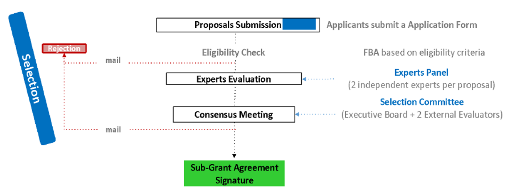
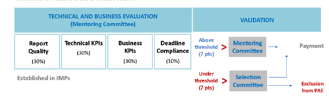

# Посібник для заявників (Guide for Applicants - GfA)

**SMART4ALL Cross-Domain Technology Transfer Experiments (CTTE)**

Кінцевий термін подання:  **17 січня 2023 до 17:00 CET**

The 3rd open call for Cross-domain Technology Transfer Experiments  (CTTE) is open to applications (21 October 2022 - 17 January 2023)!

[Оригінал](https://fundingbox-images.s3-eu-central-1.amazonaws.com/passport/opportunities/resumes/smart4all_-_3rd_ctte_open_call_gfa.pdf)

[Часті запитання (FAQ) ](CTTE_qa.md)

[SMART4ALL Comunity](https://spaces.fundingbox.com/c/smart4all-1)

[SMART4ALL Matchmaking & Partner Search Service](https://matchmaking.smart4all-project.eu/)

# 1  Основна інформація про SMART4ALL

## 1.1  Базові означення

- Академічні організації – це університети та інші академічні установи.

- Промислові організації стосуються МСП і трохи більших компаній, як визначено в Розділі 3.1.

- Системні інтегратори/постачальники технологій – це академічні або промислові організації, як означено в Розділі 3.1.

- **Експерименти застосування Pathfinder** (PAE Pathfinder Application Experiments): експерименти для підтримки вдосконалення цифрових навичок європейських громадян. Експерименти з передачі знань (KTEs), які діють як стажування/стажування, учнівство та короткострокові програми навчання для безробітних на вакантні цифрові вакансії. Експерименти з цілеспрямованої передачі технологій (FTTE) і міждоменні експерименти з передачі технологій (CTTE), які є транскордонними експериментами з передачі технологій, які об’єднують європейські компанії, соціальних партнерів, некомерційні організації та освіту та мають намір залучити цифрові навички до робочї сили.
- **Виконавча рада** (Executive Board) є керівним органом SMART4ALL, який відповідає за наукове планування та моніторинг виконання Проекту. Він складається з координатора проекту та основних партнерів консорціуму SMART4ALL.

- **Відбірковий комітет**(Selection Committee) є керівним органом SMART4ALL, який визначатиме обраних бенефіціарів відкритого конкурсу. Він складається з Виконавчої ради та 2 зовнішніх оцінювачів.
- **Наставницький комітет** (Mentoring Committee) є керівним органом SMART4ALL, який оцінюватиме ефективність відібраних проектів протягом грантового циклу. До його складу входять спеціалісти з технічних проектів, спеціалісти з інновацій, спеціалісти з розвитку бізнесу, а також технічні та бізнес-ментори.
- **DIH** — це Digital Innovation Hub (Цифровий інноваційний центр), тобто юридична особа, яка функціонує як регіональна мережа дослідницьких, інноваційних, бізнесових і галузевих організацій з метою забезпечення цифрового прогресу в регіоні. Цифрові інноваційні центри — це універсальні центри, які допомагають компаніям стати більш конкурентоспроможними щодо їхніх бізнес/виробничих процесів, продуктів або послуг із використанням цифрових технологій. Вони базуються на технологічній інфраструктурі (Competence Center – **CC**) і надають доступ до найновіших знань, досвіду та технологій для підтримки своїх клієнтів у пілотуванні, тестуванні та експериментуванні з цифровими інноваціями. DIH також надають ділову та фінансову підтримку для впровадження цих інновацій, якщо це необхідно по всьому ланцюжку створення вартості. Оскільки близькість вважається надзвичайно важливою, вони виступають першою регіональною точкою контакту, дверима та зміцнюють інноваційну екосистему. DIH — це регіональна багатопартнерська співпраця (включаючи такі організації, як RTO, університети, промислові асоціації, торговельні палати, інкубатори/акселератори, агенції регіонального розвитку та навіть уряди), а також може мати тісні зв’язки з постачальниками послуг за межами свого регіону, що підтримує компанії з доступом до їхніх послуг.

## 1.2  Про SMART4ALL

**SMART4ALL** — це проект, що фінансується в рамках H2020 (угода про надання гранту № 872614), який нарощує потенціал серед європейських зацікавлених сторін шляхом розробки самодостатніх транскордонних експериментів, які передають знання та технології між академічними та промисловими колами. Він націлений на налаштовувані обчислення з низьким споживанням енергії (**CLEC** Customised Low-Energy Computing) для кіберфізичних систем (**CPS** Cyber-Physical Systems) та Інтернету речей (**IoT**) і поєднує набір унікальних характеристик, які об’єднують у спільне бачення різні культури, різні політики, різні географічні регіони та різні домени застосування.

Консорціум SMART4ALL очолює [Університет Пелопоннесу](https://www.uop.gr/) (Греція) і складається з 25 партнерів із Центральної, Південної та Східної Європи.

SMART4ALL представляє нову парадигму для виявлення «прихованих скарбів інновацій» – переважно з географічних регіонів, які недостатньо представлені в європейському фінансуванні – та допомагає їм знайти шлях до ринку за допомогою нових, інноваційних комерційних продуктів. У рамках своєї стратегії проект розвиватиме та підтримуватиме активну мережу DIH у Центральній, Південній та Східній Європі для підтримки науковців, малого та середнього бізнесу та трохи більших компаній, які вступають в еру цифровізації.

Щоб досягти цього, SMART4ALL розробить і впровадить 3 типи транскордонних експериментів Pathfinder Application Experiments (PAE):

1) Експерименти з передачі знань (**KTE** Knowledge Transfer Experiments ), які включають новий тип експериментів стажування, що дозволяє представити, перевірити менші проекти або менш зрілі ідеї та, таким чином, потенційно знайти благодатне ґрунт для зростання та розкриття потенціалу продукту.

2) Цілеспрямовані експерименти з передачі технологій (**FTTE** Focused Technology Transfer Experiments ) дадуть можливість сформувати синергію, прискорити проекти, орієнтовані на продукт, і запропонують керівництво для успішної комерціалізації.

3) Експерименти міждоменного трансферу технологій (**CTTE** Cross-domain Technology Transfer Experiments ), націлені на більш складні міждисциплінарні трансфери та виробництво нових CLEC CPS та технологій IoT на більш широких ринках.

Цільові області застосування (targeted application areas) – це домени, які не належним чином представлені в поточних проектах Smart Anything Everywhere (**SAE**), і включають оцифроване середовище (digitized environment), оцифроване сільське господарство (digitized agriculture), оцифроване будь-що(digitized anything) та оцифрований транспорт(digitized transport).

SMART4ALL також представляє концепцію Marketplace-as-a-Service (**MaaS**), яка діє як єдина інтелектуальна зупинка (one-stop-smart- stop) кластера SMART4ALL DIH для пропонування інструментів, послуг і платформ, заснованих головним чином на технологіях з відкритим кодом, а також постачальників-приймачів технологій можливості пошуку партнерів, адаптовані до чотирьох тематичних стовпів проекту.

SMART4ALL також планує горизонтальні заходи, які підтримуватимуть програму цифрових навичок Європейської комісії та підтримку чутливих соціальних груп через ідеї та продукти, які мають значний вплив на їх життя. У цьому Посібнику для заявників описується третій відкритий конкурс SMART4ALL на цілеспрямовані експерименти з передачі технологій (FTTE).

## 1.3 Яка технологія лежить в основі SMART4ALL?

SMART4ALL зосереджується на CLEC, тобто обчислювальних технологіях з низьким енергоспоживанням, які застосовуються в чотирьох вертикалях SMART4ALL з європейським лідерством і стратегічним значенням, включаючи, але не обмежуючись, наступні сфери компетенції SMART4ALL (див. таблицю нижче):

| DIGITIZED TRANSPORT                                          | DIGITIZED  ENVIRONMENT                                       | DIGITIZED  AGRICULTURE                                       | DIGITIZED ANYTHING                                           |
| ------------------------------------------------------------ | ------------------------------------------------------------ | ------------------------------------------------------------ | ------------------------------------------------------------ |
| ●  Green transport  ●   Smart mobility  ●   Shared mobility  ●   Robotics  ●  New platforms for efficient supply- demand matchmaking  ●  Automotive electronics  ●  Autonomous vehicles  ●  Connected vehicles  ●  Streamlining  transport using big data  ●  Aeronautics and space applications  ●  Transport and Logistics  ●  City Transport Mapping | ●  Smartbuilding  •   Smarthome  •   Critical infrastructure  monitoring  •  Smart hospitals  ●  Water pollution monitoring  ●   Smartgrids  •   Energy management  ●  Environment monitoring  ●   Bio-diversity  •   Wild/migratory animals monitoring  ●   Smart industry  ●  Data processing &  data visualization | ●  Smart farming  ●   AI inspired agriculture  ●  Information based site specific applications  ●  Demand driven, sustainable  agriculture  ●  Mobile plant, soil and environment sensors  ●  Sensor networks – EU wide – cross-border  ●  Field robotics and automation systems  ●  UAV based agriculture  and plant monitoring  ●  Selective plant protection  ●  Closed nutrient cycles  ●  Agricultural  decision support systems  ●  Zero-energy food systems  ●  Circular economy  ●  Water, Energy and Food (WEF)  efficiency  ●  Revalorisation of agricultural waste | ●  Human-machine  Interaction  ●   Digital Education  ●   Industrial Automation  ●   Machine Learning  ●   Market Intelligence  ●  Medical and Health Applications  ●  Active &  Healthy Ageing  ●  Support for disabled persons  ●   Cybersecurity  ●  Data Mining and Big Data  ●   Personal security  ●  Additive Manufacturing (3D printing)  ●  Augmented and Virtual Reality  ●  Audio/Video Processing  ●  Location-based  Technologies  ●  Web and Mobile Applications  ●  Wireless Sensor Networks  ●   Disaster management  ●   Digital heritage  ●   Telemedicine  ●  Rehabilitation,  wellness, fitness  ●  E-commerce |

# 2  Що пропонує CTTE?

The **Cross-Domain Technology Transfer Experiments** (CTTE) funding instrument, focusing on one of the four defined verticals (Digitized Transport, Digitized Agriculture, Digitized Environment and Digitized Anything), will give the opportunity to form synergies, accelerate product orient projects and offer guidance towards successful commercialization.

Інструмент фінансування **Міждоменні експерименти з трансферу технологій** (CTTE, Cross-Domain Technology Transfer Experiments) зосереджений на одній із чотирьох означених вертикалей (оцифрований транспорт, оцифроване сільське господарство, оцифроване навколишнє середовище та оцифроване будь-що), дасть можливість сформувати синергію, прискорити орієнтацію на продукт проектів і пропонує вказівки щодо успішної комерціалізації.

Для цього відкритого конкурсу CTTE один академічний/промисловий **Постачальник технологій** передає нову технологію одному промисловому партнеру **Отримувачу технологій** як ранньому (першому) користувачу, а потім один промисловий **Виробничий** партнер розширює ланцюжок створення вартості. Партнери подають заявку разом як консорціум за допомогою простої форми заявки. Склад консорціуму може бути таким:

Таблиця 1 Склад консорціуму 

| Склад консорціуму | Організація 1: Постчальний технологій/Інтегратор ПЗ          | Організація 2: Отримувач технології         | Організація 3: Виробник                     |
| ----------------- | ------------------------------------------------------------ | ------------------------------------------- | ------------------------------------------- |
| Тип організації   | **Університети та інші академічні установи** або Промислові **МСП та трохи більші компанії** | Промислові **МСП та трохи більші компанії** | Промислові **МСП та трохи більші компанії** |

Постачальник технологій (Technology Provider)/Інтегратори програмного забезпечення (Software Integrators) - будь-який тип організації, що спеціалізується на передачі технологій або системній інтеграції, що обслуговує потреби кінцевих користувачів

**Провідний партнер завжди** повинен мати статус промислового партнера (**МСП або трохи більша компанія**).

## 2.1 Фінансова підтримка

Вибрані експерименти CTTE отримають до **80 000 євро** як одноразову суму на один консорціум CTTE. Максимальне фінансування для кожної окремої організації в рамках одного консорціуму CTTE не може отримувати більше ніж **60 0000,00 євро.**

У цьому третьому відкритому конкурсі CTTE ми виберемо до 4 експерименти CTTE. Загальна доступна фінансова підтримка для всіх експериментів CTTE становить до **320 000 євро** (приблизно).

Фінансова підтримка буде виплачена провідному партнеру, який потім розподілить кошти між членами свого консорціуму відповідно до розподілу ресурсів, встановленого в пропозиції.

Фінансова підтримка буде виплачена на основі подання та затвердження результатів, як означено в розділі 5.

## 2.2  Додаткова підтримка

Реалізація експериментів триває 9 місяців, протягом цього періоду SMART4ALL також пропонуватиме вибраним експериментам CTTE:

● **Технологічна підтримка**, включаючи технічне коучингування та IPR (Право інтелектуальної власності) та підтримку відкритого доступу через спеціалізованого технологічного наставника для кожного експерименту.

● **Бізнес-підтримка та доступ до фінансування**, включаючи підтримку для розробки бізнес-плану та визначення державних і приватних джерел фінансування через спеціалізованого бізнес-наставника для кожного експерименту.

● **Видимість**, вибрані експерименти CTTE буде запрошено приєднатися до [SMART4ALL marketplace](https://marketplace.smart4all-project.eu/network), крім того, вони матимуть можливість брати участь у головних подіях на Рівень ЄС.

# 3 Критерії відповідності

Ми перевіримо прийнятність усіх пропозицій, поданих до кінцевого терміну через нашу [онлайн-заявку](https://smart4all-3rd-ctte.fundingbox.com/form).Усі критерії прийнятності перелічені в цьому розділі цього Посібника для заявників. Проекти, які не відповідають цим критеріям, будуть виключені та позначені як неприйнятні. Ми перевіримо критерії прийнятності на основі інформації, наданої у вашій заявці, протягом усього процесу оцінювання.

## 3.1 Кого ми шукаємо?

Експерименти CTTE мають бути запропоновані Консорціумом, що складається з наступних типів заявників

- Університети та інші академічні установи.

- МСП і трохи більші компанії, як визначено в [Рекомендації ЄС 2003/361. ](http://eur-lex.europa.eu/legal-content/EN/TXT/?uri=CELEX%3A32003H0361&locale=en)Трохи більші компанії відповідно визначаються як організації з чисельністю персоналу менше 500 співробітників і оборотом менше або дорівнює 100 мільйонам євро, або загальний річний баланс менше або дорівнює 86 мільйонам євро.

МСП вважатиметься таким, якщо воно відповідає Рекомендації Європейської Комісії 2003/361/EC. Підсумовуючи, критерії визначення МСП такі:

- Чисельність персоналу в річній робочій одиниці (AWU) менше 250.

- Річний оборот менше або дорівнює 50 мільйонам євро АБО загальний річний баланс менше або дорівнює 43 мільйонам євро.

**Експерименти CTTE** можуть подавати будь-які з вищезазначених типів організацій, але склад консорціуму має відповідати розділу 3.2. нижче. **Одна МСП/трохи більша компанія** має бути лідером консорціуму.

Експерименти CTTE мають бути транскордонними, за участю 3 різних організацій принаймні з двох різних прийнятних країн.

## 3.2  Склад консорціуму

Консорціум складається з **3 правомочних організацій** з **принаймні двох прийнятних країн**, які виконують такі різні ролі:

*Таблиця 2 Склад консорціуму*

| Склад консорціуму | Організація 1: Постчальний технологій/Інтегратор ПЗ          | Організація 2: Отримувач технології         | Організація 3: Виробник                     |
| ----------------- | ------------------------------------------------------------ | ------------------------------------------- | ------------------------------------------- |
| Тип організації   | **Університети та інші академічні установи** або Промислові **МСП та трохи більші компанії** | Промислові **МСП та трохи більші компанії** | Промислові **МСП та трохи більші компанії** |

## 3.3 Прийнятні країни

 У цьому 3-му відкритому конкурсі CTTE будуть прийнятні такі країни:

- Держави-члени Європейського Союзу та його заморські країни та території (OCT) або

- [Країни, асоційовані з H2020.](https://ec.europa.eu/research/participants/data/ref/h2020/grants_manual/hi/3cpart/h2020-hi-list-ac_en.pdf)

- Великобританія

- Будь-яка інша країна Південно-Східної та Центральної Європи (Південно-Східної та Центральної Європи), не зазначена вище, але включена до [Додатку A робочої програми H2020](https://ec.europa.eu/research/participants/data/ref/h2020/other/wp/2018-2020/annexes/h2020-wp1820-annex-a-countries-rules_en.pdf) Країни Південно-Східної Європи: Албанія, Боснія та Герцеговина, Болгарія, Хорватія, Греція, Угорщина, Косово, Молдова, Чорногорія, Північна Македонія, Румунія, Словаччина , Словенії та Сербії.

Крім того, оскільки однією з цілей SMART4ALL є підтримка цифрової трансформації переважно в європейських країнах, недостатньо представлених у європейських схемах фінансування, за допомогою транскордонних експериментів, **консорціуми заявників, що включають принаймні одного члена з однієї з країн Південно-Східної Європи або України матиме пріоритет (крім Греції)** (див. розділ 4 цього Посібника для заявників).

## 3.4  Які види діяльності можна фінансувати?

Види діяльності, які мають право на фінансову підтримку, - це транскордонна передача технологій у такому форматі:

- Один партнер (промисловий або академічний) з однієї відповідної країни передає певну нову апаратну чи програмну технологію в області Customized Low-Energy Computing (CLEC) для Cyber-Physical Systems (CPS) та Інтернету речей (IoT) до промислового партнера отримувача (МСП або трохи більша компанія) з іншої відповідної країни. Ще один партнер із промислового виробництва розширює свій ланцюг створення вартості. Передача може включати виключне або невиключне ліцензування, навчання, послуги, документацію тощо, якщо необхідно. Продукт або рішення має працювати з однією зі сфер компетенції однієї з чотирьох вертикалей SMART4ALL, згаданих вище в розділі 1.3.

- Партнер-одержувач приймає та розгортає цю технологію, щоб удосконалити продукти, процеси чи послуги (наприклад, завдяки виграшу щодо вартості продукту, продуктивності чи споживання енергії). Таким чином, одержувач технологій досягне інновацій та відчутного впливу (наприклад, з точки зору збільшення доходів або нових робочих місць).

- Усі PAE, що фінансуються SMART4ALL, повинні будуть внести принаймні один артефакт до Marketplace проекту (https://marketplace.smart4all-project.eu/). Термін «артефакт» SMART4ALL стосується будь-якого інструменту, навчального матеріалу, послуги та/або рішення, створеного фінансованим PAE. Перегляньте наступне [посилання ](https://s3.amazonaws.com/fundingbox-sites/gear%2F1623754048275-SMART4ALL_Project_Marketplace.pdf), щоб дізнатися більше.

## 3.5 Як застосовувати?

Подання заявки на відкритий конкурс потребує часу та відданості, тому ми хочемо переконатися, що ви розумієте вимоги прийнятності, яким ви маєте відповідати.

### Вчасно:

Обов’язково надішліть свою пропозицію через [онлайн-форму ](https://smart4all-3rd-ctte.fundingbox.com/) до **дедлайну 17 січня 2023 року о 17:00 за центральноєвропейським часом.** Якщо ви подасте форму правильно, система надішле вам підтвердження вашого подання. Зв’яжіться з нами, якщо це не так. Важливо, щоб ви знали, що ми не будемо оцінювати жодну пропозицію, надіслану після кінцевого терміну та подану поза спеціальною формою.

### Вичерпно:

5 SEE countries: Albania, Bosnia and Herzegovina, Bulgaria, Croatia, Greece, Hungary, Kosovo, Moldova, Montenegro, North Macedonia, Romania, Slovakia, Slovenia and Serbia.

Ви відповіли на всі розділи форми? **Зауважте, що неможливо буде оновити будь-яку інформацію або змінити ваші пропозиції після їх надсилання.**

### Кілька повідомлень:

Кожен консорціум може подати лише одну заявку. Ані члени команди, ані будь-яка юридична особа не можуть двічі фінансуватися SMART4ALL в рамках одного відкритого конкурсу SMART4ALL. Якщо кілька обраних пропозицій мають тих самих членів команди та/або ті самі організації, фінансуватиметься лише пропозиція з найбільшою кількістю балів.

Консорціуми не зможуть змінювати свій склад після відбору. Якщо учасники консорціуму в поданій заявці не нададуть повного письмового зобов’язання щодо своєї виключної участі у вибраному проекті (не маючи можливості брати участь у будь-якому іншому з вибраних проектів) до підписання Угоди про субгрант, проект не зможе взяти участь у програмі, а інший проект буде обрано з резервного списку.

### Англійська мова:

Англійська є офіційною мовою SMART4ALL Open Calls. Усі пропозиції мають бути англійською мовою у всіх обов’язкових частинах, щоб відповідати вимогам. Якщо обов’язкові частини пропозиції на будь-якій іншій мові, уся пропозиція буде відхилена. Якщо лише необов’язкові частини пропозиції подано мовою, відмінною від англійської, ці частини не будуть оцінюватися, але пропозиція все одно буде прийнятною. Англійська також є єдиною офіційною мовою протягом усього періоду дії програми SMART4ALL. Це означає, що будь-які запитувані результати будуть прийняті, лише якщо вони подані англійською мовою.

### Кожне питання заслуговує вашої уваги:

Необхідно заповнити всі обов’язкові розділи вашої пропозиції, зазвичай позначені зірочкою. Переконайтеся, що надані дані правдиві та повні. Це вкрай важливо для нас, щоб правильно оцінити вашу пропозицію. І навпаки, будь-який додатковий матеріал, який спеціально не запитується в онлайн-формі заявки, не розглядатиметься для оцінювання, тому немає сенсу переборщувати.

### Конфлікт інтересів:

Ми візьмемо до уваги наявність потенційного конфлікту інтересів між вами та одним чи кількома партнерами консорціуму SMART4ALL. Дійсно, партнери консорціуму, їхні афілійовані особи, співробітники та постійні співробітники не можуть брати участь у програмі SMART4ALL. Усі випадки потенційного конфлікту інтересів розглядатимуться окремо.

### Здорові фінанси та чистий аркуш є обов’язковими:

Ми не приймаємо суб’єктів господарювання, які перебувають у стадії ліквідації, або підприємств, які перебувають у скрутному становищі відповідно до Регламенту Комісії № 651/2014, ст. 2.18. Ми також не прийматимемо пропозиції від організацій, які виключені з можливості отримання фінансування ЄС відповідно до положень як національного законодавства, так і законодавства ЄС, або рішенням як національного органу влади, так і органу ЄС.

### Це *ваша* пропозиція:

Ваш проект має базуватися на вашій оригінальній роботі. Якщо ні, нічого страшного, просто переконайтеся, що ваше право використовувати IPR на 100% впевнене. У майбутньому будь-які передбачувані розробки повинні бути вільними від прав третіх сторін, а якщо ні, ці права третіх сторін мають бути чітко зазначені.

## 3.6  Участь в інших відкритих конкурсах SMART4ALL і в будь-якому з проектів H2020 I4MS і SAE 

Юридичні особи не можуть отримати понад 100 000 євро через відкриті конкурси від проектів H2020 I4MS і SAE (усі отримані гранти будуть обмежені 100 000 євро, включаючи грант за цим відкритим конкурсом). Сума грантів, отриманих від ініціатив I4MS та SAE, буде вирахована з максимального гранту, доступного в цьому конкурсі. Очікується, що апліканти відповідно змінять свій бюджет, якщо це можливо, враховуючи проект та пов’язані з ним завдання, дотримуючись «правила подвійного фінансування» та повідомлять про попереднє фінансування. Подвійне фінансування означає ситуацію, коли однакові витрати на ту саму діяльність двічі фінансуються за рахунок використання державних коштів. Фундаментальним принципом, який лежить в основі правил державних витрат у ЄС, є те, що жодні витрати на ту саму діяльність не можуть двічі фінансуватися з бюджету ЄС. Ви можете знайти більше на цьому розділі 3.5 [“Financial guidelines for](https://ec.europa.eu/social/BlobServlet?docId=20893&langId=en) [applicants”.](https://ec.europa.eu/social/BlobServlet?docId=20893&langId=en)

Ця обмежена сума не включає будь-який внесок ЄС, який ваша організація отримує або отримувала в рамках проекту, що фінансується ЄС (в рамках FP7 або H2020) як бенефіціар. Участь в якості бенефіціара в проектах, що фінансуються ЄС, не впливає на участь у відкритих конкурсах SMART4ALL. Щоб отримати роз’яснення, зверніться до відповідного відділу вашої організації.

# 4  Як ми оцінимо вашу пропозицію?

Наш процес оцінювання є прозорим, чесним і рівним для всіх наших учасників. Процес відбору виглядає наступним чином:

 

*Figure 2 Процес оцінки огляду SMART4ALL* 

Ми будемо оцінювати ваш проект у 3 етапи. Ми очікуємо великої кількості заявок, тож якщо ви хочете виділитися, *якість* — це ваш шлях. Що це означає? Коротше кажучи, надайте якомога більше деталей, будучи надзвичайно чіткими та структурованими. Це допоможе нам правильно визначити ключові моменти вашої програми та побачити, як вона вписується в загальний обсяг SMART4ALL CTTE.

## 4.1  Перша автоматична перевірка відповідності вимогам

Перший крок оцінки полягає в перевірці деяких основних вимог на основі тверджень із вашої пропозиції. Ваша пропозиція буде прийнята до наступного етапу, якщо вона:

- Є **повною, читабельною і англійською мовою** в усіх обов’язкових розділах.

- Була поданою через [онлайн-форму ](https://smart4all-3rd-ctte.fundingbox.com/) протягом **крайнього терміну 17 січня 2023 року, 17:00 CET.**

- Включає правильно заповнену декларацію честі. Уважно прочитайте шаблон **Декларації честі**, який включено до форми заявки [тут](https://smart4all-3rd-ctte.fundingbox.com/), оскільки ми перевіримо відповідні надіслані заяви. Ви не зможете змінити їх після закінчення терміну.

Крім того, буде проведено першу перевірку щодо відповідності учасників, зазначених у розділі 3.

Пропозиції, які не відповідають цим критеріям, будуть виключені. Ми повідомимо вам про результати цієї першої перевірки відповідності незабаром після закінчення терміну.

## 4.2 Зовнішнє оцінювання

Застосунки CTTE будуть оцінюватися двома незалежними оцінювачами з широким досвідом у CLEC, CPS та/або IoT. Експерти будуть відібрані відповідно до особливостей CTTE.

Пропозиції будуть оцінюватися за такими критеріями:

### (1). EXCELLENCE (ВІДМІННІСТЬ)

буде оцінювати:

- Амбіції: Заявники повинні продемонструвати, наскільки запропонований CTTE виходить за межі найсучаснішого рівня техніки, і описати інноваційний підхід, що стоїть за ним (наприклад, новаторські цілі, нові концепції та підходи, нові продукти, послуги чи бізнес та організаційні моделі).

- Інновації: Заявники повинні надати інформацію про рівень інновацій на своєму ринку та про ступінь диференціації, яку принесе цей проект.

- Обґрунтованість підходу: цілі запропонованих експериментів мають бути чітко визначені, відповідні та узгоджені з цілями проекту SMART4ALL, вертикалями та сферами компетенції. Очікуване підвищення TRL (зазвичай від 5 до 7 у середньому, також можливі інші комбінації) має бути чітко описано та обґрунтовано.

### (2).  IMPACT (ВПЛИВ)

буде проаналізовано:

- Переваги співпраці: якою мірою співпраця між партнерами принесе користь кожному з них з точки зору технічних та/або ділових/ринкових очікувань, і якою мірою ця конкретна співпраця призведе до успішного експерименту та високого економічного ефекту.

- Ринкові можливості: Заявники повинні продемонструвати чітке уявлення про те, що вони хочуть робити, і чи має новий/покращений продукт ринковий потенціал, напр. оскільки це вирішує проблему для конкретного цільового клієнта.

- Конкуренція: Заявники повинні надати інформацію про ступінь конкуренції для їх конкретного продукту/послуги, а також про те, чи є пропозиція руйнівною та порушує ринок. тобто продукти/послуги, які будуть виведені на ринок, можна чітко відрізнити від конкурентів.

- Комерційна стратегія та масштабованість: Заявники мають продемонструвати рівень масштабованості нового/покращеного продукту, пояснюючи, як він буде комерціалізований для вирішення структурної проблеми в конкретному секторі/процесі/тощо, використовуючи переконливу бізнес-модель та бізнес прогнози.

- Як пропозиція впливає на життя чутливих соціальних груп. тобто Покращення або підтримка життя людей, які належать до чутливих соціальних груп (тобто вразливих груп або груп високого ризику, які є групами населення, які мають обмежений або не мають доступу до соціальних і суспільних благ і мають труднощі або не можуть на багатьох рівнях і в різні сфери, щоб мати хорошу якість життя, завдяки характеристикам, пов’язаним із статтю, віком, етнічним походженням, професією, доходом, фізичними вадами. Чутливими соціальними групами є етнічні меншини, виявлені в регіоні, мігранти, біженці, шукачі притулку, особи без громадянства, люди з обмеженими можливостями, бездомні, ті, хто бореться з будь-яким доповненням, ізольовані люди похилого віку, люди під вартою, жертви гендерного насильства, жінки у сільській місцевості на Балканах через поширеність неформальної праці, постраждалих від ВІЛ/СНІДу, тривалого безробіття, пенсіонерів з низькими доходами та дітей. Загалом, усі ті, хто стикається з труднощами, які можуть призвести до подальшої соціальної ізоляції, такими як низький рівень освіти та безробіття чи неповна зайнятість.

### (3).  IMPLEMENTATION (РЕАЛІЗАЦІЯ) 

розглянемо:

- Робочий план: робочий план експерименту має бути чітко описаний і повністю узгоджений із цілями, включаючи робочі пакети, завдання та відповідальних партнерів. План часу повинен бути реалістичним і досяжним, послідовним і ефективним.
- Внесок у ринок SMART4ALL: усі PAE, що фінансуються SMART4ALL, повинні внести принаймні один артефакт у project Marketplace (https://marketplace.smart4all-project.eu/). Термін «артефакт» SMART4ALL стосується будь-якого інструменту, навчального матеріалу, послуги та/або рішення, створеного фінансованим PAE. Опишіть, який артефакт буде виставлений на ринок. Перегляньте [документ проекту SMART4ALL](https://s3.amazonaws.com/fundingbox-sites/gear%2F1623754048275-SMART4ALL_Project_Marketplace.pdf), щоб дізнатися більше про типи артефактів.
- Команда: промоутери мають продемонструвати свої управлінські та лідерські якості, свою здатність перенести концепцію від ідеї до ринку, свою здатність реалізувати свої ідеї та зрозуміти динаміку ринку, на який вони намагаються вийти. Команда має бути збалансованою та багатофункціональною, мати сильний досвід і базу навичок.
- Ресурси: продемонструйте якість та ефективність виділених ресурсів для досягнення запропонованих цілей/результатів. Визначте витрати (за наявності) на завантаження артефакту як внеску на ринок SMART4ALL.

Кожному критерію буде присвоєно 5 балів. Порогове значення для окремих критеріїв становитиме 3. Загальне порогове значення, що застосовується до суми трьох індивідуальних балів, становитиме 10. Якщо бали оцінювачів суттєво відрізняються, розбіжність буде вирішується на консенсусній зустрічі оцінювача, а якщо це все одно не зникне, залучаючи до процесу третього оцінювача.

Для кожної заявки остаточний бал розраховуватиметься таким чином:

- Для кожного критерію буде застосовано середнє значення двох оцінок оцінювача. Якщо залучено третього оцінювача, лише два найближчих бали будуть враховуватися для середнього.
- Загальна оцінка буде складатися з трьох отриманих середніх балів.
- Кандидати, які містять у своєму консорціумі членів регіону Південно-Східної Європи або України, отримають 1 додатковий бал до загальної оцінки за кожного члена регіону Південно-Східної Європи або України. Однак цей додатковий бонусний бал не буде надано консорціумам з організаціями з Греції, оскільки Греція більше не є однією з пріоритетних країн Південно-Східної Європи.
- Якщо консорціум заявників очолює партнер з України, до загальної оцінки буде додано ще 1 додатковий бал. (максимальна кількість додаткових балів становитиме 4).

Нічиї будуть вирішуватися за такими критеріями в порядку:

- Кількість партнерів з країни Південно-Східної Європи (крім Греції) в консорціумі або України.
- Середній бал впливу.
- середній бал виконання.
- Оцінка відмінності.
- Розглянуто вертикаль (необхідно дотримуватися балансу між вертикалями серед 4 вибраних консорціумів).

| Score | Description | Justification                                                |
| ----- | ----------- | ------------------------------------------------------------ |
| 0     | Fail        | The proposal fails to address  the criterion under  examination or cannot  be judged due to missing  or incomplete information. |
| 1     | Poor        | The criterion is addressed in an  inadequate manner, or there are  serious inherent weaknesses. |
| 2     | Fair        | While the proposal broadly  addresses the criterion, there are significant weaknesses. |
| 3     | Good        | The proposal addresses the criterion well, although improvements would be necessary. |
| 4     | Very good   | The proposal addresses the criterion very well, although certain improvements are still possible. |
| 5     | Excellent   | The proposal successfully addresses all relevant aspects  of the criterion in question. Any shortcomings  are minor. |

Буде створено «Список рейтингу», і всі, хто набрав більше порогового значення, перейдуть до етапу консенсусу.

## 4.3 Консенсусна зустріч

Рейтинговий список пропозицій буде передано на консенсусну зустріч за участю «Відбіркового комітету», який складається з Виконавчої ради SMART4ALL і 2 зовнішніх оцінювачів.

«Відбіркова комісія» ухвалить консенсусом і на основі рейтингу за результатами зовнішнього оцінювання «Список фіналістів.

«Відбірковий комітет» більшістю голосів у 2/3 від усіх членів вирішить «Тимчасовий список бенефіціарів FSTP» і «Резервний список». Точну кількість схвалених пропозицій буде визначено на основі загальної якості пропозицій. Якщо заявку з найвищим рейтингом буде відхилено, ми розглянемо вибір наступної пропозиції з найкращим рейтингом.

Майте на увазі, що навіть якщо для фінансування зазвичай відбираються найкращі пропозиції, відбірковий комітет може мати вагомі підстави заперечувати проти відбору конкретного кандидата. Ці причини можуть стосуватися:

● Відповідність цілям і масштабам SMART4ALL.

● Здатність досягти максимально сильного впливу.

● Комерційна конкуренція.

● Існування значних етичних проблем.

● Наявність потенційного конфлікту інтересів.

## 4.4 Етичний огляд

Перед підписанням субгрантової угоди комітет з етики SMART4ALL перегляне всі вибрані експерименти CTTE і, зокрема, ті, що висвітлюють етичні проблеми (учасниками або оцінювачами).

Консорціуми повинні вказати у своїх заявках, чи передбачають вони будь-які етичні проблеми при розробці своїх проектів і як вони планують їх вирішити.

Кандидати, пропозиції яких відхилено через етичні проблеми або відхилені через те, що вони недостатньо розглядають етичні питання у своїх проектах, зв’яжуться електронною поштою, вказавши, що їхні пропозиції не можуть бути відібрані, і додадуть етичний звіт.

Сфери досліджень, які НЕ підходять для фінансування в рамках H2020:

- дослідницька діяльність, спрямована на клонування людини для репродуктивних цілей.

- дослідницька діяльність, спрямована на модифікацію генетичного складу людей, яка може зробити такі зміни спадковими (окрім досліджень, пов’язаних з лікуванням раку статевих залоз, які можуть фінансуватися).

- дослідницька діяльність, спрямована на створення людських ембріонів виключно з метою дослідження або отримання стовбурових клітин, включаючи техніку ядерного перенесення соматичних клітин.

- дослідження, що призводять до знищення людських ембріонів.

Мета цієї етичної перевірки полягає в тому, щоб переконатися, що SMART4ALL не підтримує експерименти CTTE, які суперечили б основним етичним принципам, і що процедури запобігання етичним проблемам, описані в пропозиції, узгоджуються з [Європейською етичною політикою](https:/ /ec.europa.eu/research/participants/docs/h2020-funding-guide/cross-cutting-issues/ethics_en.htm). У будь-якому випадку правила H2020 щодо етичних питань будуть дотримуватись, і в разі конфлікту з національними/місцевими етичними правилами перевагу матимуть правила H2020.

## 4.5  Що далі? Підготовка та підписання договору субгранту

Кожен обраний експеримент CTTE підпише субгрантову угоду з німецьким Бранденбурзьким технологічним університетом Котбус-Зенфтенберг (BTU) від імені консорціуму SMART4ALL. Кошти, надані за Угодою субгранту, надаються безпосередньо з фондів Європейського проекту SMART4ALL і, отже, є фондами, що належать Європейській Комісії: Управління коштами SMART4ALL було передано партнерам проекту в SMART4ALL через Європейську Комісію, Грантова угода № 872614.

Субгрантова угода SMART4ALL включатиме набір зобов’язань, які вибрані члени консорціуму PAE мають перед Європейською Комісією.

Перед підписанням субгрантової угоди вам слід надати документи, що підтверджують ваш офіційний статус. Консорціум SMART4ALL приступить до перевірки цих документів, щоб підтвердити правомочність кожного члена консорціуму CTTE.

Будьте надзвичайно пильними щодо:

● **Характеру документів**, які ми запитуємо. Якщо документи, які ви нам надасте, не підтвердять ваше право на участь, пригоди закінчаться на цьому.

● **Крайні терміни**, які ми надамо вам, щоб передати нам ці документи. Якщо ви не надасте запитані документи вчасно без чіткого та розумного обґрунтування, ми будемо змушені виключити вас із подальшої формальної оцінки. Потім вас замінить інший заявник зі списку Резерву.

# 5 Програма нашої підтримки та способи оплати 

## 5.1 Одноразова сума

Після того, як вашу відповідність буде підтверджено після офіційної перевірки та підписано Угоду про субгрант, ви станете офіційним бенефіціаром програми SMART4ALL.

Вибрані експерименти CTTE отримають фіксовану одноразову суму до 80 000 євро на один консорціум CTTE. Одноразова сума – це спрощений спосіб розрахунків за проектами, що фінансуються за кошти Horizon 2020. Це означає, що вам не потрібно надавати бухгалтерські документи для підтвердження понесених витрат, пов’язаних з інвестиціями (наприклад, рахунки-фактури). Однак ви зобов’язані продемонструвати, що реалізація проекту відповідає визначеним для нього етапам. Основні етапи (результати, KPI та етичні рекомендації) будуть означені та розкладені в «Індивідуальному плані наставництва», Individual Mentoring Plan, розробленому на початку програми.

Коротше кажучи, ми ретельно оцінимо ваш прогрес і якість вашої роботи під час проміжних перевірок, але ми не перевірятимемо вашу бухгалтерію. Майте на увазі, що одноразова допомога не звільняє вас від обов’язку збору документів для підтвердження витрат згідно з податковим регулюванням.

## 5.2 Прийнятні витрати

Загальна фінансова підтримка для вибраних експериментів CTTE включає відшкодування лише таких форм витрат:

- Витрати на персонал, залучений до експериментів CTTE.

- Навчання та обслуговування, пов’язані з CTTE, для галузевих партнерів.

- Розробка ліцензії та договору про інтелектуальну власність.

- Необхідні витрати на проїзд для спільних візитів партнерів CTTE або презентацій чи демонстрацій CTTE, організованих SMART4ALL.

- Витрати на забезпечення відкритого доступу до наукових публікацій, пов'язаних з CTTE.

- Вартість витратних матеріалів та обладнання.

- Витрати, понесені під час завантаження артефакту як внеску на ринок SMART4ALL.

**Примітка.** У випадку **комерційних юридичних осіб**, навіть якщо ми надаємо одноразову суму, вам потрібно буде вказати **бюджет у своїй заявці, а запитувана сума гранту не може перевищувати 70% ** кошторису витрат на виконання проекту**. Некомерційні організації можуть запитувати 100% своїх витрат**.

## 5.3 Результати та платежі

Відібрані транскордонні експерименти CTTE разом із призначеними наставниками на початку програми підтримки означать «Індивідуальний план наставництва (Individual Mentoring Plan, IMP)» . У цьому документі встановлюються ключові показники ефективності та 3 кінцеві результати, які враховуватимуться під час оцінювання ефективності експериментів SMART4ALL на етапах.

«Комітет з наставництва» оцінюватиме результативність відібраних проектів на етапах перевірки (встановлюється кожні 2-3 місяці) відповідно до таких критеріїв:

- Якість результатів. Оцінюється менторами на основі кінцевих результатів, визначених у IMP.

- Технічні показники. Оцінюється технічним наставником на основі KPI, встановлених у IMP.
- Показники ефективності діяльності. Оцінюється бізнес-менторами на основі KPI, встановлених у IMP.
- Дотримання термінів. Оцінюється менторами.

Кожен критерій оцінюватиметься від 0 до 10, а вага кожного з цих критеріїв у підсумковій оцінці буде наступною:

- Якість результатів(30%).

- Технічні показники (30%).

- Показники ефективності діяльності (30%).

- Дотримання термінів (10%). 

Згідно з цим остаточним балом:

- Експерименти CTTE, що перевищують порогове значення (7 балів), успішно отримають наступний платіж і стануть кандидатом на продовження участі в програмі.

- Експерименти CTTE під порогом. Експерименти CTTE, які не досягли порогового значення, будуть розглянуті «Відбірковою комісією», яка прийме остаточне рішення з урахуванням усіх можливих об’єктивних причин неефективності (тобто зовнішніх факторів, які могли вплинути на ефективність експериментів CTTE). Ті, хто не складе цей іспит, не отримають наступного платежу та будуть запрошені залишити Програму.

На наступному рисунку підсумовано процес перегляду експерименту CTTE:

 

*Figure 3 SMART4ALL support program evaluation overview*

Платежі після затвердження кожного з 3 результатів будуть такими:

Таблиця 4 Платіжні механізми SMART4ALL

| Очікувані результати | **Submission date**      | Одноразова оплата |
| -------------------- | ------------------------ | ----------------- |
| Початковий план      | Підписання SGA + 15 днів | 30%               |
| Проміжний звіт       | Кінець 5-го місяця       | 50%               |
| Кінцевий звіт        | Кінець 9-го місяця       | 20%               |

# 6 Зв'яжіться з нами

## 6.1 Як ми можемо вам допомогти?

Якщо у вас все ще є будь-які сумніви щодо нашого процесу Open Call, не соромтеся зв’язатися з нами:

- Щоб отримати відповідь на запитання щодо вимог до відкритого конкурсу, поставте своє запитання в [Helpdesk](https://spaces.fundingbox.com/c/smart4all-1) спільноти SMART4ALL. Щоб отримати відповіді на технічні запитання, відвідайте SMART4ALL [Helpdesk.](https://helpdesk.smart4all-project.eu/)

- Перегляньте записані вебінари та навчальні курси [тут.](https://smart4all-project.eu/opencalls-apply-now/) Будуть організовані додаткові вебінари, оголошення про які буде розміщено на головному [веб-сайті проекту](https://smart4all-project.eu/) і через наші канали соціальних мереж.

- Відвідайте [Часті запитання](https://fundingbox-images.s3-eu-central-1.amazonaws.com/passport/opportunities/resumes/smart4all_-_3rd_ctte_faqs.pdf) (FAQ). 

Якщо ви коли-небудь зіткнетеся з будь-якими технічними проблемами чи проблемами, переконайтеся, що ви включили у своє повідомлення таку інформацію:

- Ваше ім'я користувача, номер телефону та адреса електронної пошти.

- Деталі конкретної проблеми (повідомлення про помилки, що з’явилися, опис помилок, як-от розкривний список, який не працює, тощо).

- Скріншоти проблеми.

## 6.2 Скарги

Перш за все, майте на увазі, що ми не розглядатимемо вашу скаргу, **якщо**:

- Це анонімно.

- Інформація неповна.

- Це не пов'язано з результатами оцінки критеріїв прийнятності. Справді, більша частина процесу оцінювання здійснюється **незалежними експертами** у даній галузі. Консорціум проекту не втручається в їх оцінку.

Якщо після отримання результатів оцінки критеріїв прийнятності ви вважаєте, що була допущена помилка, яка призвела до відхилення вашої заявки, ви маєте право надіслати нам скаргу. Скарга має бути складена англійською мовою та подана за допомогою системи продажу заявок у [SMART4ALL](https://helpdesk.smart4all-project.eu/index.php) [Helpdesk](https://helpdesk.smart4all-project. eu/index.php)[. ](https://helpdesk.smart4all-project.eu/index.php) Будь-яка скарга повинна містити:

- Ваші контактні дані (включаючи електронну адресу).

- Предмет скарги.

- Інформація та докази щодо ймовірної помилки.

Важлива примітка щодо шкали часу:

У вас є **3 календарних дні**, щоб подати скаргу, починаючи з дня, наступного після надсилання повідомлення. Зі свого боку ми розглянемо їх протягом не більше ніж **7 календарних днів** з моменту їх отримання. Якщо нам знадобиться більше часу для розгляду вашої скарги, ми повідомимо вас електронною поштою про продовження.

# 7 Прикінцеві положення 

Будь-які питання, не охоплені цим Посібником, регулюватимуться законодавством і правилами Німеччини, пов’язаними з програмою Horizon 2020 і положеннями про гранти Європейського Союзу.

Ми робимо все можливе, щоб зберегти конфіденційність усіх даних заявника. Однак, щоб уникнути будь-яких сумнівів, ви несете повну відповідальність за вказівку конфіденційної інформації.

Ваша інтелектуальна власність залишатиметься вашою власністю. Регулювання конкретних питань прав інтелектуальної власності проектів «знизу вверх» є виключною відповідальністю третіх сторін. У випадку, якщо в експерименті CTTE бере участь більше ніж одна стороння організація, перед підписанням угоди з консорціумом SMART4ALL слід узгодити угоду про права інтелектуальної власності між сторонніми організаціями. SMART4ALL переконається, що така двостороння (або багатостороння у разі кількох сторонніх організацій) угода щодо прав інтелектуальної власності закрита, і за запитом надасть шаблон угоди щодо прав інтелектуальної власності для цієї мети.

Для вибраних експериментів CTTE угода включатиме набір зобов’язань перед Європейською комісією (наприклад: просування проекту та надання інформації про фінансування ЄС, збереження конфіденційності, розуміння потенційних засобів контролю з боку EC/ECA та OLAF).

Консорціум SMART4ALL може будь-коли скасувати виклик, змінити його положення або продовжити його. У такому випадку ми повідомимо всіх заявників про таку зміну. Підписання угоди є початковою умовою для встановлення будь-яких зобов’язань між заявниками та будь-якими партнерами Консорціуму (щодо зобов’язань щодо конфіденційності заявки).

Ви не знайшли те, що шукали? Ви можете переглянути наш [розділ частих запитань](https://fundingbox-images.s3-eu-central-1.amazonaws.com/passport/opportunities/resumes/smart4all_-_3rd_ctte_faqs.pdf)  

# 8 Додаткові поради перед наданням пропозиції 

A proposal takes time and effort, and we know it. Here a few crucial points you should read before hitting the “Submit” button in order to maximise your chances of success:

- Is your project in line with what SMART4ALL is looking for? Not 100% sure? You can consult section 3.3.

- Did you present your project in a way that will convince evaluators? Go back to section 4 if you have any doubt.

- Is your project fulfilling all the eligibility requirements described in the Guide for Applicants? Check section 3.

- Are you able to cope with our signature agreement process and payment arrangements for the selected proposals? You may want to go over section 5.

- Do you need extra help? [Get in touch!](mailto:helpdesk@smart4all-project.eu)

Пропозиція потребує часу та зусиль, і ми це знаємо. Ось кілька важливих моментів, які ви повинні прочитати, перш ніж натиснути кнопку «Надіслати», щоб збільшити свої шанси на успіх:

- Чи відповідає ваш проект тому, що шукає SMART4ALL? Не впевнені на 100%? Ви можете переглянути розділ 3.3.
- Ви представили свій проект так, щоб переконати оцінювачів? Поверніться до розділу 4, якщо у вас є сумніви.
- Чи відповідає ваш проект усім вимогам прийнятності, описаним у Посібнику для заявників? Перевірте розділ 3.
- Чи можете ви впоратися з нашим процесом підписання угоди та організацією оплати для вибраних пропозицій? Ви можете перейти до розділу 5.
- Вам потрібна додаткова допомога? [Зв'яжіться!](mailto:helpdesk@smart4all-project.eu)

# Скорочення та абревіатури

| Абревіатура |                                                              |
| ----------- | ------------------------------------------------------------ |
| **CA**      | Call Announcement - Оголошення про виклик                    |
| **GfA**     | Guide for Applicants - Керівництво для заявників             |
| **FAQs**    | Frequently Asked Questions - Питання що часто задаються      |
| **GfE**     | Guide for Evaluators - Керівництво для оцінювачів            |
| **EU**      | European Union - Європейський Союз                           |
| **CLEC**    | Customised Low-Energy Computing (налаштовувані обчислення з низьким енергоспоживанням) |
| **CPS**     | Cyber-Physical Systems - Кіберфізичні системи                |
| **IoT**     | Internet of  Things                                          |
| **SAE**     | Smart Anything Everywhere  - Розумне все скрізь              |
| **PAEs**    | Pathfinder Application Experiments - Експерименти застосування Pathfinder |
| **KTE**     | Knowledge Transfer Experiment - Експеримент із передачі знань |
| **FTTE**    | Focused Technology Transfer Experiment  - експерименти з передачі технологій |
| **CTTE**    | Cross-domain Technology Transfer Experiments - Експерименти міждоменного трансферу технологій |
| **DIH**     | Digital Innovation Hub                                       |
| **MaaS**    | Marketplace-as-a-Service - Ринок як послуга                  |
| **SME**     | Small &  Medium Enterprises - Малі та середні підприємства   |
| **ESR**     | Early-Stage Researcher - Дослідник ранньої стадії            |
| **ER**      | Experienced Researcher - Досвідчений дослідник               |
| **EUR**     | Euro                                                         |
| **FSTP**    | Financial Support to Third Parties  - Фінансова підтримка третіх сторін |
| **I4MS**    | ICT Innovation for Manufacturing SMEs -  ІКТ-інновації для виробничих малих і середніх підприємств |
| **SEE**     | South Eastern Europe                                         |
| **BTU**     | Brandenburg University of Technology Cottbus-Senftenberg  - Бранденбурзький технічний університет Котбус-Зенфтенберг |
| **IPR**     | Intellectual Property Rights -  Право інтелектуальної власності |
| **EC**      | European Commission                                          |
| **GDPR**    | General Data  Protection Regulation -  Загальний регламент захисту даних |

#  Додаток I: INFORMATION CLAUSE

Інформаційне положення щодо обробки персональних даних

Див. [ориігнальний текст](https://fundingbox-images.s3-eu-central-1.amazonaws.com/passport/opportunities/resumes/smart4all_-_3rd_ctte_open_call_gfa.pdf)