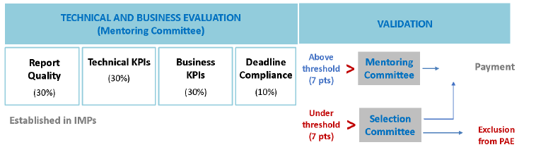

#  Посібник для заявників (Guide for Applicants - GfA)

[Оригінал](https://s3.amazonaws.com/fundingbox-sites/gear%2F1657788492151-SMART4ALL_3rd+FTTE_GFA_FINAL.pdf)

[Часті запитання (FAQ) ](FTTE_qa.md)

SMART4ALL Third Open Call for Focused Technology Transfer Experiments (FTTE)

Application submission starts on: 15 July 2022, 00:00 CEST

Submission deadline is:  **15 October 2022, 17:00 CEST**

# 1  Основна інформація про SMART4ALL

## 1.1  Базові визначення

- Академічні організації – це університети та інші академічні установи.

- Промислові організації стосуються МСП і трохи більших компаній, як визначено в Розділі 3.1.

- Системні інтегратори/постачальники технологій – це академічні або промислові організації, як визначено в Розділі 3.1.

- **Експерименти застосування Pathfinder** (PAE Pathfinder Application Experiments): експерименти для підтримки вдосконалення цифрових навичок європейських громадян. Експерименти з передачі знань (KTEs), які діють як стажування/стажування, учнівство та короткострокові програми навчання для безробітних на вакантні цифрові вакансії. Експерименти з цілеспрямованої передачі технологій (FTTE) і міждоменні експерименти з передачі технологій (CTTE), які є транскордонними експериментами з передачі технологій, які об’єднують європейські компанії, соціальних партнерів, некомерційні організації та освіту та мають намір залучити цифрові навички до робочї сили.
- **Виконавча рада** (Executive Board) є керівним органом SMART4ALL, який відповідає за наукове планування та моніторинг виконання Проекту. Він складається з координатора проекту та основних партнерів консорціуму SMART4ALL.

- **Відбірковий комітет**(Selection Committee) є керівним органом SMART4ALL, який визначатиме обраних бенефіціарів відкритого конкурсу. Він складається з Виконавчої ради та 2 зовнішніх оцінювачів.
- **Наставницький комітет** (Mentoring Committee) є керівним органом SMART4ALL, який оцінюватиме ефективність відібраних проектів протягом грантового циклу. До його складу входять спеціалісти з технічних проектів, спеціалісти з інновацій, спеціалісти з розвитку бізнесу, а також технічні та бізнес-ментори.
- **DIH** — це Digital Innovation Hub (Цифровий інноваційний центр), тобто юридична особа, яка функціонує як регіональна мережа дослідницьких, інноваційних, бізнесових і галузевих організацій з метою забезпечення цифрового прогресу в регіоні. Цифрові інноваційні центри — це універсальні центри, які допомагають компаніям стати більш конкурентоспроможними щодо їхніх бізнес/виробничих процесів, продуктів або послуг із використанням цифрових технологій. Вони базуються на технологічній інфраструктурі (Competence Center – **CC**) і надають доступ до найновіших знань, досвіду та технологій для підтримки своїх клієнтів у пілотуванні, тестуванні та експериментуванні з цифровими інноваціями. DIH також надають ділову та фінансову підтримку для впровадження цих інновацій, якщо це необхідно по всьому ланцюжку створення вартості. Оскільки близькість вважається надзвичайно важливою, вони виступають першою регіональною точкою контакту, дверима та зміцнюють інноваційну екосистему. DIH — це регіональна багатопартнерська співпраця (включаючи такі організації, як RTO, університети, промислові асоціації, торговельні палати, інкубатори/акселератори, агенції регіонального розвитку та навіть уряди), а також може мати тісні зв’язки з постачальниками послуг за межами свого регіону, що підтримує компанії з доступом до їхніх послуг.

## 1.2  Про SMART4ALL

**SMART4ALL** — це проект, що фінансується в рамках H2020 (угода про надання гранту № 872614), який нарощує потенціал серед європейських зацікавлених сторін шляхом розробки самодостатніх транскордонних експериментів, які передають знання та технології між академічними та промисловими колами. Він націлений на налаштовувані обчислення з низьким споживанням енергії (**CLEC** Customised Low-Energy Computing) для кіберфізичних систем (**CPS** Cyber-Physical Systems) та Інтернету речей (**IoT**) і поєднує набір унікальних характеристик, які об’єднують у спільне бачення різні культури, різні політики, різні географічні регіони та різні домени застосування.

Консорціум SMART4ALL очолює [Університет Пелопоннесу](https://www.uop.gr/) (Греція) і складається з 25 партнерів із Центральної, Південної та Східної Європи.

SMART4ALL представляє нову парадигму для виявлення «прихованих скарбів інновацій» – переважно з географічних регіонів, які недостатньо представлені в європейському фінансуванні – та допомагає їм знайти шлях до ринку за допомогою нових, інноваційних комерційних продуктів. У рамках своєї стратегії проект розвиватиме та підтримуватиме активну мережу DIH у Центральній, Південній та Східній Європі для підтримки науковців, малого та середнього бізнесу та трохи більших компаній, які вступають в еру цифровізації.

Щоб досягти цього, SMART4ALL розробить і впровадить 3 типи транскордонних експериментів Pathfinder Application Experiments (PAE):

1) Експерименти з передачі знань (**KTE** Knowledge Transfer Experiments ), які включають новий тип експериментів стажування, що дозволяє представити, перевірити менші проекти або менш зрілі ідеї та, таким чином, потенційно знайти благодатне ґрунт для зростання та розкриття потенціалу продукту.

2) Цілеспрямовані експерименти з передачі технологій (**FTTE** Focused Technology Transfer Experiments ) дадуть можливість сформувати синергію, прискорити проекти, орієнтовані на продукт, і запропонують керівництво для успішної комерціалізації.

3) Експерименти міждоменного трансферу технологій (**CTTE** Cross-domain Technology Transfer Experiments ), націлені на більш складні міждисциплінарні трансфери та виробництво нових CLEC CPS та технологій IoT на більш широких ринках.

Цільові області застосування (targeted application areas) – це домени, які не належним чином представлені в поточних проектах Smart Anything Everywhere (**SAE**), і включають оцифроване середовище (digitized environment), оцифроване сільське господарство (digitized agriculture), оцифроване будь-що(digitized anything) та оцифрований транспорт(digitized transport).

SMART4ALL також представляє концепцію Marketplace-as-a-Service (**MaaS**), яка діє як єдина інтелектуальна зупинка (one-stop-smart- stop) кластера SMART4ALL DIH для пропонування інструментів, послуг і платформ, заснованих головним чином на технологіях з відкритим кодом, а також постачальників-приймачів технологій можливості пошуку партнерів, адаптовані до чотирьох тематичних стовпів проекту.

SMART4ALL також планує горизонтальні заходи, які підтримуватимуть програму цифрових навичок Європейської комісії та підтримку чутливих соціальних груп через ідеї та продукти, які мають значний вплив на їх життя. У цьому Посібнику для заявників описується третій відкритий конкурс SMART4ALL на цілеспрямовані експерименти з передачі технологій (FTTE).

## 1.3 Яка технологія лежить в основі SMART4ALL?

SMART4ALL зосереджується на CLEC, тобто обчислювальних технологіях з низьким енергоспоживанням, які застосовуються в чотирьох вертикалях SMART4ALL з європейським лідерством і стратегічним значенням, включаючи, але не обмежуючись, наступні сфери компетенції SMART4ALL (див. таблицю нижче):

| DIGITIZED TRANSPORT                                          | DIGITIZED  ENVIRONMENT                                       | DIGITIZED  AGRICULTURE                                       | DIGITIZED ANYTHING                                           |
| ------------------------------------------------------------ | ------------------------------------------------------------ | ------------------------------------------------------------ | ------------------------------------------------------------ |
| ●  Green transport  ●   Smart mobility  ●   Shared mobility  ●   Robotics  ●  New platforms for efficient supply- demand matchmaking  ●  Automotive electronics  ●  Autonomous vehicles  ●  Connected vehicles  ●  Streamlining  transport using big data  ●  Aeronautics and space applications  ●  Transport and Logistics  ●  City Transport Mapping | ●  Smartbuilding  •   Smarthome  •   Critical infrastructure  monitoring  •  Smart hospitals  ●  Water pollution monitoring  ●   Smartgrids  •   Energy management  ●  Environment monitoring  ●   Bio-diversity  •   Wild/migratory animals monitoring  ●   Smart industry  ●  Data processing &  data visualization | ●  Smart farming  ●   AI inspired agriculture  ●  Information based site specific applications  ●  Demand driven, sustainable  agriculture  ●  Mobile plant, soil and environment sensors  ●  Sensor networks – EU wide – cross-border  ●  Field robotics and automation systems  ●  UAV based agriculture  and plant monitoring  ●  Selective plant protection  ●  Closed nutrient cycles  ●  Agricultural  decision support systems  ●  Zero-energy food systems  ●  Circular economy  ●  Water, Energy and Food (WEF)  efficiency  ●  Revalorisation of agricultural waste | ●  Human-machine  Interaction  ●   Digital Education  ●   Industrial Automation  ●   Machine Learning  ●   Market Intelligence  ●  Medical and Health Applications  ●  Active &  Healthy Ageing  ●  Support for disabled persons  ●   Cybersecurity  ●  Data Mining and Big Data  ●   Personal security  ●  Additive Manufacturing (3D printing)  ●  Augmented and Virtual Reality  ●  Audio/Video Processing  ●  Location-based  Technologies  ●  Web and Mobile Applications  ●  Wireless Sensor Networks  ●   Disaster management  ●   Digital heritage  ●   Telemedicine  ●  Rehabilitation,  wellness, fitness  ●  E-commerce |

## 1.4  Короткий огляд FTTE

Інструмент фінансування цілеспрямованих експериментів з передачі технологій (FTTE  - Focused Technology Transfer Experiments), який зосереджується на одній із чотирьох визначених вертикалей (оцифрований транспорт, оцифроване сільське господарство, оцифроване навколишнє середовище та оцифроване будь-що), дасть можливість сформувати синергію, прискорити проекти, орієнтовані на продукт, і запропонує керівництво для досягнення успіху комерціалізації.

Він буде короткостроковим (9 місяців) і складатиметься з транскордонних експериментів із застосуванням Pathfinder (PAE) між двома різними організаціями з двох різних прийнятних країн (відповідно до критеріїв прийнятності, викладених у розділі 3.2).

Для цього відкритого конкурсу FTTE один постачальник академічних/промислових технологій передає нову технологію обладнання (HW) або програмного забезпечення (SW) одному партнеру-отримувачу промислових технологій як першому користувачу. Партнери подають заявку разом як консорціум за допомогою простої форми заявки. Склад консорціуму може бути таким:

| Постачальник технологій | Приймач технологій |
| ----------------------- | ------------------ |
| Academic                | Industrial         |
| Industrial              |                    |

Провідний партнер завжди повинен мати статус промислового партнера (SME або трохи більша компанія).

SMART4ALL вже організував два відкритих виклики FTTE, і це буде третій і останній відкритий виклик FTTE. Усі відкриті виклики SMART4ALL є одноетапними. У цьому конкурсі буде **4 бенефіціари**. 8 бенефіціарів уже було обрано під час першого та другого відкритих конкурсів FTTE у 2020 та 2021 роках. Більше інформації про 4 обраних переможців першого відкритого конкурсу FTTE можна знайти [тут](https://smart4all-project.eu/news/1st-ftte-winners/) і з другого відкритого виклику FTTE [тут.](https://smart4all-project.eu/news/2nd-ftte-open-call-winners-announced/)

# 2 Що ми пропонуємо?

## 2.1 Фінансова підтримка

Партнери FTTE подадуть заявку на отримання фінансової підтримки, подавши одну спільну пропозицію з описом FTTE та його технічного плану та детальною оцінкою витрат, пов’язаних з FTTE.

Бенефіціарам буде надано до **80 000** євро одноразово. У цьому третьому відкритому конкурсі FTTE загальна фінансова підтримка в розмірі до 320 000 євро (приблизно) буде надана до 4 FTTE загалом.

- Фінансова підтримка на FTTE. Експерименти FTTE будуть підтримані одноразовою сумою до 80 000 євро.

- Фінансова підтримка на кожного партнера FTTE. Для цього відкритого конкурсу фінансова підтримка кожного партнера FTTE не перевищуватиме 60 000 євро.

Фінансова підтримка буде виплачена обом партнерам окремо відповідно до розподілу ресурсів, встановленого в пропозиції.

Фінансова підтримка буде виплачена на основі подання та затвердження результатів, як визначено в розділі 5.

## 2.2 Додаткова підтримка

Після вибору PAE SMART4ALL запропонує партнерам FTTE (бенефіціарам Open Call):

- Технологічна підтримка, включаючи технічне навчання та IPR та підтримку відкритого доступу через спеціалізованого технологічного наставника для кожного експерименту.

- Підтримка бізнесу та доступ до фінансування, включаючи підтримку розробки бізнес-плану та визначення державних і приватних джерел фінансування через спеціалізованого бізнес-ментора для кожного експерименту.

- Видимість завдяки порталу співпраці, де будуть опубліковані всі PAE та бенефіціари, а також участь SMART4ALL у основних подіях на рівні ЄС.

# 3 Критерії прийнятності

Ми перевіримо прийнятність усіх пропозицій, поданих до закінчення терміну. Усі критерії прийнятності перелічені в цьому розділі цього Посібника для заявників. Проекти, які не відповідають цим критеріям, будуть виключені та позначені як неприйнятні. Ми перевіримо критерії прийнятності на основі інформації, наданої у вашій заявці, протягом усього процесу оцінювання.

## 3.1 Кого ми шукаємо?

Транскордонні експерименти SMART4ALL мають бути запропоновані Консорціумом із 2 організацій, включаючи такі типи заявників (для участі в цьому конкурсі номер PIC не потрібен.):

- Університети та інші академічні установи.

- МСП і трохи більші компанії, як визначено в [Рекомендації ЄС 2003/361. ](http://eur-lex.europa.eu/legal-content/EN/TXT/?uri=CELEX%3A32003H0361&locale=en)Трохи більші компанії відповідно визначаються як організації з чисельністю персоналу менше 500 співробітників і оборотом менше або дорівнює 100 мільйонам євро, або загальний річний баланс менше або дорівнює 86 мільйонам євро.

МСП вважатиметься таким, якщо воно відповідає Рекомендації Європейської Комісії 2003/361/EC. Підсумовуючи, критерії визначення МСП такі:

- Чисельність персоналу в річній робочій одиниці (AWU) менше 250.

- Річний оборот менше або дорівнює 50 мільйонам євро АБО загальний річний баланс менше або дорівнює 43 мільйонам євро.

Зауважте, що цифри партнерів і пов’язаних підприємств також слід враховувати, як зазначено в посібнику користувача SME.

Для отримання детальної інформації перегляньте рекомендації ЄС: https://ec.europa.eu/growth/smes/sme-definition_en

Пропозиції можуть подавати будь-які з вищезазначених типів організацій, але участь принаймні одного малого та середнього бізнесу/трохи більшої компанії є обов’язковою та має очолити транскордонні експерименти Pathfinder Application Experiments (PAE).

PAE мають бути транскордонними, включати дві незалежні організації з двох різних країн, які мають право.

## 3.2  Прийнятні країни

У цьому відкритому конкурсі FTTE будуть прийнятні такі країни:

- Держави-члени Європейського Союзу та його заморські країни та території (OCT) або

- [Країни, асоційовані з H2020.](https://ec.europa.eu/research/participants/data/ref/h2020/grants_manual/hi/3cpart/h2020-hi-list-ac_en.pdf)

- Великобританія

- Будь-яка інша країна Південно-Східної та Центральної Європи (Південно-Східної та Центральної Європи), не зазначена вище, але включена до [Додатку A робочої програми H2020](https://ec.europa.eu/research/participants/data/ref/h2020/other/wp/2018-2020/annexes/h2020-wp1820-annex-a-countries-rules_en.pdf) Країни Південно-Східної Європи: Албанія, Боснія та Герцеговина, Болгарія, Хорватія, Греція, Угорщина, Косово, Молдова, Чорногорія, Північна Македонія, Румунія, Словаччина , Словенії та Сербії.

Крім того, оскільки однією з цілей SMART4ALL є підтримка цифрової трансформації в основному європейських країнах, недостатньо представлених у європейських схемах фінансування, за допомогою транскордонних експериментів, консорціуми заявників повинні включати принаймні одного члена з однієї з країн Південно-Східної Європи (крім Греції) або Україну (додаткову інформацію див. у розділі 4 цього Посібника для аплікантів).

## 3.3 Які види діяльності можна фінансувати?

Види діяльності, які мають право на фінансову підтримку, - це транскордонна передача технологій у такому форматі:

- Один партнер (промисловий або академічний) з однієї відповідної країни передає певну нову технологію апаратного чи програмного забезпечення в області Customized Low-Energy Computing (CLEC) для Cyber-Physical Systems (CPS) та Інтернету речей (IoT) до отримання галузевого партнера (МСП або трохи більша компанія) з іншої відповідної країни.

- Передача може включати виключне або невиключне ліцензування, навчання, послуги, документацію тощо, якщо необхідно. Продукт або рішення має працювати з однією зі сфер компетенції однієї з чотирьох вертикалей SMART4ALL, згаданих у розділі 1.3.

- Партнер-одержувач приймає та розгортає цю технологію, щоб удосконалити продукти, процеси чи послуги (наприклад, виграш щодо вартості продукту, продуктивності чи споживання енергії). Таким чином, одержувач технологій досягне інновацій та відчутного впливу (наприклад, з точки зору збільшення доходів або нових робочих місць).

- Усі PAE, що фінансуються SMART4ALL, повинні будуть внести принаймні один артефакт до Marketplace проекту (https://marketplace.smart4all-project.eu/). Термін «артефакт» SMART4ALL стосується будь-якого інструменту, навчального матеріалу, послуги та/або рішення, створеного фінансованим PAE. Перегляньте наступне [посилання ](https://s3.amazonaws.com/fundingbox-sites/gear%2F1623754048275-SMART4ALL_Project_Marketplace.pdf), щоб дізнатися більше.

ПРИКЛАДИ:
Приклади FTTE:

1) Алгоритм стиснення, що потребує низьких ресурсів, розроблено малим і середнім підприємством із використанням нової технології, наданої університетом з іншої країни, яка використовується в програмах, які мають значний вплив на соціально чутливі групи (вихід PAE є алгоритмом)
2) Апаратний прискорювач для обробки зображень розроблено малим і середнім підприємством з використанням революційної технології, наданої іншим малим і середнім підприємством з іншої країни, що допомагає розв’язати інтерпретацію виявлення деяких варіантів коронавірусу (результатом PAE є апаратне забезпечення).

## 3.4 Як застосовувати?

Подання заявки на відкритий конкурс потребує часу та відданості, тому ми хочемо переконатися, що ви розумієте вимоги прийнятності, яким ви маєте відповідати.

### Бути вчасно:

Обов’язково надішліть свою пропозицію через [онлайн-форму](https://smart4all-2nd-ftte.fundingbox.com/apply) до кінцевого терміну 15 жовтня 2022 року, 17:00 CEST. Заявку може подати **лише провідний партнер** (МСП або трохи більша компанія). Якщо ви надішлете форму правильно, система надішле вам підтвердження надсилання. Зв’яжіться з нами, якщо це не так. Важливо, щоб ви знали, що ми не будемо оцінювати жодну пропозицію, надіслану після кінцевого терміну та подану поза спеціальною формою.

### Будьте вичерпними:

Ви відповіли на всі розділи форми? Будь ласка, зверніть увагу, що неможливо буде додати будь-яку інформацію або змінити пропозицію після її надсилання.

### Кілька повідомлень:

Кожен консорціум може подати лише одну заявку. Ані члени команди, ані будь-яка юридична особа не можуть двічі фінансуватися SMART4ALL в рамках одного відкритого конкурсу SMART4ALL. Якщо кілька обраних пропозицій мають тих самих членів команди та/або ті самі організації, фінансуватиметься лише пропозиція з найбільшою кількістю балів.

Консорціуми не зможуть змінювати свій склад після відбору. Якщо учасники консорціуму в поданій заявці не нададуть повного письмового зобов’язання щодо своєї виключної участі у вибраному проекті (не маючи можливості брати участь у будь-якому іншому з вибраних проектів) до підписання Угоди про субгрант, проект не зможе взяти участь у програмі, а інший проект буде обрано з резервного списку.

### Англійська мова:

Англійська є офіційною мовою SMART4ALL Open Calls. Усі пропозиції мають бути англійською мовою у всіх обов’язкових частинах, щоб відповідати вимогам. Якщо обов’язкові частини пропозиції на будь-якій іншій мові, уся пропозиція буде відхилена. Якщо лише необов’язкові частини пропозиції подано мовою, відмінною від англійської, ці частини не будуть оцінюватися, але пропозиція все одно буде прийнятною. Англійська також є єдиною офіційною мовою протягом усього періоду дії програми SMART4ALL. Це означає, що будь-які запитувані результати будуть прийняті, лише якщо вони подані англійською мовою.

### Кожне питання заслуговує вашої уваги:

Необхідно заповнити всі обов’язкові розділи вашої пропозиції, зазвичай позначені зірочкою. Переконайтеся, що надані дані правдиві та повні. Це вкрай важливо для нас, щоб правильно оцінити вашу пропозицію. І навпаки, будь-який додатковий матеріал, який спеціально не запитується в онлайн-формі заявки, не розглядатиметься для оцінювання, тому немає сенсу переборщувати.

### Конфлікт інтересів:

Ми візьмемо до уваги наявність потенційного конфлікту інтересів між вами та одним чи кількома партнерами консорціуму SMART4ALL. Дійсно, партнери консорціуму, їхні афілійовані особи, співробітники та постійні співробітники не можуть брати участь у програмі SMART4ALL. Усі випадки потенційного конфлікту інтересів розглядатимуться окремо.

### Здорові фінанси та чистий аркуш є обов’язковими:

Ми не приймаємо суб’єктів господарювання, які перебувають у стадії ліквідації, або підприємств, які перебувають у скрутному становищі відповідно до Регламенту Комісії № 651/2014, ст. 2.18. Ми також не прийматимемо пропозиції від організацій, які виключені з можливості отримання фінансування ЄС відповідно до положень як національного законодавства, так і законодавства ЄС, або рішенням як національного органу влади, так і органу ЄС.

### Це *ваша* пропозиція:

Ваш проект має базуватися на вашій оригінальній роботі. Якщо ні, нічого страшного, просто переконайтеся, що ваше право використовувати IPR на 100% впевнене. У майбутньому будь-які передбачувані розробки повинні бути вільними від прав третіх сторін, а якщо ні, ці права третіх сторін мають бути чітко зазначені.

## 3.5 Участь в інших відкритих конкурсах SMART4ALL і в будь-якому з проектів H2020 I4MS і SAE 

Юридичні особи не можуть отримати понад 100 000 євро через відкриті конкурси від проектів H2020 I4MS і SAE (усі отримані гранти будуть обмежені 100 000 євро, включаючи грант за цим відкритим конкурсом). Сума грантів, отриманих від ініціатив I4MS та SAE, буде вирахована з максимального гранту, доступного в цьому конкурсі. Очікується, що апліканти відповідно змінять свій бюджет, якщо це можливо, враховуючи проект та пов’язані з ним завдання, дотримуючись «правила подвійного фінансування» та повідомлять про попереднє фінансування. Подвійне фінансування означає ситуацію, коли однакові витрати на ту саму діяльність двічі фінансуються за рахунок використання державних коштів. Фундаментальним принципом, який лежить в основі правил державних витрат у ЄС, є те, що жодні витрати на ту саму діяльність не можуть двічі фінансуватися з бюджету ЄС. Ви можете знайти більше на цьому розділі 3.5 [“Financial guidelines for](https://ec.europa.eu/social/BlobServlet?docId=20893&langId=en) [applicants”.](https://ec.europa.eu/social/BlobServlet?docId=20893&langId=en)

Ця обмежена сума не включає будь-який внесок ЄС, який ваша організація отримує або отримувала в рамках проекту, що фінансується ЄС (в рамках FP7 або H2020) як бенефіціар. Участь в якості бенефіціара в проектах, що фінансуються ЄС, не впливає на участь у відкритих конкурсах SMART4ALL. Щоб отримати роз’яснення, зверніться до відповідного відділу вашої організації.

# 4 Як ми оцінимо вашу пропозицію? 

Наш процес оцінювання є прозорим, чесним і рівним для всіх наших учасників. Процес відбору виглядає наступним чином:

 

Ми будемо оцінювати ваш проект у 3 етапи. Ми очікуємо великої кількості заявок, тож якщо ви хочете виділитися, *якість* — це ваш шлях. Що це означає? Коротше кажучи, надайте якомога більше деталей, будучи надзвичайно чіткими та структурованими. Це допоможе нам правильно визначити ключові моменти вашої програми та побачити, як вона вписується в загальний обсяг SMART4ALL FTTE.

## 4.1 Перша автоматична перевірка відповідності вимогам 

Перший крок оцінки полягає в перевірці деяких основних вимог на основі тверджень із вашої пропозиції. Ваша пропозиція буде прийнята до наступного етапу, якщо вона:

- Є повною, читабельною і англійською мовою в усіх обов’язкових розділах.

- Була подана через [веб-сайт відкритого конкурсу ](https://smart4all-2nd-ftte.fundingbox.com/apply) протягом кінцевого терміну до 15 жовтня 2022 року, 17:00 CEST.

- Включає правильно заповнену декларацію пошани. Уважно прочитайте шаблон Декларації честі, який включено до форми заявки, оскільки ми перевіримо відповідні подані заяви. Ви не зможете змінити їх після надсилання форми заявки.

Крім того, буде проведено першу перевірку щодо відповідності учасників, зазначених у розділі 3. Пропозиції, які не відповідають цим критеріям, будуть виключені. Ми повідомимо вам про результати цієї першої перевірки відповідності незабаром після закінчення терміну.

## 4.2 Зовнішнє оцінювання

Програми FTTE будуть оцінюватися двома незалежними оцінювачами з великим досвідом у CLEC, CPS та/або IoT. Експерти будуть відібрані відповідно до конкретних характеристик FTTE.

Пропозиції будуть оцінюватися за такими критеріями:

### (1). EXCELLENCE (ВІДМІННІСТЬ)

буде оцінювати:

- Амбіції: Заявники повинні продемонструвати, наскільки запропонований FTTE виходить за межі найсучаснішого рівня техніки, і описати інноваційний підхід, що стоїть за ним (наприклад, новаторські цілі, нові концепції та підходи, нові продукти, послуги чи бізнес та організаційні моделі).

- Інновації: Заявники повинні надати інформацію про рівень інновацій на своєму ринку та про ступінь диференціації, яку принесе цей проект.

- Обґрунтованість підходу: цілі запропонованих експериментів мають бути чітко визначені, відповідні та узгоджені з цілями проекту SMART4ALL, вертикалями та сферами компетенції. Очікуване підвищення TRL (зазвичай від 5 до 7 у середньому, також можливі інші комбінації) має бути чітко описано та обґрунтовано.

### (2).  IMPACT (ВПЛИВ)

буде проаналізовано:

- Переваги співпраці: якою мірою співпраця між партнерами принесе користь кожному з них з точки зору технічних та/або ділових/ринкових очікувань, і якою мірою ця конкретна співпраця призведе до успішного експерименту та високого економічного ефекту.

- Ринкові можливості: Заявники повинні продемонструвати чітке уявлення про те, що вони хочуть робити, і чи має новий/покращений продукт ринковий потенціал, напр. оскільки це вирішує проблему для конкретного цільового клієнта.

- Конкуренція: Заявники повинні надати інформацію про ступінь конкуренції для їх конкретного продукту/послуги, а також про те, чи є пропозиція руйнівною та порушує ринок. тобто продукти/послуги, які будуть виведені на ринок, можна чітко відрізнити від конкурентів.

- Комерційна стратегія та масштабованість: Заявники мають продемонструвати рівень масштабованості нового/покращеного продукту, пояснюючи, як він буде комерціалізований для вирішення структурної проблеми в конкретному секторі/процесі/тощо, використовуючи переконливу бізнес-модель та бізнес прогнози.

- Як пропозиція впливає на життя чутливих соціальних груп. тобто Покращення або підтримка життя людей, які належать до чутливих соціальних груп (тобто вразливих груп або груп високого ризику, які є групами населення, які мають обмежений або не мають доступу до соціальних і суспільних благ і мають труднощі або не можуть на багатьох рівнях і в різні сфери, щоб мати хорошу якість життя, завдяки характеристикам, пов’язаним із статтю, віком, етнічним походженням, професією, доходом, фізичними вадами. Чутливими соціальними групами є етнічні меншини, виявлені в регіоні, мігранти, біженці, шукачі притулку, особи без громадянства, люди з обмеженими можливостями, бездомні, ті, хто бореться з будь-яким доповненням, ізольовані люди похилого віку, люди під вартою, жертви гендерного насильства, жінки у сільській місцевості на Балканах через поширеність неформальної праці, постраждалих від ВІЛ/СНІДу, тривалого безробіття, пенсіонерів з низькими доходами та дітей. Загалом, усі ті, хто стикається з труднощами, які можуть призвести до подальшої соціальної ізоляції, такими як низький рівень освіти та безробіття чи неповна зайнятість.

### (3).  IMPLEMENTATION (РЕАЛІЗАЦІЯ) 

розглянемо:

- Робочий план: робочий план експерименту має бути чітко описаний і повністю узгоджений із цілями, включаючи робочі пакети, завдання та відповідальних партнерів. План часу повинен бути реалістичним і досяжним, послідовним і ефективним.

- Команда: промоутери мають продемонструвати свої управлінські та лідерські якості, свою здатність перенести концепцію від ідеї до ринку, свою здатність реалізувати свої ідеї та зрозуміти динаміку ринку, на який вони намагаються вийти. Команда має бути збалансованою та багатофункціональною, мати міцну базу досвіду та навичок.

- Ресурси: продемонструйте якість та ефективність виділених ресурсів для досягнення запропонованих цілей/результатів.

Кожен оцінювач ранжуватиме програму, призначаючи оцінку від 0 до 5 для кожного критерію, і створюватиме індивідуальний звіт про оцінку, додаючи оцінку кожному критерію. Порогове значення для кожного окремого критерію становитиме 3. Порогове значення для звіту про індивідуальну оцінку становитиме 10.

Якщо бали оцінювачів суттєво відрізняються, розбіжність буде вирішено на консенсусній зустрічі оцінювачів і, якщо вона не зникне, шляхом залучення до процесу третього оцінювача..

Для кожної заявки остаточний бал розраховуватиметься таким чином:

- Для кожного критерію буде застосовано середнє значення двох оцінок оцінювача. У разі залучення третього оцінювача, лише два найближчі бали будуть враховуватися як середнє.

- Загальний бал буде сумою трьох отриманих середніх балів.

- Кандидати, які містять у своєму консорціумі членів регіону Південно-Східної Європи або **України**, отримають **1 додатковий бал** до загальної оцінки за кожного члена регіону Південно-Східної Європи або України. Однак цей додатковий бонусний бал не буде надано консорціумам з організаціями з Греції, оскільки Греція більше не є однією з пріоритетних країн Південно-Східної Європи.

- Якщо консорціум заявників **очолює партнер з України, до загальної оцінки буде додано ще 1 додатковий бал.**

(максимальна кількість додаткових балів становитиме **3**).

Нічиї будуть вирішуватися за такими критеріями в порядку:

- Кількість партнерів з країни Південно-Східної Європи в консорціумі (крім Греції) або України.

- Середній бал впливу.

- Середній бал впровадження.

- Оцінка відмінності.

- Розглянуто вертикаль (необхідно дотримуватися балансу між вертикалями серед 4 вибраних консорціумів).

| Score | Description | Justification                                                |
| ----- | ----------- | ------------------------------------------------------------ |
| 0     | Fail        | The proposal fails to address the  criterion under examination or cannot be judged due to missing or incomplete  information. |
| 1     | Poor        | The criterion  is addressed in an inadequate manner, or there are serious inherent weaknesses. |
| 2     | Fair        | While the  proposal broadly addresses the criterion, there are significant weaknesses. |
| 3     | Good        | The proposal addresses the  criterion well, although improvements would be necessary. |
| 4     | Very good   | The proposal  addresses the criterion very well, although certain improvements are still possible. |
| 5     | Excellent   | The proposal successfully addresses all relevant aspects  of the criterion in question. Any shortcomings are minor. |

Буде створено «Список рейтингу», і всі, хто набрав більше порогового значення, перейдуть до етапу консенсусу.

## 4.3  Консенсусна зустріч

Рейтинговий список пропозицій буде передано на консенсусну зустріч за участю «Відбіркового комітету», який складається з Виконавчої ради SMART4ALL і 2 зовнішніх оцінювачів.

«Відбірковий комітет» більшістю голосів у 2/3 від усіх членів вирішить «Тимчасовий список бенефіціарів FSTP» і «Резервний список». Точну кількість схвалених пропозицій буде визначено на основі загальної якості пропозицій. Якщо заявку з найвищим рейтингом буде відхилено, ми розглянемо вибір наступної пропозиції з найкращим рейтингом.

Майте на увазі, що навіть якщо для фінансування зазвичай відбираються найкращі пропозиції, відбірковий комітет може мати вагомі підстави заперечувати проти відбору конкретного кандидата. Ці причини можуть стосуватися:

- Відповідність цілям і масштабам SMART4ALL.

- Здатність досягти максимально сильного впливу.

- Комерційний конкурс.

- Існування значних етичних проблем.

- Наявність потенційного конфлікту інтересів.

## 4.4 Етичний огляд

Перед підписанням субгрантової угоди комітет з етики SMART4ALL перегляне всі вибрані FTTE і, зокрема, ті, що висвітлюють етичні проблеми (учасниками або оцінювачами).

Консорціуми повинні вказати у своїх заявках, чи передбачають вони будь-які етичні проблеми при розробці своїх проектів і як вони планують їх вирішити.

Кандидати, пропозиції яких відхилено через етичні проблеми або відхилені через те, що вони недостатньо розглядають етичні питання у своїх проектах, зв’яжуться електронною поштою, вказавши, що їхні пропозиції не можуть бути відібрані, і додадуть етичний звіт.

Сфери досліджень, які НЕ підходять для фінансування в рамках H2020:

- науково-дослідна діяльність, спрямована на клонування людини для репродуктивних цілей.

- дослідницька діяльність, спрямована на модифікацію генетичного складу людей, що може зробити такі зміни спадковими (окрім досліджень, пов’язаних з лікуванням раку статевих залоз, які можуть фінансуватися)

- дослідницька діяльність, спрямована на створення людських ембріонів виключно з метою дослідження або отримання стовбурових клітин, включаючи техніку ядерного перенесення соматичних клітин.

- дослідження, що призводять до знищення людських ембріонів.

- Подвійне фінансування заходів.

Мета цієї етичної перевірки полягає в тому, щоб переконатися, що SMART4ALL не підтримує FTTE, які суперечили б основним етичним принципам, і що процедури запобігання етичним проблемам, описані в пропозиції, узгоджуються з [Європейською етичною політикою](https://ec.europa.eu/research/participants/docs/h2020-funding-guide/cross-cutting-issues/ethics_en.htm) У будь-якому випадку дотримуватимуться правил H2020 щодо етичних питань, а в разі конфлікту з національними/місцевими етичними правилами переважатимуть правила H2020. 

## 4.5  Що далі? Підготовка та підписання договору субгранту

Кожен відібраний заявник підпише Угоду про субгрант з німецьким Бранденбурзьким технологічним університетом Котбус-Зенфтенберг (BTU) від імені консорціуму SMART4ALL. Кошти, надані згідно з Угодою субгранту, надаються безпосередньо з фондів Європейського проекту SMART4ALL і, отже, є коштами, що належать Європейській Комісії: управління коштами SMART4ALL було передано партнерам проекту в SMART4ALL через Європейську Комісію, грант Номер договору 872614.

Субгрантова угода SMART4ALL включатиме набір зобов’язань, які бенефіціари FSTP мають перед Європейською Комісією. Завданням бенефіціарів FSTP є виконання цих зобов’язань, а партнерів консорціуму SMART4ALL – поінформувати про них бенефіціарів FSTP.

Перед підписанням субгрантової угоди вам слід надати документи, що підтверджують ваш офіційний статус. Консорціум SMART4ALL приступить до перевірки цих документів, щоб переконатися, що ви відповідаєте вимогам.

Будьте гранично пильними щодо:

1. Характер документів, які ми запитуємо. Якщо документи, які ви нам надасте, не підтвердять ваше право на участь, пригоди закінчаться на цьому.

2. Терміни, які ми надамо вам, щоб передати нам ці документи. Якщо ви не надасте запитані документи вчасно без чіткого та розумного обґрунтування, ми будемо змушені виключити вас із подальшої формальної оцінки. Потім вас замінить інший заявник зі списку Резерву.

# 5 Наша програма підтримки та порядок оплати

## 5.1 Одноразова сума

Після того, як вашу відповідність буде підтверджено після офіційної перевірки та підписаної Угоди про субгрант, ви станете офіційним бенефіціаром програми SMART4ALL. Саме зараз починається пригода, і настав час зрозуміти, як розподілятиметься фінансування.

Як бенефіціар ви отримаєте фіксовану одноразову суму до 80 000 євро. Одноразова допомога – це спрощений спосіб розрахунків за проектами, що фінансуються за кошти Horizon 2020. Це означає, що вам не потрібно надавати бухгалтерські документи для підтвердження понесених витрат, пов’язаних з інвестиціями (наприклад, рахунки-фактури). Однак ви зобов’язані продемонструвати, що реалізація проекту відповідає визначеним для нього етапам. Основні етапи (результати, KPI та етичні рекомендації) будуть визначені та розкладені в «Індивідуальному плані наставництва», розробленому на початку програми.

Коротше кажучи, ми ретельно оцінимо ваш прогрес і якість вашої роботи під час проміжних перевірок, але ми не перевірятимемо вашу бухгалтерію. Майте на увазі, що одноразова допомога не звільняє вас від обов’язку збору документів для підтвердження витрат згідно з податковим регулюванням.

## 5.2 Прийнятні витрати

Загальна фінансова підтримка на FTTE включає відшкодування лише таких форм витрат:

- Витрати на персонал, залучений до FTTE.

- Навчання та обслуговування, пов'язане з FTTE, для галузевих партнерів.

- Розробка ліцензії та договору про інтелектуальну власність.

- Необхідні витрати на проїзд для спільних візитів партнерів FTTE або презентацій чи демонстрацій FTTE, організованих SMART4ALL.

- Витрати на забезпечення відкритого доступу до наукових публікацій, пов’язаних із FTTE.

- витрати на витратні матеріали та обладнання.

Фінансова підтримка відшкодовує 100% прийнятних витрат Вибраних третіх сторін, які є некомерційними юридичними особами, і 70% прийнятних витрат Вибраних третіх сторін, які є комерційними юридичними особами. Однак ці ставки відшкодування вже були враховані при розрахунку одноразової суми та не впливатимуть на ставку розподілу між партнерами, як зазначено у вищезазначеному розділі 5.1.

Примітка. Навіть якщо ми надамо одноразову суму, вам потрібно буде включити бюджет у свою заявку. У випадку некомерційних юридичних осіб розмір гранту, який запитується, не може перевищувати 70% витрат, передбачених для реалізації проекту, а неприбуткові організації можуть вимагати 100% своїх витрат. Шаблон бюджету можна знайти [тут.](https://smart4all.fundingbox.com/pages/Guides%26Documents)

## 5.3 Результати та платежі

Вибраний транскордонний FTTE буде визначено на початку програми підтримки разом із призначеними наставниками «Індивідуальний план наставництва (IMP)». У цьому документі встановлюються ключові показники ефективності та 3 кінцеві результати, які враховуватимуться під час оцінювання ефективності експериментів SMART4ALL під час перегляду основних етапів.

«Комітет з наставництва» оцінюватиме результативність відібраних проектів на етапах перевірки (встановлюється кожні 2-3 місяці) відповідно до таких критеріїв:

- Якість результатів. Оцінюється наставниками на основі кінцевих результатів, визначених у IMP.

- Показники ефективності бізнесу. Оцінюється бізнес-менторами на основі KPI, встановлених у IMP.

- Технічні показники роботи. Оцінюється технічним наставником на основі KPI, встановлених у IMP.

- Дотримання термінів. Оцінюватиметься наставниками.

Кожен критерій оцінюватиметься від 0 до 10, а вага кожного з цих критеріїв у підсумковій оцінці буде наступною:

- Якість поставки (30%).

- Технічні показники (30%).

- Показники ефективності діяльності (30%).

- Дотримання термінів (10%).

Згідно з цим остаточним балом:

- Бенефіціари, які перевищують поріг (7 балів), успішно отримають наступний платіж і стануть кандидатами на продовження участі в програмі.

- Бенефіціари під порогом. Ті бенефіціари, які не досягли порогового значення, будуть переглянуті «Відбірковим комітетом», який прийме остаточне рішення, враховуючи всі можливі об’єктивні причини неефективності (тобто зовнішні фактори, які могли вплинути на результати бенефіціарів). Ті, хто не складе цей іспит, не отримають наступного платежу та будуть попрошені залишити Програму.

На наступному рис. підсумовано процес перевірки PAE:

Платежі після затвердження кожного з 3 результатів будуть такими:

| Deliverable         | Submission  date        | Lump sum  Instalments |
| ------------------- | ----------------------- | --------------------- |
| Initial Plan        | SGA Signature + 15 days | 30%                   |
| Intermediate Report | End of M05              | 50%                   |
| Final Report        | End of M09              | 20%                   |

  

 

# 6 Зв'яжіться з нами

## 6.1 Як ми можемо вам допомогти?

Якщо у вас все ще є будь-які сумніви щодо нашого процесу Open Call, не соромтеся зв’язатися з нами:

- Щоб отримати запитання щодо вимог Open Call, поставте своє запитання в [Helpdesk](https://spaces.fundingbox.com/c/smart4all-1) у спільноті SMART4ALL. Щоб отримати відповіді на технічні запитання, відвідайте SMART4ALL [Helpdesk.](https://helpdesk.smart4all-project.eu/)

- Перегляньте записані вебінари та навчальні курси [тут. ](https://smart4all-project.eu/opencalls-apply-now/)Будуть організовані додаткові вебінари, оголошення про які буде розміщено на головному [веб-сайті проекту](https://smart4all-project.eu/) та через наші канали в соціальних мережах.

- Надішліть нам електронний лист на таку адресу: [helpdesk@smart4all-project.eu](mailto:helpdesk@smart4all-project.eu)

- Відвідайте [Часті запитання](https://s3.amazonaws.com/fundingbox-sites/gear%2F1582629305588-FAQs_SMART4ALL.pdf)(FAQ). Ви можете знайти відповіді на поширені запитання вашою мовою [тут](https://faq.smart4all-project.eu/index.php/Main_Page)

Якщо ви коли-небудь зіткнетеся з будь-якими технічними питаннями чи проблемами, переконайтеся, що ви включили у своє повідомлення таку інформацію:

- Ваше ім'я користувача, номер телефону та адресу електронної пошти.

- Деталі конкретної проблеми (повідомлення про помилки, що з’явилися, опис помилок, як-от розкривний список, який не працює, тощо).

- Скріншоти проблеми.

## 6.2 Скарги

Перш за все, майте на увазі, що ми не розглядатимемо вашу скаргу, якщо:

- Це анонімно.

- Інформація неповна.

- Це не пов'язано з результатами оцінки критеріїв прийнятності. Дійсно, більша частина процесу оцінювання здійснюється незалежними експертами в даній галузі. Консорціум проекту не втручається в їх оцінку.

Якщо після отримання результатів оцінки критеріїв прийнятності ви вважаєте, що була допущена помилка, яка призвела до відхилення вашої заявки, ви маєте право надіслати нам скаргу. Ви можете надіслати нам електронний лист англійською мовою на адресу [helpdesk@smart4all-project.eu ](mailto:helpdesk@smart4all-project.eu), включно з такою інформацією:

- Ваші контактні дані (включаючи електронну адресу).

- Предмет скарги.

- Інформація та докази щодо передбачуваної помилки.

Важливе зауваження щодо графіка: У вас є 3 календарних дні, щоб подати скаргу, починаючи з дня, наступного після надсилання повідомлення. Зі свого боку ми розглянемо їх протягом не більше 7 календарних днів з моменту його отримання. Якщо нам знадобиться більше часу для розгляду вашої скарги, ми повідомимо вас електронною поштою про продовження. 

# 7 І останнє, але не менш важливе – заключні положення

Будь-які питання, не охоплені цим Посібником, регулюватимуться законодавством і правилами Німеччини, пов’язаними з програмою Horizon 2020 і положеннями про гранти Європейського Союзу.

Ми робимо все можливе, щоб зберегти конфіденційність усіх даних заявника. Однак, щоб уникнути будь-яких сумнівів, ви несете повну відповідальність за вказівку конфіденційної інформації.

Ваша інтелектуальна власність залишатиметься вашою власністю. Регулювання конкретних питань прав інтелектуальної власності проектів «знизу вверх» є виключною відповідальністю третіх сторін. У випадку, якщо в Проекті «знизу вгору» бере участь більше ніж одна третя сторона, перед підписанням угоди з консорціумом SMART4ALL слід узгодити угоду про права інтелектуальної власності між сторонніми організаціями. SMART4ALL переконається, що така двостороння (або багатостороння у разі кількох сторонніх організацій) угода щодо прав інтелектуальної власності закрита, і за запитом надасть шаблон угоди щодо прав інтелектуальної власності для цієї мети.

Для вибраних бенефіціарів угода включатиме набір зобов’язань перед Європейською комісією (наприклад: просування проекту та надання інформації про фінансування ЄС, дотримання конфіденційності, розуміння можливого контролю з боку EC/ECA та OLAF).

Консорціум SMART4ALL може будь-коли скасувати виклик, змінити його положення або продовжити його. У такому випадку ми повідомимо всіх заявників про таку зміну. Підписання угоди є початковою умовою для встановлення будь-яких зобов’язань між заявниками та будь-якими партнерами Консорціуму (щодо зобов’язань щодо конфіденційності заявки).

Ви не знайшли те, що шукали? Ви можете перевірити наш [розділ із поширеними запитаннями.](https://smart4all.fundingbox.com/pages/Guides%26Documents). Ви можете знайти поширені запитання вашою мовою, перейшовши за цим [посиланням.](https:/ /faq.smart4all-project.eu/index.php/Main_Page) 

# 8 Додаткові підказки перед поданням пропозиції

Пропозиція потребує часу та зусиль, і ми це знаємо. Ось кілька важливих моментів, які ви повинні прочитати, перш ніж натиснути кнопку «Надіслати», щоб збільшити свої шанси на успіх:

- Чи відповідає ваш проект тому, що шукає SMART4ALL? Не впевнений на 100%? Ви можете переглянути розділ 3.1.

- Ви представили свій проект так, щоб переконати оцінювачів? Поверніться до розділу 4, якщо у вас є сумніви.

- Чи відповідає ваш проект усім вимогам прийнятності, описаним у Посібнику для заявників? Перевірте розділ 3.

- Чи можете ви впоратися з нашим процесом підписання угоди та організацією оплати для вибраних пропозицій? Ви можете перейти до розділу 5.

- Вам потрібна додаткова допомога? [Зв’яжіться з нами!](mailto:helpdesk@smart4all-project.eu)

# Annex 1: Information Clause

Information clause for personal data processing

in the Third Open Call for Focused Technology Transfer Experiments (FTTE) organized under SMART4ALL Project

#### Grant Agreement No. 872614

The data controllers are all entities in the [FundingBox capital group ](https://fundingbox.com/trust/company/)as the Joint Controllers. All FundingBox entities have agreed on common data processing purposes. In all matters regarding personal data, you can contact us using the following email address: [privacy@fundingbox.com](mailto:privacy@fundingbox.com)[.](mailto:privacy@fundingbox.com)

The essence of the arrangement is available [here.](https://fundingbox.com/trust/jointcontrollers/) 

| PURPOSES, LEGAL BASIS AND PROCESSING PERIOD                  |                                                              |                                                              |
| ------------------------------------------------------------ | ------------------------------------------------------------ | ------------------------------------------------------------ |
| The purpose and legitimate interest of processing            | Legal basis  for processing                                  | Period                                                       |
| 1) To run an Open Call  and collect data necessary to evaluate applications submitted in the Open  Call. | Legitimate interest of FundingBox (based on Article 6, paragraph 1 (f) of  GDPR) which is fulfilling the obligations and our other interests  related to these purposes. | 6 years from  the end of the year in which the Project ended. |
| 2) To realize  the Project goals  described in the  Grant Agreement (e.g. communication,  reporting, collaborating with other project partners). |                                                              |                                                              |
| 3) To consider potential complaints.                         |                                                              |                                                              |
| 4) To gather feedback from applicants when  the Open Call is over to improve processes. |                                                              |                                                              |
| If an applicant has been selected to become the beneficiary of the project: |                                                              |                                                              |
| 5) To collect the  applicant’s details and  documentation  necessary to verify its legal status.  Data will be collected in separate form via FundingBox platform. | Processing is necessary for the performance of a contract  (based on Article 6, paragraph 1  (b) of GDPR). |                                                              |

The Joint Controllers will transfer personal data only to trusted recipients such as IT service providers, accountants, law firms, postal and courier companies (who process personal data on the controllers’ behalf).

Due to the fact that we use the services of Google LLC, your data may be transferred to the USA. We have concluded an agreement with those entities – the so-called Standard Contractual Clauses. This means that in accordance with the decision of the European Commission No. 2021/914 EU of June 4, 2021, your personal data may be processed by this company in the USA. More information about the decision at: https://fundingbox.com/trust/transfer-outside-eea/ 

To realize the Project, data can be transferred also to Project Partners (complete list of the project partners is available at the email address: [privacy@fundingbox.com](mailto:privacy@fundingbox.com)) and European Commision.

Due to the fact that we process your personal data, you have the right to:

1)  request access to your personal data,

2)  demand the rectification of your personal data,

3)  request to remove or limit the processing of your personal data,

4)  data portability,

5)  complain    with    the    supervisory    authority (https://edpb.europa.eu/about-edpb/about-edpb/members_en). 

You also have a right to object to processing of your personal data for all purposes indicated above (according to the Article 21 of GDPR).

Providing data is voluntary, although it is necessary to participate in the Open Call. Without providing your data, it is not possible to contact you and evaluate the application.
