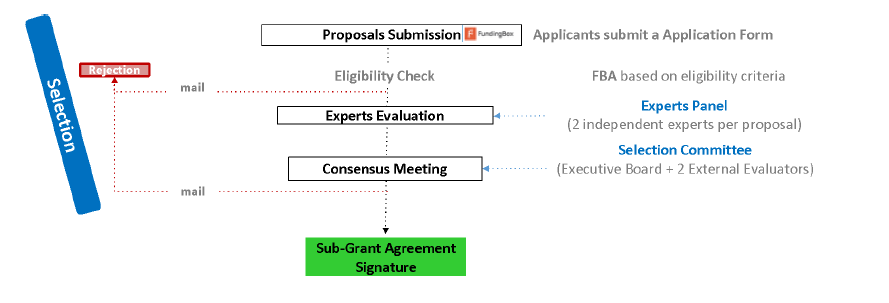
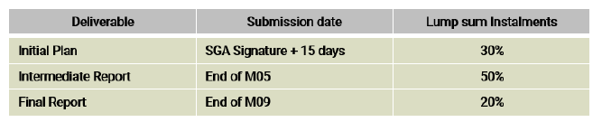

# Часті запитання (FAQ) SMART4ALL на третій відкритий конкурс на експерименти Focus Technology Transfer Experiments (FTTE)

Frequently Asked Questions (FAQs) SMART4ALL Third Open Call for Focus Technology Transfer Experiments (FTTE)

[Оригінальний документ](https://s3.amazonaws.com/fundingbox-sites/gear%2F1657788543443-SMART4ALL_3rd+FTTE_FAQs.pdf)

## 1  Що таке FTTE?

Інструмент фінансування цілеспрямованих експериментів з передачі технологій (**FTTE** Focused Technology Transfer Experiments), який зосереджується на одній із чотирьох визначених вертикалей (оцифрований транспорт, оцифроване сільське господарство, оцифроване навколишнє середовище та оцифроване будь-що), дасть можливість сформувати синергію, прискорити проекти, орієнтовані на продукт, і запропонує керівництво для досягнення успіху комерціалізації. Він матиме короткострокову тривалість (9 місяців) і складатиметься з транскордонних експериментів із застосуванням Pathfinder (PAE Pathfinder Application Experiments) між двома різними організаціями з двох різних прийнятних країн (відповідно до критеріїв прийнятності, викладених у розділі 3 Посібника для заявників). У рамках цих типів експериментів одна сторона передає партнеру-одержувачу певну технологію обладнання (HW) або програмного забезпечення (SW), щоб робити придатним вдосконалений продукт або процеси. 

## 2 Хто може подати заявку на відкритий конкурс FTTE?

Транскордонні експерименти SMART4ALL мають бути запропоновані Консорціумом із 2 організацій, включаючи такі типи заявників:

● Університети та інші академічні установи.

● МСП(SME) і трохи більші компанії, як визначено в [Рекомендації ЄС 2003/361.](http://eur-lex.europa.eu/legal-content/EN/TXT/?uri=CELEX%3A32003H0361&locale=en) Трохи Більші компанії визначаються відповідно як організації з чисельністю персоналу менше 500 співробітників і оборотом менше або дорівнює 100 мільйонів євро або загальним річним балансом менше або дорівнює 86 мільйонів євро.

МСП вважатиметься таким, якщо воно відповідає Рекомендації Європейської Комісії 2003/361/EC. Підсумовуючи, критерії визначення МСП такі: i) Чисельність персоналу в річній робочій одиниці (AWU) менше 250; ii) Річний оборот менше або дорівнює 50 мільйонам євро АБО загальний річний баланс менше або дорівнює 43 мільйонам євро. Зауважте, що цифри партнерів і пов’язаних підприємств також слід враховувати, як зазначено в посібнику користувача SME. Для отримання детальної інформації перегляньте рекомендації ЄС: <https://ec.europa.eu/growth/smes/sme-definition_en>

Пропозиції можуть подавати будь-які з вищезазначених типів організацій, але участь принаймні одного малого та середнього бізнесу або трохи більшої компанії є обов’язковою та має очолити транскордонні експерименти Pathfinder Application Experiments (PAE).

PAE мають бути транскордонними, включати принаймні дві незалежні організації з двох різних країн, які мають право.

Заявники, залучені до консорціуму, НЕ можуть включати партнерів SMART4ALL.

## 3 Чи можуть дві академічні організації разом подати заявку на відкритий конкурс FTTE?

Ні. Постачальник технологій і Отримувач технологій повинні подавати заявку разом як консорціум за допомогою простої форми заявки. Склад консорціуму може бути таким: 

| Technology  Provider | Technology  Receiver |
| -------------------- | -------------------- |
| Academic             | Industrial           |
| Industrial           |                      |

## 4 Як знайти партнера для подання заявки?

Через SMART4ALL [Сервіс підбору партнерів (Matchmaking & Partner Search Service)](https://matchmaking.smart4all-project.eu/) ви маєте доступ до екосистеми SMART4ALL для:

● Встановлення відповідності між технологічними партнерами, а також між технологічними та бізнес-партнерами на основі конкретних вимог, пропозицій і характеристик.

● Пошук партнерів для відкритих дзвінків SMART4ALL. 

## 5 Чи можу я подати заявку, якщо я є співавтором одного з партнерів консорціуму SMART4ALL? 

Ні, заявники не повинні мати фактичного чи/або потенційного конфлікту інтересів із партнерами консорціуму SMART4ALL. Однак усі випадки конфлікту інтересів розглядатимуться окремо. 

## 6 Які технології та вертикалі стоять за SMART4ALL? 

SMART4ALL зосереджується на CLEC (low-energy computing technologies), тобто обчислювальних технологіях з низьким енергоспоживанням, які застосовуються в чотирьох вертикалях SMART4ALL з європейським лідерством і стратегічним значенням, включаючи, але не обмежуючись, наступні сфери компетенції SMART4ALL (див. узагальнену таблицю нижче, повну таблицю можна знайти в Посібнику для кандидатів) :

| DIGITIZED TRANSPORT                                          | DIGITIZED  ENVIRONMENT                                       | DIGITIZED  AGRICULTURE                                       | DIGITIZED ANYTHING                                           |
| ------------------------------------------------------------ | ------------------------------------------------------------ | ------------------------------------------------------------ | ------------------------------------------------------------ |
| ●  Green transport  ●   Smart mobility  ●   Shared mobility  ●   Robotics  ●  New platforms for efficient supply- demand matchmaking  ●  Automotive electronics  ●  Autonomous vehicles  ●  Connected vehicles  ●  Streamlining  transport using big data  ●  Aeronautics and space applications  ●  Transport and Logistics  ●  City Transport Mapping | ●  Smartbuilding  •   Smarthome  •   Critical infrastructure  monitoring  •  Smart hospitals  ●  Water pollution monitoring  ●   Smartgrids  •   Energy management  ●  Environment monitoring  ●   Bio-diversity  •   Wild/migratory animals monitoring  ●   Smart industry  ●  Data processing &  data visualization | ●  Smart farming  ●   AI inspired agriculture  ●  Information based site specific applications  ●  Demand driven, sustainable  agriculture  ●  Mobile plant, soil and environment sensors  ●  Sensor networks – EU wide – cross-border  ●  Field robotics and automation systems  ●  UAV based agriculture  and plant monitoring  ●  Selective plant protection  ●  Closed nutrient cycles  ●  Agricultural  decision support systems  ●  Zero-energy food systems  ●  Circular economy  ●  Water, Energy and Food (WEF)  efficiency  ●  Revalorisation of agricultural waste | ●  Human-machine  Interaction  ●   Digital Education  ●   Industrial Automation  ●   Machine Learning  ●   Market Intelligence  ●  Medical and Health Applications  ●  Active &  Healthy Ageing  ●  Support for disabled persons  ●   Cybersecurity  ●  Data Mining and Big Data  ●   Personal security  ●  Additive Manufacturing (3D printing)  ●  Augmented and Virtual Reality  ●  Audio/Video Processing  ●  Location-based  Technologies  ●  Web and Mobile Applications  ●  Wireless Sensor Networks  ●   Disaster management  ●   Digital heritage  ●   Telemedicine  ●  Rehabilitation,  wellness, fitness  ●  E-commerce |

## 7 Чи може мій консорціум подати заявку, якщо моя пропозиція стосується CLEC, але сфера нашої компетенції не входить до попереднього списку? 

Так, ви можете подати заявку, якщо ваша пропозиція зосереджена на CLEC і ви можете довести, що вона має справу з однією з чотирьох вертикалей. Як зазначалося у вступному реченні, наведений вище список не претендує на обмеження сфер компетенції, це лише орієнтовний список.  

## 8 Які країни мають право на SMART4ALL?

У цьому відкритому конкурсі FTTE будуть прийнятні такі країни:

● Держави-члени Європейського Союзу та його заморські країни та території (OCT) або

● [Країни, асоційовані з H2020.](https://ec.europa.eu/research/participants/data/ref/h2020/grants_manual/hi/3cpart/h2020-hi-list-ac_en.pdf)

● Великобританія

● Будь-яка інша країна Південно-Східної та Центральної Європи (Південно-Східної та Центральної Європи), не зазначена вище, але включена до [Додатку A](https://ec.europa.eu/research/participants/data/ref/h2020/other/wp /2018-2020/annexes/h2020-wp1820-annex-a-countries-rules_en.pdf) [Робоча програма H2020.](https://ec.europa.eu/research/participants/data/ref/h2020/other/ wp/2018-2020/annexes/h2020-wp1820-annex-a-countries-rules_en.pdf) SEE countries: Albania, Bosnia and Herzegovina, Bulgaria, Croatia, Greece, Hungary, Kosovo, Moldova, Montenegro, North Macedonia, Romania, Slovakia, Slovenia and Serbia.

Крім того, оскільки однією з цілей SMART4ALL є підтримка цифрової трансформації в основному європейських країнах, недостатньо представлених у європейських схемах фінансування, за допомогою транскордонних експериментів консорціуми, що включають принаймні одного члена з однієї з країн Південно-Східної Європи, будуть пріоритетними (за винятком Греція) або Україна (див. розділ 4 Посібника для аплікантів): 

## 9 Чи може консорціум подавати заявку, якщо дві організації з однієї країни?

Ні, FTTE та весь експеримент SMART4ALL будуть транскордонними. У випадку FTTE два члени консорціуму, що подає заявку, мають бути з двох різних країн зі списку відповідних країн. 

## 10 Чи може консорціум або член консорціуму подати більше однієї пропозиції? 

Кожен консорціум може подати лише одну заявку. Ані члени команди, ані будь-яка юридична особа не можуть двічі фінансуватися SMART4ALL в рамках одного відкритого конкурсу SMART4ALL. Якщо кілька обраних пропозицій мають тих самих членів команди та/або ті самі організації, фінансуватиметься лише пропозиція з найбільшою кількістю балів.

## 11 Що містить форма заявки на відкритий конкурс FTTE? 

Заявки потрібно подавати через мікросайт SMART4ALL: https://smart4all.fundingbox.com/ Заявки, подані будь-яким іншим способом, не розглядатимуться для фінансування.

Заявку може подати лише провідний партнер (МСП або трохи більша компанія).

Усім Заявникам буде запропоновано підтвердити форму інформованої згоди, щоб подати повну Заявку. Пропозиції, подані через онлайн-платформу, включатимуть такі розділи:

- Контактна інформація

- Інформація про партнера № 1:

- Інформація про партнера № 2:

- Ключові дані FTTE

- Опис FTTE

  - (Оцінка) ПЕРЕВАГИ

  - (Оцінка) ВПЛИВ

  - (Оцінка) РЕАЛІЗАЦІЯ

- Етичні питання, захист даних і конфіденційність

- Питання для статистичних цілей

- Декларація честі та відсутність конфлікту інтересів – прийняття

- Форма інформованої згоди – прийняття

- Обробка персональних даних – прийняття інформаційного пункту

Додаткові матеріали, які не були включені та не були спеціально запитані в онлайн-формі заявки, не розглядатимуться для оцінки пропозицій. Дані, не включені в пропозицію, не враховуватимуться. Консорціум SMART4ALL докладає всіх зусиль, щоб зберегти конфіденційність усіх наданих даних; однак, щоб уникнути сумнівів, заявник несе повну відповідальність за вказівку своєї конфіденційної інформації як такої. 

## 12 Скільки часу займає заповнення заявки?

Щоб успішно заповнити форму заявки, вам, ймовірно, знадобиться 1-2 дні для написання, але ми припускаємо, що ваша команда складається з членів, які спеціалізуються у своїй галузі знань, яку ви можете "розділяти та володарювати". Ви зможете додавати співавторів до своєї програми, щоб кожен член команди міг працювати зі своєю сферою застосування, і ви швидше закінчите роботу.

Враховуючи, що в кожному розділі онлайн-форми заявки встановлено обмеження кількості символів, ми рекомендуємо вам зосередити свою заявку на запитуваній інформації, пам’ятаючи про проблеми та сфери, які охоплює цей конкурс.

Ми також рекомендуємо розпочати процес подання завчасно до кінцевого терміну, щоб уникнути обставин в останню хвилину. 

 

## 13 Коли закінчується термін подання моєї заявки? 

Заявки повинні бути подані до часу та дати закриття, опублікованих у відкритому конкурсі. Приймаються лише пропозиції, подані до закінчення терміну. Після завершення конкурсу жодні доповнення та зміни до надісланих пропозицій не враховуються.

Кінцевий термін подання цього дзвінка – 15 жовтня 2022 року (17:00 CEST).

## 14 Що таке процедура відбору і скільки часу вона займає? 

Процес відбору виглядає наступним чином:

##### Загальна перевірка відповідності вимогам:

Пропозиція вважатиметься прийнятною для оцінки, якщо вона відповідає таким умовам:

● Є повною, читабельною і англійською мовою в усіх обов’язкових розділах.

● Було подано через веб-сайт відкритого конкурсу протягом кінцевого терміну до 15 жовтня 2022 року, 17:00 CEST.

● Включає правильно заповнену декларацію честі. Уважно прочитайте шаблон Декларації честі, який включено до форми заявки, оскільки ми перевіримо відповідні подані заяви. Ви не зможете змінити їх після надсилання форми заявки.

Крім того, буде проведено першу перевірку щодо відповідності учасників, зазначених у розділі 3.

Пропозиції, які не відповідають усім умовам, не розглядатимуться для оцінювання.

##### Зовнішнє оцінювання (xternal evaluation)

Пропозиції будуть оцінюватися за такими критеріями:

ВІДМІННІСТЬ(EXCELLENCE), ВПЛИВ(IMPACT ) і ВПРОВАДЖЕННЯ(IMPLEMENTATION). Детальніше див. у розділі 4 Посібника для аплікантів.

##### Фаза консенсусу

На консенсусній зустрічі буде обрано пропозиції, яким буде надано фінансову підтримку.

##### Етичний огляд

Перед підписанням субгрантової угоди комітет з етики SMART4ALL перегляне всі вибрані FTTE і, зокрема, ті, що висвітлюють етичні проблеми (учасниками або оцінювачами).

##### Офіційне рішення

Офіційне рішення щодо фінансової підтримки залежить від підписання угоди про фінансування SMART4ALL. Перед підписанням субгрантової угоди вам слід надати документи, що підтверджують ваш офіційний статус. Консорціум SMART4ALL приступить до перевірки цих документів, щоб переконатися, що ви відповідаєте вимогам.

Будьте гранично пильними щодо:

- Характер документів, які ми запитуємо.

- Якщо документи, які ви нам надасте, не підтвердять ваше право на участь, пригоди закінчаться на цьому. Терміни, які ми надамо вам, щоб передати нам ці документи.

- Якщо ви не надасте запитані документи вчасно без чіткого та розумного обґрунтування, ми будемо змушені виключити вас із подальшої формальної оцінки. Потім вас замінить інший заявник зі списку Резерву.

##### Спілкування після оцінки

Заявники будуть проінформовані про результати після завершення оцінювання та прийняття остаточних рішень. Заявники відхилених пропозицій отримають електронний лист із зазначенням причин відхилення.

## 15 Чи всі критерії оцінювання матимуть однаковий бал? 

Нічиї будуть розв’язуватися за наступними критеріями в такому порядку:

● Кількість партнерів з країни Південно-Східної Європи в консорціумі (крім Греції) або України.

● Середній бал впливу.

● Середній бал впровадження

● Оцінка відмінності.

● Розглянуто вертикаль (необхідно дотримуватися балансу між вертикалями серед 4 вибраних консорціумів).

Буде створено «Список рейтингу» пропозицій, які набрали більше мінімального порогу, і передано на етап консенсусу. 

## 16 Які витрати прийнятні в FTTE?

Загальна фінансова підтримка на FTTE включає відшкодування лише таких форм витрат:

- Витрати на персонал, залучений до FTTE.

- Навчання та обслуговування, пов’язані з FTTE, для галузевих партнерів.

- Розробка ліцензії та договору про інтелектуальну власність.

- Необхідні витрати на проїзд для спільних візитів партнерів FTTE або презентацій чи демонстрацій FTTE, організованих SMART4ALL.

- Витрати на забезпечення відкритого доступу до наукових публікацій, пов’язаних із FTTE.

- Вартість витратних матеріалів та обладнання.

Примітка. Навіть якщо ми надамо одноразову суму, вам потрібно буде включити бюджет у свою заявку. У випадку некомерційних юридичних осіб сума гранту, яку запитують, не може перевищувати 70% витрат, передбачених для виконання проекту, а неприбуткові організації можуть вимагати 100% своїх витрат.

## 17 Чи кожен член консорціуму отримає кошти, які ми просимо ?

Кожен відібраний аплікант підпише субгрантову угоду з консорціумом SMART4ALL. Кошти, надані згідно з Угодою субгранту, надаються безпосередньо з коштів Європейського проекту SMART4ALL, і тому є коштами, що належать Європейській Комісії.

Як зазначалося вище, консорціум буде вільно розподіляти запитані кошти між двома партнерами, відповідно до розподілу ресурсів, встановленого в пропозиції.

Проте грант буде виплачено Головному партнеру, який відповідатиме за його розподіл у консорціумі.  

## 18 Коли ми отримаємо кошти? 

Консорціум SMART4ALL здійснюватиме виплати провідному партнеру FTTE на основі подання результатів і схвалення Наставницьким комітетом SMART4ALL:

 

Щоб отримати докладнішу інформацію, перегляньте розділ 5 Посібника для заявників.

## 19 Чи отримаємо ми шаблон затребуваних результатів?      Will we get a template of the requested deliverables?

Так, затребувані звіти будуть включені до індивідуального плану наставництва (IMP, Individual Mentoring Plan), який вибраний транскордонний FTTE визначить на початку програми підтримки разом із призначеними наставниками. У цьому документі встановлюються ключові показники ефективності та 3 кінцеві результати, які враховуватимуться під час оцінювання ефективності експериментів SMART4ALL на етапах. 

## 20 Чи зможе консорціум, який отримує фінансування від FTTE, подати заявку на наступні відкриті конкурси в рамках програми SMART4ALL? 

Так, будь-який консорціум або будь-який член консорціуму зможе подати заявку та отримати фінансування для наступних відкритих конкурсів SMART4ALL, включно з іншими відкритими конкурсами FTTE.

Єдине обмеження полягає в тому, що через усі відкриті конкурси від проектів H2020 I4MS та SAE (включаючи проект SMART4ALL) організація зможе запросити загальну суму до 100 000 євро .

Заявники повинні дотримуватися «правила подвійного фінансування».  Подвійне фінансування означає ситуацію, коли однакові витрати на ту саму діяльність двічі фінансуються за рахунок використання державних коштів. Фундаментальним принципом, який лежить в основі правил державних витрат у ЄС, є те, що жодні витрати на ту саму діяльність не можуть двічі фінансуватися з бюджету ЄС. Ви можете дізнатися більше про це в розділі «Фінансові рекомендації для заявників»

## 21 Чи застосовується правило 'de minimis' для FTTE? Чи існують додаткові обмеження щодо фінансування?       

Ні, правило «de minimis» не застосовуватиметься ні в FTTE, ні в будь-якому іншому відкритому виклику SMART4ALL.

Згідно з правилами Європейської комісії, фінансова підтримка не надаватиметься окремим юридичним особам, які вже отримали понад 100 000 євро через відкриті конкурси (фінансова підтримка третіх сторін = FSTP = каскадне фінансування) від H2020 I4MS (https://i4ms.eu). /) і проекти SAE (https://smartanythingeverywhere.eu/).

У разі отримання фінансування, але в межах зазначеного порогу (100 000 євро) із вищезазначених джерел, очікується, що заявники змінять свій бюджет відповідно, якщо це можливо, враховуючи проект і пов’язані з ним завдання, дотримуючись «правила подвійного фінансування».

Ця обмежена сума не включає будь-який внесок ЄС, який ваша організація отримує або отримувала в рамках проекту, що фінансується ЄС (в рамках FP7 або H2020) як бенефіціар. Участь в якості бенефіціара в проектах, що фінансуються ЄС, не впливає на участь у відкритих конкурсах SMART4ALL. Щоб отримати роз’яснення, зверніться до відповідного відділу вашої організації. 

## 22  Який тип підтримки буде доступний для підготовки заявки? 

The Guide for Applicants is the main reference document. It provides detailed information about the requirements of the evaluation and selection process.

If you still have any doubts regarding our Open Call process, feel free to get in touch with us:

●    For questions on the Open Call requirements, ask your question in the [Helpdesk ](https://spaces.fundingbox.com/c/smart4all-1)space of SMART4ALL Community. For technical questions, please visit the SMART4ALL [Helpdesk.](https://helpdesk.smart4all-project.eu/)

●    View the recorded webinars and training courses [here. ](https://smart4all-project.eu/opencalls-apply-now/)There will be additional webinars organised which will be advertised on the main [project website ](https://smart4all-project.eu/)and via our social media channels.

●    Send us an email to the following address: [helpdesk@smart4all-project.eu](mailto:helpdesk@smart4all-project.eu)

●    Visit the [Frequently Asked Questions ](https://s3.amazonaws.com/fundingbox-sites/gear%2F1582629305588-FAQs_SMART4ALL.pdf)(FAQs). You can find the FAQs in your local language [here.](https://faq.smart4all-project.eu/index.php/Main_Page)

Довідник для вступників (Guide for Applicants) є основним довідковим документом. Він містить детальну інформацію про вимоги до процесу оцінювання та відбору.

Якщо у вас все ще є будь-які сумніви щодо нашого процесу Open Call, не соромтеся зв’язатися з нами:

● Щоб отримати запитання щодо вимог до відкритого конкурсу, поставте своє запитання в [службі підтримки](https://spaces.fundingbox.com/c/smart4all-1) спільноти SMART4ALL. Щоб отримати відповіді на технічні запитання, відвідайте SMART4ALL [Helpdesk.](https://helpdesk.smart4all-project.eu/)

● Перегляньте записані вебінари та навчальні курси [тут. ](https://smart4all-project.eu/opencalls-apply-now/)Будуть організовані додаткові вебінари, оголошення про які буде розміщено на головному [веб-сайті проекту](https://smart4all-project.eu/) та через наші канали в соціальних мережах.

● Надішліть нам електронний лист на таку адресу: [helpdesk@smart4all-project.eu](mailto:helpdesk@smart4all-project.eu)

● Відвідайте розділ [Часті запитання](https://s3.amazonaws.com/fundingbox-sites/gear%2F1582629305588-FAQs_SMART4ALL.pdf)(FAQs). Ви можете знайти відповіді на поширені запитання вашою мовою [тут](https://faq.smart4all-project.eu/index.php/Main_Page) 

## 23 Який розклад етапів відкритого конкурсу та оцінки? 

| Description                                   | Indicative Dates               |
| --------------------------------------------- | ------------------------------ |
| Third FTTE Open  Call launch                  | 15 July 2022  at 00:00 CEST    |
| Third FTTE Open  Call deadline                | 15 October 2022  at 17:00 CEST |
| Third FTTE Open Call evaluation and selection | October-November 2022          |
| Consensus Meeting                             | November 2022                  |
| Communication of Results                      | November 2022                  |
| Start of Experiment                           | January 2023                   |
| End of Experiment                             | October 2023                   |