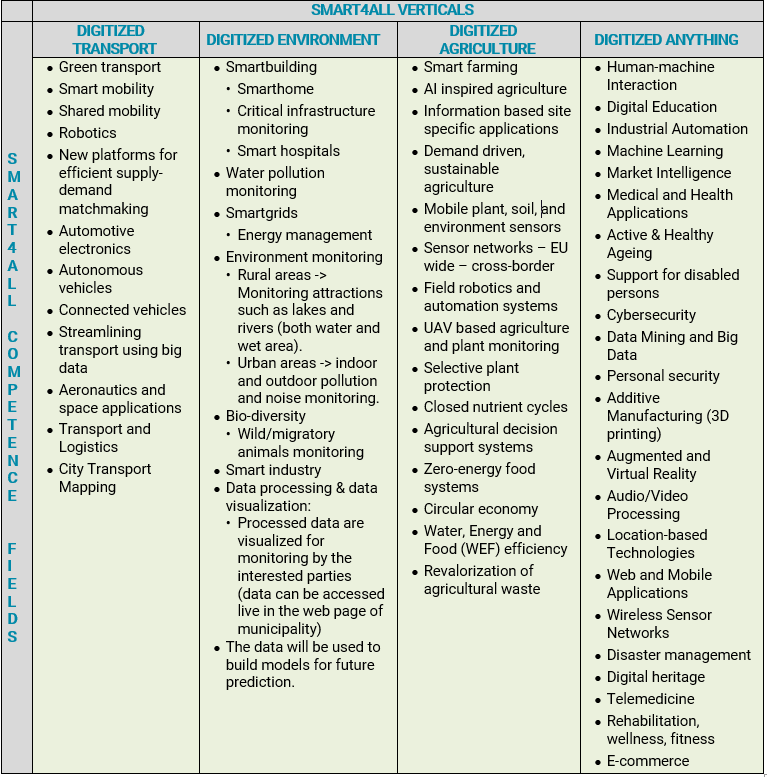
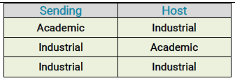
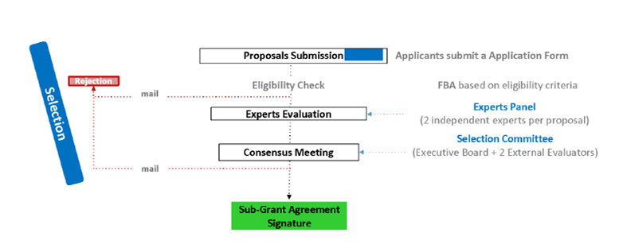

# smart4all

Відкриті коли:

https://smart4all.fundingbox.com/

https://smart4all-project.eu/opencalls-apply-now/

# Про платформу

- [Презентація](https://smart4all-project.eu/wp-content/documents/SMART4ALL%20Official%20Presentation%20v2.0%20Webinar.pdf)

**Smart** - SELFSUSTAINED CROSS-BORDER CUSTOMIZED CYBERPHYSICAL SYSTEM EXPERIMENTS FOR CAPACITY BUILDING AMONG EUROPEAN STAKEHOLDERS

SMART4ALL – це проект, що фінансується H2020 (грантова угода № 872614), який нарощує потенціал серед європейських зацікавлених сторін шляхом розробки самодостатніх транскордонних експериментів, які передають знання та технології між науковими колами та промисловістю. Він орієнтований на індивідуальні низькоенергетичні обчислення (CLEC) для кібер-фізичні системи (CPS) та Інтернет речей (IoT) і поєднує в собі набір унікальних характеристик, які об’єднують під загальним баченням різні культури, різні політики, різні географічні області та різні домени застосувань.

Консорціум SMART4ALL очолює Університет Пелопоннесу (Греція) і складається з 25 партнерів із Центральної, Південної та Східної Європи. SMART4ALL пропонує нову парадигму для виявлення «прихованих інноваційних скарбів» – переважно з географічних районів, які недостатньо представлені в європейському фінансуванні – і допомагає їм знайти шлях до ринку за допомогою нових інноваційних комерційних продуктів. У рамках своєї стратегії проект розвиватиме та підтримуватиме активну мережу DIH у Центральній, Південній та Східній Європі для підтримки науковців, малого та середнього бізнесу та трохи більших компаній, які вступають у еру цифровізації.

Nikolaos Voros - University of Peloponnese SMART4ALL Project Coordinato

- 25 партнерів з Південної, Східної та Центральної Європи
- Консорціум складається з університетів, науково-дослідних інститутів, інвесторів, мереж
   організації, МСП, інноваційні центри та НУО

- Бачення: нарощувати потенціал серед європейських зацікавлених сторін шляхом приєднання різних культур, різних політик, різних географічних областей та різних областей застосування
- Як: шляхом розробки самодостатніх транскордонних експериментів, які передають знання та технології між науковими колами та промисловістю
- Технологічні сфери: налаштовані низькоенергетичні обчислення (CLEC) та Інтернет речей
- Області застосування: оцифрована середовище, оцифрована сільське господарство, оцифрована будь-що та оцифрований транспорт

## Цілі (Objectives)

- Впровадити інноваційні індивідуальні обчислення з низьким споживанням енергії (CLEC) CPS та технології IoT у недопредставлених секторах бізнесу

- Розкрити потенціал південно-східних сторін через зв’язки з інвесторами в ланцюгах створення вартості та в регіонах, щоб прискорити розробку та індустріалізацію рішень CLEC CPS/IoT
- Розробити/пропонувати нові інструменти для збільшення використання CLEC CPS та технологій IoT по всій Європі
- Забезпечити стійкість після проекту та зростання мережі експериментів SMART4ALL і DIH
- Впровадити інноваційні CLEC CPS та технології IoT у життя чутливих соціальних груп
- Підтримати політику Європейської Комісії щодо цифрових навичок та робочих місць

##  An Extensive Network of DIHs (Розгалужена мережа DIH)

Розгалужена мережа центрів цифрових інновацій для прискорення розвитку технологій та бізнесу в Південній, Східній та Центральній Європі

**Ecosystem Services:**

- Access to SMART4ALL network/ecosystem
- Identify funding opportunities
  - SMART4ALL Open Calls
  - Local and European funding frameworks
- Application oriented ethics coaching
- Interconnection with other networks/ecosystems

**Business Services:**

- Application oriented coaching for business development
- Partner search and business matchmaking
- Online training courses

**Technological Services:**

- Application oriented technological coaching
- Access to state-of-the-art infrastructures & services
- Technological matchmaking
- Online training courses

# Типи експериментів

Щоб досягти цього, SMART4ALL розробить та впровадить 3 типи транскордонних експериментів із застосуванням Pathfinder (PAE):

1) Експерименти передачі знань (KTE), які включають новий тип експериментів стажування
    дозволяючи меншим проектам або менш зрілим ідеям представляти, тестувати і таким чином потенційно знаходити сприятливий ґрунт для зростання та розкриття його товарного потенціалу;
2) Сфокусовані експерименти з передачею технологій (FTTE), зосереджені на одному з чотирьох визначених недостатньо представлені сфери, дасть можливість сформувати синергію, прискорити проекти, орієнтовані на продукт і запропонувати рекомендації щодо успішної комерціалізації;
3) Експерименти міждоменного передачі технологій (CTTEs), орієнтовані на більш складну міждисциплінарну передачу та виробництво нових технологій CLEC CPS та IoT на ширші ринки.

## KTEs – Knowledge Transfer Experiments (Експерименти з передачі знань)

Новий тип експериментів, який дозволяє представити, протестувати менші проекти або менш зрілі ідеї і таким чином потенційно знайти сприятливий ґрунт для зростання та розкриття потенціалу продукту. KTE виступають як стажування ( internships/traineeships, apprenticeships) та короткострокові програми навчання безробітних для вакантних цифрових робочих місць.

> **Очікувана тривалість:** короткострокова (3 місяці)
>
> **Схема**: проекти стажування між двома різними організаціями з двох різних країн ЄС: один академічний/промисловий партнер, який виступає як організація-відправник, і один академічний/промисловий партнер, який виступає як приймаюча організація. Бенефіціари
>
> **Бюджет**: до 8000 євро для покриття надбавки на мобільність для проведення стажування.

https://smart4all-3rd-kte.fundingbox.com/

**KTEs** – це короткострокові (3 місяці) проекти стажування між двома різними організаціями з двох різних країн (див. відповідні країни нижче): один академічний/промисловий партнер, який виступає як організація-відправник, і один академічний/промисловий партнер, який виступає як Приймаюча організація.

Експерименти з передачею знань (KTE) включають новий тип експериментів, які дозволяють представити, протестувати менші проекти або менш зрілі ідеї і таким чином потенційно знайти сприятливий грунт для зростання та розкриття потенціалу продукту.

Діяльність, яка має право на фінансову підтримку, пов’язана з обміном знаннями CLEC для CPS та IoT, які мають застосовуватись у чотирьох вертикалях SMART4ALL з європейським лідерством та стратегічною важливістю (див. розділ [Керівництво та документи](https://smart4all.fundingbox.com/pages/Guides&Documents)):

- **Digitized Transport**
- **Digitized Environment**
- **Digitized Agriculture**
- **Digitized Anything**

**Хто може подати заявку?**

У конкурсі можуть брати участь такі види організацій:

- **Університети** та інші **академічні установи**.
- **МСП** та **Трохи більші компанії**, як визначено в [**Рекомендації ЄС 2003/361**](https://eur-lex.europa.eu/legal-content/EN/TXT /?uri=CELEX:32003H0361). Трохи більші компанії визначаються відповідно як організації з чисельністю персоналу менше 500 співробітників і оборотом нижче 100 мільйонів євро.

**Системні інтегратори** та/або **Постачальники технологій**, тобто будь-який тип організації, що спеціалізується на передачі технологій або системної інтеграції, що обслуговує потреби кінцевих користувачів, за умови, що їх можна віднести до одного з двох попередніх типів бенефіціарів.

Для цього відкритого виклику KTE організація-відправник і приймаюча організація подають заявку разом як консорціум.

**Заявку має подати провідний промисловий партнер.**
Члени консорціуму можуть домовитися про двосторонню передачу знань, але завжди має бути організація, яка відправляє свого співробітника до організації з іншої країни, яка приймає його або її. Крім того, **Провідний партнер завжди повинен мати статус промислового партнера (МСП або трохи більша компанія)**.

**Країни, які відповідають вимогам**

У цьому відкритому конкурсі KTE можуть брати участь такі країни:

- Держави-члени Європейського Союзу, включаючи Великобританію;
- **[Країни, пов’язані з Horizon 2020](https://ec.europa.eu/research/participants/data/ref/h2020/grants_manual/hi/3cpart/h2020-hi-list-ac_en.pdf)** ;
- Будь-яка інша країна Південно-Східної Європи (SEE), не зазначена вище, але включена в [**Додаток A** **Робочої програми H2020**](https://ec.europa.eu/research/participants/data /ref/h2020/other/wp/2018-2020/annexes/h2020-wp1820-annex-a-countries-rules_en.pdf)**.**

**Prioritised Countries** 

Крім того, оскільки однією з цілей **SMART4ALL** є підтримка цифрової трансформації переважно в європейських країнах, які недостатньо представлені в європейських схемах фінансування, за допомогою транскордонних експериментів, консорціуми, що включають принаймні одного члена з однієї з країн СЄ, будуть бути пріоритетним:

- Albania
- Bosnia and Herzegovina
- Bulgaria
- Croatia
- Hungary
- Kosovo
- Moldova
- Montenegro
- North Macedonia
- Romania
- Slovakia
- Slovenia
- Serbia

**Фінансова підтримка**

Експерименти KTE будуть підтримуватися одноразовою виплатою до **8 000 євро** кожен для покриття надбавки на мобільність для проходження стажування.

Консорціуми зможуть вільно розподілити цю суму між двома партнерами. однак:

- Кожному консорціуму потрібно буде пояснити в онлайн-заявці, як буде розподілена сума між партнерами та за яку категорію витрат відповідатиме кожен партнер.

- Грант буде виплачено Провідному партнеру, який відповідатиме за його розподіл у консорціумі. Кожен консорціум вирішує, яка організація буде провідним партнером, але вона завжди повинна мати статус промислового партнера (МСП або трохи більша компанія). Деталі розподілу гранту між партнерами будуть описані в Угоді про субгрант.
- Перш ніж прийняти рішення щодо розподілу видатків у проекті, слід звернути увагу на норми ЄС та національні правила соціального забезпечення. Витрати на соціальне страхування має нести партнер, який зобов’язаний це робити відповідно до вищезгаданих правил.

[Усі гайди та документи](https://smart4all.fundingbox.com/pages/Guides&Documents)

[Guide for Applicants (GfA)](https://s3.amazonaws.com/fundingbox-sites/gear%2F1647279034328-SMART4ALL_3rd_KTE_GFA.pdf)

Для цього інструменту фінансування SMART4ALL вибере до 43 транскордонних консорціумів, включаючи одного академічного/промислового партнера, який виступає як організація-відправник, та одного академічного/промислового партнера, який діє як приймаюча організація, у трьох конкурентних відкритих конкурсах KTE, до 15 у кожному з них. Перші 2 відкриті конкурси були завершені у 2020 та 2021 роках, де загалом було відібрано 25 бенефіціарів. У цьому третьому і останньому відкритому конкурсі KTE буде надано загальну фінансову підтримку в розмірі до 144 000 євро (приблизно) для 18 KTE в цілому. Більше інформації про 25 раніше відібраних переможців можна знайти [тут](https://smart4all-project.eu/winnerskte/).

Усі відкриті виклики SMART4ALL є одноетапними.

Для цього відкритого виклику KTE організація-відправник і приймаюча організація подають заявку як консорціум за допомогою простої форми заявки. Склад консорціуму може бути таким:

KTE — це короткий 3-місячний експеримент стажування, коли організація-відправник відправляє члена свого персоналу до приймаючої організації, що базується в іншій країні, щоб передати певні знання, пов’язані з технологіями та вертикалями SMART4ALL, описаними нижче. Внаслідок обмежень, пов’язаних з пандемією Covid19, заявники також матимуть можливість брати участь у програмі без поїздки до країни перебування.

Члени консорціуму можуть домовитися про двосторонню передачу знань. Крім того, провідний партнер завжди повинен мати статус промислового партнера (принаймні одна компанія малого та середнього бізнесу або трохи більша компанія є обов’язковою). Заявку може подати тільки провідний партнер (МСП або трохи більша компанія).

### Що ми пропонуємо?

**Фінансова підтримка**

Експерименти KTE будуть підтримуватися одноразовою виплатою до 8 000 євро кожен для покриття надбавки на мобільність для проходження стажування. Бенефіціари, які не можуть подорожувати через обмеження Covid-19, матимуть можливість змінити розмір фінансової підтримки на одноразову суму до 6000 євро. У цих випадках експеримент можна провести дистанційно. Це рішення може бути прийняте лише до підписання Угоди про субгрант (SGA). Після підписання SGA жодні зміни не допускаються, а бенефіціар повинен буде провести експеримент згідно з угодою.

Консорціуми зможуть вільно розподілити цю суму між двома партнерами. однак:

- Кожному консорціуму потрібно буде пояснити в онлайн-формі заявки, як буде розподілена сума між партнерами та за яку категорію витрат відповідатиме кожен партнер.
- Грант буде виплачено Провідному партнеру, який відповідатиме за його розподіл у консорціумі. Кожен консорціум вирішує, яка організація буде провідним партнером, але він завжди повинен мати статус промислового партнера (МСП або трохи більша компанія). Деталі розподілу гранту між партнерами будуть описані в Угоді про субгрант.
- Перш ніж прийняти рішення щодо розподілу видатків у проекті, слід звернути увагу на норми ЄС та національні правила соціального забезпечення. Витрати на соціальне страхування має нести партнер, який зобов’язаний це робити відповідно до вищезгаданих правил.

Фінансова підтримка буде виплачуватися на основі подання та затвердження результатів, як визначено в розділі 5.

### Додаткова підтримка

Після вибору PAE SMART4ALL запропонує партнерам та третім сторонам (бенефіціарам Open Call FSTP):

- Технологічна підтримка, включаючи технічний коучинг та IPR, а також підтримку відкритого доступу через спеціалізованого технологічного наставника для кожного експерименту.
- Підтримка бізнесу та доступ до фінансування, включаючи підтримку розробки бізнес-плану та визначення державних та приватних джерел фінансування через спеціалізованого бізнес-ментора для кожного експерименту.

Наочність завдяки порталу співпраці, на якому будуть опубліковані всі PAE та бенефіціари FSTP, та участі SMART4ALL у основних заходах на рівні ЄС.

### Критерії прийнятності

Ми перевіримо відповідність усіх пропозицій, поданих до кінцевого терміну. Усі критерії прийнятності наведені в цьому розділі цього посібника для заявників. Проекти, які не відповідають цим критеріям, будуть виключені та позначені як непридатні. Ми перевіримо критерії прийнятності на основі інформації, наданої у вашій заявці, протягом усього процесу оцінювання.

**Кого ми шукаємо?**

Транскордонні експерименти SMART4ALL мають бути запропоновані консорціумом, що включає наступні типи заявників1:

- Університети та інші академічні установи.
- МСП та трохи більші компанії, як визначено в рекомендації ЄС 2003/361. Трохи більші компанії визначаються відповідно як організації з чисельністю персоналу менше 500 співробітників і оборотом менше або рівним 100 мільйонам євро або річним підсумком балансу менше або дорівнює 86 мільйонам євро.

Пропозиції можуть подавати будь-який із вищезгаданих типів організацій, але участь, принаймні, однієї малого та середнього бізнесу/трохи більшої компанії є обов’язковою та має бути керівником транскордонних експериментів із застосуванням Pathfinder (PAE).

PAE мають бути транскордонними, з 2 різними організаціями з двох різних країн, які мають право на участь.

**Прийнятні країни**

У цьому відкритому конкурсі KTE можуть брати участь такі країни:

- Держави-члени Європейського Союзу та його заморські країни та території (OCT) або асоційовані [Associated Countries to H2020](https://ec.europa.eu/research/participants/data/ref/h2020/grants_manual/hi/3cpart/h2020-hi-list-ac_en.pdf)..
- Сполучене Королівство
- Будь-яка інша країна Південно-Східної та Центральної Європи (SEE), не перелічена вище, але включена в [Додаток A Робочої програми H2020](https://ec.europa.eu/research/participants/data/ref/h2020/other/wp/2018-2020/annexes/h2020-wp1820-annex-a-countries-rules_en.pdf)

**Які види діяльності можна фінансувати?**

Мета KTE полягає в наступному: конкретний проект стажування між двома різними організаціями з двох різних країн ЄС: один академічний/промисловий партнер (SME або SB), який діє як організація-відправник, і один академічний/промисловий партнер, який виступає в якості приймаючого. Організація. Діяльність, яка має право на фінансову підтримку, пов’язана з обміном знаннями CLEC для CPS та IoT, які мають бути застосовані в продукті або рішенні, що стосуються однієї з вищезгаданих сфер компетенції.

ПРИКЛАДИ:

1) Університетська група розробила інструмент для швидкої обробки даних ДНК на FPGA. МСП хоче дослідити, чи можна легко інтегрувати цей інструмент у основний процес розробки. та перевірити фактичні переваги на місцях. Дослідник з університетської групи переходить до компанії на 3 місяці. Приймаючою організацією буде МСП.
2) МСП шукає університетську групу з досвідом у новій технології (наприклад, методи моделювання для мереж 5G). Технічний співробітник групи переїжджає в компанію на 3 місяці для розробки імітаційних моделей за допомогою найсучаснішого мережевого симулятора. Приймаючою організацією буде МСП.

Усі PAE, які фінансуються SMART4ALL, повинні будуть внести принаймні один артефакт до проекту Marketplace (https://marketplace.smart4all-project.eu/). Під терміном «артефакт» SMART4ALL позначає будь-який інструмент, навчальний матеріал, послугу та/або рішення, які були створені фінансованою PAE. Додаткову інформацію дивіться за посиланням.

**Як застосовувати**

Подача заявки на відкритий конкурс вимагає часу та відданості, і ми хотіли б переконатися, що ви розумієте кваліфікаційні вимоги, яким ви повинні відповідати.

- Бути вчасно:
  Обов’язково подайте свою пропозицію через онлайн-форму до 15 червня 2022 року до 17:00 CEST. Заявку може подати тільки провідний партнер (МСП або трохи більша компанія). Якщо ви заповнили форму правильно, система надішле вам підтвердження подання. Зв’яжіться з нами, якщо це не так. Вам важливо знати, що ми не будемо оцінювати будь-які пропозиції, надіслані після кінцевого терміну та подані за межами спеціальної форми.
- Будьте вичерпними:
  Ви відповіли на всі розділи форми? Зауважте, що додавати будь-яку інформацію чи змінювати пропозицію після її подання буде неможливо.
- Кілька заявок: кожен консорціум може подати лише одну заявку. Ні члени команди, ні будь-яка юридична особа не можуть бути профінансовані SMART4ALL двічі в рамках одного відкритого конкурсу SMART4ALL. Якщо кілька відібраних пропозицій мають однакових членів команди та/або ті самі організації, фінансуватиме лише пропозицію з найбільшою кількістю балів.

Після вибору консорціуми не зможуть змінити свій склад. Якщо члени консорціуму в поданій заявці не нададуть повного письмового зобов’язання щодо своєї виключної участі в обраному проекті (не маючи можливості брати участь в жодному іншому з відібраних проектів) до підписання Угоди про субгрант, проект не зможе взяти участь у програмі, і інший проект буде вибрано з резервного списку.

- Англійська мова: англійська мова є офіційною мовою SMART4ALL Open Calls. Усі пропозиції мають бути англійською мовою у всіх їх обов’язкових частинах, щоб бути прийнятними. Якщо обов’язкові частини пропозиції написані іншою мовою, вся пропозиція буде відхилена. Якщо лише необов’язкові частини пропозиції подано мовою, відмінною від англійської, ці частини не оцінюватимуться, але пропозиція все ще прийнятна. Англійська також є єдиною офіційною мовою протягом усього періоду програми SMART4ALL. Це означає, що будь-які запитані результати будуть прийняті лише в тому випадку, якщо вони подані англійською мовою.
- Кожне запитання заслуговує вашої уваги: усі обов'язкові розділи вашої пропозиції, які зазвичай позначені зірочкою, повинні бути заповнені. Переконайтеся, що надані дані є правдивими та повними. Це дуже важливо для правильної оцінки вашої пропозиції. І навпаки, будь-який додатковий матеріал, який спеціально не запитується в онлайн-формі заявки, не розглядатиметься для оцінки, тому немає сенсу переборщувати.
- Конфлікт інтересів: ми візьмемо до уваги наявність потенційного конфлікту інтересів між вами та одним або кількома партнерами консорціуму SMART4ALL. Справді, партнери консорціуму, їхні афілійовані особи, співробітники та постійні співробітники не можуть брати участь у програмі SMART4ALL. Усі випадки потенційного конфлікту інтересів розглядатимуться окремо.
- Здорові фінанси та чистий арсенал є обов’язковими: ми не приймаємо юридичних осіб, які перебувають у стані ліквідації, або підприємства, що знаходяться в скрутному становищі відповідно до Регламенту Комісії № 651/2014, ст. 2.18. Ми також не будемо приймати пропозиції від суб’єктів, які не мають можливості отримати фінансування ЄС відповідно до положень національного законодавства та законодавства ЄС, або за рішенням національного чи ЄС.
- Це ваша пропозиція: ваш проект має бути заснований на вашій оригінальній роботі. Якщо ні, це нормально, просто переконайтеся, що ваше право на використання права інтелектуальної власності на 100% впевнене. Надалі будь-які передбачувані події повинні бути вільними від прав третіх сторін, а якщо ні, ці права третіх сторін мають бути чітко зазначені.

### Участь в інших відкритих дзвінках SMART4ALL та будь-яких із проектів H2020 I4MS та SAE  .

Юридичні особи не можуть отримати більше 100 000 євро за відкритими конкурсами від проектів H2020 I4MS і SAE (усі отримані гранти будуть обмежені 100 000 євро, включаючи грант з цього відкритого конкурсу). Сума грантів, отриманих від ініціатив I4MS та SAE, буде вирахована з максимального гранту, доступного в цьому конкурсі. Очікується, що заявники відповідно змінять свій бюджет, якщо це можливо, враховуючи проект і пов’язані з ним завдання, дотримуючись [«правила подвійного фінансування»](https://ec.europa.eu/social/BlobServlet?docId=20893&langId=en) та повідомляють про попереднє фінансування. Ця обмежена сума не включає будь-який внесок ЄС, який отримує або має ваша організація. отримано в рамках проекту, що фінансується ЄС (в рамках РП7 або П2020) як бенефіціар. Участь як бенефіціара в проектах, що фінансуються ЄС, не впливає на участь у відкритих конкурсах SMART4ALL. Для уточнення, будь ласка, зверніться до відповідного відділу вашої організації.

How will we evaluate your proposal? 

Our evaluation process is transparent, fair and equal to all our participants.

 The selection process is as follows:
We will be evaluating your project in 3 phases. We expect a high number of applications so if you want to stand out, quality is the way to go. What does it mean? In short, provide as many details as possible while being extremely clear and structured. This will help us to properly identify the key points of your application and see how it fits within the overall SMART4ALL KTE scope.

### Як ми оцінимо вашу пропозицію?

Наш процес оцінювання є прозорим, справедливим і рівним для всіх наших учасників.

Процес відбору виглядає наступним чином:

Ми будемо оцінювати ваш проект у 3 етапи. Ми очікуємо великої кількості додатків, тому, якщо ви хочете виділитися, якість - це шлях. Що це означає? Коротше кажучи, надайте якомога більше деталей, будучи надзвичайно чіткими та структурованими. Це допоможе нам правильно визначити ключові моменти вашої програми та побачити, як вона вписується в загальну область застосування SMART4ALL KTE.

**Консенсусна зустріч**

Рейтинговий список пропозицій буде передано на консенсусну зустріч за участю «Відбіркової комісії», до складу якої входять Виконавча рада SMART4ALL та 2 зовнішніх оцінювачів.

«Відбіркова комісія» буде приймати рішення більшістю голосів 2/3 від усіх членів «Тимчасового списку бенефіціарів FSTP» та «Резервного списку». Точна кількість затверджених пропозицій буде вирішена на основі загальної якості пропозицій. Якщо заявка з найвищим рейтингом буде відхилена, ми розглянемо вибір наступної пропозиції з найкращим рейтингом.

Майте на увазі, що навіть якщо зазвичай для фінансування відбираються найкращі пропозиції, відбіркова комісія може мати поважні причини для заперечення проти вибору конкретного кандидата. Ці причини можуть стосуватися:

### Наша програма підтримки та умови оплати 

**Одноразова сума**

Після офіційної перевірки та підписання Угоди про субгрант ви станете офіційним бенефіціаром програми SMART4ALL. Ось зараз починається пригода, і настав час зрозуміти, як буде розподілено фінансування.
Як бенефіціар, ви отримаєте фіксовану одноразову суму до 8000 євро. Одноразова сума – це спрощений спосіб погашення витрат у проектах, що фінансуються за рахунок коштів Horizon 2020. Це означає, що вам не потрібно надавати бухгалтерські документи, щоб підтвердити понесені витрати, пов’язані з інвестиціями (наприклад, рахунки-фактури). Однак ви зобов’язані продемонструвати, що реалізація проекту відповідає встановленим для нього етапам. Основні етапи (результативні результати, KPI та етичні рекомендації) будуть визначені та календарно внесені в «Індивідуальний план наставництва», розроблений на початку програми.

Коротше кажучи, ми ретельно оцінимо ваш прогрес і якість вашої роботи під час проміжних оглядів, але не будемо перевіряти ваш бухгалтерський облік. Майте на увазі, що одноразова сума не звільняє вас від обов’язку зібрати документацію для підтвердження витрат за фіскальним регулюванням.

Eligible costs
The total financial support per KTE includes only the following cost forms:
● Salaries or staff manpower needed to implement a granted specific KTE experiment.
● Necessary travel, accommodation and subsistence costs for the member of the staff of the Sending organisation to be sent to the Host one (only applicable to those consortia applying for an EUR 8,000 funding support).
● Social security costs due by the Host organisation.
● Institutional environment requirements if any (hosting arrangement, infrastructure).
The Financial Support reimburses 100% of the eligible costs of the Selected Third-Parties that are non-profit legal entities and 70% of the eligible costs of the Selected Third-Parties that are for-profit legal entities . However, these reimbursement rates have already been considered in the lump sum calculation and will not affect the distribution rate among partners as mentioned in the above section 5.1.
Note: Even if we provide a lump sum, you will need to include a budget in your application. In the case of for-profit legal entities, the grant amount requested cannot exceed the 70% of the costs estimated for the execution of the project and Non-for-profit entities can request 100% of their costs. A budget template can be found here.

**Прийнятні витрати**

Загальна фінансова підтримка на KTE включає лише такі форми витрат:

- Заробітна плата або персонал, необхідний для реалізації наданого конкретного експерименту KTE.
- Необхідні витрати на проїзд, проживання та життєдіяльність для співробітника організації-відправника, яка буде направлена до приймаючої організації (застосовується лише до тих консорціумів, які подають заявку на фінансову підтримку в розмірі 8000 євро).
- Витрати на соціальне страхування, сплачені приймаючою організацією.
- Вимоги до інституційного середовища, якщо такі є (організація розміщення, інфраструктура).
  Фінансова підтримка відшкодовує 100% прийнятних витрат Вибраних третіх сторін, які є неприбутковими юридичними особами, і 70% прийнятних витрат Вибраних третіх сторін, які є комерційними юридичними особами. Однак ці ставки відшкодування вже були враховані при розрахунку одноразової суми і не вплинуть на ставку розподілу між партнерами, як зазначено у вищезгаданому розділі 5.1.
- Примітка. Навіть якщо ми надаємо одноразову суму, вам потрібно буде включити бюджет у свою заявку. Що стосується комерційних юридичних осіб, то сума гранту, що запитується, не може перевищувати 70% витрат, розрахованих на виконання проекту, а неприбуткові організації можуть вимагати 100% своїх витрат. Шаблон бюджету можна знайти тут.

Поставки та платежі
Фінансовий орган SMART4ALL здійснюватиме виплати Провідному партнеру KTE на основі подання та схвалення Наставницького комітету SMART4ALL:

## FTTEs – Focused Technology Transfer Experiments (Експерименти з передачі технологій)

Within this type of experiments, one party transfers to the receiving partner a specific HW or SW technology in order to enable improved product or  processes.

> **Expected duration**: short-term (up to 9 months)
>
> **Scheme**: Two different entities from two different EU Countries: one Academic and one Industrial or two industrials.
>
> **Budget**: up to 80,000€ to cover staff, travel and equipment

У рамках цього типу експериментів одна сторона передає партнеру-отримувачу конкретну технологію HW або SW, щоб забезпечити покращення продукту або процесів.

> **Очікувана тривалість**: короткострокова (до 9 місяців)
>
> **Схема**: дві різні організації з двох різних країн ЄС: одна академічна та одна промислова або дві промислові.
>
> **Бюджет**: до 80 000 євро для покриття персоналу, подорожей та обладнання 

 

FTTE – це короткострокові (9 місяців) **транскордонні** експерименти між двома різними організаціями (промисловими або академічними) з двох різних країн, які відповідають критеріям. Проекти будуть зосереджені на одній із чотирьох наступних визначених вертикалей і дадуть можливість сформувати синергію, прискорити проекти, орієнтовані на продукт, і запропонують керівництво для успішної комерціалізації.

- **Digitized Transport**
- **Digitized Environment**
- **Digitized Agriculture**
- **Digitized Anything**

Один партнер (промисловий або академічний) з однієї відповідної країни передає певну нову апаратну чи програмну технологію в області Customized Low-Energy Computing (CLEC) для Cyber-Physical Systems (CPS) та Інтернету речей (IoT) до отримувача галузевий партнер (МСП або трохи більша компанія) з іншої відповідної країни. (див. розділ Посібники та документи).

## CTTEs – Cross-domain Technology Transfer Experiments (Експерименти міждоменного перенесення технологій)

Комплексна мультидисциплінарна передача та виробництво нових технологій CLEC CPS та IoT на широкі ринки.

> **Очікувана тривалість**: короткострокова (9 місяців)
>
> **Схема**: три (3) організації з принаймні двох різних країн ЄС (принаймні один МСП; експеримент має очолювати МСП)
>
> **Бюджет**: до 80 000 євро для покриття персоналу, подорожей та обладнання

# Хто може поадаваитися

## Consortia must include the following type of applicants:

Консорціуми повинні включати наступні типи заявників:

- Університети або академічні установи

- МСП та трохи більші компанії

- Системні інтегратори та/або постачальники технологій загалом

# Дати

 **SMART4ALL** організує дев'ять відкритих колів, по три на кожен тип колів, по одному на рік протягом перших 36 місяців проекту:

| PAE TYPE                                            |                      | Call 1         | Call 2         | Call 3          |
| --------------------------------------------------- | -------------------- | -------------- | -------------- | --------------- |
| Knowledge Transfer Experiments (KTE)                | Call Announcement:   | Apr 15th, 2020 | Mar 2021       | Mar 15th, 2022  |
|                                                     | Submission Deadline: | Sep 15th, 2020 | Jun 15th, 2021 | June 15th, 2022 |
| Focused Technology Transfer Experiments (FTTE)      | Call Announcement:   | Jul 1st, 2020  | Jun 15th, 2021 | Jun 2022        |
|                                                     | Submission Deadline: | Sep 30th, 2020 | Sep 15th, 2021 | Aug 2022        |
| Cross Domain Technology Transfer Experiments (CTTE) | Call Announcement:   | Dec 1st, 2020  | Oct 15th, 2021 | Sep 2022        |
|                                                     | Submission Deadline: | Mar 15th, 2021 | Jan 17th, 2022 | Nov 2022        |

Процедура подання пропозицій та відбору буде здійснюватися через платформу FundingBox, веб-систему, яка дозволить керувати всім циклом відкритого конкурсу відповідно до стандартів ЄС.

Під час процесу оцінювання 1-го виклику KTE, заявки на відкриті конкурси, які розглядають поточні та майбутні проблеми, пов’язані з кризою COVID-19, отримають 1 додатковий бал у загальній оцінці.

https://smart4all.fundingbox.com/pages/Guides&Documents

# SMART4ALL overview and proposal preparation         

 **

- Smart4all overview and funding opportunity ([pdf](https://smart4all-project.eu/wp-content/documents/SMART4ALL Official Presentation v2.0 Webinar.pdf?_t=1621929308), [vid](https://smart4all-project.eu/wp-content/documents/Nikolaos_Voros.mp4?_t=1621929362)).
- How can I write a successful KTE proposal ([pdf](https://smart4all-project.eu/wp-content/documents/SMART4ALL_Guidilines_KTE.pdf?_t=1621929596), [vid](https://smart4all-project.eu/wp-content/documents/Georgios_Keramidas.mp4?_t=1621929618)).
- How can I write a successful FTTE/CTTE proposal ([pdf](https://smart4all-project.eu/wp-content/documents/SMART4ALL_Guidelines_on_preparing_a_coherent_proposal.pdf?_t=1621929713), [vid](https://www.youtube.com/watch?v=b1V3nlAUaZ0&t=8s)).
- Things to avoid when preparing a SMART4ALL Open Call Proposal ([pdf](https://smart4all-project.eu/wp-content/uploads/2021/12/SMART4ALL_OC_Proposals_Improvements_v3.pdf), [vid](https://youtu.be/yqdq3Jv3LTs))

## Current Open Call  

##### 3rd KTE Open Call

##### International 3rd KTE Webinar

- What is SMART4ALL network of DIHs? ([pdf](https://smart4all-project.eu/wp-content/documents/SMART4ALL Official Presentation v2.1 Webminar.pptx), [vid](https://youtu.be/VY34co09i5Q))
- Overview of the 3rd Open Call for KTEs ([pdf](https://smart4all-project.eu/wp-content/documents/22-05-04 SMART4ALL - Presentation FundingBox 9th Webinar on Open Calls- KTE Focus.pdf?_t=1652099198), [vid](https://youtu.be/g8EVMMkxsXQ))                                                         
- Guidelines on competitive proposal preparation ([pdf](https://smart4all-project.eu/wp-content/documents/SMART4ALL_Guidilines_KTE2.pdf?_t=1652099297), [vid](https://youtu.be/58RBtQf8Ddc))                                                            
- Things to avoid when preparing a SMART4ALL Open Call proposal ([pdf](https://smart4all-project.eu/wp-content/documents/SMART4ALL_OC_Proposals_Improvements_v3.1.pdf?_t=1652099356), [vid](https://youtu.be/gIMTRmhnm3A))                                         
- NFB_VR project presentation and tips for proposal writing ([pdf](https://smart4all-project.eu/wp-content/documents/Neurofeedback_Virtual_Reality-Project_presentation_SMART4ALL.pdf?_t=1653635692), [vid](https://youtu.be/pdpxtxmJeXA))

#### Regional 3rd KTE webinar (In Serbian, Bosnian, Montenegrin, Croatian)

- Presentation of SMART4ALL project ([pdf](https://smart4all-project.eu/wp-content/documents/SMART4ALL prezentacija.pdf?_t=1652707118))
- 3rd KTE Open Call. How to finance your projects? ([pdf](https://smart4all-project.eu/wp-content/documents/SMART4ALL 3. otvoreni KTE poziv.pdf?_t=1652707117))

#### 3rd KTE seminar (in Macedonian)

- SMART4ALL network of Digital Innovation Hubs: Overview and Service ([pdf](https://smart4all-project.eu/wp-content/documents/SMART4ALL Official Presentation v2.1 Webminar.pptx))
- Overview and guidelines on competitive proposal preparation of 3rd Knowledge Transfer Experiment Open Call ([pdf](https://smart4all-project.eu/wp-content/documents/SMART4ALL - Presentation Marseco.pptx))
- Insights by completed 1st and 2nd KTE Open Call projects on proposal preparation
  and project execution ([pdf](https://smart4all-project.eu/wp-content/documents/SMART4ALL - Presentation SEEU_10.05.2022.pptx))

 

## Previous Open Calls

### 1st Round of Open Calls   

#### KTE Open Call:

1. Introduction to SMART4ALL – ΚΤΕ Open Call #1 ([pdf](https://smart4all-project.eu/wp-content/documents/SMART4ALL_Overview_1st_Webminar_UoP.pdf?_t=1616055084), [vid](https://www.youtube.com/watch?v=NPPq7q2rOHA&t=13s))
2. Marketplace & Services – ΚΤΕ Open Call #1 ([pdf](https://smart4all-project.eu/wp-content/documents/SMART4ALL_Marketplace-Services_1st_Webinar_UoP.pdf?_t=1616055084), [vid](https://www.youtube.com/watch?v=aNexwuUY79k))
3. Applying for Knowledge Transfer Experiments – KTE Open Call #1 ([pdf](https://smart4all-project.eu/wp-content/documents/SMART4ALL_Open-Calls_FundingBox_1st_Webinar.pdf?_t=1616055084), [vid](https://www.youtube.com/watch?v=kM7m9_bs01I&t=571s))

#### FTTE Open Call:

1. Introduction to SMART4ALL – FTTE Open Call #1 ([pdf](https://smart4all-project.eu/wp-content/documents/SMART4ALL_Overview_1st_Webminar_UoP.pdf?_t=1616055084), [vid](https://www.youtube.com/watch?v=NPPq7q2rOHA&t=13s))
2. Marketplace & Services – FTTE Open Call #1 ([pdf](https://smart4all-project.eu/wp-content/documents/SMART4ALL_Marketplace-Services_1st_Webinar_UoP.pdf?_t=1616055084), [vid](https://www.youtube.com/watch?v=aNexwuUY79k))
3. Applying for Focused Technology Experiments – FTTE Open Call #1 ([pdf](https://smart4all-project.eu/wp-content/documents/SMART4ALL_Open-Calls_FundingBox_1st_Webinar.pdf?_t=1616055084), [vid](https://www.youtube.com/watch?v=kM7m9_bs01I&t=571s))
4. EDIoT Smart4All FTTE Funded proposal (1st round) ([pdf](https://smart4all-project.eu/wp-content/documents/EDIoT_Smart4All_1st_FTTE-Funded_proposal.pdf), [vid](https://www.youtube.com/watch?v=gB74d_77r5Q))
5. SMartY-Smart4All FTTE Funded proposal (1st round) ([pdf](https://smart4all-project.eu/wp-content/documents/SMartY-Smart4All_1st_FTTE_Funded_proposal.pdf), [vid](https://www.youtube.com/watch?v=fwRGXk723P4))

#### CTTE Open Call:

1. Introduction to SMART4ALL – CTTE Open Call #1  ([pdf](https://smart4all-project.eu/wp-content/documents/SMART4ALL Official Presentation v1.0 Webminar.pdf?_t=1614347358),[ vid](https://youtu.be/IOXDsvQXVlg))
2. Marketplace & Services – CTTE Open Call #1 ([pdf](https://smart4all-project.eu/wp-content/documents/SMART4ALL Official Presentation v2.0 Webminar_Marketplace-Services.pdf?_t=1616055802),[ vid](https://youtu.be/IOXDsvQXVlg))
3. Applying for Cross domain technology Transfer Experiments – CTTE Open Call #1 ([pdf](https://smart4all-project.eu/wp-content/documents/20-12-02 SMART4ALL - Presentation 3rd Webinar on Open Calls.pdf?_t=1616055802))  
4. SMART4ALL CTTE Open Calls ([pdf](https://smart4all-project.eu/wp-content/documents/SMART4ALL-CTTE_Open_Calls.pdf), [vid](https://www.youtube.com/watch?v=EonHjyuTusM))
5. QnA on SMART4ALL and 1st CTTE Open Call 24-2-2021 ([vid](https://www.youtube.com/watch?v=0RdjSGa3VxI))

### 2nd Round of Open Calls

#### 2nd FTTE open call:

##### International 2nd FTTE Webinar

- Introduction to SMART4ALL – FTTE Open Call #2 ([pdf](https://smart4all-project.eu/wp-content/documents/SMART4ALL Official Presentation v2.0 Webminar.pdf?_t=1631267809), [vid](https://smart4all-project.eu/wp-content/documents/Introduction to smart4all.mp4?_t=1631279436)) 
- Applying for Focused Technology Experiments – FTTE Open Call #2 ([pdf](https://smart4all-project.eu/wp-content/documents/21-09-10 SMART4ALL - Presentation FundingBox 7th Webinar on Open Calls - FTTE Focus.pdf?_t=1631268003), [vid](https://smart4all-project.eu/wp-content/documents/Applying for Focused Technology Experiments.mp4?_t=1631279436)) 
- How can I write a successful FTTE proposal? ([pdf](https://smart4all-project.eu/wp-content/documents/SMART4ALL_Guidilines_FTTE.pdf?_t=1631267690), [vid](https://smart4all-project.eu/wp-content/documents/How can I write a successful FTTE-CTTE proposal.mp4?_t=1631279436)) 

##### Regional 2nd FTTE Webinar

- Presentation of the SMART4ALL Project ([pdf](https://smart4all-project.eu/wp-content/documents/SMART4ALL prezentacija- Nikolina Brajovic.pdf?_t=1630917022))
- Financing Knowledge transfer through FTTE Open Call ([pdf](https://smart4all-project.eu/wp-content/documents/SMART4ALL Introduction Matija.pdf?_t=1630917022))
- How to get funding – FTTE open Call ([pdf](https://smart4all-project.eu/wp-content/documents/SMART4ALL - 2. otvoreni FTTE poziv- Boris Antic.pdf?_t=1630917288), [vid](https://smart4all-project.eu/wp-content/documents/FTTE.mp4?_t=1630917022))

##### KTE Open Call

- 2nd KTE open call ([pdf](https://smart4all-project.eu/wp-content/documents/21-05-13 SMART4ALL - Presentation FundingBox 6th Webinar on Open Calls.pdf?_t=1621929928) , [vid](https://smart4all-project.eu/wp-content/documents/Antonio_Montalvo.mp4?_t=1621929939)) 

##### 2nd CTTE Open Call

##### International 2nd CTTE Webinar

- What is SMART4ALL network of DIHs? ([pdf](https://smart4all-project.eu/wp-content/documents/SMART4ALL Official Presentation v1.0 Webminar.pdf?_t=1614347358), [vid](https://youtu.be/8m0-vVv5SOc))
- Overview of the 2nd Open Call for CTTEs ([pdf](https://smart4all-project.eu/wp-content/uploads/2021/11/21-11-24-SMART4ALL-Presentation-Webinar-on-Open-Calls-2nd-CTTE-Focus.pdf), [vid](https://youtu.be/MNhmrqHSG7A))                                                         
- Guidelines on competitive proposal preparation ([pdf](https://smart4all-project.eu/wp-content/uploads/2021/11/SMART4ALL_Guidilines_CTTE.pdf), [vid](https://youtu.be/nZQVTw2uNLM))                                                            
- Things to avoid when preparing a SMART4ALL Open Call proposal ([pdf](https://smart4all-project.eu/wp-content/uploads/2021/11/SMART4ALL_OC_Proposals_Improvements.pdf), [vid](https://youtu.be/yqdq3Jv3LTs))                                         
- ReAssure project presentation and tips for proposal writing ([pdf](https://smart4all-project.eu/wp-content/uploads/2021/11/SMART4ALL-ReAssure-Presentation-24-11-2021.pdf), [vid](https://youtu.be/djVR0y1hRSo))

# Success Stories

### 1st Round Open Calls

#### KTEs – Knowledge Transfer Experiments:

- Capacity building for development of innovative system for prediction of Medical Device performance ([vid](https://smart4all-project.eu/wp-content/documents/FUTURE-MD.mp4?_t=1621934297))
- EPATHLON – A robotic system for soil laboratory testing ([pdf](https://smart4all-project.eu/wp-content/documents/SMART4ALL - Presentation EPTATHLON_FINAL.pdf?_t=1621934044), [vid](https://smart4all-project.eu/wp-content/documents/EPTATHLON.mp4?_t=1621934040))

#### FTTEs – Focused Technology Transfer Experiments:

- EDIoT – Energy Disaggregation on IoT Smart Meters ([pdf](https://smart4all-project.eu/wp-content/documents/EDIoT_Smart4All_1st_FTTE-Funded_proposal.pdf?_t=1621934615), [vid](https://www.youtube.com/watch?v=gB74d_77r5Q))
- EmBrace – Social Distancing Bracelet ([pdf](https://smart4all-project.eu/wp-content/documents/Embrace_Smart4ALL_Webinar.pdf?_t=1621934874), [vid](https://www.youtube.com/watch?v=UXaVJ2MTZqA&t=3s))
- SMartY – Smart Metering & ARtificial intelligence for SaMMY IoT Platform ([pdf](https://smart4all-project.eu/wp-content/documents/SMartY-Smart4All_1st_FTTE_Funded_proposal.pdf?_t=1621935051), [vid](https://www.youtube.com/watch?v=fwRGXk723P4))

#### CTTEs – Cross-domain Technology Transfer Experiments:

- RADIUS – Autonomous micro-mobility parking and positioning
  management system for hospitality operators ([pdf](https://smart4all-project.eu/wp-content/documents/SMART4ALL_RADIUS.pdf?_t=1630572138))
- TONI-AI – Tracking Of Nutrition Intake using Artificial Intelligence ([pdf](https://smart4all-project.eu/wp-content/documents/TONI-AI.pdf?_t=1630572138))
- FlexCLEC – Wearables pathfinder experiment ([pdf](https://smart4all-project.eu/wp-content/documents/SMART4ALL_FLEXCLEC.pdf?_t=1630572138))
- ReAssure project – REmote
  ASsistant with Smart Utilisation of Remote Extended monitoring ([pdf](https://smart4all-project.eu/wp-content/documents/ReAssure_SMART4ALL - Presentation 07-06-2021.pdf?_t=1630572138))

### 2nd round Open Calls

#### KTEs – Knowledge Transfer Experiments:

- NFB_VR project presentation and tips for proposal writing ([pdf](https://smart4all-project.eu/wp-content/documents/Neurofeedback_Virtual_Reality-Project_presentation_SMART4ALL.pdf?_t=1653635692), [vid](https://youtu.be/pdpxtxmJeXA))